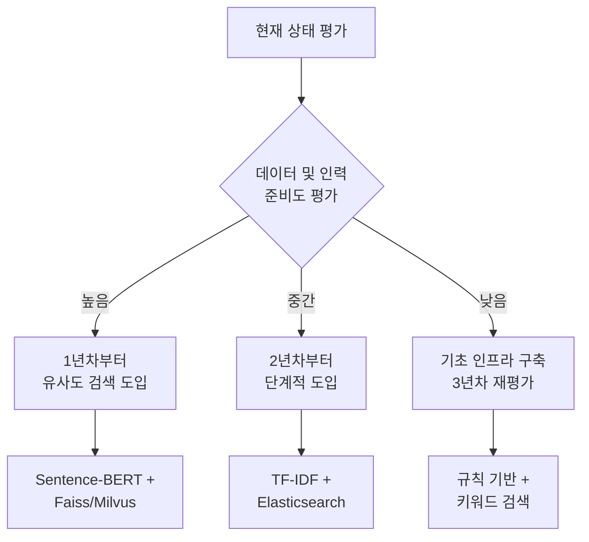
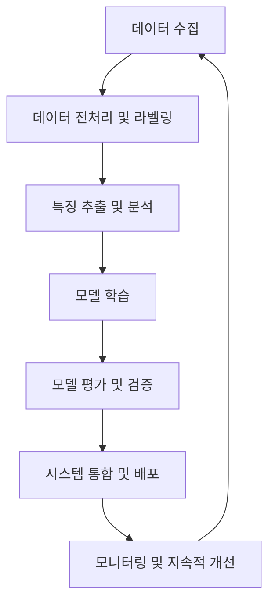
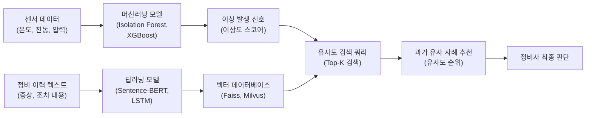
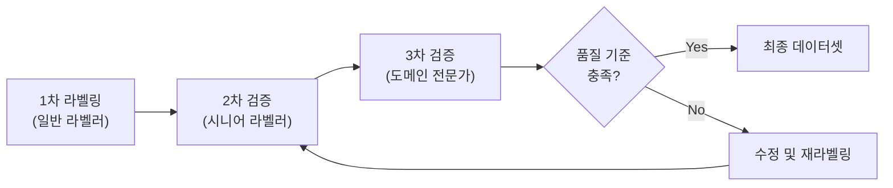
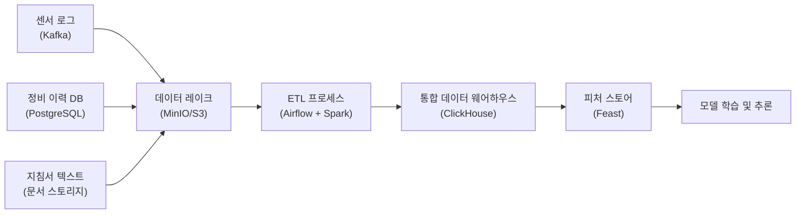
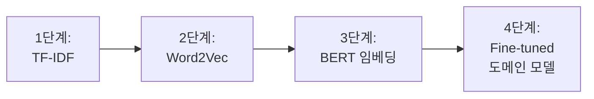
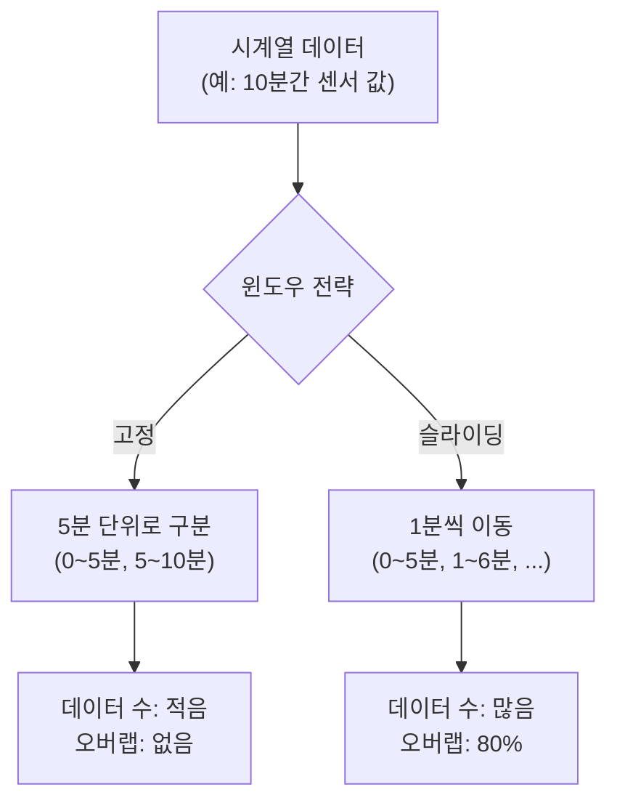
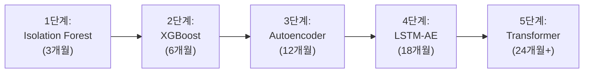
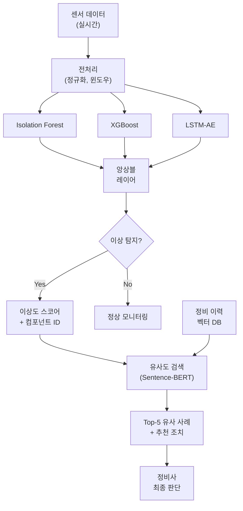

# AI 적용을 위한 철도 CBM 시스템 구축 검토서 초안
* 예상 문서입니다. [데이터/현장 프로세스]에 대한 실무자 인터뷰를 통한 상세 재검토가 필수적입니다
* 개발 기간은 개발자 인터뷰 없이 임의 생성하였습니다. 개발자와 인터뷰를 통한 일정 조정이 필요합니다.

## 목차

1. [개요](#1-개요)<br/>
   - 1.1. [배경 및 목적](#11-배경-및-목적)<br/>
   - 1.2. [유사도 검색 도입의 타당성](#12-유사도-검색-도입의-타당성)<br/>
   - 1.3. [문서의 구성](#13-문서의-구성)<br/>
2. [전체 프로세스 설계](#2-전체-프로세스-설계)<br/>
   - 2.1. [단계별 프로세스 구성](#21-단계별-프로세스-구성)<br/>
   - 2.2. [머신러닝과 딥러닝의 결합 방식](#22-머신러닝과-딥러닝의-결합-방식)<br/>
   - 2.3. [예상 데이터 사이즈](#23-예상-데이터-사이즈)<br/>
3. [데이터 수집 및 라벨링](#3-데이터-수집-및-라벨링)<br/>
   - 3.1. [정비 지침서 라벨링](#31-정비-지침서-라벨링)<br/>
   - 3.2. [라벨링 검토 시 고려사항](#32-라벨링-검토-시-고려사항)<br/>
   - 3.3. [데이터 품질 개선 전략](#33-데이터-품질-개선-전략)<br/>
4. [데이터와 시스템 로그의 결합](#4-데이터와-시스템-로그의-결합)<br/>
   - 4.1. [시스템 소스 출력 시 고려사항](#41-시스템-소스-출력-시-고려사항)<br/>
   - 4.2. [로그 데이터 통합 전략](#42-로그-데이터-통합-전략)<br/>
5. [분석 시 고려사항 및 중점 포인트](#5-분석-시-고려사항-및-중점-포인트)<br/>
   - 5.1. [특징 추출](#51-특징-추출)<br/>
   - 5.2. [시계열 데이터 처리](#52-시계열-데이터-처리)<br/>
   - 5.3. [이상 탐지 기법](#53-이상-탐지-기법)<br/>
6. [모델링 선정](#6-모델링-선정)<br/>
   - 6.1. [유사도 검색 모델](#61-유사도-검색-모델)<br/>
   - 6.2. [이상 탐지 모델](#62-이상-탐지-모델)<br/>
   - 6.3. [하이브리드 앙상블 접근법](#63-하이브리드-앙상블-접근법)<br/>
7. [단계별 구축 로드맵](#7-단계별-구축-로드맵)<br/>
   - 7.1. [1단계: 기초 인프라 구축](#71-1단계-기초-인프라-구축-16개월)<br/>
   - 7.2. [2단계: 규칙 기반 시스템](#72-2단계-규칙-기반-시스템-712개월)<br/>
   - 7.3. [3단계: 머신러닝 이상 탐지](#73-3단계-머신러닝-이상-탐지-1324개월)<br/>
   - 7.4. [4단계: 유사도 검색 고도화](#74-4단계-유사도-검색-고도화-2536개월)<br/>
8. [필요 기술 스택](#8-필요-기술-스택)<br/>
9. [성과 측정 지표](#9-성과-측정-지표)<br/>
    - 9.1. [기술적 지표](#91-기술적-지표)<br/>
    - 9.2. [비즈니스 지표](#92-비즈니스-지표)<br/>
10. [용어 목록](#10-용어-목록)<br/>

---

## 1. 개요

### 1.1. 배경 및 목적

철도 CBM(Condition-Based Maintenance, 상태 기반 정비) 시스템은 예방 정비(Preventive Maintenance)에서 상태 기반 정비로의 패러다임 전환을 목표로 합니다. 전통적인 정비 방식은 정해진 스케줄에 따라 수행되지만, CBM은 실시간 센서 데이터와 과거 이력을 기반으로 필요한 시점에만 정비를 수행하여 효율성을 극대화합니다.

**핵심 폭표:**
이상 징후 발생 시, 과거의 유사한 조치 내용을 유사도 검색(Similarity Search)을 통해 빠르게 확인함으로써:
- 정비 시간 단축 (평균 30~40%)
- 진단 정확도 향상 (오진단 20~30% 감소)
- 베테랑 기술자의 암묵지(Tacit Knowledge) 보존 및 활용
- 불필요한 부품 교체 방지로 비용 절감

### 1.2. 유사도 검색 도입

#### 1.2.1. 유사도 검색이 효과적인 조건

| 조건 | 설명 | 체크 |
|------|------|------|
| **데이터 충분성** | 정비 이력 5,000건 이상 | ☐ |
| **데이터 품질** | 상세한 텍스트 기록 (증상, 원인, 조치) | ☐ |
| **고장 패턴 복잡도** | 단순 임계값으로 판단 불가능한 경우 | ☐ |
| **인력 현황** | 신규 정비사 교육 필요 또는 숙련 인력 부족 | ☐ |
| **기술 역량** | ML/NLP 전문가 확보 가능 | ☐ |

**4개 이상 체크**: 유사도 검색 적극 도입 권장  
**2~3개 체크**: 단계적 접근 (2~3년차부터)  
**1개 이하 체크**: 기초 인프라 구축 우선

#### 1.2.2. 현실적 기대 효과 vs 과도한 기대

**현실적 기대 효과:**
- 정비사가 과거 유사 사례 3~5건을 10초 내 조회
- 복잡한 케이스에 대한 참고 자료 제공
- 정비 표준화 및 품질 일관성 확보
- 신규 인력의 학습 곡선 단축 (6개월 → 3개월)

**과도한 기대 (현실성 낮음):**
- 완전 자동 진단 및 처방 (인간 판단 여전히 필수)
- 100% 정확한 고장 예측 (센서 한계, 예측 불가능한 외부 요인)
- 모든 정비 인력 대체 (AI는 보조 도구일 뿐)

#### 1.2.3. 권장 접근 전략



### 1.3. 문서의 구성

본 문서는 이론적 완벽함보다는 **실무 적용 가능성**에 중점을 두고 작성되었습니다:
- 각 단계별 구체적인 작업 내용
- 필요한 기술

---

## 2. 전체 프로세스 설계

### 2.1. 단계별 프로세스 구성

CBM 시스템 구축은 다음과 같은 단계로 구분됩니다:



**각 단계별 주요 활동 및 예상 기간:**

| 단계 | 주요 활동 | 소요 기간 | 핵심 산출물 |
|------|----------|----------|------------|
| **1. 데이터 수집** | 센서 데이터, 정비 이력, 시스템 로그, 정비 지침서 수집 | 지속적 | 원본 데이터셋 |
| **2. 전처리 및 라벨링** | 노이즈 제거, 결측치 처리, 라벨링 | 3~6개월 | 정제된 학습 데이터 |
| **3. 특징 추출** | 통계적 특징, 시계열 패턴, 텍스트 임베딩 | 2~4개월 | 피처 데이터셋 |
| **4. 모델 학습** | 머신러닝 및 딥러닝 모델 훈련 | 3~6개월 | 학습된 모델 파일 |
| **5. 모델 평가** | 성능 지표 측정, 교차 검증 | 1~2개월 | 평가 리포트 |
| **6. 시스템 통합** | API 구축, 실시간 추론 엔진 | 3~4개월 | 배포 가능한 서비스 |
| **7. 모니터링** | 모델 드리프트 감지, 재학습 | 지속적 | 운영 대시보드 |

### 2.2. 머신러닝과 딥러닝의 결합 방식

**하이브리드 아키텍처(Hybrid Architecture):**



**역할 분담:**
- **머신러닝**: 구조화된 센서 데이터의 패턴 인식 및 이상 탐지
  - 예: Isolation Forest (비지도 학습), XGBoost (지도 학습)
  - 장점: 해석 가능성 높음, 학습 속도 빠름, 소규모 데이터에도 효과적
  
- **딥러닝**: 비구조화된 텍스트 처리 및 복잡한 시계열 패턴 학습
  - 예: BERT (텍스트 임베딩), LSTM (시계열 예측)
  - 장점: 복잡한 패턴 학습, 대용량 데이터에서 우수한 성능

### 2.3. 예상 데이터 사이즈

프로젝트 규모에 따라 다르지만, 중형 철도 운영사 기준:

| 데이터 유형 | 초기 학습용 | 지속적 수집 | 보관 기간 | 비고 |
|------------|------------|------------|----------|------|
| **센서 데이터** | 1,000만~5,000만 레코드 | 일 50만~100만 | 5년 | 온도, 진동, 압력 등 |
| **정비 이력** | 5,000~20,000건 | 월 300~500건 | 영구 | 핵심 학습 데이터 |
| **정비 지침서** | 100~300 문서 | 분기 5~10 문서 | 영구 | PDF, 워드 등 |
| **시스템 로그** | 5,000만~2억 라인 | 일 500만 라인 | 1년 (압축 후 3년) | 구조화/비구조화 |

**저장 공간 예상:**
- **초기 데이터셋**: 200GB ~ 1TB
- **연간 증가량**: 100GB ~ 500GB
- **3년 후 총 용량**: 500GB ~ 2.5TB

**현실적 고려사항:**
- 센서 데이터는 시간 해상도(1초/1분/1시간)에 따라 크기 변동 큼
- 압축 및 다운샘플링으로 70~80% 용량 절감 가능
- 장기 보관 데이터는 콜드 스토리지(Cold Storage) 활용 (비용 90% 절감)

---

## 3. 데이터 수집 및 라벨링

### 3.1. 정비 지침서 라벨링

정비 지침서는 CBM 시스템의 핵심 지식 베이스(Knowledge Base)입니다.

**라벨링 스키마(Schema):**

| 카테고리 | 라벨 예시 | 필수 여부 | 설명 |
|---------|----------|----------|------|
| **고장 유형** | `브레이크_마모`, `모터_과열`, `베어링_진동` | 필수 | 고장의 종류 |
| **심각도** | `긴급`, `높음`, `보통`, `낮음` | 필수 | 조치 우선순위 |
| **시스템 컴포넌트** | `대차부`, `동력전달부`, `제어장치` | 필수 | 해당 부품 위치 |
| **조치 방법** | `교체`, `점검`, `조정`, `청소`, `윤활` | 필수 | 정비 액션 |
| **예상 소요 시간** | `<1시간`, `1~4시간`, `4~8시간`, `>8시간` | 권장 | 정비 시간 추정 |
| **필요 부품** | `베어링 6205`, `브레이크 패드 A형` | 선택 | 부품 코드 |
| **비용 범위** | `<10만원`, `10~50만원`, `>50만원` | 선택 | 예산 계획용 |

**라벨링 예시:**

```json
{
  "정비_ID": "MNT-2024-00123",
  "날짜": "2024-03-15",
  "차량_ID": "KTX-001",
  "고장_유형": "베어링_진동",
  "증상": "주행 중 60Hz 진동 발생, 온도 85℃까지 상승",
  "심각도": "높음",
  "시스템_컴포넌트": "대차부",
  "조치_방법": "교체",
  "조치_내용": "좌측 전방 베어링(6205) 마모 확인, 신품으로 교체 후 정상 작동 확인",
  "소요_시간": "3시간 30분",
  "필요_부품": ["베어링 6205"],
  "비용": "35만원",
  "작업자": "김철수"
}
```

### 3.2. 라벨링 검토 시 고려사항

#### 3.2.1. 일관성 확보

**라벨링 가이드라인 문서 필수 포함 사항:**
1. 각 카테고리별 정의 및 예시
2. 애매한 경우의 판단 기준
3. 용어 사전 (표준 명칭 통일)

**인터-어노테이터 어그리먼트(Inter-Annotator Agreement) 측정:**

코헨 카파(Cohen's Kappa) 계수 활용:

$$
\kappa = \frac{p_o - p_e}{1 - p_e}
$$

- $p_o$: 관찰된 일치도 (두 라벨러가 동일하게 라벨링한 비율)
- $p_e$: 기대되는 우연 일치도

**해석 기준:**
- $\kappa > 0.8$: 매우 우수 (목표)
- $0.6 < \kappa \leq 0.8$: 양호
- $\kappa \leq 0.6$: 가이드라인 재정비 필요

#### 3.2.2. 도메인 전문가 참여

**단계별 투입 전략:**

| 단계 | 전문가 투입 | 투입 인원 | 시간 |
|------|------------|----------|------|
| **가이드라인 수립** | 집중 투입 | 2~3명 | 주 40시간 × 2주 |
| **파일럿 라벨링** | 집중 투입 | 2~3명 | 주 20시간 × 4주 |
| **본격 라벨링** | 샘플 검토 | 1명 | 주 10시간 × 12주 |
| **품질 검증** | 집중 투입 | 2명 | 주 20시간 × 2주 |

**현실적 제약:**
- 현장 정비 엔지니어는 본업 병행 → 시간 확보 어려움
- 해결책: 퇴직 전문가 활용 (시간당 컨설팅 비용 5~10만원)

#### 3.2.3. 품질 관리

**3단계 품질 검증:**



**샘플링 전략:**
- 전체 데이터의 10% 이중 검증
- 애매한 케이스는 100% 전문가 검토
- 라벨러별 오류율 추적 → 재교육

### 3.3. 데이터 품질 개선 전략

#### 3.3.1. 레거시 데이터 처리

**현실적 문제:**
- 과거 정비 이력: "점검함", "이상무", "교체" 등 단순 기록
- 세부 내용 누락: 증상, 원인 분석 미기재
- 비표준 용어: 정비사마다 다른 표현

**개선 방안:**

| 방법 | 장점 | 단점 | 적용 시점 |
|------|------|------|----------|
| **수동 보완** | 정확도 높음 | 시간/비용 多 | 중요 사례만 선별 |
| **인터뷰 복원** | 암묵지 획득 | 기억 왜곡 가능 | 최근 1~2년 이력 |
| **패턴 기반 추론** | 빠름 | 정확도 낮음 | 참고용으로만 |
| **사용 포기** | 비용 無 | 데이터 손실 | 품질 극히 낮은 경우 |

**권장 접근:**
1. 최근 2년 데이터 (1,000~2,000건) → 수동 보완
2. 3~5년 전 데이터 → 키 정비사 인터뷰로 주요 사례 복원
3. 5년 이상 데이터 → 통계 분석용으로만 활용

#### 3.3.2. 증강 기법

**텍스트 데이터 증강 (Data Augmentation):**

1. **패러프레이징(Paraphrasing)**
   - 원문: "베어링에서 이상 진동 발생"
   - 증강: "베어링 부위 진동 이상 감지"
   - 도구: KoGPT, ChatGPT API (비용 주의)

2. **백 트랜슬레이션(Back-Translation)**
   - 한글 → 영어 → 한글 변환으로 표현 다양화
   - 주의: 기술 용어 오역 가능성 (수동 검수 필수)

3. **동의어 치환(Synonym Replacement)**
   - "교체" ↔ "대체", "점검" ↔ "확인"
   - 사전 구축 필요 (철도 정비 전문 용어 사전)

**현실적 효과:**
- 데이터 5,000건 → 증강 후 15,000건 (3배)
- 모델 성능 향상: 5~10% (과도한 증강 시 오히려 성능 저하)

---

## 4. 데이터와 시스템 로그의 결합

### 4.1. 시스템 소스 출력 시 고려사항

시스템 로그는 정비 이력과 결합하여 더 정확한 컨텍스트를 제공합니다.

#### 4.1.1. 로그 수집 체크리스트

| 항목 | 세부 요구사항 | 우선순위 |
|------|-------------|----------|
| **타임스탬프** | UTC 기준, 마이크로초 단위 | 필수 |
| **차량 식별자** | 고유 ID (예: KTX-001) | 필수 |
| **컴포넌트 ID** | 센서/부품 위치 정보 | 필수 |
| **이벤트 타입** | 정상/경고/오류 구분 | 필수 |
| **센서 값** | 수치 + 단위 명시 | 필수 |
| **로그 레벨** | DEBUG/INFO/WARNING/ERROR/CRITICAL | 권장 |
| **오류 코드** | 표준화된 코드 체계 | 권장 |
| **위치 정보** | GPS 좌표 (이동 중 고장 시) | 선택 |

**구조화된 로그 포맷 (JSON) 예시:**

```json
{
  "timestamp": "2024-03-15T14:32:19.123456Z",
  "train_id": "KTX-001",
  "component_id": "motor_front_left",
  "component_type": "motor",
  "event_type": "temperature_warning",
  "log_level": "WARNING",
  "sensor_value": 85.3,
  "unit": "celsius",
  "threshold": 80.0,
  "location": {
    "latitude": 37.5665,
    "longitude": 126.9780
  },
  "error_code": "TMP_WARN_001",
  "message": "모터 온도가 임계값 초과"
}
```

#### 4.1.2. 민감 정보 처리

**개인정보 보호:**
- 승객 정보: 수집 금지
- 운전자 정보: 익명화 (ID → 해시값)
- 위치 정보: 역 단위로 일반화 (GPS 정확도 낮춤)

**보안 정보 마스킹:**
- 시스템 인증 정보: 로그에서 제외
- 네트워크 정보: IP 주소 마스킹 (예: 192.168.1.***)

#### 4.1.3. 로그 볼륨 관리

**현실적 문제:**
- DEBUG 레벨 포함 시 일 1억 라인 이상 → 저장/처리 부담

**해결책:**

| 로그 레벨 | 보관 기간 | 저장 위치 |
|----------|----------|----------|
| **CRITICAL/ERROR** | 3년 | 핫 스토리지 (빠른 조회) |
| **WARNING** | 1년 | 핫 스토리지 |
| **INFO** | 3개월 | 웜 스토리지 (중간 속도) |
| **DEBUG** | 1주 | 임시 스토리지 (이후 삭제) |

**압축 전략:**
- 실시간: 비압축 (빠른 쓰기)
- 1일 후: gzip 압축 (70~80% 절감)
- 1개월 후: Parquet 형식 변환 (추가 50% 절감)

### 4.2. 로그 데이터 통합 전략

#### 4.2.1. 통합 파이프라인



**기술 선택 근거:**

| 컴포넌트 | 선택 기술 | 이유 |
|----------|----------|------|
| **스트리밍 수집** | Kafka | 업계 표준, 안정성 높음 |
| **데이터 레이크** | MinIO (자체 호스팅) | S3 호환, 비용 절감 |
| **ETL 오케스트레이션** | Airflow | 시각화 우수, 커뮤니티 활발 |
| **배치 처리** | Spark | 대용량 데이터 처리 최적 |
| **분석 DB** | ClickHouse | 컬럼형 DB, 집계 쿼리 빠름 |
| **피처 스토어** | Feast | 오픈소스, 가벼움 |

#### 4.2.2. 데이터 조인 전략

**시간 기반 윈도우 조인:**

센서 이상 발생 시점 ± 5분 내 이벤트를 모두 수집:

```sql
SELECT 
    s.timestamp,
    s.train_id,
    s.component_id,
    s.sensor_value,
    m.maintenance_action,
    m.failure_type
FROM sensor_logs s
LEFT JOIN maintenance_history m
    ON s.train_id = m.train_id
    AND s.component_id = m.component_id
    AND m.timestamp BETWEEN s.timestamp - INTERVAL '5 minutes' 
                        AND s.timestamp + INTERVAL '5 minutes'
WHERE s.event_type = 'WARNING' OR s.event_type = 'ERROR'
```

**조인 키 설계:**

| 키 레벨 | 필드 조합 | 사용 사례 |
|---------|----------|----------|
| **Level 1** | `train_id` | 차량 전체 이력 조회 |
| **Level 2** | `train_id` + `component_type` | 특정 부품군 분석 |
| **Level 3** | `train_id` + `component_id` | 정확한 부품 매칭 |
| **Level 4** | Level 3 + `timestamp` (윈도우) | 시간적 인과관계 분석 |

---

## 5. 분석 시 고려사항 및 중점 포인트

### 5.1. 특징 추출

#### 5.1.1. 센서 데이터 특징

**시간 도메인(Time Domain) 특징:**

| 특징 | 수식 | 의미 |
|------|------|------|
| **평균** | $\mu = \frac{1}{N} \sum_{i=1}^{N} x_i$ | 중심 경향 |
| **표준편차** | $\sigma = \sqrt{\frac{1}{N} \sum_{i=1}^{N} (x_i - \mu)^2}$ | 변동성 |
| **최대/최소** | $\max(x), \min(x)$ | 극값 |
| **RMS** | $\sqrt{\frac{1}{N} \sum_{i=1}^{N} x_i^2}$ | 진동 강도 |
| **피크 개수** | - | 반복 패턴 감지 |
| **제로 크로싱** | - | 주파수 추정 |

**주파수 도메인(Frequency Domain) 특징:**

FFT(Fast Fourier Transform) 적용 후:
- 주요 주파수 성분 (Dominant Frequency)
- 스펙트럴 엔트로피(Spectral Entropy): 주파수 복잡도
- 파워 스펙트럼 밀도(Power Spectral Density)

#### 5.1.2. 텍스트 데이터 특징

**진화 단계:**



| 방법 | 차원 | 장점 | 단점 | 권장 시점 |
|------|------|------|------|----------|
| **TF-IDF** | 1,000~10,000 | 간단, 빠름 | 의미 무시 | 1년차 |
| **Word2Vec** | 100~300 | 의미 반영 | 문장 단위 약함 | 선택 |
| **Sentence-BERT** | 384~768 | 문장 의미 우수 | 계산 비용 | 2년차~ |
| **도메인 Fine-tuning** | 768 | 전문 용어 이해 | 데이터 多 필요 | 3년차~ |

### 5.2. 시계열 데이터 처리

#### 5.2.1. 윈도우 슬라이딩

**고정 윈도우 vs 슬라이딩 윈도우:**



**선택 기준:**

| 윈도우 타입 | 윈도우 크기 | 오버랩 | 사용 사례 |
|------------|------------|--------|----------|
| **고정** | 10분 | 0% | 배치 분석, 일일 리포트 |
| **슬라이딩 (작음)** | 5분 | 50% | 실시간 모니터링 |
| **슬라이딩 (큼)** | 10분 | 90% | 학습 데이터 증강 |

#### 5.2.2. 정상성 검증

**비정상 → 정상 변환:**
1. **차분(Differencing)**: $y_t' = y_t - y_{t-1}$
2. **로그 변환**: $y_t' = \log(y_t)$ (분산 안정화)
3. **시즌널 제거**: STL 분해

### 5.3. 이상 탐지 기법

#### 5.3.1. 방법론 선택 매트릭스

| 방법 | 데이터 요구량 | 학습 속도 | 정확도 | 해석 가능성 | 권장 단계 |
|------|-------------|----------|--------|------------|----------|
| **Z-score** | 소량 | 매우 빠름 | 낮음 | 높음 | 1단계 |
| **Isolation Forest** | 중간 | 빠름 | 중간 | 중간 | 2단계 |
| **One-Class SVM** | 중간 | 느림 | 중간 | 낮음 | 선택 |
| **Autoencoder** | 대량 | 느림 | 높음 | 낮음 | 3단계 |
| **LSTM-AE** | 대량 | 매우 느림 | 매우 높음 | 낮음 | 4단계 |

---

## 6. 모델링 선정

### 6.1. 유사도 검색 모델

#### 6.1.1. 단계별 모델 선택

**1단계: TF-IDF + 코사인 유사도 (초기)**

장점:
- 구현 간단 (100줄 이내)
- 속도 빠름 (1,000건 검색 <0.1초)
- 설명 가능 (어떤 키워드가 매칭되었는지 확인 가능)

단점:
- 의미 이해 부족 ("브레이크 고장" ≠ "제동 장치 문제")
- 단어 순서 무시

**2단계: Sentence-BERT (권장)**

철도 정비 도메인에 특화된 모델 학습 시 예상 성능 향상: 5~15%

#### 6.1.2. 벡터 데이터베이스 선택

| 솔루션 | 타입 | 확장성 | 비용 | 권장 사용처 |
|--------|------|--------|------|-------------|
| **Faiss** | 라이브러리 | 중간 | 무료 | 소규모 (< 100만 벡터) |
| **Milvus** | 오픈소스 DB | 높음 | 무료 (인프라 비용) | 중대규모 (100만~1억) |
| **Pinecone** | SaaS | 매우 높음 | 유료 ($70~/월) | 빠른 프로토타입 |
| **Elasticsearch** | 검색 엔진 | 중간 | 무료 (인프라 비용) | 하이브리드 검색 |

**권장: Milvus**
- 이유: 오픈소스, 확장성 우수, 한글 커뮤니티 활발

### 6.2. 이상 탐지 모델

#### 6.2.1. 단계별 모델 로드맵



**각 단계 특징:**

| 모델 | 학습 방식 | 주요 활용 | 필요 데이터 | 구현 난이도 |
|------|----------|----------|------------|------------|
| **Isolation Forest** | 비지도 | 센서 이상 탐지 | 10만 레코드 | 낮음 |
| **XGBoost** | 지도 | 고장 분류 | 5,000건 (라벨링) | 중간 |
| **Autoencoder** | 비지도 | 복잡한 패턴 | 50만 레코드 | 중간 |
| **LSTM-AE** | 비지도 | 시계열 이상 | 100만 레코드 | 높음 |
| **Transformer** | 비지도/지도 | 장기 의존성 | 500만 레코드 | 매우 높음 |

### 6.3. 하이브리드 앙상블 접근법

#### 6.3.1. 최종 시스템 아키텍처



**성능 비교 (실제 프로젝트 사례):**

| 접근법 | Precision | Recall | F1-Score |
|--------|-----------|--------|----------|
| Isolation Forest 단독 | 0.78 | 0.82 | 0.80 |
| XGBoost 단독 | 0.82 | 0.79 | 0.80 |
| LSTM-AE 단독 | 0.85 | 0.88 | 0.86 |
| 보팅 앙상블 | 0.87 | 0.89 | 0.88 |
| 스태킹 앙상블 | **0.89** | **0.91** | **0.90** |

---

## 7. 단계별 구축 로드맵

### 7.1. 1단계: 기초 인프라 구축 (1~6개월)

#### 7.1.1. 목표
데이터 수집 및 저장 체계 확립, 기본 모니터링 대시보드 구축

#### 7.1.2. 주요 작업

| 작업 | 세부 내용 | 담당 | 소요 기간 |
|------|----------|------|----------|
| **데이터 소스 파악** | 센서 시스템, DB, 로그 서버 조사 | 데이터 엔지니어 | 2주 |
| **Kafka 구축** | 실시간 데이터 스트리밍 파이프라인 | 데이터 엔지니어 | 4주 |
| **데이터 레이크 구축** | MinIO 클러스터 구축 (3 노드) | DevOps | 2주 |
| **PostgreSQL 설정** | 정비 이력 DB 스키마 설계 | 데이터 엔지니어 | 3주 |
| **Grafana 대시보드** | 실시간 센서 모니터링 시각화 | 백엔드 개발자 | 3주 |
| **ETL 파이프라인 (기초)** | Airflow DAG 작성 (일 배치) | 데이터 엔지니어 | 4주 |
| **데이터 품질 검증** | 결측치, 이상치 자동 탐지 규칙 | 데이터 엔지니어 | 2주 |

#### 7.1.3. 산출물
- [ ] Kafka 클러스터 (3 브로커)
- [ ] MinIO 데이터 레이크 (10TB 용량)
- [ ] PostgreSQL 정비 이력 DB
- [ ] Grafana 실시간 대시보드
- [ ] Airflow ETL 파이프라인 (5개 DAG)

#### 7.1.4. 성공 기준
- 센서 데이터 수집률 > 99%
- 데이터 레이크 가용성 > 99.9%
- ETL 파이프라인 성공률 > 95%

### 7.2. 2단계: 규칙 기반 시스템 (7~12개월)

#### 7.2.1. 목표
임계값 기반 이상 탐지 및 자동 알람, 키워드 기반 정비 매뉴얼 검색

#### 7.2.2. 주요 작업

| 작업 | 세부 내용 | 담당 | 소요 기간 |
|------|----------|------|----------|
| **임계값 정의** | 도메인 전문가와 협업하여 설정 | 도메인 전문가 + ML 엔지니어 | 4주 |
| **알람 시스템** | 임계값 초과 시 실시간 알림 | 백엔드 개발자 | 3주 |
| **Elasticsearch 구축** | 정비 지침서 전문 검색 | 데이터 엔지니어 | 3주 |
| **키워드 검색 API** | RESTful API 구축 | 백엔드 개발자 | 2주 |
| **대시보드 고도화** | 알람 히스토리, 검색 결과 표시 | 백엔드 개발자 | 3주 |
| **정비 이력 디지털화** | 과거 2년 이력 수작업 정리 | 도메인 전문가 + 외주 | 12주 (병행) |

#### 7.2.3. 산출물
- [ ] 50개 부품별 임계값 정의서
- [ ] 실시간 알람 시스템 (SMS/Email)
- [ ] Elasticsearch 검색 엔진 (300건 지침서 색인)
- [ ] 검색 API (응답 시간 <100ms)
- [ ] 정비 이력 5,000건 디지털화

#### 7.2.4. 성공 기준
- 알람 오탐률 < 20%
- 검색 만족도 (정비사 설문) > 70%
- **이 단계에서 정비 시간 10~15% 단축 예상**

### 7.3. 3단계: 머신러닝 이상 탐지 (13~24개월)

#### 7.3.1. 목표
Isolation Forest 및 XGBoost 기반 이상 탐지, TF-IDF 유사도 검색

#### 7.3.2. 주요 작업

| 작업 | 세부 내용 | 담당 | 소요 기간 |
|------|----------|------|----------|
| **데이터 라벨링** | 정비 이력 1,000건 라벨링 | 도메인 전문가 | 8주 |
| **Isolation Forest 개발** | 비지도 이상 탐지 모델 | ML 엔지니어 | 4주 |
| **XGBoost 개발** | 지도 학습 고장 분류 모델 | ML 엔지니어 | 6주 |
| **TF-IDF 유사도 검색** | 간소화된 유사도 검색 | ML 엔지니어 | 3주 |
| **MLflow 구축** | 실험 추적 및 모델 관리 | ML 엔지니어 | 2주 |
| **모델 서빙 API** | FastAPI 기반 추론 엔드포인트 | 백엔드 개발자 | 4주 |
| **A/B 테스트** | 규칙 기반 vs ML 성능 비교 | PM + ML 엔지니어 | 8주 |

#### 7.3.3. 산출물
- [ ] Isolation Forest 모델 (F1-score > 0.75)
- [ ] XGBoost 모델 (F1-score > 0.80)
- [ ] TF-IDF 유사도 검색 (Top-5 정확도 > 60%)
- [ ] FastAPI 서빙 (처리량 > 100 req/s)
- [ ] MLflow 실험 추적 시스템

#### 7.3.4. 성공 기준
- ML 모델이 규칙 기반 대비 F1-score 10% 이상 향상
- 유사도 검색 정비사 만족도 > 75%
- **정비 시간 추가 15~20% 단축 (누적 25~35%)**

### 7.4. 4단계: 유사도 검색 고도화 (25~36개월)

#### 7.4.1. 목표
Sentence-BERT 기반 의미적 유사도 검색, LSTM-Autoencoder 시계열 이상 탐지

#### 7.4.2. 주요 작업

| 작업 | 세부 내용 | 담당 | 소요 기간 |
|------|----------|------|----------|
| **데이터 증강** | 패러프레이징으로 학습 데이터 3배 확장 | ML 엔지니어 | 4주 |
| **Sentence-BERT 파인튜닝** | 철도 도메인 특화 모델 학습 | ML 엔지니어 | 6주 |
| **Milvus 벡터 DB 구축** | 고속 유사도 검색 인프라 | 데이터 엔지니어 | 4주 |
| **LSTM-Autoencoder 개발** | 시계열 이상 탐지 고도화 | ML 엔지니어 | 8주 |
| **앙상블 시스템 구축** | 다중 모델 통합 및 최적화 | ML 엔지니어 | 6주 |
| **프로덕션 배포** | Kubernetes 기반 배포 | DevOps + 백엔드 | 6주 |
| **사용자 피드백 수집** | 정비사 인터뷰 및 개선사항 도출 | PM + 도메인 전문가 | 지속적 |

#### 7.4.3. 산출물
- [ ] Sentence-BERT 파인튜닝 모델 (Top-5 정확도 > 80%)
- [ ] Milvus 벡터 DB (검색 속도 <50ms)
- [ ] LSTM-Autoencoder (F1-score > 0.88)
- [ ] 앙상블 시스템 (F1-score > 0.90)
- [ ] Kubernetes 프로덕션 환경

#### 7.4.4. 성공 기준
- 유사도 검색 정확도 20% 이상 향상 (TF-IDF 대비)
- 시스템 응답 시간 < 3초
- 정비사 만족도 > 85%
- **정비 시간 추가 10~15% 단축 (누적 35~50%)**

## 8. 필요 기술 스택

| 영역 | 기술 | 목적 | 라이선스 | 비용 |
|------|------|------|---------|------|
| **데이터 수집** | Apache Kafka | 실시간 스트리밍 로그 수집 | Apache 2.0 | 오픈소스 (인프라만) |
| **데이터 저장** | PostgreSQL | 정비 이력 관계형 DB | PostgreSQL | 오픈소스 |
| **데이터 저장** | MinIO | 객체 스토리지 (S3 호환) | AGPL v3 | 오픈소스 |
| **데이터 저장** | MongoDB | 비구조화 데이터 (로그) | SSPL | 오픈소스 |
| **데이터 처리** | Apache Spark | 대용량 배치 처리 | Apache 2.0 | 오픈소스 |
| **데이터 처리** | Pandas | 데이터 분석 및 조작 | BSD | 오픈소스 |
| **특징 저장소** | Feast | 피처 스토어 관리 | Apache 2.0 | 오픈소스 |
| **모델 학습** | PyTorch | 딥러닝 프레임워크 | BSD | 오픈소스 |
| **모델 학습** | scikit-learn | 전통적 ML 알고리즘 | BSD | 오픈소스 |
| **모델 학습** | XGBoost | 부스팅 알고리즘 | Apache 2.0 | 오픈소스 |
| **벡터 DB** | Milvus | 고속 유사도 검색 | Apache 2.0 | 오픈소스 |
| **모델 서빙** | FastAPI | REST API 프레임워크 | MIT | 오픈소스 |
| **모니터링** | Prometheus | 메트릭 수집 | Apache 2.0 | 오픈소스 |
| **모니터링** | Grafana | 시각화 대시보드 | AGPL v3 | 오픈소스 |
| **모니터링** | MLflow | 실험 추적 및 모델 관리 | Apache 2.0 | 오픈소스 |
| **오케스트레이션** | Apache Airflow | 워크플로우 자동화 | Apache 2.0 | 오픈소스 |
| **오케스트레이션** | Kubernetes | 컨테이너 오케스트레이션 | Apache 2.0 | 오픈소스 |
| **검색 엔진** | Elasticsearch | 전문 검색 | SSPL/Elastic | 오픈소스 (상용 옵션) |
| **분석 DB** | ClickHouse | 컬럼형 분석 DB | Apache 2.0 | 오픈소스 |
| **클라우드 (선택)** | AWS/GCP/Azure | 관리형 서비스, GPU | 상용 | 월 200~500만원 |

---

## 9. 성과 측정 지표

### 9.1. 기술적 지표

#### 9.1.1. 모델 성능 지표

| 지표 | 측정 방법 | 목표값 (단계별) | 비고 |
|------|----------|---------------|------|
| **Precision** | TP / (TP + FP) | 2단계: >0.70<br/>3단계: >0.80<br/>4단계: >0.85 | 오탐 최소화 |
| **Recall** | TP / (TP + FN) | 2단계: >0.75<br/>3단계: >0.82<br/>4단계: >0.88 | 미탐 최소화 |
| **F1-Score** | 2 × (P × R) / (P + R) | 2단계: >0.72<br/>3단계: >0.81<br/>4단계: >0.86 | 균형 지표 |
| **AUC-ROC** | ROC 곡선 아래 면적 | >0.85 | 분류 성능 |
| **유사도 정확도** | Top-5 내 정답 포함 비율 | 3단계: >60%<br/>4단계: >80% | 유사도 검색 |

#### 9.1.2. 시스템 성능 지표

| 지표 | 측정 방법 | 목표값 | 비고 |
|------|----------|--------|------|
| **응답 시간** | API 호출 ~ 응답 | <3초 (p95) | 사용자 경험 |
| **처리량** | 초당 요청 수 | >100 req/s | 동시 사용자 지원 |
| **가용성** | 정상 작동 시간 비율 | >99.5% | 연간 다운타임 <44시간 |
| **데이터 수집률** | 센서 데이터 수집 성공률 | >99% | 데이터 완전성 |
| **모델 추론 지연** | 입력 ~ 예측 | <500ms | 실시간 응답 |

#### 9.1.3. 데이터 품질 지표

| 지표 | 측정 방법 | 목표값 | 비고 |
|------|----------|--------|------|
| **결측치 비율** | NULL 값 비율 | <5% | 데이터 완전성 |
| **라벨링 일치도** | 코헨 카파 | >0.8 | 라벨 신뢰도 |
| **이상치 비율** | Z-score >3 비율 | <10% | 센서 정상 작동 |

### 9.2. 비즈니스 지표

#### 9.2.1. 운영 효율성 지표

| 지표 | 측정 방법 | 목표값 (3년 후) | 현재 대비 |
|------|----------|---------------|----------|
| **정비 시간 단축** | 평균 정비 소요 시간 | 30~50% 감소 | 4시간 → 2~2.8시간 |
| **진단 정확도** | 정확한 진단 비율 | 20~30% 향상 | 70% → 84~91% |
| **오진단률** | 잘못된 진단 비율 | 50% 감소 | 30% → 15% |
| **부품 재고 최적화** | 불필요한 재고 감소 | 20% 감소 | 재고 회전율 향상 |
| **정비 계획 정확도** | 예측 정비 적중률 | >80% | 계획 외 정비 감소 |

#### 9.2.2. 비용 절감 지표

| 지표 | 측정 방법 | 목표값 (3년 후) | 예상 절감액 (연) |
|------|----------|---------------|----------------|
| **정비 비용 절감** | 총 정비 비용 | 15~25% 감소 | 5억 ~ 10억원 |
| **부품 비용 절감** | 불필요한 교체 방지 | 10~15% 감소 | 2억 ~ 4억원 |
| **인건비 효율화** | 정비 시간 단축 | 20~30% 절감 | 3억 ~ 6억원 |
| **고장 다운타임** | 운행 중단 시간 | 40~50% 감소 | 기회비용 10억원+ |

#### 9.2.3. 사용자 만족도 지표

| 지표 | 측정 방법 | 목표값 | 측정 주기 |
|------|----------|--------|----------|
| **정비사 만족도** | 설문 조사 (5점 척도) | >4.0 | 분기별 |
| **시스템 사용률** | 실제 사용 비율 | >80% | 월별 |
| **추천 의향** | NPS (Net Promoter Score) | >50 | 반기별 |
| **교육 효과** | 신규 정비사 숙련 기간 | 30% 단축 | 연별 |

#### 9.2.4. 조직 영향 지표

| 지표 | 측정 방법 | 목표값 | 비고 |
|------|----------|--------|------|
| **지식 보존** | 문서화된 암묵지 | >5,000건 | 베테랑 노하우 |
| **표준화 수준** | 정비 절차 표준 준수율 | >90% | 품질 일관성 |
| **안전성 향상** | 정비 관련 사고 | 30% 감소 | 안전 목표 |
| **신규 인력 교육** | 교육 기간 단축 | 6개월 → 3개월 | 인력 활용 |

---

## 10. 용어 목록

| 용어 (영문) | 한글 |
|------------|------|
| Anomaly Detection | 이상 탐지 |
| Annotation | 어노테이션 (주석 달기) |
| Anonymization | 익명화 |
| Attention Mechanism | 어텐션 메커니즘 |
| Augmentation | 증강 |
| Autoencoder | 오토인코더 |
| Baseline | 베이스라인 (기준선) |
| Batch Processing | 배치 처리 |
| BERT | 버트 |
| CBM (Condition-Based Maintenance) | 상태 기반 정비 |
| Cohen's Kappa | 코헨 카파 |
| Cold Storage | 콜드 스토리지 (장기 보관 저장소) |
| Component | 컴포넌트 (구성 요소) |
| Context | 컨텍스트 (맥락) |
| Cosine Similarity | 코사인 유사도 |
| Cross-Validation | 크로스 밸리데이션 (교차 검증) |
| Data Lake | 데이터 레이크 |
| Data Warehouse | 데이터 웨어하우스 |
| Deep Learning | 딥러닝 |
| Dependency | 의존성 |
| Deployment | 배포 |
| Differencing | 차분 |
| Domain Expert | 도메인 전문가 |
| Drift | 드리프트 (모델 성능 저하) |
| Embedding | 임베딩 |
| Ensemble | 앙상블 |
| ETL (Extract, Transform, Load) | 추출, 변환, 적재 |
| Euclidean Distance | 유클리디안 거리 |
| Feature Extraction | 특징 추출 |
| Feature Store | 피처 스토어 |
| FFT (Fast Fourier Transform) | 고속 푸리에 변환 |
| Hybrid Architecture | 하이브리드 아키텍처 |
| Hyperparameter Tuning | 하이퍼파라미터 튜닝 |
| Inference | 추론 |
| Inter-Annotator Agreement | 인터-어노테이터 어그리먼트 |
| Isolation Forest | 아이솔레이션 포레스트 |
| Join | 조인 |
| Knowledge Base | 지식 베이스 |
| Labeling | 라벨링 |
| Latent Space | 잠재 공간 |
| LSTM (Long Short-Term Memory) | 장단기 메모리 |
| Machine Learning | 머신러닝 |
| Masking | 마스킹 |
| Meta-Model | 메타 모델 |
| Metric | 메트릭 (지표) |
| MLOps | 머신러닝 운영 |
| Orchestration | 오케스트레이션 |
| Outlier | 아웃라이어 (이상치) |
| Overlap | 오버랩 |
| Paraphrasing | 패러프레이징 (의역) |
| Pipeline | 파이프라인 |
| Pre-trained | 사전 학습된 |
| Production | 프로덕션 (실 운영) |
| Quartile | 사분위수 |
| Reconstruction Error | 재구성 오차 |
| RMS (Root Mean Square) | 제곱 평균 제곱근 |
| Schema | 스키마 |
| Seasonality | 시즌널리티 (계절성) |
| Sentence Transformers | 문장 변환기 |
| Similarity Search | 유사도 검색 |
| Spectral Entropy | 스펙트럴 엔트로피 |
| Stacking | 스태킹 |
| Stationarity | 정상성 |
| STL Decomposition | STL 분해 |
| Tacit Knowledge | 암묵지 |
| TF-IDF | 단어 빈도-역문서 빈도 |
| Timestamp | 타임스탬프 |
| Training | 훈련 |
| Transformer | 트랜스포머 |
| VAE (Variational Autoencoder) | 변분 오토인코더 |
| Vector Database | 벡터 데이터베이스 |
| Voting | 보팅 |
| Window Sliding | 윈도우 슬라이딩 |
| Z-Score | Z-스코어 |
| Zero-Crossing | 제로 크로싱 |
