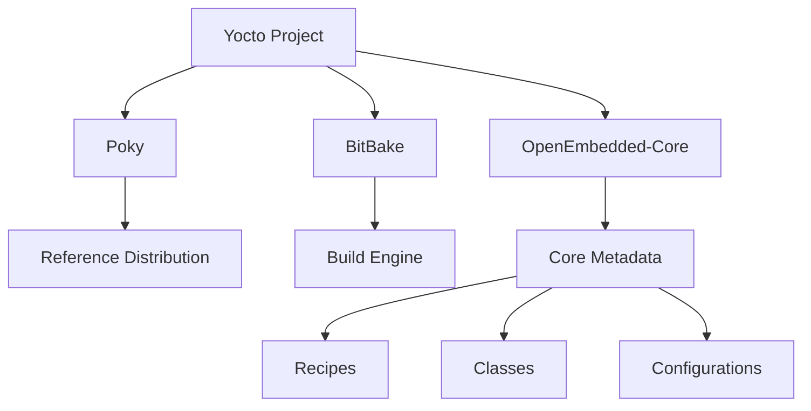
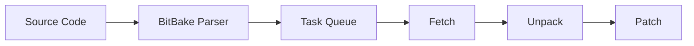
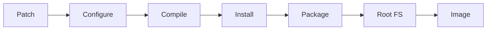

# Yocto Project 시작 가이드

## 목차
1. [Yocto Project 개요](#1-yocto-project-개요)<br/>
   - 1.1. [Yocto란 무엇인가](#11-yocto란-무엇인가)<br/>
   - 1.2. [주요 특징과 장점](#12-주요-특징과-장점)<br/>
   - 1.3. [기본 구성 요소](#13-기본-구성-요소)<br/>
2. [개발 환경 구축](#2-개발-환경-구축)<br/>
   - 2.1. [시스템 요구사항](#21-시스템-요구사항)<br/>
   - 2.2. [Ubuntu 24.04 환경 설정](#22-ubuntu-2404-환경-설정)<br/>
   - 2.3. [필수 패키지 설치](#23-필수-패키지-설치)<br/>
3. [핵심 개념 이해](#3-핵심-개념-이해)<br/>
   - 3.1. [레이어 (Layers)](#31-레이어-layers)<br/>
   - 3.2. [레시피 (Recipes)](#32-레시피-recipes)<br/>
   - 3.3. [비트베이크 (BitBake)](#33-비트베이크-bitbake)<br/>
   - 3.4. [메타데이터 (Metadata)](#34-메타데이터-metadata)<br/>
4. [MVP 프로젝트 실습](#4-mvp-프로젝트-실습)<br/>
   - 4.1. [Poky 다운로드](#41-poky-다운로드)<br/>
   - 4.2. [빌드 환경 초기화](#42-빌드-환경-초기화)<br/>
   - 4.3. [첫 번째 이미지 빌드](#43-첫-번째-이미지-빌드)<br/>
   - 4.4. [QEMU로 테스트](#44-qemu로-테스트)<br/>
5. [빌드 결과물 확인](#5-빌드-결과물-확인)<br/>
   - 5.1. [생성된 이미지 분석](#51-생성된-이미지-분석)<br/>
   - 5.2. [패키지 구조 이해](#52-패키지-구조-이해)<br/>

## 1. Yocto Project 개요

### 1.1. Yocto란 무엇인가

Yocto Project(욕토 프로젝트)는 임베디드 리눅스 배포판을 만들기 위한 오픈소스 협업 프로젝트입니다. 하드웨어 아키텍처에 관계없이 커스텀 리눅스 기반 시스템을 구축할 수 있는 템플릿, 도구, 메서드를 제공합니다.

### 1.2. 주요 특징과 장점

- **크로스 컴파일레이션(Cross-compilation)** 지원
- **재현 가능한 빌드(Reproducible builds)** 보장
- **모듈러 아키텍처(Modular architecture)** 채택
- **광범위한 하드웨어 지원**
- **라이선스 컴플라이언스(License compliance)** 관리

### 1.3. 기본 구성 요소



## 2. 개발 환경 구축

### 2.1. 시스템 요구사항

- **최소 디스크 공간**: 50GB 이상 (권장 100GB)
- **RAM**: 최소 4GB (권장 8GB 이상)
- **CPU**: 멀티코어 프로세서 권장
- **OS**: Ubuntu 24.04 LTS (이미 준비됨)

### 2.2. Ubuntu 24.04 환경 설정

```bash
# 시스템 업데이트
sudo apt update && sudo apt upgrade -y

# 로케일 설정 (UTF-8 필수)
sudo locale-gen en_US.UTF-8
export LANG=en_US.UTF-8
```

### 2.3. 필수 패키지 설치

```bash
# Yocto 빌드를 위한 필수 패키지 설치
sudo apt install -y \
    gawk wget git diffstat unzip texinfo gcc build-essential \
    chrpath socat cpio python3 python3-pip python3-pexpect \
    xz-utils debianutils iputils-ping python3-git python3-jinja2 \
    python3-subunit zstd liblz4-tool file locales libacl1 \
    libc6-dev-amd64-cross

# 추가 유틸리티
sudo apt install -y \
    libsdl1.2-dev xterm lz4 zstd curl
```

## 3. 핵심 개념 이해

### 3.1. 레이어 (Layers)

레이어는 관련된 메타데이터의 콜렉션(collection)입니다. 각 레이어는 특정 기능이나 하드웨어 지원을 제공합니다.

```
meta/               # 코어 레이어
meta-poky/          # Poky 디스트리뷰션 레이어
meta-yocto-bsp/     # BSP 레이어
```

### 3.2. 레시피 (Recipes)

레시피(.bb 파일)는 소프트웨어를 빌드하는 방법을 정의합니다. 기본 구조:

```bash
DESCRIPTION = "패키지 설명"
LICENSE = "라이선스 종류"
SRC_URI = "소스 위치"

do_compile() {
    # 컴파일 명령
}

do_install() {
    # 설치 명령
}
```

### 3.3. 비트베이크 (BitBake)

BitBake는 Yocto의 태스크 실행 엔진입니다. 파이썬으로 작성되었으며, 레시피를 파싱(parsing)하고 의존성을 해결합니다.

### 3.4. 메타데이터 (Metadata)

메타데이터는 빌드 시스템에 대한 정보를 포함합니다:
- **Configuration files** (.conf)
- **Recipes** (.bb, .bbappend)
- **Classes** (.bbclass)

## 4. MVP 프로젝트 실습

### 4.1. Poky 다운로드

```bash
# 작업 디렉토리 생성
mkdir ~/yocto-test && cd ~/yocto-test

# Poky 레포지토리 클론 (Scarthgap 24.0.7 LTS)
git clone -b scarthgap git://git.yoctoproject.org/poky.git
cd poky
```

### 4.2. 빌드 환경 초기화

```bash
# 빌드 환경 스크립트 실행
source oe-init-build-env build-test

# 현재 디렉토리가 build-test로 변경됨
pwd  # ~/yocto-test/poky/build-test
```

### 4.3. 첫 번째 이미지 빌드

#### 4.3.1. 기본 설정 확인

```bash
# local.conf 파일 확인
cat conf/local.conf | grep "^MACHINE"
# 기본값: MACHINE ?= "qemux86-64"

# 병렬 빌드 설정 (CPU 코어 수에 따라 조정)
echo 'BB_NUMBER_THREADS = "4"' >> conf/local.conf
echo 'PARALLEL_MAKE = "-j 4"' >> conf/local.conf
```

#### 4.3.2. 미니멀 이미지 빌드

```bash
# core-image-minimal 빌드 (가장 작은 이미지)
bitbake core-image-minimal

# 첫 빌드는 1-3시간 소요 (인터넷 속도와 CPU 성능에 따라 다름)
```

#### 4.3.3. AppArmor User Namespace 에러 해결

Ubuntu 24.04에서는 보안상의 이유로 unprivileged user namespace가 기본적으로 제한되어 있어 BitBake 실행 시 다음과 같은 에러가 발생할 수 있습니다:

```bash
ERROR: User namespaces are not usable by BitBake, possibly due to AppArmor.
See https://discourse.ubuntu.com/t/ubuntu-24-04-lts-noble-numbat-release-notes/39890#unprivileged-user-namespace-restrictions for more information.
Summary: There was 1 ERROR message, returning a non-zero exit code.
```

**에러 원인:**
- Ubuntu 24.04부터 AppArmor가 일반 사용자의 user namespace 생성을 제한
- BitBake는 sandboxing을 위해 user namespace 기능을 사용

**해결 방법:**

```bash
# 1. 현재 상태 확인
sysctl kernel.apparmor_restrict_unprivileged_userns
# 출력: kernel.apparmor_restrict_unprivileged_userns = 1 (제한 활성화)

# 2. User namespace 제한 해제
sudo sysctl -w kernel.apparmor_restrict_unprivileged_userns=0

# 3. 재부팅 후에도 유지되도록 설정
echo "kernel.apparmor_restrict_unprivileged_userns=0" | sudo tee -a /etc/sysctl.d/99-yocto.conf

# 4. 설정 적용 확인
sudo sysctl -p /etc/sysctl.d/99-yocto.conf

# 5. 빌드 다시 실행
bitbake core-image-minimal
```

**보안 고려사항:**
- 이 설정은 시스템 보안 수준을 약간 낮출 수 있습니다
- 개발 전용 VM 환경에서 사용하는 것을 권장합니다
- 프로덕션 환경에서는 별도의 격리된 빌드 환경을 구축하는 것이 좋습니다

### 4.4. QEMU로 테스트

```bash
# QEMU 에뮬레이터로 빌드된 이미지 실행
runqemu qemux86-64 core-image-minimal

# QEMU 내에서:
# root로 로그인 (비밀번호 없음)
# 기본 명령어 테스트
uname -a
cat /etc/os-release
ps aux

# QEMU 종료: Ctrl-A 후 X
```

## 5. 빌드 결과물 확인

### 5.1. 생성된 이미지 분석

```bash
# 빌드 결과물 위치
cd tmp/deploy/images/qemux86-64/

# 생성된 파일 확인
ls -lh core-image-minimal*

# 주요 파일:
# - core-image-minimal-qemux86-64.rootfs.ext4  # 루트 파일시스템
# - core-image-minimal-qemux86-64.qemuboot.conf # QEMU 설정
# - bzImage-qemux86-64.bin                      # 커널 이미지
```

### 5.2. 패키지 구조 이해

```bash
# 설치된 패키지 목록 확인
cd ../../rpm/
ls -la

# 매니페스트 파일 확인
cd ../images/qemux86-64/
cat core-image-minimal-qemux86-64.manifest | head -20
```

## 빌드 프로세스 다이어그램





## 트러블슈팅 팁

### 일반적인 문제 해결

1. **AppArmor User Namespace 에러 (Ubuntu 24.04)**
   ```bash
   # 에러 메시지:
   # ERROR: User namespaces are not usable by BitBake, possibly due to AppArmor.

   # 해결 방법:
   sudo sysctl -w kernel.apparmor_restrict_unprivileged_userns=0
   echo "kernel.apparmor_restrict_unprivileged_userns=0" | sudo tee -a /etc/sysctl.d/99-yocto.conf
   sudo sysctl -p /etc/sysctl.d/99-yocto.conf
   ```

2. **디스크 공간 부족**
   ```bash
   # 빌드 캐시 정리
   bitbake -c cleansstate core-image-minimal

   # 다운로드 캐시 정리
   rm -rf downloads/*

   # tmp 디렉토리 정리
   rm -rf tmp/
   ```

3. **네트워크 문제**
   ```bash
   # 프록시 설정 (필요시)
   export http_proxy=http://proxy.example.com:8080
   export https_proxy=http://proxy.example.com:8080

   # 다운로드 타임아웃 설정 (local.conf에 추가)
   echo 'BB_FETCH_PREMIRRORONLY = "0"' >> conf/local.conf
   echo 'BB_NO_NETWORK = "0"' >> conf/local.conf
   ```

4. **빌드 실패 시 로그 확인**
   ```bash
   # 상세 로그 위치
   ls tmp/work/*/core-image-minimal/*/temp/log.*

   # 가장 최근 에러 로그 확인
   tail -100 tmp/log/cooker/qemux86-64/console-latest.log

   # 특정 패키지 빌드 로그
   bitbake -c devshell <package-name>
   ```

5. **빌드 진행 상황 모니터링**
   ```bash
   # 실시간 빌드 로그 확인
   tail -f tmp/log/cooker/qemux86-64/console-latest.log

   # 빌드 통계 확인
   bitbake -g core-image-minimal
   cat pn-depends.dot | grep -v "digraph"
   ```

## 다음 단계 제안

1. **커스텀 레이어 생성**
   ```bash
   bitbake-layers create-layer meta-custom
   ```

2. **자체 레시피 작성**
   - 간단한 "Hello World" 애플리케이션 추가

3. **이미지 커스터마이제이션**
   - 추가 패키지 포함
   - 설정 파일 수정

## 용어 목록

| 용어 | 설명 |
|------|------|
| **BitBake** | Yocto의 태스크 실행 엔진, 메타데이터를 파싱하고 빌드 태스크를 실행 |
| **BSP (Board Support Package)** | 특정 하드웨어 보드를 지원하기 위한 드라이버와 설정 |
| **Cross-compilation** | 타겟 아키텍처와 다른 호스트에서 컴파일하는 과정 |
| **Image** | 타겟 디바이스에 배포될 완전한 루트 파일시스템 |
| **Layer** | 관련된 레시피, 설정, 클래스를 포함하는 메타데이터 콜렉션 |
| **Manifest** | 이미지에 포함된 모든 패키지의 목록 |
| **Metadata** | 빌드 시스템을 제어하는 레시피, 설정, 클래스 파일들 |
| **OE-Core (OpenEmbedded-Core)** | Yocto와 OpenEmbedded가 공유하는 핵심 메타데이터 |
| **Poky** | Yocto Project의 레퍼런스 디스트리뷰션 |
| **QEMU** | 하드웨어 에뮬레이터, 빌드된 이미지를 테스트하는 데 사용 |
| **Recipe** | 소프트웨어 패키지를 빌드하는 방법을 정의하는 파일 (.bb) |
| **Rootfs** | 루트 파일시스템, 리눅스 시스템의 기본 디렉토리 구조 |
| **Sstate-cache** | 빌드 속도 향상을 위한 공유 상태 캐시 |
| **Task** | 레시피 내에서 실행되는 개별 빌드 단계 (fetch, compile 등) |
| **Toolchain** | 크로스 컴파일을 위한 컴파일러와 도구 모음 |
