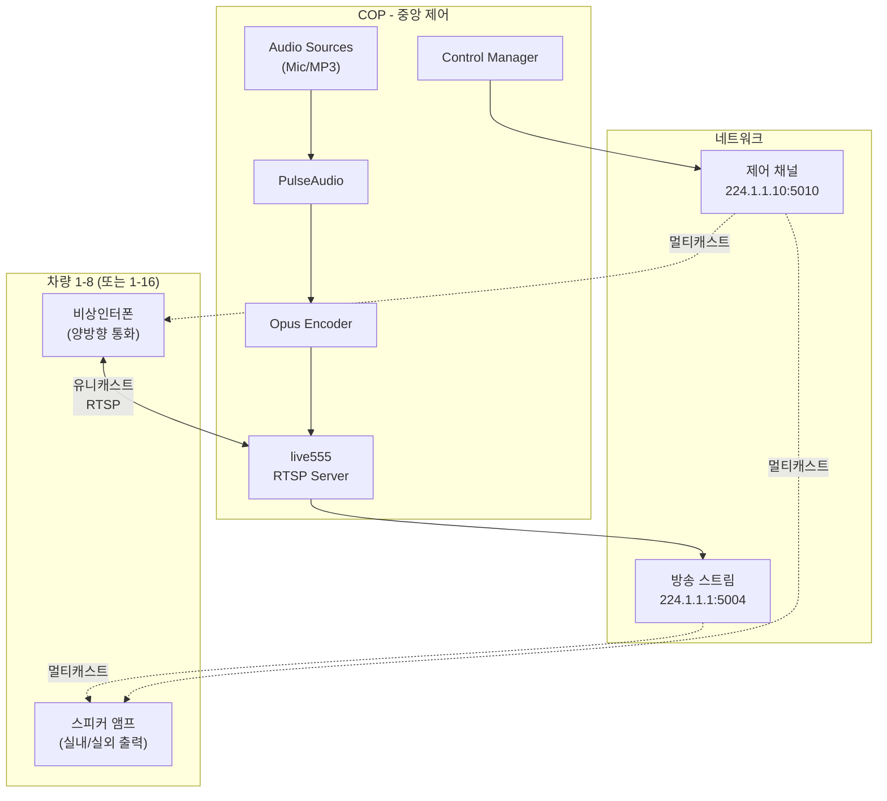
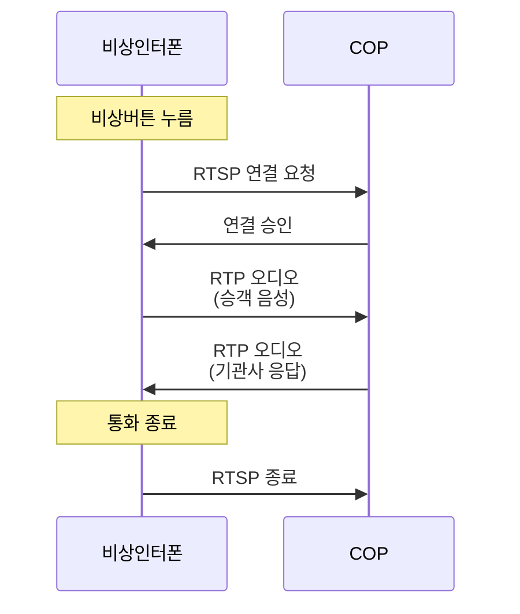

# 철도차량 음성방송 시스템 설계 문서 (초안)
* 실제 HW에 대한 기능 테스트가 되지 않았습니다. HW 적용 전 기능 테스트를 통한 설계 보완이 필요할 수 있습니다.

## 목차

- [1. 개요](#1-개요)<br/>
  - [1.1 문서 목적](#11-문서-목적)<br/>
  - [1.2 시스템 개요](#12-시스템-개요)<br/>
  - [1.3 핵심 설계 원칙](#13-핵심-설계-원칙)<br/>
- [2. 시스템 구성](#2-시스템-구성)<br/>
  - [2.1 차량 구성](#21-차량-구성)<br/>
  - [2.2 장치 구성](#22-장치-구성)<br/>
  - [2.3 중련 확장](#23-중련-확장)<br/>
- [3. 시스템 아키텍처](#3-시스템-아키텍처)<br/>
  - [3.1 전체 구성도](#31-전체-구성도)<br/>
  - [3.2 COP 중앙 제어 시스템](#32-cop-중앙-제어-시스템)<br/>
  - [3.3 스피커 앰프 장치](#33-스피커-앰프-장치)<br/>
  - [3.4 비상인터폰 장치](#34-비상인터폰-장치)<br/>
- [4. 방송 시스템](#4-방송-시스템)<br/>
  - [4.1 오디오 처리 흐름](#41-오디오-처리-흐름)<br/>
  - [4.2 실내/실외 방송 제어](#42-실내실외-방송-제어)<br/>
  - [4.3 RTSP 멀티캐스트 스트리밍](#43-rtsp-멀티캐스트-스트리밍)<br/>
- [5. 비상통화 시스템](#5-비상통화-시스템)<br/>
  - [5.1 양방향 통신 구조](#51-양방향-통신-구조)<br/>
  - [5.2 RTSP 서버/클라이언트 구성](#52-rtsp-서버클라이언트-구성)<br/>
- [6. 제어 프로토콜](#6-제어-프로토콜)<br/>
  - [6.1 제어 채널 개요](#61-제어-채널-개요)<br/>
  - [6.2 제어 명령 유형](#62-제어-명령-유형)<br/>
  - [6.3 보안](#63-보안)<br/>
- [7. 기술 스택](#7-기술-스택)<br/>
  - [7.1 오디오 처리](#71-오디오-처리)<br/>
  - [7.2 스트리밍](#72-스트리밍)<br/>
  - [7.3 애플리케이션 프레임워크](#73-애플리케이션-프레임워크)<br/>
- [8. 구현 고려사항](#8-구현-고려사항)<br/>
  - [8.1 멀티스레딩](#81-멀티스레딩)<br/>
  - [8.2 성능 및 안정성](#82-성능-및-안정성)<br/>
  - [8.3 확장성](#83-확장성)<br/>
- [부록](#부록)<br/>
  - [A. 네트워크 구성](#a-네트워크-구성)<br/>
  - [B. 시스템 사양 요약](#b-시스템-사양-요약)<br/>

---

## 1. 개요

### 1.1 문서 목적

본 문서는 철도차량 음성방송 시스템의 기술적 설계를 정의한다. 시스템의 구조, 핵심 컴포넌트, 기술 스택, 그리고 구현 고려사항을 기술하여 개발 가이드를 제공한다.

### 1.2 시스템 개요

철도차량 음성방송 시스템은 COP(Central Operating Panel)를 중심으로 철도차량에 대해 실내 및 실외 방송, 그리고 승객 비상통화 기능을 제공한다.

**주요 기능**:
- 실내/실외 마이크 방송
- 실내/실외 MP3 재생 방송
- 승객 비상통화 (양방향 음성)

**차량 구성**:
- **기본**: 8량 편성
- **확장**: 중련 시 16량 (8량 + 8량)

### 1.3 핵심 설계 원칙

1. **단순성(Simplicity)**: 복잡한 소프트웨어 로직 배제, 핵심 기능에 집중
2. **안정성(Stability)**: 검증된 기술 스택 사용 (live555, Opus, PulseAudio)
3. **경량화(Lightweight)**: 최소 의존성, 임베디드 환경 고려
4. **2중화 의존**: 물리적 2중화에 의존, 소프트웨어 복잡도 최소화

---

## 2. 시스템 구성

### 2.1 차량 구성

**기본 구성 (8량)**:
- 8량 철도차량
- 24개 스피커 앰프 (차량당 3개)
- 32개 비상인터폰 (차량당 4개)

**확장 구성 (중련 16량)**:
- 16량 철도차량 (8량 + 8량)
- 48개 스피커 앰프
- 64개 비상인터폰

**중련 인식**:
- 중련 시 자동 인식 (물리적 연결 감지)
- 상세 메커니즘은 본 문서 범위 외

### 2.2 장치 구성

**차량당 장치**:

```
[차량 N]
├── 스피커 앰프 3개
│   ├── 앰프 1 (전방)
│   ├── 앰프 2 (중앙)
│   └── 앰프 3 (후방)
└── 비상인터폰 4개
    ├── 인터폰 1 (도어 1)
    ├── 인터폰 2 (도어 2)
    ├── 인터폰 3 (도어 3)
    └── 인터폰 4 (도어 4)
```

### 2.3 중련 확장

**8량 → 16량 전환**:
- 물리적 중련 시 자동 인식
- 네트워크 자동 확장
- 추가 장치 자동 등록
- 설정 변경 불필요

---

## 3. 시스템 아키텍처

### 3.1 전체 구성도



### 3.2 COP 중앙 제어 시스템

**플랫폼**:
- OS: Ubuntu 20.04 LTS
- 개발 프레임워크: Qt 5.15+

**소프트웨어 구성**:
- **PulseAudio**: 오디오 소스 믹싱
- **Opus Encoder**: 오디오 인코딩
- **live555**: RTSP 서버 (멀티캐스트 방송 + 유니캐스트 비상통화)
- **Qt Application**: GUI 및 제어 로직

**주요 기능**:
- 마이크 및 MP3 오디오 소스 관리
- 실내/실외 방송 제어 (제어 채널로 명령 송신)
- 비상통화 수신 및 응답

### 3.3 스피커 앰프 장치

**플랫폼**:
- OS: Ubuntu 20.04 LTS (또는 임베디드 리눅스)

**소프트웨어 구성**:
- **live555 RTSP Client**: 방송 스트림 수신
- **Opus Decoder**: 오디오 디코딩
- **ALSA**: 오디오 출력 (실내/실외 스피커)
- **Control Listener**: 제어 채널 수신

**주요 기능**:
- RTSP 멀티캐스트 스트림 수신
- Opus 디코딩
- 실내/실외/동시 출력 제어 (제어 명령에 따라)
- 볼륨 제어

### 3.4 비상인터폰 장치

**플랫폼**:
- OS: Ubuntu 20.04 LTS (또는 임베디드 리눅스)

**소프트웨어 구성**:
- **PulseAudio**: 마이크 입력 캡처 (COP 및 비상인터폰 공통)
- **Opus Encoder/Decoder**: 양방향 인코딩/디코딩
- **live555 RTSP Server**: 승객 음성 송신
- **live555 RTSP Client**: 기관사 응답 수신
- **ALSA**: 오디오 입출력

**주요 기능**:
- 비상 버튼 인터페이스
- 승객 음성을 RTSP로 COP에 전송
- COP로부터 기관사 응답 수신 및 재생

---

## 4. 방송 시스템

### 4.1 오디오 처리 흐름

**COP 오디오 처리**:

```
[마이크] ──┐
           ├──> [PulseAudio Mixer] ──> [Opus Encoder] ──> [live555 RTSP Server]
[MP3]  ────┘
                                                               │
                                                               ▼
                                                    [멀티캐스트 스트림]
                                                      224.1.1.1:5004
```

**PulseAudio 구성**:
- 가상 싱크(Virtual Sink) 생성
- Loopback 모듈로 마이크 및 MP3 라우팅
- 48kHz, 모노 출력

**Opus 인코딩 파라미터**:
- 샘플레이트: 48 kHz
- 채널: 모노
- 비트레이트: 64 kbps
- 프레임 크기: 20ms
- 애플리케이션 타입: OPUS_APPLICATION_VOIP

### 4.2 실내/실외 방송 제어

**단일 스트림 방식**:
- COP는 하나의 방송 스트림만 생성 (224.1.1.1:5004)
- 실내/실외 구분은 제어 채널(224.1.1.10:5010)을 통해 설정
- 각 스피커 앰프가 제어 명령에 따라 출력 경로 선택

**스피커 앰프 출력 제어**:
- **실내 전용**: 실내 스피커만 출력
- **실외 전용**: 실외 스피커만 출력
- **동시 출력**: 실내 + 실외 동시 출력

**처리 흐름**:

```
[COP] ──방송 스트림──┐
                     ├──> [스피커 앰프] ──┬──> 실내 스피커
[COP] ──제어 명령──┘                    └──> 실외 스피커
```

### 4.3 RTSP 멀티캐스트 스트리밍

**live555 사용**:
- RTSP 서버 구현
- 멀티캐스트 주소: 224.1.1.1
- RTP 포트: 5004
- Opus 페이로드 타입: 96 (dynamic)

**스트림 URL**:
```
rtsp://224.1.1.1:5004/broadcast
```

**특성**:
- 단일 스트림, 모든 스피커 앰프 공유
- 네트워크 대역폭 효율적 (~70 kbps)

---

## 5. 비상통화 시스템

### 5.1 양방향 통신 구조

**통신 흐름**:



### 5.2 RTSP 서버/클라이언트 구성

**비상인터폰**:
- **RTSP Server**: 승객 음성 송신 (포트 855X)
- **RTSP Client**: 기관사 응답 수신

**COP**:
- **RTSP Client**: 승객 음성 수신 (각 비상인터폰에서)
- **RTSP Server**: 기관사 응답 송신 (포트 8554)

**PulseAudio 사용 (마이크 입력)**:
- COP 및 비상인터폰 모두 PulseAudio 사용
- 마이크 샘플링 통일 (48kHz, 모노)
- 일관된 오디오 처리

**Opus 인코딩/디코딩**:
- 양방향 모두 Opus 코덱 사용
- 저지연 설정 (20ms 프레임)

---

## 6. 제어 프로토콜

### 6.1 제어 채널 개요

**멀티캐스트 제어 채널**:
- 주소: 224.1.1.10:5010
- 프로토콜: UDP
- 페이로드: 간단한 제어 메시지 (바이너리 또는 텍스트)

**특성**:
- 지속적으로 멀티캐스트 전송
- 제어 비트 포함
- 각 장치는 해당 비트 확인 후 동작
- 패킷 손실에도 동작 보장 (주기적 전송)

### 6.2 제어 명령 유형

제어 프로토콜의 상세 명령은 본 문서에서 최소화하며, 주요 기능만 나열한다:

**방송 제어**:
- 방송 시작/중단
- 실내/실외/동시 출력 선택

**볼륨 제어**:
- 전체 볼륨 조정
- 개별 장치 볼륨 조정

**비상통화 제어**:
- 비상 호출 알림
- 통화 종료

**기타**:
- 장치 상태 요청/응답
- 시스템 상태 모니터링

> **참고**: 프로토콜 레벨의 상세 사양은 별도 문서에서 정의

### 6.3 보안

**암호화 (옵션)**:
- 필요 시 AES-256 암호화 적용 가능
- 제어 메시지 보호
- 구현은 선택 사항

---

## 7. 기술 스택

### 7.1 오디오 처리

**PulseAudio** (COP 및 비상인터폰):
- 마이크 샘플링
- 오디오 믹싱 (COP)
- 가상 디바이스 및 loopback

**ALSA** (스피커 앰프 및 비상인터폰):
- 저지연 오디오 출력
- 임베디드 환경에 적합
- 경량화

**Opus 코덱**:
- 라이브러리: libopus
- 저지연, 고품질 음성 인코딩
- 패킷 손실 복구 기능

### 7.2 스트리밍

**live555**:
- RTSP 서버/클라이언트 구현
- 멀티캐스트 지원
- RTP/RTCP 처리
- 경량화 및 안정성

**사용 이유**:
- 검증된 라이브러리
- 상용 제품에 사용 (VLC, FFmpeg 등)
- 멀티캐스트 네이티브 지원

### 7.3 애플리케이션 프레임워크

**Qt 5.15+**:
- COP GUI 개발
- 이벤트 루프 및 시그널-슬롯
- 멀티스레딩 지원
- 크로스 플랫폼

**사용 모듈**:
- Qt Core: 기본 클래스 및 이벤트
- Qt Widgets: GUI
- Qt Multimedia: MP3 재생
- Qt Network: 네트워크 보조

---

## 8. 구현 고려사항

### 8.1 멀티스레딩

**live555 이벤트 루프와 Qt 분리**:
- live555는 자체 이벤트 루프 사용
- Qt 메인 이벤트 루프와 충돌 방지
- **해결책**: QThread로 live555 이벤트 루프 분리

**구조**:
```
[Qt Main Thread]
    ├── GUI 이벤트
    └── 제어 로직

[Live555 Thread]
    ├── RTSP 서버/클라이언트
    ├── RTP 송수신
    └── live555 이벤트 루프
```

**통신**:
- Qt Signal/Slot으로 스레드 간 통신
- QueuedConnection 사용

### 8.2 성능 및 안정성

**완전한 제어 가능**:
- live555 기반으로 모든 스트리밍 제어
- 멀티캐스트 및 유니캐스트 유연하게 사용
- 네트워크 파라미터 조정 가능

**경량화**:
- 최소 의존성
- 임베디드 환경 고려
- CPU 및 메모리 사용 최소화

**안정성**:
- 물리적 2중화에 의존
- 소프트웨어 복잡도 최소화
- 검증된 기술 스택 사용

### 8.3 확장성

**차량 증가 대응**:
- 8량 → 16량 자동 확장
- 네트워크 자동 인식
- 설정 변경 불필요

**향후 확장 가능성**:
- 외치등(Station Announcement) 등 추가 시스템 연계 가능
- 주요 기능(방송 및 통화) 우선, 추가 기능은 향후 검토

---

## 부록

### A. 네트워크 구성

**멀티캐스트 주소**:

| 서비스 | 주소 | 포트 | 설명 |
|--------|------|------|------|
| 방송 스트림 | 224.1.1.1 | 5004 | Opus 오디오 (RTP) |
| 제어 채널 | 224.1.1.10 | 5010 | 제어 메시지 (UDP) |

**유니캐스트 포트**:

| 장치 | 포트 | 용도 |
|------|------|------|
| COP | 8554 | 비상통화 응답 송신 |
| 비상인터폰 N | 8555 + N | 승객 음성 송신 (N: 0-63) |

**대역폭**:
- 방송 스트림: ~70 kbps
- 제어 채널: ~2 kbps
- 비상통화 1개: ~140 kbps (양방향)
- 최대 동시 통화 3개: ~420 kbps
- **총 대역폭 (피크)**: ~500 kbps

### B. 시스템 사양 요약

**COP**:
- OS: Ubuntu 20.04 LTS
- CPU: Intel i5 쿼드코어 이상
- RAM: 4GB
- 네트워크: 기가비트 이더넷

**스피커 앰프 (차량당 3개)**:
- OS: Ubuntu 20.04 또는 임베디드 리눅스
- CPU: ARM Cortex-A53 이상
- RAM: 512MB
- 네트워크: 100Mbps 이더넷

**비상인터폰 (차량당 4개)**:
- OS: Ubuntu 20.04 또는 임베디드 리눅스
- CPU: ARM Cortex-A53 이상
- RAM: 512MB
- 네트워크: 100Mbps 이더넷

**오디오 사양**:
- 코덱: Opus
- 샘플레이트: 48 kHz
- 채널: 모노
- 비트레이트: 64 kbps
- 프레임 크기: 20ms

---

**문서 버전**: 1.0  
**최종 수정일**: 2025-10-16  
**작성자**: 김명환
