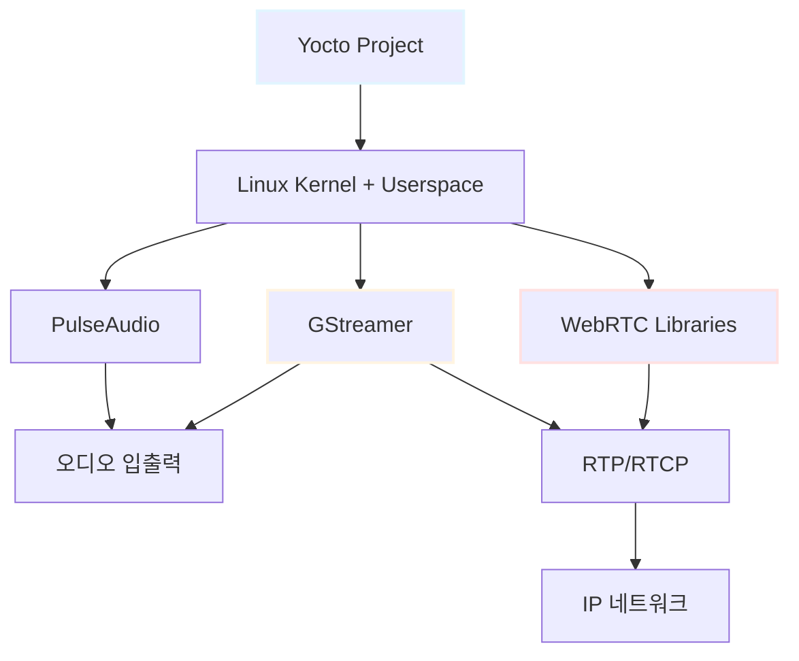
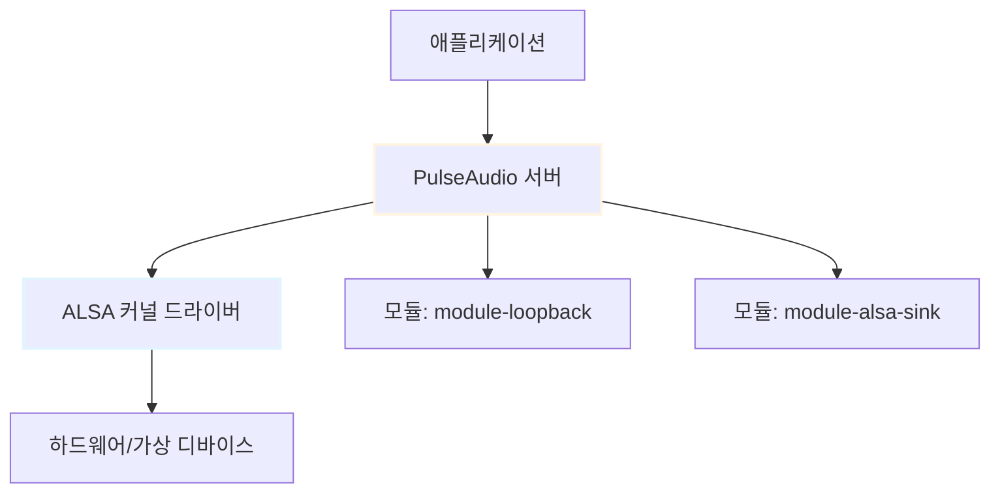
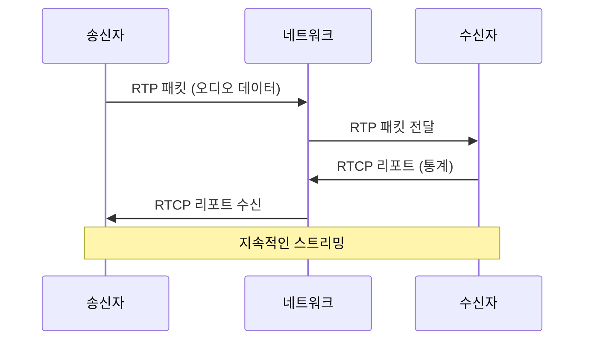
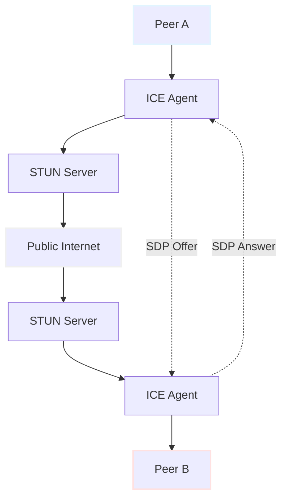
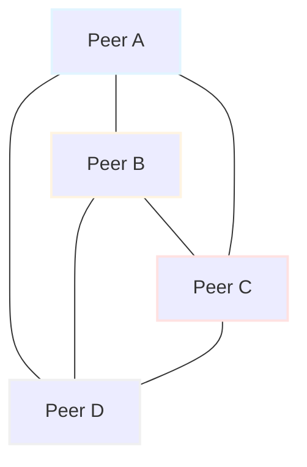
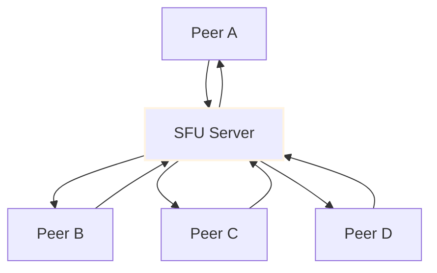

# Yocto ARM32 WebRTC 오디오 통신 시스템 구축 가이드 초안 (검토)

## 목차

1. [프로젝트 개요](#1-프로젝트-개요)
   - 1.1. [목표 및 배경](#11-목표-및-배경)
   - 1.2. [기술 스택](#12-기술-스택)
   - 1.3. [개발 환경 요구사항](#13-개발-환경-요구사항)

2. [1단계: Yocto 이미지 제작](#2-1단계-yocto-이미지-제작)
   - 2.1. [Yocto 프로젝트 소개](#21-yocto-프로젝트-소개)
   - 2.2. [빌드 환경 설정](#22-빌드-환경-설정)
   - 2.3. [커스텀 레이어 생성](#23-커스텀-레이어-생성)
   - 2.4. [이미지 레시피 작성](#24-이미지-레시피-작성)
   - 2.5. [필수 패키지 추가](#25-필수-패키지-추가)
   - 2.6. [빌드 실행](#26-빌드-실행)
   - 2.7. [QEMU 부팅 및 검증](#27-qemu-부팅-및-검증)

3. [1.5단계: 네트워크 검증](#3-15단계-네트워크-검증)
   - 3.1. [QEMU 네트워크 구성](#31-qemu-네트워크-구성)
   - 3.2. [호스트-게스트 연결 테스트](#32-호스트-게스트-연결-테스트)
   - 3.3. [SSH 접속 설정](#33-ssh-접속-설정)

4. [2단계: 로컬 오디오 처리 검증](#4-2단계-로컬-오디오-처리-검증)
   - 4.1. [PulseAudio 기본 설정](#41-pulseaudio-기본-설정)
   - 4.2. [ALSA 루프백 디바이스](#42-alsa-루프백-디바이스)
   - 4.3. [MP3 재생 테스트](#43-mp3-재생-테스트)
   - 4.4. [오디오 캡처 및 WAV 녹음](#44-오디오-캡처-및-wav-녹음)

5. [3단계: GStreamer 오디오 파이프라인](#5-3단계-gstreamer-오디오-파이프라인)
   - 5.1. [GStreamer 기본 개념](#51-gstreamer-기본-개념)
   - 5.2. [파일 기반 인코딩/디코딩](#52-파일-기반-인코딩디코딩)
   - 5.3. [실시간 루프백 테스트](#53-실시간-루프백-테스트)

6. [3.5단계: RTP 스트리밍](#6-35단계-rtp-스트리밍)
   - 6.1. [RTP 프로토콜 개요](#61-rtp-프로토콜-개요)
   - 6.2. [UDP 기반 오디오 전송](#62-udp-기반-오디오-전송)
   - 6.3. [양방향 통신 구성](#63-양방향-통신-구성)

7. [4단계: WebRTC IP-to-IP 통신](#7-4단계-webrtc-ip-to-ip-통신)
   - 7.1. [WebRTC 기본 개념](#71-webrtc-기본-개념)
   - 7.2. [GStreamer webrtcbin 플러그인](#72-gstreamer-webrtcbin-플러그인)
   - 7.3. [로컬 루프백 테스트](#73-로컬-루프백-테스트)
   - 7.4. [호스트-게스트 통신](#74-호스트-게스트-통신)
   - 7.5. [다중 인스턴스 테스트](#75-다중-인스턴스-테스트)

8. [5단계: 성능 측정 및 최적화](#8-5단계-성능-측정-및-최적화)
   - 8.1. [레이턴시 측정](#81-레이턴시-측정)
   - 8.2. [CPU 및 메모리 사용량](#82-cpu-및-메모리-사용량)
   - 8.3. [ARM32 최적화 팁](#83-arm32-최적화-팁)

9. [부록 A: Qt 애플리케이션 통합](#9-부록-a-qt-애플리케이션-통합)
   - 9.1. [QProcess를 통한 GStreamer 실행](#91-qprocess를-통한-gstreamer-실행)
   - 9.2. [GStreamer C API 사용](#92-gstreamer-c-api-사용)

10. [부록 B: 고급 기능](#10-부록-b-고급-기능)
    - 10.1. [다자간 통화 (1:N)](#101-다자간-통화-1n)
    - 10.2. [통화 녹음](#102-통화-녹음)
    - 10.3. [연결 시간 및 딜레이 분석](#103-연결-시간-및-딜레이-분석)

11. [트러블슈팅](#11-트러블슈팅)
    - 11.1. [Yocto 빌드 문제](#111-yocto-빌드-문제)
    - 11.2. [QEMU 오디오 이슈](#112-qemu-오디오-이슈)
    - 11.3. [GStreamer 파이프라인 오류](#113-gstreamer-파이프라인-오류)
    - 11.4. [네트워크 연결 문제](#114-네트워크-연결-문제)

12. [용어 목록 (Glossary)](#12-용어-목록-glossary)

---

## 1. 프로젝트 개요

### 1.1. 목표 및 배경

본 프로젝트는 **Yocto 프로젝트**를 사용하여 ARM32 아키텍처 기반의 임베디드 리눅스 이미지를 생성하고, **GStreamer**와 **WebRTC** 기술을 활용하여 IP 네트워크를 통한 실시간 오디오 통신 시스템을 구축하는 것을 목표로 합니다.

#### 주요 목표
1. **최소 기능 제품(MVP) 검증**: 코딩 없이 명령줄 도구만으로 전체 통신 플로우 테스트
2. **단계적 검증**: 각 계층(오디오 처리, 네트워크 전송, WebRTC)을 독립적으로 테스트
3. **QEMU 에뮬레이션**: 실제 ARM 하드웨어 없이 개발 환경 구축
4. **확장 가능한 아키텍처**: 향후 다자간 통화, 녹음 등 고급 기능 추가 가능

#### 사용 사례
- 임베디드 VoIP 시스템
- IoT 디바이스 간 음성 통신
- 산업용 인터콤 시스템
- 원격 모니터링 및 제어 시스템

### 1.2. 기술 스택



| 컴포넌트 | 버전 | 역할 |
|---------|------|------|
| **Yocto Project** | Kirkstone (4.0) | 커스텀 리눅스 이미지 빌드 시스템 |
| **Linux Kernel** | 5.15+ | ARM32 지원 커널 |
| **GStreamer** | 1.20+ | 멀티미디어 프레임워크 |
| **PulseAudio** | 15.0+ | 오디오 서버 |
| **libnice** | 0.1.18+ | ICE 프로토콜 (NAT traversal) |
| **libsrtp** | 2.4+ | SRTP 암호화 |
| **Opus** | 1.3+ | 오디오 코덱 |

### 1.3. 개발 환경 요구사항

#### 호스트 시스템
- **OS**: Ubuntu 22.04 LTS (64-bit) 권장
- **CPU**: 최소 4코어 (8코어 이상 권장)
- **RAM**: 최소 8GB (16GB 이상 권장)
- **디스크**: 50GB 이상의 여유 공간
- **네트워크**: 인터넷 연결 (패키지 다운로드용)

#### 필수 소프트웨어
```bash
sudo apt-get update
sudo apt-get install -y \
    gawk wget git diffstat unzip texinfo gcc build-essential \
    chrpath socat cpio python3 python3-pip python3-pexpect \
    xz-utils debianutils iputils-ping python3-git python3-jinja2 \
    libegl1-mesa libsdl1.2-dev pylint3 xterm \
    qemu-system-arm qemu-user-static \
    pulseaudio pulseaudio-utils sox
```

#### VMware 설정 (Windows 사용자)
- **VMware Workstation** 또는 **VMware Player**
- **네트워크 어댑터**: NAT 또는 Bridged 모드
- **오디오**: Host 오디오 디바이스와 게스트 연결 활성화

---

## 2. 1단계: Yocto 이미지 제작

### 2.1. Yocto 프로젝트 소개

Yocto 프로젝트는 임베디드 리눅스 배포판을 생성하기 위한 오픈소스 협업 프로젝트입니다. **BitBake** 빌드 엔진과 **OpenEmbedded** 메타데이터를 사용하여 타겟 하드웨어에 최적화된 커스텀 이미지를 생성합니다.

#### 핵심 개념
- **Recipe (레시피)**: 소프트웨어 패키지를 빌드하는 방법을 정의 (`.bb` 파일)
- **Layer (레이어)**: 관련된 레시피들의 모음
- **Image (이미지)**: 부팅 가능한 루트 파일시스템
- **Machine (머신)**: 타겟 하드웨어 설정

### 2.2. 빌드 환경 설정

#### Yocto 소스 다운로드
```bash
# 작업 디렉토리 생성
mkdir -p ~/yocto-webrtc
cd ~/yocto-webrtc

# Poky (Yocto 참조 배포판) 다운로드
git clone -b kirkstone git://git.yoctoproject.org/poky.git
cd poky

# 메타 레이어 추가
git clone -b kirkstone git://git.openembedded.org/meta-openembedded
git clone -b kirkstone https://github.com/openembedded/meta-multimedia.git
```

#### 빌드 환경 초기화
```bash
# 환경 변수 설정 (새 터미널 세션마다 실행 필요)
source oe-init-build-env build-webrtc

# 현재 위치: ~/yocto-webrtc/poky/build-webrtc
```

### 2.3. 커스텀 레이어 생성

```bash
# 커스텀 레이어 생성
bitbake-layers create-layer ../meta-webrtc-audio
bitbake-layers add-layer ../meta-webrtc-audio
bitbake-layers add-layer ../meta-openembedded/meta-oe
bitbake-layers add-layer ../meta-openembedded/meta-multimedia
bitbake-layers add-layer ../meta-openembedded/meta-networking
```

#### 레이어 구조
```
meta-webrtc-audio/
├── conf/
│   └── layer.conf
├── recipes-core/
│   └── images/
│       └── webrtc-audio-image.bb
└── recipes-multimedia/
    └── gstreamer/
        └── gstreamer1.0-plugins-webrtc_%.bbappend
```

### 2.4. 이미지 레시피 작성

#### `meta-webrtc-audio/recipes-core/images/webrtc-audio-image.bb`

```python
SUMMARY = "WebRTC Audio Communication Image"
DESCRIPTION = "Custom image with GStreamer, PulseAudio, and WebRTC support"

# 기본 이미지 상속
require recipes-core/images/core-image-minimal.bb

# 이미지 특징
IMAGE_FEATURES += "ssh-server-dropbear"
IMAGE_FEATURES += "tools-debug"
IMAGE_FEATURES += "package-management"

# 추가 디스크 공간 (MB)
IMAGE_ROOTFS_EXTRA_SPACE = "2048"

# 필수 패키지
IMAGE_INSTALL:append = " \
    alsa-utils \
    alsa-lib \
    alsa-plugins \
    pulseaudio \
    pulseaudio-server \
    pulseaudio-module-alsa-sink \
    pulseaudio-module-alsa-source \
    pulseaudio-module-loopback \
    gstreamer1.0 \
    gstreamer1.0-plugins-base \
    gstreamer1.0-plugins-good \
    gstreamer1.0-plugins-bad \
    gstreamer1.0-plugins-ugly \
    gstreamer1.0-libav \
    gstreamer1.0-rtsp-server \
    opus \
    opus-tools \
    libsrtp \
    libnice \
    mpg123 \
    sox \
    wget \
    curl \
    tcpdump \
    iperf3 \
    htop \
    vim \
    "

# WebRTC 관련 패키지 (가용한 경우)
IMAGE_INSTALL:append = " \
    gstreamer1.0-plugins-webrtc \
    "

# 개발 도구 (디버깅용)
IMAGE_INSTALL:append = " \
    gdb \
    strace \
    "
```

### 2.5. 필수 패키지 추가

#### `conf/local.conf` 수정

```bash
cd ~/yocto-webrtc/poky/build-webrtc/conf
vim local.conf
```

다음 내용 추가:

```python
# 머신 타겟 설정
MACHINE = "qemuarm"

# 병렬 빌드 설정 (CPU 코어 수에 맞게 조정)
BB_NUMBER_THREADS = "8"
PARALLEL_MAKE = "-j 8"

# 추가 디스크 공간
DL_DIR = "${TOPDIR}/../downloads"
SSTATE_DIR = "${TOPDIR}/../sstate-cache"

# 패키지 형식
PACKAGE_CLASSES = "package_ipk"

# 라이선스 확인 건너뛰기 (개발용)
LICENSE_FLAGS_ACCEPTED = "commercial"

# 시스템 로케일
GLIBC_GENERATE_LOCALES = "en_US.UTF-8"

# PulseAudio 활성화
DISTRO_FEATURES:append = " pulseaudio"
DISTRO_FEATURES:append = " alsa"

# 네트워크 기능
DISTRO_FEATURES:append = " ipv4 ipv6"

# 디버그 심볼 포함
EXTRA_IMAGE_FEATURES += "dbg-pkgs"

# GStreamer 플러그인 전체 포함
PACKAGECONFIG:pn-gstreamer1.0-plugins-base = "opus ogg vorbis"
PACKAGECONFIG:pn-gstreamer1.0-plugins-good = "pulse v4l2 rtpmanager rtp"
PACKAGECONFIG:pn-gstreamer1.0-plugins-bad = "rsvg opus srtp dtls hls webrtc"

# QEMU 네트워크 설정
QEMU_USE_SLIRP = "1"
```

### 2.6. 빌드 실행

```bash
# 빌드 환경 재초기화 (필요시)
cd ~/yocto-webrtc/poky
source oe-init-build-env build-webrtc

# 빌드 시작 (첫 빌드는 3-8시간 소요)
bitbake webrtc-audio-image
```

#### 빌드 진행 상황 확인
```bash
# 실시간 로그 확인
tail -f tmp/log/cooker/qemuarm/console-latest.log

# 특정 패키지 빌드 상태 확인
bitbake -c listtasks gstreamer1.0-plugins-bad
```

#### 빌드 산출물 위치
```
build-webrtc/tmp/deploy/images/qemuarm/
├── webrtc-audio-image-qemuarm.ext4
├── zImage-qemuarm.bin
└── modules-qemuarm.tgz
```

### 2.7. QEMU 부팅 및 검증

#### 기본 부팅

```bash
# QEMU 실행 (그래픽 모드)
runqemu qemuarm nographic

# 로그인: root (비밀번호 없음)
```

#### 부팅 옵션 상세

```bash
# 네트워크 포트 포워딩 추가
runqemu qemuarm nographic \
    slirp hostfwd=tcp::2222-:22 \
    hostfwd=udp::5000-:5000 \
    hostfwd=udp::5001-:5001

# 메모리 증설
runqemu qemuarm nographic qemuparams="-m 512"
```

#### 패키지 설치 확인

```bash
# GStreamer 버전 확인
gst-launch-1.0 --version

# PulseAudio 확인
pulseaudio --version
pactl info

# Opus 코덱 확인
opusenc --version

# 네트워크 인터페이스 확인
ip addr show

# 설치된 GStreamer 플러그인 확인
gst-inspect-1.0 | grep -E "(webrtc|rtp|opus|pulse)"
```

**✅ 1단계 성공 기준**:
- [ ] QEMU가 정상 부팅됨
- [ ] `gst-launch-1.0 --version` 실행 성공
- [ ] `pactl info` 실행 성공
- [ ] `gst-inspect-1.0 webrtcbin` 실행 시 플러그인 정보 출력
- [ ] 네트워크 인터페이스 존재 (`eth0` 또는 `enp0s3`)

---

## 3. 1.5단계: 네트워크 검증

### 3.1. QEMU 네트워크 구성

#### QEMU 네트워크 모드

| 모드 | 특징 | 사용 시나리오 |
|------|------|--------------|
| **User (SLIRP)** | NAT 기반, 설정 간단 | 기본 테스트, 인터넷 접근 |
| **TAP** | 브리지 연결, 호스트와 동등 | 실제 네트워크 시뮬레이션 |
| **Socket** | 다중 QEMU 연결 | 여러 가상 머신 통신 |

#### SLIRP 네트워크 구조


### 3.2. 호스트-게스트 연결 테스트

#### 게스트에서 호스트로 Ping

```bash
# QEMU 내부 (게스트)
ping -c 4 10.0.2.2

# 예상 출력:
# 64 bytes from 10.0.2.2: icmp_seq=1 ttl=255 time=0.5 ms
```

#### 게스트에서 외부 인터넷 접근

```bash
# DNS 확인
ping -c 4 8.8.8.8

# HTTP 접근
wget -O /dev/null http://www.google.com
```

#### 호스트에서 게스트로 연결

```bash
# 호스트 터미널 (QEMU 외부)
# 포트 포워딩 사용: localhost:2222 -> 게스트:22
ssh -p 2222 root@localhost

# UDP 포트 테스트
nc -u -l 5000  # 호스트에서 리스닝
```

### 3.3. SSH 접속 설정

#### Dropbear SSH 서버 활성화 (게스트)

```bash
# SSH 서비스 시작
/etc/init.d/dropbear start

# 부팅 시 자동 시작 설정
systemctl enable dropbear  # systemd 사용 시
```

#### 호스트에서 SSH 접속

```bash
# 기본 연결
ssh -p 2222 root@localhost

# 키 기반 인증 설정 (선택사항)
ssh-keygen -t rsa -b 2048 -f ~/.ssh/qemu_key
ssh-copy-id -p 2222 -i ~/.ssh/qemu_key.pub root@localhost
```

#### 파일 전송 테스트

```bash
# 호스트 → 게스트
scp -P 2222 test.mp3 root@localhost:/home/root/

# 게스트 → 호스트
scp -P 2222 root@localhost:/tmp/output.wav ./
```

**✅ 1.5단계 성공 기준**:
- [ ] 게스트에서 `ping 10.0.2.2` 성공
- [ ] 게스트에서 `ping 8.8.8.8` 성공 (인터넷 접근)
- [ ] 호스트에서 `ssh -p 2222 root@localhost` 접속 성공
- [ ] SCP로 파일 전송 성공

---

## 4. 2단계: 로컬 오디오 처리 검증

### 4.1. PulseAudio 기본 설정

#### PulseAudio 아키텍처



#### PulseAudio 시작

```bash
# 데몬 시작
pulseaudio --start --log-target=syslog

# 상태 확인
pactl info

# 출력 예시:
# Server String: /run/user/0/pulse/native
# Library Protocol Version: 35
# Server Protocol Version: 35
# Default Sink: alsa_output.platform-snd_aloop.0.analog-stereo
```

#### 설정 파일 수정

**`/etc/pulse/default.pa`** (필요시 수정):

```bash
# ALSA 디바이스 로드
load-module module-alsa-sink device=hw:0,0
load-module module-alsa-source device=hw:0,0

# 루프백 모듈 (마이크 → 스피커 테스트용)
load-module module-loopback latency_msec=1

# 네트워크 스트리밍 (선택사항)
load-module module-native-protocol-tcp auth-ip-acl=127.0.0.1;10.0.2.0/24
```

### 4.2. ALSA 루프백 디바이스

#### 루프백 커널 모듈 로드

```bash
# snd-aloop 모듈 로드 (가상 오디오 디바이스)
modprobe snd-aloop

# 확인
cat /proc/asound/cards

# 출력 예시:
#  0 [Loopback       ]: Loopback - Loopback
#                       Loopback 1
```

#### ALSA 디바이스 테스트

```bash
# 사용 가능한 디바이스 나열
aplay -l
arecord -l

# 테스트 사운드 재생 (빔 소리)
speaker-test -D hw:0,0 -c 2 -t wav
```

### 4.3. MP3 재생 테스트

#### 테스트 파일 준비

```bash
# 호스트에서 MP3 파일 전송
scp -P 2222 ~/Music/test.mp3 root@localhost:/tmp/

# 또는 wget으로 다운로드 (게스트 내부)
wget -O /tmp/test.mp3 https://www.soundhelix.com/examples/mp3/SoundHelix-Song-1.mp3
```

#### mpg123으로 재생

```bash
# 기본 재생
mpg123 /tmp/test.mp3

# 특정 PulseAudio 출력으로 재생
mpg123 -a pulse /tmp/test.mp3

# 루프 재생 (테스트용)
mpg123 --loop -1 /tmp/test.mp3
```

#### PulseAudio 직접 재생

```bash
# WAV 변환 후 재생
mpg123 -w /tmp/test.wav /tmp/test.mp3
paplay /tmp/test.wav

# 또는 SoX 사용
sox /tmp/test.mp3 -t raw -r 44100 -e signed -b 16 -c 2 - | \
    paplay --raw --rate=44100 --channels=2 --format=s16le
```

### 4.4. 오디오 캡처 및 WAV 녹음

#### PulseAudio 소스 확인

```bash
# 사용 가능한 오디오 소스 나열
pactl list sources short

# 출력 예시:
# 0  alsa_output.platform-snd_aloop.0.analog-stereo.monitor  ...
# 1  alsa_input.platform-snd_aloop.0.analog-stereo  ...
```

#### 스피커 출력 모니터링 (재생 중인 오디오 캡처)

```bash
# 백그라운드에서 MP3 재생
mpg123 --loop -1 /tmp/test.mp3 &

# 스피커 출력을 캡처하여 WAV 저장 (10초)
timeout 10 parec \
    --device=alsa_output.platform-snd_aloop.0.analog-stereo.monitor \
    --file-format=wav \
    /tmp/captured_output.wav

# 재생 프로세스 종료
killall mpg123

# 녹음 파일 재생 확인
paplay /tmp/captured_output.wav
```

#### 마이크 입력 녹음

```bash
# 마이크에서 직접 녹음 (5초)
timeout 5 parec \
    --device=alsa_input.platform-snd_aloop.0.analog-stereo \
    --file-format=wav \
    /tmp/mic_input.wav

# 녹음 파일 정보 확인
file /tmp/mic_input.wav
soxi /tmp/mic_input.wav  # SoX 사용 시

# 재생
paplay /tmp/mic_input.wav
```

#### Raw PCM 데이터 처리

```bash
# Raw 형식으로 녹음
parec --device=alsa_output.platform-snd_aloop.0.analog-stereo.monitor \
    --format=s16le --rate=44100 --channels=2 \
    /tmp/raw_audio.pcm

# Raw를 WAV로 변환 (SoX)
sox -t raw -r 44100 -e signed -b 16 -c 2 \
    /tmp/raw_audio.pcm \
    /tmp/converted.wav
```

**✅ 2단계 성공 기준**:
- [ ] `pactl info` 실행 시 PulseAudio 서버 실행 중
- [ ] `mpg123 /tmp/test.mp3` 재생 성공 (소리 확인)
- [ ] `parec`로 스피커 출력 캡처 성공
- [ ] 캡처된 WAV 파일 재생 시 원본 음악 들림
- [ ] `aplay -l` 실행 시 최소 1개 디바이스 표시

---

## 5. 3단계: GStreamer 오디오 파이프라인

### 5.1. GStreamer 기본 개념

#### 파이프라인 구조


#### 핵심 요소 (Element)

| 요소 타입 | 예시 | 기능 |
|----------|------|------|
| **Source** | `pulsesrc`, `filesrc`, `audiotestsrc` | 데이터 생성/입력 |
| **Filter** | `audioconvert`, `audioresample`, `volume` | 데이터 변환 |
| **Encoder** | `opusenc`, `vorbisenc`, `avenc_aac` | 오디오 압축 |
| **Payloader** | `rtpopuspay`, `rtpvorbispay` | RTP 패킷화 |
| **Sink** | `pulsesink`, `filesink`, `udpsink` | 데이터 출력 |

#### 기본 문법

```bash
# 기본 구조
gst-launch-1.0 [옵션] 요소1 ! 요소2 ! 요소3

# 캡 필터 (Capabilities) 사용
gst-launch-1.0 source ! "audio/x-raw,rate=48000" ! sink

# 속성 설정
gst-launch-1.0 source property=value ! sink
```

### 5.2. 파일 기반 인코딩/디코딩

#### 오디오 녹음 (PulseAudio → WAV)

```bash
# 기본 녹음 (10초)
timeout 10 gst-launch-1.0 -e \
    pulsesrc ! \
    audioconvert ! \
    wavenc ! \
    filesink location=/tmp/gst_recording.wav

# 샘플링 레이트 지정
timeout 10 gst-launch-1.0 -e \
    pulsesrc ! \
    audioconvert ! \
    "audio/x-raw,rate=48000,channels=2" ! \
    wavenc ! \
    filesink location=/tmp/gst_48k.wav
```

#### Opus 인코딩

```bash
# WAV → Opus
gst-launch-1.0 \
    filesrc location=/tmp/test.wav ! \
    decodebin ! \
    audioconvert ! \
    opusenc bitrate=64000 ! \
    oggmux ! \
    filesink location=/tmp/test.opus

# 실시간 녹음 → Opus
timeout 10 gst-launch-1.0 -e \
    pulsesrc ! \
    audioconvert ! \
    opusenc ! \
    oggmux ! \
    filesink location=/tmp/live_recording.opus
```

#### 파일 재생

```bash
# WAV 재생
gst-launch-1.0 \
    filesrc location=/tmp/gst_recording.wav ! \
    wavparse ! \
    audioconvert ! \
    pulsesink

# Opus 재생
gst-launch-1.0 \
    filesrc location=/tmp/test.opus ! \
    oggdemux ! \
    opusdec ! \
    audioconvert ! \
    pulsesink

# 자동 디코딩 (decodebin)
gst-launch-1.0 \
    filesrc location=/tmp/test.mp3 ! \
    decodebin ! \
    audioconvert ! \
    pulsesink
```

### 5.3. 실시간 루프백 테스트

#### 기본 루프백 (마이크 → 스피커)

```bash
# 최소 지연 루프백
gst-launch-1.0 \
    pulsesrc ! \
    audioconvert ! \
    pulsesink

# 지연 시간 명시
gst-launch-1.0 \
    pulsesrc buffer-time=20000 latency-time=10000 ! \
    audioconvert ! \
    pulsesink buffer-time=20000 latency-time=10000
```

#### 처리 체인 추가

```bash
# 볼륨 조절
gst-launch-1.0 \
    pulsesrc ! \
    audioconvert ! \
    volume volume=0.5 ! \
    pulsesink

# 에코 효과
gst-launch-1.0 \
    pulsesrc ! \
    audioconvert ! \
    audioecho delay=500000000 intensity=0.6 feedback=0.4 ! \
    pulsesink
```

#### 압축/해제 루프백 (코덱 테스트)

```bash
# Opus 인코딩 → 디코딩
gst-launch-1.0 \
    pulsesrc ! \
    audioconvert ! \
    opusenc bitrate=64000 ! \
    opusdec ! \
    audioconvert ! \
    pulsesink
```

#### 디버깅 정보 출력

```bash
# 상세 로그 활성화
GST_DEBUG=3 gst-launch-1.0 \
    pulsesrc ! audioconvert ! pulsesink

# 특정 요소만 디버깅
GST_DEBUG=pulsesrc:5 gst-launch-1.0 \
    pulsesrc ! audioconvert ! pulsesink

# 파이프라인 그래프 생성 (DOT 파일)
GST_DEBUG_DUMP_DOT_DIR=/tmp gst-launch-1.0 \
    pulsesrc ! audioconvert ! pulsesink
# 생성된 .dot 파일을 Graphviz로 시각화 가능
```

**✅ 3단계 성공 기준**:
- [ ] `gst-launch-1.0 pulsesrc ! audioconvert ! filesink location=/tmp/test.wav` 실행 성공
- [ ] 녹음된 WAV 파일 재생 가능
- [ ] Opus 인코딩/디코딩 성공
- [ ] 실시간 루프백 시 음성/음악 들림 (약간의 지연 허용)
- [ ] `gst-inspect-1.0 opusenc` 실행 시 플러그인 정보 표시

---

## 6. 3.5단계: RTP 스트리밍

### 6.1. RTP 프로토콜 개요

#### RTP (Real-time Transport Protocol)

RTP는 실시간 오디오/비디오 전송을 위한 표준 프로토콜입니다. UDP 기반으로 작동하며, RTCP(Real-time Transport Control Protocol)와 함께 사용됩니다.



#### RTP vs Raw UDP

| 특징 | Raw UDP | RTP |
|------|---------|-----|
| **시퀀스 번호** | 없음 | 있음 (패킷 순서 보장) |
| **타임스탬프** | 없음 | 있음 (동기화) |
| **패킷 손실 감지** | 어려움 | 가능 |
| **지터 제어** | 없음 | 버퍼링 지원 |

### 6.2. UDP 기반 오디오 전송

#### 송신자 (Sender) 파이프라인

```bash
# 기본 Opus over RTP 송신
gst-launch-1.0 -v \
    pulsesrc ! \
    audioconvert ! \
    audioresample ! \
    opusenc bitrate=64000 ! \
    rtpopuspay ! \
    udpsink host=127.0.0.1 port=5000

# 호스트로 전송 (QEMU 게스트 → 호스트)
gst-launch-1.0 -v \
    pulsesrc ! \
    audioconvert ! \
    audioresample ! \
    opusenc ! \
    rtpopuspay ! \
    udpsink host=10.0.2.2 port=5000
```

#### 수신자 (Receiver) 파이프라인

```bash
# 기본 RTP 수신 (로컬)
gst-launch-1.0 -v \
    udpsrc port=5000 caps="application/x-rtp,media=(string)audio,encoding-name=(string)OPUS,payload=(int)96" ! \
    rtpopusdepay ! \
    opusdec ! \
    audioconvert ! \
    pulsesink

# 더 명시적인 캡 설정
gst-launch-1.0 -v \
    udpsrc port=5000 ! \
    "application/x-rtp,media=audio,clock-rate=48000,encoding-name=OPUS,payload=96" ! \
    rtpopusdepay ! \
    opusdec ! \
    audioconvert ! \
    audioresample ! \
    pulsesink
```

#### 전체 테스트 스크립트

**송신 스크립트** (`sender.sh`):

```bash
#!/bin/bash
echo "Starting RTP Sender on port 5000..."

gst-launch-1.0 -v \
    pulsesrc device=alsa_input.platform-snd_aloop.0.analog-stereo ! \
    audioconvert ! \
    audioresample ! \
    "audio/x-raw,rate=48000,channels=1" ! \
    opusenc bitrate=64000 frame-size=20 ! \
    rtpopuspay ! \
    udpsink host=${TARGET_IP:-127.0.0.1} port=5000
```

**수신 스크립트** (`receiver.sh`):

```bash
#!/bin/bash
echo "Starting RTP Receiver on port 5000..."

gst-launch-1.0 -v \
    udpsrc port=5000 ! \
    "application/x-rtp,media=audio,clock-rate=48000,encoding-name=OPUS,payload=96" ! \
    rtpjitterbuffer latency=100 ! \
    rtpopusdepay ! \
    opusdec ! \
    audioconvert ! \
    audioresample ! \
    pulsesink device=alsa_output.platform-snd_aloop.0.analog-stereo
```

### 6.3. 양방향 통신 구성

#### 포트 할당

| 방향 | 송신 포트 | 수신 포트 |
|------|----------|----------|
| **A → B** | A:5000 | B:5000 |
| **B → A** | B:5001 | A:5001 |

#### 인스턴스 A (송수신)

```bash
# 터미널 1: 송신 (포트 5000으로)
gst-launch-1.0 \
    pulsesrc ! audioconvert ! opusenc ! rtpopuspay ! \
    udpsink host=192.168.1.101 port=5000 &

# 터미널 2: 수신 (포트 5001에서)
gst-launch-1.0 \
    udpsrc port=5001 ! \
    "application/x-rtp,media=audio,encoding-name=OPUS,payload=96" ! \
    rtpopusdepay ! opusdec ! audioconvert ! pulsesink
```

#### 인스턴스 B (송수신)

```bash
# 터미널 1: 송신 (포트 5001으로)
gst-launch-1.0 \
    pulsesrc ! audioconvert ! opusenc ! rtpopuspay ! \
    udpsink host=192.168.1.100 port=5001 &

# 터미널 2: 수신 (포트 5000에서)
gst-launch-1.0 \
    udpsrc port=5000 ! \
    "application/x-rtp,media=audio,encoding-name=OPUS,payload=96" ! \
    rtpopusdepay ! opusdec ! audioconvert ! pulsesink
```

#### 패킷 캡처 및 분석

```bash
# Wireshark 없이 tcpdump로 확인
tcpdump -i any -n udp port 5000 -vv

# RTP 패킷 통계
tcpdump -i any -n udp port 5000 -c 100 | \
    grep "UDP" | wc -l

# 특정 호스트 간 트래픽
tcpdump -i any -n host 192.168.1.100 and udp port 5000
```

#### 성능 측정

```bash
# 네트워크 대역폭 측정
iperf3 -s -p 5002  # 서버
iperf3 -c 192.168.1.101 -u -b 100K -p 5002  # 클라이언트

# GStreamer 통계 출력
GST_DEBUG=GST_STATES:3 gst-launch-1.0 \
    udpsrc port=5000 ! ... ! pulsesink
```

**✅ 3.5단계 성공 기준**:
- [ ] 송신 파이프라인 실행 후 에러 없음
- [ ] 수신 파이프라인에서 오디오 출력됨
- [ ] `tcpdump`로 UDP 패킷 확인 가능
- [ ] 양방향 통신 시 에코 들림 (루프백 상태)
- [ ] 네트워크 지연이 500ms 이하

---

## 7. 4단계: WebRTC IP-to-IP 통신

### 7.1. WebRTC 기본 개념

#### WebRTC 아키텍처



#### 주요 구성 요소

| 구성 요소 | 설명 | 역할 |
|----------|------|------|
| **ICE** | Interactive Connectivity Establishment | NAT 통과 후보 수집 |
| **STUN** | Session Traversal Utilities for NAT | 공인 IP 확인 |
| **TURN** | Traversal Using Relays around NAT | 릴레이 서버 (Fallback) |
| **SDP** | Session Description Protocol | 세션 정보 교환 |
| **DTLS** | Datagram Transport Layer Security | 보안 채널 |
| **SRTP** | Secure Real-time Transport Protocol | 암호화된 미디어 전송 |

#### Signaling 없는 직접 연결

로컬 네트워크 테스트에서는 SDP를 수동으로 교환하여 Signaling 서버를 생략할 수 있습니다.

```
┌─────────┐         ┌─────────┐
│ Peer A  │ <─────> │ Peer B  │
└─────────┘  직접   └─────────┘
             연결
```

### 7.2. GStreamer webrtcbin 플러그인

#### webrtcbin 확인

```bash
# 플러그인 설치 확인
gst-inspect-1.0 webrtcbin

# 출력 예시:
# Factory Details:
#   Rank: none (0)
#   Long-name: WebRTC Bin
#   ...
```

#### 기본 파이프라인 구조

```bash
# 송신 기본 구조
gst-launch-1.0 webrtcbin name=sendrecv \
    pulsesrc ! opusenc ! rtpopuspay ! \
    "application/x-rtp,media=audio,encoding-name=OPUS,payload=96" ! \
    sendrecv.

# 수신 포함 (양방향)
gst-launch-1.0 webrtcbin name=sendrecv \
    pulsesrc ! opusenc ! rtpopuspay ! sendrecv. \
    sendrecv. ! rtpopusdepay ! opusdec ! pulsesink
```

### 7.3. 로컬 루프백 테스트

#### 간소화된 WebRTC 루프백

```bash
# 주의: 실제 WebRTC는 Signaling 필요
# 이 예제는 개념 검증용

gst-launch-1.0 webrtcbin name=wb bundle-policy=max-bundle \
    pulsesrc ! audioconvert ! opusenc ! rtpopuspay ! \
    "application/x-rtp,media=audio,payload=96,encoding-name=OPUS" ! \
    wb.sink_0 \
    wb.src_0 ! rtpopusdepay ! opusdec ! audioconvert ! pulsesink
```

**참고**: 실제 동작에는 Python 스크립트 등을 통한 SDP 교환 필요.

### 7.4. 호스트-게스트 통신

#### Python 기반 간단한 WebRTC 예제

**`webrtc_sender.py`** (송신자):

```python
#!/usr/bin/env python3
import gi
gi.require_version('Gst', '1.0')
gi.require_version('GstWebRTC', '1.0')
gi.require_version('GstSdp', '1.0')
from gi.repository import Gst, GstWebRTC, GstSdp, GLib
import json
import sys

Gst.init(None)

pipeline = Gst.parse_launch(
    'webrtcbin name=sendrecv bundle-policy=max-bundle '
    'pulsesrc ! audioconvert ! audioresample ! queue ! opusenc ! rtpopuspay ! '
    '"application/x-rtp,media=audio,encoding-name=OPUS,payload=96" ! sendrecv.'
)

webrtc = pipeline.get_by_name('sendrecv')

def on_negotiation_needed(element):
    promise = Gst.Promise.new_with_change_func(on_offer_created, element, None)
    element.emit('create-offer', None, promise)

def on_offer_created(promise, element, _):
    promise.wait()
    reply = promise.get_reply()
    offer = reply['offer']
    promise = Gst.Promise.new()
    element.emit('set-local-description', offer, promise)
    promise.interrupt()
    
    # SDP 출력 (수동 전달)
    print("=== SDP OFFER ===")
    print(offer.sdp.as_text())
    print("=================")

def on_ice_candidate(element, mlineindex, candidate):
    print(f"ICE: {mlineindex} {candidate}")

webrtc.connect('on-negotiation-needed', on_negotiation_needed)
webrtc.connect('on-ice-candidate', on_ice_candidate)

pipeline.set_state(Gst.State.PLAYING)

try:
    loop = GLib.MainLoop()
    loop.run()
except KeyboardInterrupt:
    pass

pipeline.set_state(Gst.State.NULL)
```

**`webrtc_receiver.py`** (수신자):

```python
#!/usr/bin/env python3
import gi
gi.require_version('Gst', '1.0')
gi.require_version('GstWebRTC', '1.0')
gi.require_version('GstSdp', '1.0')
from gi.repository import Gst, GstWebRTC, GstSdp, GLib

Gst.init(None)

pipeline = Gst.parse_launch(
    'webrtcbin name=sendrecv bundle-policy=max-bundle '
    'sendrecv. ! rtpopusdepay ! opusdec ! audioconvert ! audioresample ! pulsesink'
)

webrtc = pipeline.get_by_name('sendrecv')

# Offer SDP를 입력받아 설정
def set_remote_description(sdp_text):
    sdp = GstSdp.SDPMessage.new()
    GstSdp.sdp_message_parse_buffer(bytes(sdp_text.encode()), sdp)
    offer = GstWebRTC.WebRTCSessionDescription.new(GstWebRTC.WebRTCSDPType.OFFER, sdp)
    
    promise = Gst.Promise.new()
    webrtc.emit('set-remote-description', offer, promise)
    promise.interrupt()
    
    # Answer 생성
    promise = Gst.Promise.new_with_change_func(on_answer_created, webrtc, None)
    webrtc.emit('create-answer', None, promise)

def on_answer_created(promise, element, _):
    promise.wait()
    reply = promise.get_reply()
    answer = reply['answer']
    promise = Gst.Promise.new()
    element.emit('set-local-description', answer, promise)
    promise.interrupt()
    
    print("=== SDP ANSWER ===")
    print(answer.sdp.as_text())
    print("==================")

pipeline.set_state(Gst.State.PLAYING)

# 송신자의 SDP를 여기에 붙여넣기
sdp_offer = """
v=0
o=- 123456 2 IN IP4 127.0.0.1
...
"""
set_remote_description(sdp_offer)

try:
    loop = GLib.MainLoop()
    loop.run()
except KeyboardInterrupt:
    pass

pipeline.set_state(Gst.State.NULL)
```

#### 실행 순서

```bash
# 터미널 1 (수신자)
python3 webrtc_receiver.py

# 터미널 2 (송신자)
python3 webrtc_sender.py
# SDP OFFER 복사 → receiver.py의 sdp_offer 변수에 붙여넣기
# receiver.py 재실행
```

### 7.5. 다중 인스턴스 테스트

#### QEMU 2개 인스턴스 실행

**터미널 1** (인스턴스 A):

```bash
cd ~/yocto-webrtc/poky/build-webrtc
runqemu qemuarm nographic \
    slirp hostfwd=tcp::2222-:22 hostfwd=udp::5000-:5000
```

**터미널 2** (인스턴스 B):

```bash
cd ~/yocto-webrtc/poky/build-webrtc
runqemu qemuarm nographic \
    slirp hostfwd=tcp::2223-:22 hostfwd=udp::5001-:5001
```

#### 네트워크 브리지 구성 (고급)

TAP 네트워크를 사용하여 실제 네트워크처럼 구성:

```bash
# 호스트에서 브리지 생성
sudo ip link add br0 type bridge
sudo ip link set br0 up
sudo ip addr add 192.168.100.1/24 dev br0

# QEMU 실행 시 TAP 사용
runqemu qemuarm nographic \
    qemuparams="-netdev tap,id=net0,ifname=tap0,script=no,downscript=no -device virtio-net-device,netdev=net0"
```

**✅ 4단계 성공 기준**:
- [ ] `gst-inspect-1.0 webrtcbin` 실행 성공
- [ ] Python WebRTC 스크립트 실행 시 SDP 출력됨
- [ ] SDP 교환 후 오디오 전송 확인
- [ ] 2개 QEMU 인스턴스 간 통신 성공 (또는 호스트-게스트)
- [ ] 양방향 통화 가능 (약간의 딜레이 허용)

---

## 8. 5단계: 성능 측정 및 최적화

### 8.1. 레이턴시 측정

#### 엔드-투-엔드 레이턴시 구조

```
[마이크] → [PulseAudio] → [GStreamer] → [Opus 인코딩] → [RTP] → 
→ [네트워크] → [RTP] → [Opus 디코딩] → [GStreamer] → [PulseAudio] → [스피커]
```

#### 측정 방법론

**1. 루프백 테스트**

```bash
# 송신과 수신을 동시 실행, 마이크 입력이 스피커로 돌아오는 시간 측정
# 비프음 생성
gst-launch-1.0 audiotestsrc freq=1000 ! pulsesink &

# 동시에 녹음 시작
arecord -f cd -d 3 /tmp/loopback_test.wav

# 오디오 파형 분석 (수동)
audacity /tmp/loopback_test.wav
```

**2. 타임스탬프 기반 측정**

```bash
# GStreamer 통계 활성화
GST_DEBUG="GST_TRACER:7" GST_TRACERS="latency" \
gst-launch-1.0 \
    pulsesrc ! audioconvert ! opusenc ! rtpopuspay ! \
    udpsink host=127.0.0.1 port=5000

# 로그에서 지연 시간 확인
# latency: 42ms
```

#### 예상 레이턴시

| 구간 | 예상 시간 | 최적화 가능 |
|------|----------|------------|
| **오디오 캡처** | 10-20ms | ✓ (버퍼 크기) |
| **인코딩** | 5-10ms | ✓ (코덱 설정) |
| **네트워크 전송** | 5-50ms | △ (네트워크 품질) |
| **디코딩** | 5-10ms | ✓ |
| **재생 버퍼** | 10-30ms | ✓ |
| **총합** | **35-120ms** | |

### 8.2. CPU 및 메모리 사용량

#### 모니터링 도구

```bash
# 실시간 프로세스 모니터링
htop

# 특정 프로세스 CPU 사용량
top -p $(pgrep gst-launch-1.0)

# GStreamer 프로세스 메모리
ps aux | grep gst-launch | awk '{print $6 " KB"}'

# 시스템 전체 메모리
free -h
```

#### 자동화된 벤치마크

```bash
#!/bin/bash
# benchmark.sh

echo "Starting WebRTC performance test..."

# CPU 사용량 기록 시작
top -b -d 1 -n 60 > /tmp/cpu_usage.log &
TOP_PID=$!

# GStreamer 실행
gst-launch-1.0 \
    pulsesrc ! audioconvert ! opusenc ! rtpopuspay ! \
    udpsink host=127.0.0.1 port=5000 &
GST_PID=$!

sleep 60

# 종료
kill $GST_PID
kill $TOP_PID

# 평균 CPU 사용량 계산
grep "gst-launch" /tmp/cpu_usage.log | \
    awk '{sum+=$9; count++} END {print "Average CPU:", sum/count "%"}'
```

#### ARM32 프로파일링

```bash
# perf 도구 (커널 지원 필요)
perf record -g gst-launch-1.0 pulsesrc ! audioconvert ! pulsesink
perf report

# strace로 시스템 콜 분석
strace -c gst-launch-1.0 pulsesrc ! audioconvert ! pulsesink
```

#### 예상 리소스 사용량

| 시나리오 | CPU 사용률 | 메모리 |
|---------|-----------|--------|
| **Opus 인코딩** | 5-15% | 20MB |
| **RTP 송수신** | 10-20% | 30MB |
| **WebRTC (DTLS 포함)** | 15-30% | 50MB |

### 8.3. ARM32 최적화 팁

#### 컴파일러 최적화

**`local.conf`에 추가**:

```python
# ARM NEON SIMD 활성화
TUNE_FEATURES:append = " neon"

# 최적화 레벨
FULL_OPTIMIZATION = "-O3 -pipe"

# Opus ARM 최적화
PACKAGECONFIG:pn-opus = "fixed-point"
```

#### GStreamer 최적화

```bash
# 하드웨어 가속 (ARM 디바이스에서)
gst-launch-1.0 \
    pulsesrc ! audioconvert ! \
    opusenc complexity=5 ! \  # 낮은 복잡도 (0-10)
    rtpopuspay ! udpsink

# 버퍼 크기 조정
gst-launch-1.0 \
    pulsesrc buffer-time=20000 latency-time=5000 ! \
    audioconvert ! pulsesink buffer-time=20000
```

#### PulseAudio 설정

**`/etc/pulse/daemon.conf`**:

```ini
# 샘플 레이트 (낮추면 CPU 부담 감소)
default-sample-rate = 16000
alternate-sample-rate = 16000

# 버퍼 크기
default-fragments = 4
default-fragment-size-msec = 10

# 리샘플링 알고리즘 (빠른 버전)
resample-method = ffmpeg
```

#### 코덱 설정 최적화

```bash
# Opus 저복잡도 설정
gst-launch-1.0 \
    pulsesrc ! audioconvert ! \
    opusenc \
        bitrate=32000 \
        frame-size=40 \
        complexity=5 \
        inband-fec=false \
        dtx=true ! \
    rtpopuspay ! udpsink
```

#### 메모리 최적화

```bash
# Swap 비활성화 (eMMC/SD 수명 보호)
swapoff -a

# 캐시 정리
sync; echo 3 > /proc/sys/vm/drop_caches

# OOM Killer 설정
echo -1000 > /proc/$(pgrep gst-launch-1.0)/oom_score_adj
```

**✅ 5단계 성공 기준**:
- [ ] 엔드-투-엔드 레이턴시 150ms 이하
- [ ] CPU 사용률 30% 이하 (단일 통화)
- [ ] 메모리 사용량 100MB 이하
- [ ] 1시간 연속 통화 시 안정성 유지

---

## 9. 부록 A: Qt 애플리케이션 통합

### 9.1. QProcess를 통한 GStreamer 실행

#### 기본 예제 (C++/Qt)

```cpp
// AudioStreamer.h
#ifndef AUDIOSTREAMER_H
#define AUDIOSTREAMER_H

#include <QObject>
#include <QProcess>

class AudioStreamer : public QObject
{
    Q_OBJECT
    
public:
    explicit AudioStreamer(QObject *parent = nullptr);
    ~AudioStreamer();
    
    void startSending(const QString &targetIp, int port);
    void startReceiving(int port);
    void stop();
    
signals:
    void errorOccurred(const QString &error);
    void stateChanged(const QString &state);
    
private slots:
    void onProcessFinished(int exitCode);
    void onProcessError(QProcess::ProcessError error);
    void onProcessOutput();
    
private:
    QProcess *m_senderProcess;
    QProcess *m_receiverProcess;
};

#endif // AUDIOSTREAMER_H
```

```cpp
// AudioStreamer.cpp
#include "AudioStreamer.h"
#include <QDebug>

AudioStreamer::AudioStreamer(QObject *parent)
    : QObject(parent)
    , m_senderProcess(nullptr)
    , m_receiverProcess(nullptr)
{
}

AudioStreamer::~AudioStreamer()
{
    stop();
}

void AudioStreamer::startSending(const QString &targetIp, int port)
{
    if (m_senderProcess && m_senderProcess->state() == QProcess::Running) {
        qWarning() << "Sender already running";
        return;
    }
    
    m_senderProcess = new QProcess(this);
    
    connect(m_senderProcess, QOverload<int>::of(&QProcess::finished),
            this, &AudioStreamer::onProcessFinished);
    connect(m_senderProcess, &QProcess::errorOccurred,
            this, &AudioStreamer::onProcessError);
    connect(m_senderProcess, &QProcess::readyReadStandardOutput,
            this, &AudioStreamer::onProcessOutput);
    
    QString pipeline = QString(
        "pulsesrc ! audioconvert ! opusenc ! rtpopuspay ! "
        "udpsink host=%1 port=%2"
    ).arg(targetIp).arg(port);
    
    QStringList args;
    args << "-e" << pipeline;
    
    m_senderProcess->start("gst-launch-1.0", args);
    
    if (!m_senderProcess->waitForStarted(3000)) {
        emit errorOccurred("Failed to start GStreamer sender");
        return;
    }
    
    emit stateChanged("Sending audio");
}

void AudioStreamer::startReceiving(int port)
{
    if (m_receiverProcess && m_receiverProcess->state() == QProcess::Running) {
        qWarning() << "Receiver already running";
        return;
    }
    
    m_receiverProcess = new QProcess(this);
    
    connect(m_receiverProcess, QOverload<int>::of(&QProcess::finished),
            this, &AudioStreamer::onProcessFinished);
    connect(m_receiverProcess, &QProcess::errorOccurred,
            this, &AudioStreamer::onProcessError);
    
    QString pipeline = QString(
        "udpsrc port=%1 ! "
        "application/x-rtp,media=audio,encoding-name=OPUS,payload=96 ! "
        "rtpopusdepay ! opusdec ! audioconvert ! pulsesink"
    ).arg(port);
    
    QStringList args;
    args << "-e" << pipeline;
    
    m_receiverProcess->start("gst-launch-1.0", args);
    
    if (!m_receiverProcess->waitForStarted(3000)) {
        emit errorOccurred("Failed to start GStreamer receiver");
        return;
    }
    
    emit stateChanged("Receiving audio");
}

void AudioStreamer::stop()
{
    if (m_senderProcess) {
        m_senderProcess->terminate();
        if (!m_senderProcess->waitForFinished(3000)) {
            m_senderProcess->kill();
        }
        m_senderProcess->deleteLater();
        m_senderProcess = nullptr;
    }
    
    if (m_receiverProcess) {
        m_receiverProcess->terminate();
        if (!m_receiverProcess->waitForFinished(3000)) {
            m_receiverProcess->kill();
        }
        m_receiverProcess->deleteLater();
        m_receiverProcess = nullptr;
    }
    
    emit stateChanged("Stopped");
}

void AudioStreamer::onProcessFinished(int exitCode)
{
    qDebug() << "Process finished with code:" << exitCode;
    emit stateChanged("Process finished");
}

void AudioStreamer::onProcessError(QProcess::ProcessError error)
{
    QString errorMsg;
    switch (error) {
        case QProcess::FailedToStart:
            errorMsg = "Failed to start GStreamer";
            break;
        case QProcess::Crashed:
            errorMsg = "GStreamer crashed";
            break;
        default:
            errorMsg = "Unknown error";
    }
    emit errorOccurred(errorMsg);
}

void AudioStreamer::onProcessOutput()
{
    QProcess *process = qobject_cast<QProcess*>(sender());
    if (process) {
        QString output = process->readAllStandardOutput();
        qDebug() << "GStreamer output:" << output;
    }
}
```

#### 사용 예제

```cpp
// main.cpp
#include <QCoreApplication>
#include "AudioStreamer.h"

int main(int argc, char *argv[])
{
    QCoreApplication app(argc, argv);
    
    AudioStreamer streamer;
    
    // 시그널 연결
    QObject::connect(&streamer, &AudioStreamer::stateChanged,
                     [](const QString &state) {
        qDebug() << "State:" << state;
    });
    
    QObject::connect(&streamer, &AudioStreamer::errorOccurred,
                     [](const QString &error) {
        qWarning() << "Error:" << error;
    });
    
    // 송수신 시작
    streamer.startSending("192.168.1.101", 5000);
    streamer.startReceiving(5001);
    
    return app.exec();
}
```

### 9.2. GStreamer C API 사용

#### 프로젝트 설정 (.pro 파일)

```qmake
QT += core
QT -= gui

CONFIG += c++17
TARGET = webrtc_audio_app

# GStreamer 패키지
CONFIG += link_pkgconfig
PKGCONFIG += gstreamer-1.0 gstreamer-audio-1.0

SOURCES += main.cpp AudioPipeline.cpp
HEADERS += AudioPipeline.h
```

#### 직접 API 사용 예제

```cpp
// AudioPipeline.h
#ifndef AUDIOPIPELINE_H
#define AUDIOPIPELINE_H

#include <QObject>
#include <gst/gst.h>

class AudioPipeline : public QObject
{
    Q_OBJECT
    
public:
    explicit AudioPipeline(QObject *parent = nullptr);
    ~AudioPipeline();
    
    bool initialize();
    bool start();
    void stop();
    
signals:
    void errorOccurred(const QString &error);
    
private:
    static GstBusSyncReply busCallSync(GstBus *bus, GstMessage *msg, gpointer data);
    
    GstElement *m_pipeline;
    GstElement *m_source;
    GstElement *m_encoder;
    GstElement *m_payloader;
    GstElement *m_sink;
};

#endif // AUDIOPIPELINE_H
```

```cpp
// AudioPipeline.cpp
#include "AudioPipeline.h"
#include <QDebug>

AudioPipeline::AudioPipeline(QObject *parent)
    : QObject(parent)
    , m_pipeline(nullptr)
{
    gst_init(nullptr, nullptr);
}

AudioPipeline::~AudioPipeline()
{
    stop();
    if (m_pipeline) {
        gst_object_unref(m_pipeline);
    }
}

bool AudioPipeline::initialize()
{
    // 파이프라인 생성
    m_pipeline = gst_pipeline_new("audio-sender");
    if (!m_pipeline) {
        emit errorOccurred("Failed to create pipeline");
        return false;
    }
    
    // 요소 생성
    m_source = gst_element_factory_make("pulsesrc", "source");
    m_encoder = gst_element_factory_make("opusenc", "encoder");
    m_payloader = gst_element_factory_make("rtpopuspay", "payloader");
    m_sink = gst_element_factory_make("udpsink", "sink");
    
    if (!m_source || !m_encoder || !m_payloader || !m_sink) {
        emit errorOccurred("Failed to create elements");
        return false;
    }
    
    // 속성 설정
    g_object_set(m_sink, "host", "127.0.0.1", "port", 5000, nullptr);
    g_object_set(m_encoder, "bitrate", 64000, nullptr);
    
    // 파이프라인에 추가
    gst_bin_add_many(GST_BIN(m_pipeline), m_source, m_encoder, 
                     m_payloader, m_sink, nullptr);
    
    // 연결
    if (!gst_element_link_many(m_source, m_encoder, m_payloader, m_sink, nullptr)) {
        emit errorOccurred("Failed to link elements");
        return false;
    }
    
    // 버스 메시지 감시
    GstBus *bus = gst_pipeline_get_bus(GST_PIPELINE(m_pipeline));
    gst_bus_set_sync_handler(bus, busCallSync, this, nullptr);
    gst_object_unref(bus);
    
    return true;
}

bool AudioPipeline::start()
{
    if (!m_pipeline) {
        return false;
    }
    
    GstStateChangeReturn ret = gst_element_set_state(m_pipeline, GST_STATE_PLAYING);
    if (ret == GST_STATE_CHANGE_FAILURE) {
        emit errorOccurred("Failed to start pipeline");
        return false;
    }
    
    return true;
}

void AudioPipeline::stop()
{
    if (m_pipeline) {
        gst_element_set_state(m_pipeline, GST_STATE_NULL);
    }
}

GstBusSyncReply AudioPipeline::busCallSync(GstBus *bus, GstMessage *msg, gpointer data)
{
    Q_UNUSED(bus);
    
    AudioPipeline *pipeline = static_cast<AudioPipeline*>(data);
    
    switch (GST_MESSAGE_TYPE(msg)) {
        case GST_MESSAGE_ERROR: {
            GError *error;
            gchar *debug;
            gst_message_parse_error(msg, &error, &debug);
            
            QString errorMsg = QString("GStreamer error: %1").arg(error->message);
            emit pipeline->errorOccurred(errorMsg);
            
            g_error_free(error);
            g_free(debug);
            break;
        }
        case GST_MESSAGE_EOS:
            qDebug() << "End of stream";
            break;
        default:
            break;
    }
    
    return GST_BUS_PASS;
}
```

---

## 10. 부록 B: 고급 기능

### 10.1. 다자간 통화 (1:N)

#### 아키텍처 옵션

**1. Mesh 구조** (P2P 풀메시):



- **장점**: 지연 시간 최소, 중앙 서버 불필요
- **단점**: 대역폭 사용량 $$O(N^2)$$, CPU 부담 큼

**2. SFU 구조** (Selective Forwarding Unit):



- **장점**: 클라이언트 부담 적음, 확장성 좋음
- **단점**: 서버 필요, 약간의 지연 증가

#### GStreamer Multicast 예제

```bash
# 송신 (1명)
gst-launch-1.0 \
    pulsesrc ! audioconvert ! opusenc ! rtpopuspay ! \
    udpsink host=224.1.1.1 port=5000 auto-multicast=true

# 수신 (N명)
gst-launch-1.0 \
    udpsrc address=224.1.1.1 port=5000 multicast-group=224.1.1.1 auto-multicast=true ! \
    "application/x-rtp,media=audio,encoding-name=OPUS,payload=96" ! \
    rtpopusdepay ! opusdec ! audioconvert ! pulsesink
```

### 10.2. 통화 녹음

#### 단일 스트림 녹음

```bash
# 송신 + 녹음
gst-launch-1.0 \
    pulsesrc ! audioconvert ! tee name=t ! \
    queue ! opusenc ! rtpopuspay ! udpsink host=192.168.1.101 port=5000 \
    t. ! queue ! wavenc ! filesink location=/tmp/sent_audio.wav
```

#### 양방향 녹음 (믹싱)

```bash
# 송신 오디오 녹음
gst-launch-1.0 \
    pulsesrc device=alsa_input.platform-snd_aloop.0.analog-stereo ! \
    audioconvert ! wavenc ! filesink location=/tmp/mic.wav &

# 수신 오디오 녹음
gst-launch-1.0 \
    udpsrc port=5001 ! \
    "application/x-rtp,media=audio,encoding-name=OPUS,payload=96" ! \
    rtpopusdepay ! opusdec ! audioconvert ! \
    tee name=t ! \
    queue ! pulsesink \
    t. ! queue ! wavenc ! filesink location=/tmp/speaker.wav
```

#### 믹싱 (SoX 사용)

```bash
# 두 파일을 하나로 합치기
sox -m /tmp/mic.wav /tmp/speaker.wav /tmp/mixed_call.wav
```

### 10.3. 연결 시간 및 딜레이 분석

#### 연결 시간 측정

```bash
#!/bin/bash
# connection_time.sh

START=$(date +%s%3N)

# WebRTC 연결 시작
python3 webrtc_sender.py &
SENDER_PID=$!

# SDP 교환 대기 (실제로는 Signaling 서버 사용)
sleep 2

# 연결 완료 시점
END=$(date +%s%3N)

CONNECTION_TIME=$((END - START))
echo "Connection time: ${CONNECTION_TIME}ms"

kill $SENDER_PID
```

#### 예상 성능 지표

| 지표 | 로컬 | 동일 LAN | 인터넷 |
|------|------|----------|--------|
| **연결 시간** | 100-300ms | 200-500ms | 1-3초 |
| **오디오 지연** | 20-50ms | 30-80ms | 100-300ms |
| **패킷 손실** | <0.01% | <0.1% | 0.5-5% |
| **지터** | <5ms | <10ms | 10-50ms |

---

## 11. 트러블슈팅

### 11.1. Yocto 빌드 문제

#### 문제: `bitbake` 실행 시 명령어를 찾을 수 없음

```
bash: bitbake: command not found
```

**해결**:

```bash
# 환경 변수 재설정
cd ~/yocto-webrtc/poky
source oe-init-build-env build-webrtc
```

#### 문제: 디스크 공간 부족

```
ERROR: No space left on device
```

**해결**:

```bash
# 불필요한 tmp 디렉토리 정리
cd ~/yocto-webrtc/poky/build-webrtc
rm -rf tmp

# 또는 부분 정리
bitbake -c clean gstreamer1.0
bitbake -c cleansstate gstreamer1.0
```

#### 문제: 패키지 다운로드 실패

```
ERROR: Fetcher failure for URL: 'https://...'
```

**해결**:

```bash
# 다운로드 재시도
bitbake -c cleanall <패키지명>
bitbake <패키지명>

# 미러 서버 변경 (local.conf)
PREMIRRORS:prepend = "\
    git://.*/.* http://downloads.yoctoproject.org/mirror/sources/ \n \
    ftp://.*/.* http://downloads.yoctoproject.org/mirror/sources/ \n \
    http://.*/.* http://downloads.yoctoproject.org/mirror/sources/ \n \
    https://.*/.* http://downloads.yoctoproject.org/mirror/sources/ \n"
```

### 11.2. QEMU 오디오 이슈

#### 문제: PulseAudio 서버 시작 실패

```
E: [pulseaudio] main.c: Failed to acquire autospawn lock
```

**해결**:

```bash
# 기존 PulseAudio 프로세스 종료
killall -9 pulseaudio

# 소켓 파일 삭제
rm -rf /run/user/0/pulse

# 재시작
pulseaudio --start
```

#### 문제: 오디오 디바이스 없음

```
aplay: device_list:274: no soundcards found...
```

**해결**:

```bash
# ALSA 루프백 모듈 로드
modprobe snd-aloop

# 부팅 시 자동 로드 설정
echo "snd-aloop" >> /etc/modules

# 확인
cat /proc/asound/cards
```

### 11.3. GStreamer 파이프라인 오류

#### 문제: 플러그인을 찾을 수 없음

```
WARNING: erroneous pipeline: no element "webrtcbin"
```

**해결**:

```bash
# 플러그인 설치 확인
gst-inspect-1.0 webrtcbin

# 플러그인 경로 확인
echo $GST_PLUGIN_PATH

# 수동 플러그인 검색 경로 설정
export GST_PLUGIN_PATH=/usr/lib/gstreamer-1.0:$GST_PLUGIN_PATH

# 플러그인 재스캔
gst-inspect-1.0 --gst-plugin-path=/usr/lib/gstreamer-1.0
```

#### 문제: 파이프라인 협상 실패

```
ERROR: from element /GstPipeline:pipeline0/GstOpusEnc:opusenc0: Could not negotiate format
```

**해결**:

```bash
# 명시적 캡 필터 추가
gst-launch-1.0 \
    pulsesrc ! \
    audioconvert ! \
    "audio/x-raw,format=S16LE,rate=48000,channels=1" ! \
    opusenc ! \
    rtpopuspay ! udpsink
```

### 11.4. 네트워크 연결 문제

#### 문제: UDP 패킷이 전송되지 않음

**디버깅**:

```bash
# 방화벽 확인
iptables -L -n

# 특정 포트 허용 (호스트)
sudo ufw allow 5000/udp
sudo ufw allow 5001/udp

# QEMU 네트워크 인터페이스 확인
ip addr show
ip route show

# 패킷 캡처
tcpdump -i any -n udp port 5000 -vv
```

#### 문제: 호스트-게스트 통신 불가

**해결**:

```bash
# SLIRP 모드에서 호스트는 10.0.2.2
ping 10.0.2.2

# 포트 포워딩 확인
# runqemu 실행 시 hostfwd 옵션 사용
runqemu qemuarm nographic slirp hostfwd=udp::5000-:5000

# TAP 모드로 전환 (권장)
# 별도의 네트워크 설정 필요
```

---

- VoIP-SIP IP-to-IP 클라이언트 개발 기간 (예상)

| 개발 단계 | 상세 개발 내용 | 예상 기간 (인월, PM) |
| :--- | :--- | :--- |
| **설계 및 환경 설정** | SIP 스택 선정 및 포팅, 오디오 드라이버 통합 | 1개월 |
| **핵심 통신 기능 구현** | SIP 등록 및 P2P 통화 로직, RTP/RTCP 스트림 제어, 코덱 통합 | 2개월 |
| **안정화 및 테스트** | 네트워크 지연/손실 처리, 마이크/스피커 품질 테스트, 에러 핸들링 | 1~3개월 |
| **총 개발 기간** | | **4 ~ 6개월** |

---

- WebRTC IP-to-IP 클라이언트 개발 기간 (예상)

| 개발 단계 | 상세 개발 내용 | 예상 기간 (인월, PM) |
| :--- | :--- | :--- |
| **설계 및 환경 설정** | WebRTC 스택(`libwebrtc`) 포팅, 오디오/비디오 드라이버 통합 | 2개월 |
| **시그널링 서버/로직 개발** | IP 주소 및 세션 정보 교환을 위한 커스텀 로직 개발 | 1개월 |
| **네트워크 우회 구현** | ICE, STUN/TURN 프로토콜 통합 및 테스트 | 2개월 |
| **핵심 미디어 기능 구현** | 오디오/비디오 파이프라인 구성, SRTP 암호화, 일대일 P2P 연결 로직 | 2개월 |
| **안정화 및 테스트** | 다양한 네트워크 조건에서의 연결 안정성 및 최적화 | 2개월 |
| **총 개발 기간** | | **7 ~ 9개월** |

---

## 용어 목록 (Glossary)

| 영문 용어 | 한글 설명 |
|----------|----------|
| **ALSA** | Advanced Linux Sound Architecture. 리눅스 커널의 사운드 카드 드라이버 프레임워크 |
| **ARM32** | 32비트 ARM 아키텍처. 임베디드 시스템에서 널리 사용되는 RISC 프로세서 |
| **BitBake** | Yocto 프로젝트의 빌드 엔진. 레시피를 실행하여 소프트웨어 패키지를 빌드 |
| **Codec** | 오디오/비디오 데이터를 인코딩/디코딩하는 알고리즘 (예: Opus, AAC) |
| **DTLS** | Datagram Transport Layer Security. UDP 기반 보안 프로토콜 |
| **GStreamer** | 멀티미디어 처리를 위한 파이프라인 기반 프레임워크 |
| **ICE** | Interactive Connectivity Establishment. NAT/방화벽 통과를 위한 프로토콜 |
| **Jitter** | 네트워크 패킷 도착 시간의 변동성 |
| **Latency** | 신호가 입력에서 출력까지 걸리는 시간 (지연 시간) |
| **Layer** | Yocto에서 관련 레시피와 설정을 그룹화한 디렉토리 구조 |
| **MVP** | Minimum Viable Product. 최소 기능 제품 |
| **NAT** | Network Address Translation. 사설 IP를 공인 IP로 변환하는 기술 |
| **Opus** | 저지연, 고품질 오디오 코덱. VoIP에 최적화됨 |
| **Payload** | RTP 패킷 내 실제 미디어 데이터 |
| **Payloader** | GStreamer에서 미디어 데이터를 RTP 패킷으로 변환하는 요소 |
| **PulseAudio** | 리눅스의 사운드 서버. 여러 애플리케이션의 오디오 스트림을 관리 |
| **QEMU** | 하드웨어 가상화 및 에뮬레이션 소프트웨어 |
| **Recipe** | Yocto에서 소프트웨어 빌드 방법을 정의한 파일 (`.bb` 확장자) |
| **RTP** | Real-time Transport Protocol. 실시간 미디어 전송 프로토콜 |
| **RTCP** | RTP Control Protocol. RTP 세션의 품질 모니터링 및 제어 프로토콜 |
| **SDP** | Session Description Protocol. 미디어 세션 정보 교환 형식 |
| **SFU** | Selective Forwarding Unit. 미디어 트래픽을 선택적으로 전달하는 서버 |
| **Signaling** | WebRTC에서 세션 정보(SDP, ICE 후보)를 교환하는 과정 |
| **SLIRP** | QEMU의 사용자 모드 네트워킹. NAT 기반 |
| **SRTP** | Secure Real-time Transport Protocol. 암호화된 RTP |
| **STUN** | Session Traversal Utilities for NAT. NAT 환경에서 공인 IP 확인 |
| **TAP** | 가상 네트워크 인터페이스. 브리지 모드로 실제 네트워크 시뮬레이션 |
| **TURN** | Traversal Using Relays around NAT. 릴레이 서버를 통한 NAT 우회 |
| **UDP** | User Datagram Protocol. 비연결형 전송 프로토콜 |
| **VoIP** | Voice over Internet Protocol. IP 네트워크 기반 음성 통신 |
| **WebRTC** | Web Real-Time Communication. 브라우저 간 실시간 통신 기술 |
| **Yocto Project** | 임베디드 리눅스 배포판 생성을 위한 오픈소스 프로젝트 |

---

## 참고 자료

### 공식 문서
- **Yocto Project**: https://docs.yoctoproject.org/
- **GStreamer**: https://gstreamer.freedesktop.org/documentation/
- **PulseAudio**: https://www.freedesktop.org/wiki/Software/PulseAudio/Documentation/
- **WebRTC**: https://webrtc.org/
- **Opus Codec**: https://opus-codec.org/docs/

### 튜토리얼 및 가이드
- GStreamer WebRTC 예제: https://github.com/centricular/gstwebrtc-demos
- Yocto Quick Start: https://docs.yoctoproject.org/brief-yoctoprojectqs/index.html
- Qt GStreamer Integration: https://doc.qt.io/qt-6/qtmultimedia-index.html

### 커뮤니티
- GStreamer 메일링 리스트: gstreamer-devel@lists.freedesktop.org
- Yocto Project 포럼: https://lists.yoctoproject.org/
- WebRTC Discuss: https://groups.google.com/g/discuss-webrtc

---

## 라이선스 및 법적 고지

본 문서는 교육 목적으로 작성되었습니다. 사용된 오픈소스 소프트웨어들은 각각의 라이선스를 따릅니다:

- **Yocto Project**: 다양한 오픈소스 라이선스 (MIT, GPLv2 등)
- **GStreamer**: LGPL v2.1
- **PulseAudio**: LGPL v2.1
- **Opus**: BSD 라이선스
- **libnice**: LGPL v2.1 / MPL 1.1

상업적 사용 시 각 라이선스 조건을 준수해야 합니다.

---

## 변경 이력

| 버전 | 날짜 | 변경 내용 | 작성자 |
|------|------|-----------|--------|
| 1.0 | 2025-11-05 | 초기 문서 작성 | 김명환 |

---


