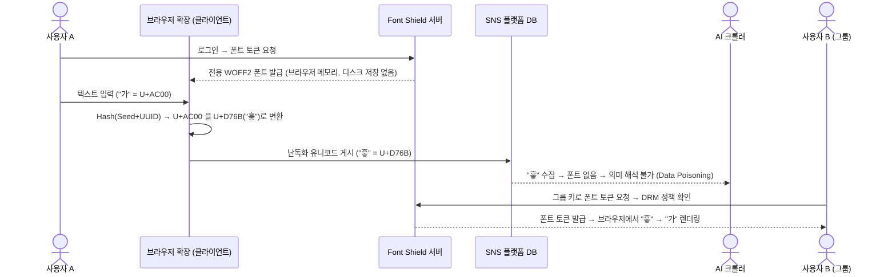

# Font Shield
**사람에게는 지식으로, AI에게는 노이즈로 2026 INC0GNITO 아이디어톤`***

Font Shield: AI 시대 개인정보 보호 서비스 기획

---

## 문제 정의

AI 기업은 SNS·블로그·이메일 등 개인 텍스트를 크롤링하여 모델 학습에 무단 활용한다. 기존 암호화는 전용 뷰어가 필요하고 기존 소프트웨어와 호환되지 않아 실용적이지 않다. **개인이 플랫폼에 의존하지 않고 스스로 데이터 공개 범위를 통제할 수단이 없다.**

---

## 핵심 아이디어: 폰트 인덱스 치환 (Font Index Shuffling)

브라우저 확장 프로그램이 사용자 입력 텍스트를 **클라이언트 사이드에서 난독화된 유니코드로 변환하여 플랫폼에 저장**한다. 전용 Font Shield 폰트는 이 난독화 코드포인트를 원문 글자 모양으로 렌더링하는 복호화 뷰어 역할을 한다. SNS 플랫폼 API 연동이나 서버 수정은 불필요하다.

```
[사용자 입력] "가" (U+AC00)
      ↓ 브라우저 확장이 클라이언트 사이드에서 변환
[SNS DB 저장] "흫" (U+D76B)  ← AI 크롤러가 수집하는 값
      ↓ 전용 폰트 적용 시
[화면 렌더링] "가"            ← 인증 사용자에게만 보이는 원문
```

| 구분 | DB / 크롤러 수집값 | 화면 표시 | 결과 |
|------|-------------------|-----------|------|
| 표준 폰트 | U+AC00 (가) | 가 | 공개 (AI 학습 가능) |
| Font Shield 적용 | U+D76B (흫) | 가 (전용 폰트 렌더링) | 보호 (AI 학습 불가) |
| AI 크롤러 수집 | U+D76B (흫) | 흫 (폰트 없음) | 쓰레기 데이터 |

> 크롤러는 HTML 소스 및 DB의 유니코드 값을 직접 수집한다. Font Shield는 DB에 저장되는 값 자체를 난독화하여 원천 데이터를 무의미하게 만든다. 복사·붙여넣기 시에도 난독화값만 복사되어 **휴먼 스크래핑까지 원천 차단**하는 DRM 효과를 가진다.

---

## 서비스 동작 흐름



**DRM 정책**: 만료 기간 · 열람 횟수 · IP 대역 제한 · 기기 바인딩 · 그룹 키 공유

---

## 선택적 보안: SNS 공개 범위를 사용자가 직접 결정

| 상황 | 적용 모드 | 효과 |
|------|-----------|------|
| 검색 노출이 필요한 공개 글 | 표준 폰트 | SEO 정상, TTS 정상 |
| 가족·친구끼리 비밀 공유 | Font Shield + 그룹 키 | AI 차단, 그룹원만 열람 |
| 시각장애인 지인과 공유 | Font Shield + 그룹 키 | 확장이 복호화 원문을 OS Accessibility API에 전달 → TTS 정상 |

공개 망(SNS 타임라인) 위에서 그룹 키를 공유한 구성원끼리만 내용을 해독할 수 있어 **퍼블릭 플랫폼 기반 E2EE(종단간 암호화) 사설 통신망**으로 기능한다.

---

## 확장 비전: 차단 → 협상 → 보상 (데이터 주권 플랫폼)

데이터가 잠겨 있는 한 AI 기업은 접근 불가하다. OCR 우회를 시도할 경우 막대한 GPU 비용이 발생하여 경제성이 소멸한다. 결국 AI 기업은 사용자에게 접근 권한을 구매하는 것이 합리적이 되며, 이것이 **데이터 보상 생태계**로 이어진다.

| 단계 | 내용 |
|------|------|
| 차단 | 동의 없는 AI 학습 원천 차단 (기본값) |
| 허락 | 사용자가 직접 접근 조건 설정 |
| 보상 | 비용·포인트·서비스 혜택 수령 |
| 연합 | Data Union으로 집단 협상력 확보 |

유럽 GDPR의 데이터 이동권, 학계의 데이터 배당(Data Dividend) 논의를 기술적으로 구현하는 인프라로서, 법·정책보다 먼저 개인이 기술로 협상력을 확보할 수 있다.

---

## 기대 효과

- **개인**: 기존 소프트웨어(Word·HWP·SNS) 그대로 사용하면서 AI 무단 학습 차단 및 데이터 보상 수령
- **사회**: AI 학습 데이터 수집에 대한 개인 거부권 기술적 구현, 데이터 주권 민주화
- **기술**: SNS 플랫폼 수정 없이 적용 가능한 클라이언트 사이드 범용 보안 레이어