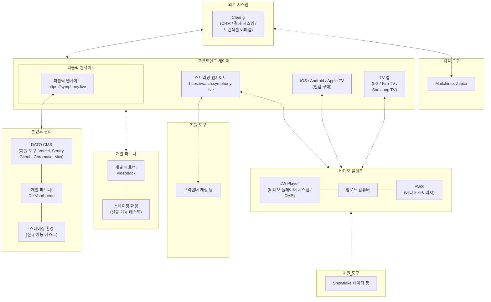

## 1. 현행 시스템 아키텍처 개요

### 1.1. 시스템 구성

현재 스트리밍 플랫폼은 **멀티 플랫폼 VOD 서비스**를 중심으로 설계된 현대적인 아키텍처를 갖추고 있습니다.

```mermaid
graph TB
    direction TB

    subgraph AA["외부 시스템"]
        A["Cleeng<br/> (CRM / 결제 시스템 /<br/> 트랜잭션 이메일)"]
    end

    subgraph BB["프론트엔드 레이어"]
        direction TB
        subgraph BB01["퍼블릭 웹사이트"]
            direction LR
            B["퍼블릭 웹사이트<br/>https://symphony.live"]
        end
        C["스트리밍 웹사이트<br/>https://watch.symphony.<br/>live"]
        D["iOS / Android / Apple TV<br/>(인앱 구매)"]
        E["TV 앱<br/>(LG / Fire TV /<br/> Samsung TV)"]
    end
    
    subgraph CC["콘텐츠 관리"]
        direction TB
        F["DATO CMS<br/>(지원 도구: Vercel, Sentry,<br/> Github, Chromatic, Mux)"]
        G["개발 파트너:<br/>De Voorhoede"]
        H["스테이징 환경<br/>(신규 기능 테스트)"]

        F --- G --- H
    end
    
    subgraph DD0["개발 파트너"]
        direction TB
        I["개발 파트너:<br/>Videodock"]
        K["스테이징 환경<br/>(신규 기능 테스트)"]
        I --- K
    end

    subgraph DD1["비디오 플랫폼"]
        direction LR
        J["JW Player<br/>(비디오 플레이어 시스템 /<br/> CMS)"]
        L["업로드 컴퓨터"]
        M["AWS<br/>(비디오 스토리지)"]
        
        J --- L --- M
    end

    subgraph EE["지원 도구"]
        direction TB
        N["Mailchimp, Zapier"]
    end

    subgraph FF["지원 도구"]
        direction TB
        O["프리렌더 캐싱 등"]
    end

    subgraph GG["지원 도구"]
        direction TB
        P["Snowflake 데이터 등"]
    end

    B <-.-> CC

    AA <-.-> BB
    AA <-.-> N

    BB <-.-> DD0

    C <-.-> DD1
    D <-.-> DD1
    E <-.-> DD1
    DD1 <-.-> P

    C <-.-> O
```
