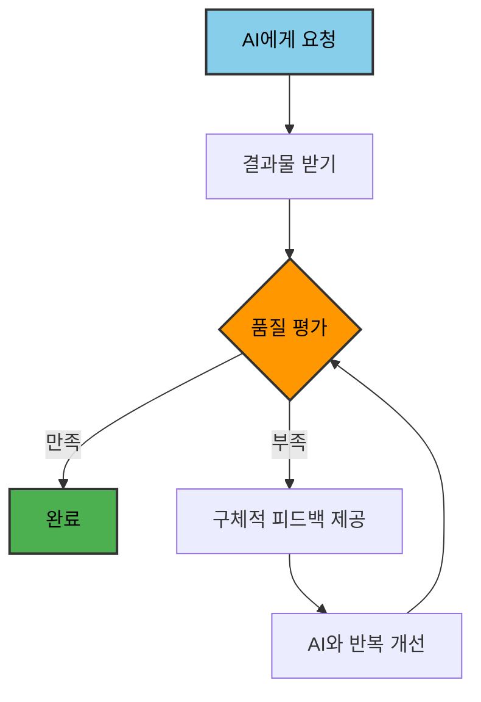

# AI 시대 소프트웨어 개발자의 새로운 역량

## 서론: 패러다임의 변화

20년 이상 C/C++ 시스템 엔지니어링 현장에서 쌓아온 경험을 바탕으로, 최근 AI 엔지니어로 전향하면서 느낀 소프트웨어 개발의 패러다임 변화에 대해 공유하고자 합니다.

과거 우리가 중시했던 **API 숙련도**, **구현 능력**, **알고리즘 개발**은 여전히 중요하지만, AI 시대에는 이보다 더 중요한 새로운 역량들이 부각되고 있습니다.

## 전통적 개발자 역량 vs AI 시대 개발자 역량

### 과거의 핵심 역량
- ✅ API 문서 숙지 및 활용
- ✅ 효율적인 코드 구현
- ✅ 알고리즘 설계 및 최적화
- ✅ 디버깅 및 성능 튜닝

### AI 시대의 새로운 핵심 역량
- 🔥 **AI와의 효과적인 소통 (Prompt Engineering)**
- 🔥 **요구사항을 명확한 지시로 변환하는 능력**
- 🔥 **AI 생성 결과의 품질 평가 및 개선**
- 🔥 **AI 한계 인식 및 개입 시점 판단**

## 1. AI와의 소통 능력 (Prompt Engineering)

### 왜 중요한가?
AI는 명확하고 구체적인 지시에 따라 놀라운 결과를 만들어내지만, 모호한 요청에는 예상과 다른 결과를 제공합니다.

### 실제 예시

**❌ 비효율적인 소통**
```
"웹사이트 만들어줘"
```

**✅ 효과적인 소통**
```
"React 18과 TypeScript 4.9를 사용해서 사용자 로그인 기능이 있는 
할 일 관리 웹앱을 만들어줘. 

기술 요구사항:
- JWT 토큰 기반 인증 (Access Token + Refresh Token)
- RESTful API 연동 (axios 사용)
- React Router v6를 사용한 페이지 라우팅
- 반응형 디자인 (모바일 우선, Tailwind CSS)
- 상태 관리는 Context API 또는 Zustand 사용

기능 요구사항:
- 할 일 CRUD 기능 (생성, 조회, 수정, 삭제)
- 완료/미완료 상태 토글
- 마감일 설정 및 정렬 기능
- 카테고리별 필터링

UI/UX 요구사항:
- 로딩 상태 표시
- 에러 처리 및 사용자 피드백
- 접근성 (ARIA 레이블) 고려
```
```
"React 18과 TypeScript 4.9를 사용해서 사용자 로그인 기능이 있는 
할 일 관리 웹앱을 만들어줘. 

기술 요구사항:
- JWT 토큰 기반 인증 (Access Token + Refresh Token)
- RESTful API 연동 (axios 사용)
- React Router v6를 사용한 페이지 라우팅
- 반응형 디자인 (모바일 우선, Tailwind CSS)
- 상태 관리는 Context API 또는 Zustand 사용

기능 요구사항:
- 할 일 CRUD 기능 (생성, 조회, 수정, 삭제)
- 완료/미완료 상태 토글
- 마감일 설정 및 정렬 기능
- 카테고리별 필터링

UI/UX 요구사항:
- 로딩 상태 표시
- 에러 처리 및 사용자 피드백
- 접근성 (ARIA 레이블) 고려
```

### 핵심 기법
- **구체적인 기술 스택 명시**
- **명확한 요구사항 정의**
- **예상 결과물 설명**
- **제약사항 및 조건 명시**

## 2. 결과물 품질 평가 및 개선 능력

### AI 결과물 검증 체크리스트

#### 코드 품질 검증
- [ ] 보안 취약점은 없는가?
- [ ] 성능상 병목지점은 없는가?
- [ ] 예외 처리가 적절한가?
- [ ] 코드 스타일이 일관적인가?
- [ ] 테스트 가능한 구조인가?

#### 기능 검증
- [ ] 요구사항이 정확히 반영되었는가?
- [ ] 엣지 케이스가 고려되었는가?
- [ ] 사용자 경험이 직관적인가?

### 개선 프로세스 예시



## 3. AI 한계 인식 및 개입 시점 판단

### AI가 어려워하는 상황들

#### 🚨 직접 개입이 필요한 경우

**복잡한 시스템 디버깅**
```python
# 20년 경험이 빛나는 순간
# AI 모델 학습 중 메모리 누수와 성능 저하 발생
import tensorflow as tf
import multiprocessing as mp

def train_model_parallel(data_batch):
    # GPU 메모리 정리가 제대로 안되는 미묘한 문제
    # 여러 프로세스간 데이터 공유 시 메모리 중복 할당
    # AI는 표면적인 tf.keras 예제만 제시할 가능성
    # 실제로는 GPU 메모리 관리, 프로세스간 통신 최적화 등
    # 시스템 레벨 이해가 필요한 복합적 문제
    pass
```

**레거시 시스템 통합**
- 대용량 데이터 파이프라인 최적화
- 분산 시스템 간 데이터 일관성 보장
- 도메인 특화 지식이 필요한 부분

**성능 크리티컬한 최적화**
- 대규모 AI 모델 추론 최적화
- 분산 학습 시스템 병목 해결
- GPU/CPU 리소스 효율적 활용

### 효과적인 개입 전략

1. **문제를 작은 단위로 분할**
   ```
   큰 문제 → AI가 혼란
   작은 문제들 → AI가 각각 해결 → 개발자가 통합
   ```

2. **구체적인 컨텍스트 제공**
   ```
   "데이터 파이프라인에서 메모리 사용량이 계속 증가하는 문제를 분석해줘"
   + 관련 Python 코드 스니펫
   + 시스템 리소스 사용량 그래프
   + 에러 로그와 스택 트레이스
   ```

3. **점진적 개선 접근 (가장 중요한 원칙)**
   
   > 🏗️ **건축 설계와 같은 접근법**
   > 아파트나 모빌 건물을 짓듯이, 머릿속에는 완성품이 있더라도 단계적으로 차근차근 요청하고 확인하는 과정을 거쳐야 복잡한 완성품을 만들 수 있습니다.

   **❌ 처음부터 복잡하게 요청**
   ```
   "사용자 인증, 데이터베이스 연동, API 서버, 
   프론트엔드, 실시간 알림, 결제 시스템이 포함된 
   완전한 e-commerce 플랫폼을 만들어줘"
   → 원하지 않는 결과, 부분적 구현, 일관성 부족
   ```
   
   **✅ 단계별 점진적 구축**
   ```
   1단계: "기본 사용자 모델과 회원가입 API만 먼저 만들어줘"
   2단계: "로그인/로그아웃 기능 추가해줘" 
   3단계: "JWT 토큰 기반 인증 미들웨어 추가해줘"
   4단계: "상품 모델과 CRUD API 만들어줘"
   5단계: "장바구니 기능 추가해줘"
   ...각 단계마다 테스트하고 검증
   ```
   
   ### 점진적 개발의 핵심 원칙
   
   **🔍 각 단계별 완전성 확보**
   - 현재 단계가 완벽히 동작하는지 확인 후 다음 단계
   - 부분적 기능이라도 완전한 동작 보장
   - 테스트 코드와 함께 각 단계 검증
   
   **📐 의존성 고려한 순서 설계**
   ```
   기초 → 핵심 → 부가기능 순서
   
   예: AI 추천 시스템 구축
   1. 데이터 모델 설계
   2. 기본 CRUD 기능  
   3. 간단한 규칙 기반 추천
   4. 머신러닝 모델 통합
   5. 실시간 추천 API
   6. 성능 최적화
   ```
   
   **🔄 피드백 루프 구축**
   - 각 단계 완료 후 반드시 실행 및 테스트
   - 예상과 다른 부분은 즉시 수정
   - 다음 단계 전에 현재 단계 완성도 100% 확보

## 4. 실무 활용 전략

### AI 협업 워크플로우


#### 실제 협업 사례

**시나리오**: 대용량 데이터 처리 API 개발

**1단계: 요구사항 분석 (개발자)**
```
- 1GB 이상 CSV 파일 처리
- 실시간 진행 상황 모니터링
- 메모리 사용량 최적화 필수
- 에러 발생 시 부분 복구 가능
```

**2단계: AI 프롬프트 설계 (개발자)**
```
"Python FastAPI를 사용해서 대용량 CSV 파일을 청크 단위로 
처리하는 비동기 API를 만들어줘.

요구사항:
- pandas chunksize 사용으로 메모리 효율성 확보
- WebSocket으로 실시간 진행률 전송  
- Redis를 사용한 작업 상태 관리
- 에러 발생 시 중단점부터 재시작 가능
- 처리 결과는 PostgreSQL에 배치 삽입

기술 스택: FastAPI, pandas, Redis, PostgreSQL, WebSocket
```

**3단계: 초기 코드 생성 (AI)**
→ AI가 기본적인 FastAPI 구조와 CSV 처리 로직 생성

**4단계: 코드 리뷰 및 개선 (개발자 + AI)**
- 개발자: "메모리 누수 가능성이 있어. pandas DataFrame 정리 부분 개선해줘"
- AI: GC 호출과 명시적 메모리 해제 로직 추가

**5단계: 테스트 및 디버깅 (개발자 주도)**
- 실제 1GB 파일로 부하 테스트
- 메모리 프로파일링으로 병목 지점 발견
- 동시 요청 처리 시 Redis 연결 풀 이슈 해결

**6단계: 최종 최적화 (개발자)**
- 프로덕션 환경 설정
- 모니터링 및 로깅 추가
- Docker 컨테이너 리소스 한계 설정

### 시간 배분 가이드라인
- **AI 활용**: 70% (반복적 작업, 보일러플레이트 코드)
- **개발자 직접**: 30% (핵심 로직, 디버깅, 최적화)

### 🛠️ 실무 팁: AI와 효율적으로 작업하는 방법

#### 1. 컨텍스트 스위칭 최소화
```
❌ 매번 새로운 대화 시작
✅ 하나의 세션에서 관련 작업들을 연속으로 처리
```

#### 2. 코드 리뷰 체크리스트 활용
```python
# AI 생성 코드 검토 시 필수 확인 사항
def review_ai_code(code):
    checks = [
        "보안 취약점 (SQL Injection, XSS 등)",
        "성능 병목 (N+1 쿼리, 무한 루프 등)", 
        "예외 처리 (try-catch, 에러 핸들링)",
        "메모리 누수 (리소스 정리, GC)",
        "테스트 가능성 (의존성 주입, 모킹)",
        "코드 가독성 (변수명, 주석)",
        "확장 가능성 (SOLID 원칙, 디자인 패턴)"
    ]
    return checks
```

#### 3. 반복 작업 템플릿화
```
# 자주 사용하는 프롬프트 템플릿 예시
TEMPLATE_API_ENDPOINT = """
{language}를 사용해서 {기능} API 엔드포인트를 만들어줘.

기술 요구사항:
- 프레임워크: {framework}
- 데이터베이스: {database} 
- 인증: {auth_method}
- 검증: {validation_library}

기능 요구사항:
- {specific_features}

응답 형식: JSON
에러 처리: HTTP 상태 코드와 에러 메시지 포함
테스트: 단위 테스트 코드도 함께 작성
"""
```

### 💡 핵심 인사이트: AI는 거들뿐, 방향성은 개발자가 결정한다

#### 🎯 개발자의 역할 (방향 설정자)
- **문제 정의**: 무엇을 해결할 것인가?
- **아키텍처 설계**: 전체 시스템을 어떻게 구성할 것인가?
- **우선순위 결정**: 어떤 기능부터 구현할 것인가?
- **품질 기준 설정**: 어느 정도 수준까지 완성할 것인가?
- **기술 스택 선택**: 어떤 도구와 기술을 사용할 것인가?

#### ⚙️ AI의 역할 (실행 보조자)
- **코드 생성**: 개발자가 정의한 요구사항을 코드로 구현
- **반복 작업**: 보일러플레이트, 테스트 코드 등 패턴화된 작업
- **코드 최적화**: 기존 코드의 성능이나 가독성 개선 제안
- **문서화**: 코드 설명, API 문서 등 부가 작업

> **"AI가 아무리 뛰어나도 **왜** 만드는지, **무엇을** 만들 것인지는 경험 있는 개발자만이 정확히 판단할 수 있습니다."**

## 5. 학습 로드맵

### 단계별 학습 계획

#### Phase 1: AI 도구 숙련 (1-2개월)
- **ChatGPT, Claude, Copilot 등 활용법**
  - 기본 프롬프트 작성법
  - 코드 생성 및 설명 요청
  - 디버깅 도움 받기
- **프롬프트 엔지니어링 기초**
  - 구체적 지시 방법
  - 컨텍스트 제공 기법
  - 단계별 요청 전략
- **코드 생성 및 리뷰 실습**
  - 간단한 함수부터 시작
  - AI 생성 코드 검증 연습

#### Phase 2: AI 협업 패턴 습득 (2-3개월)  
- **효과적인 요구사항 전달법**
  - 기술 스택 명시 방법
  - 제약사항 정의 기법
  - 예상 결과물 설명
- **AI 결과물 품질 평가법**
  - 보안 취약점 체크
  - 성능 병목 분석
  - 코드 품질 검증
- **반복 개선 프로세스 구축**
  - 피드백 루프 설계
  - 점진적 개선 방법

#### Phase 3: 전문성 결합 (지속적)
- **기존 도메인 지식 + AI 활용**
  - 시스템 설계에 AI 활용
  - 복잡한 알고리즘 구현
- **복잡한 문제 해결 시 AI와 역할 분담**
  - 문제 분해 기법
  - AI 한계 인식
- **새로운 기술 습득에 AI 활용**
  - 새 프레임워크 학습
  - 트렌드 기술 탐색

## 결론: 개발자의 진화

AI는 우리의 **도구**이지 **대체재**가 아닙니다. 

전통적인 개발 역량에 AI 소통 능력이 더해진 개발자가 되어야 합니다:

- **AI가 잘하는 것**: 반복 작업, 초기 코드 생성, 패턴 인식
- **개발자가 잘하는 것**: 문제 정의, 품질 판단, 복잡한 디버깅, 최적화

20년간 축적한 **시스템 사고력**과 **문제 해결 경험**은 AI 시대에 더욱 빛을 발할 것입니다. AI를 도구로 활용하되, 핵심적인 판단과 품질 관리는 여전히 경험 있는 개발자의 몫입니다.

---

*"AI와 함께 춤추되, 음악의 방향은 개발자가 결정한다"*