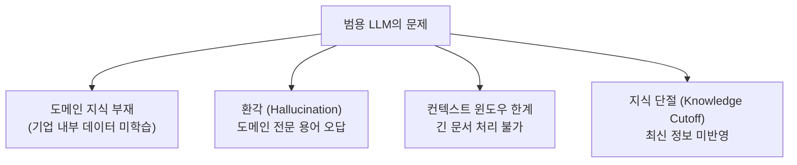
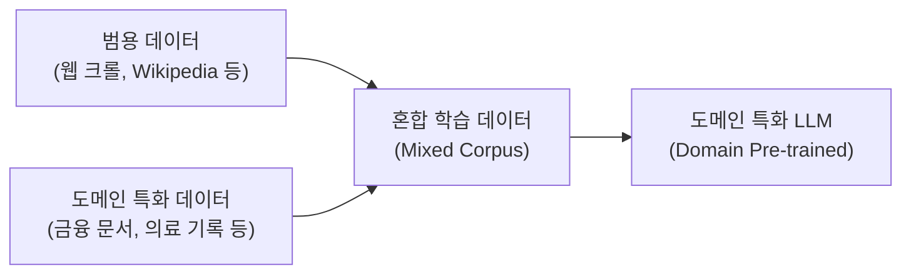
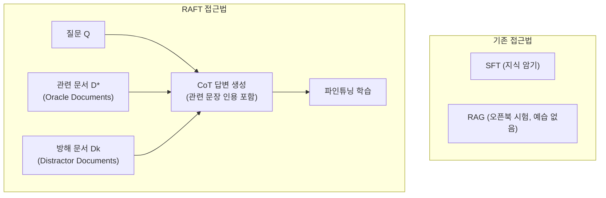
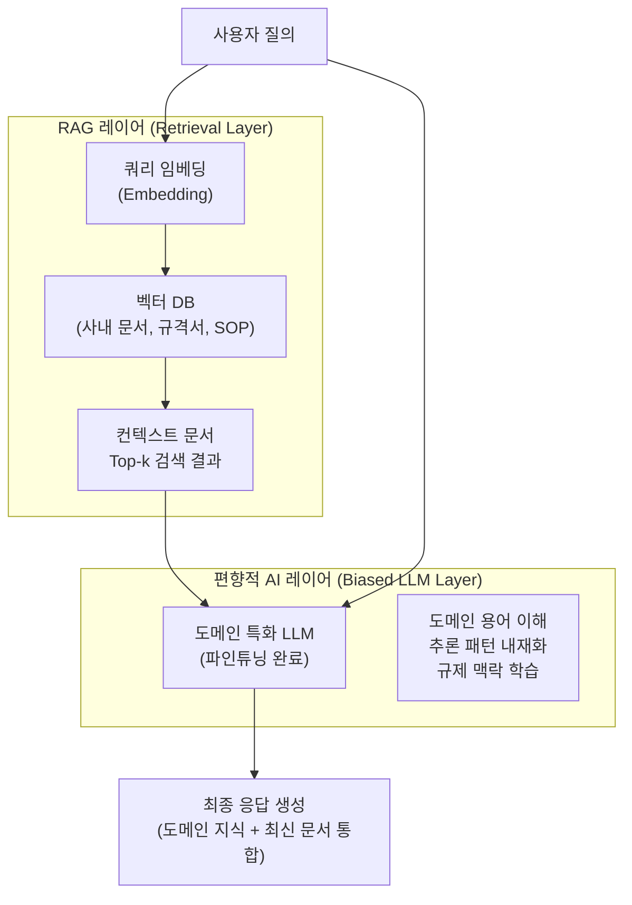
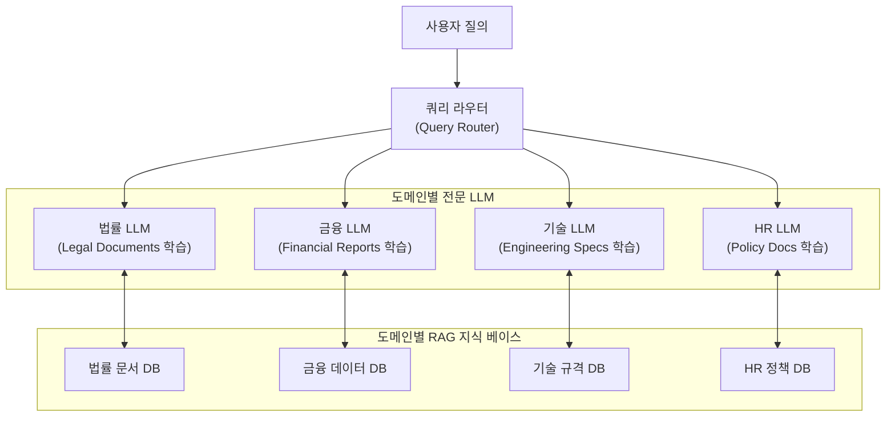
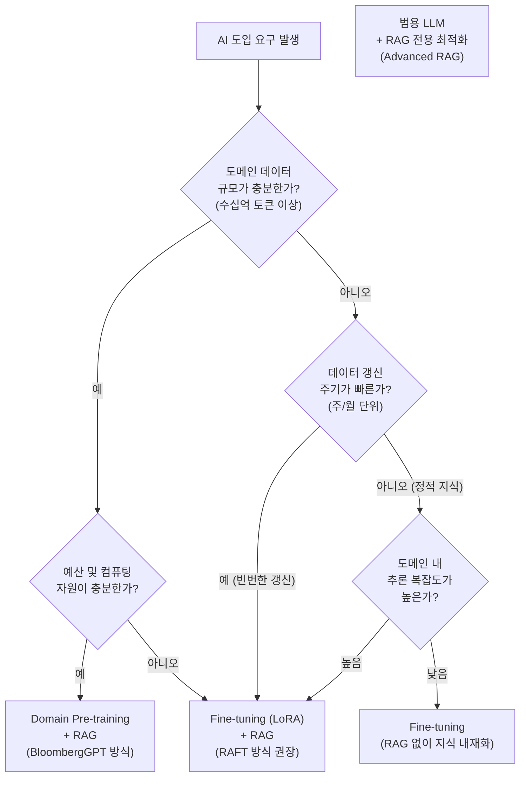
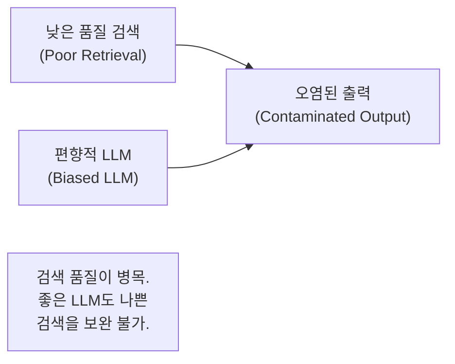

# 기업 환경에서의 편향적 AI(Domain-specific LLM) + RAG 전략 검토

---

## 목차

- [기업 환경에서의 편향적 AI(Domain-specific LLM) + RAG 전략 검토](#기업-환경에서의-편향적-aidomain-specific-llm--rag-전략-검토)
  - [목차](#목차)
  - [1. 개요](#1-개요)
  - [2. 핵심 개념 정의](#2-핵심-개념-정의)
    - [2.1. 범용 AI vs 편향적 AI](#21-범용-ai-vs-편향적-ai)
    - [2.2. RAG 아키텍처 기초](#22-rag-아키텍처-기초)
  - [3. 편향적 AI가 필요한 이유](#3-편향적-ai가-필요한-이유)
    - [3.1. 범용 LLM의 구조적 한계](#31-범용-llm의-구조적-한계)
    - [3.2. 도메인 특화의 이점](#32-도메인-특화의-이점)
  - [4. 도메인 특화 LLM 구축 방식](#4-도메인-특화-llm-구축-방식)
    - [4.1. 사전학습 기반 특화 (Domain Pre-training)](#41-사전학습-기반-특화-domain-pre-training)
    - [4.2. 파인튜닝 기반 특화 (Fine-tuning)](#42-파인튜닝-기반-특화-fine-tuning)
    - [4.3. RAFT: 파인튜닝과 RAG의 통합](#43-raft-파인튜닝과-rag의-통합)
  - [5. RAG와의 결합 아키텍처](#5-rag와의-결합-아키텍처)
    - [5.1. RAG 기초 메커니즘](#51-rag-기초-메커니즘)
    - [5.2. 편향적 AI + RAG 시너지 구조](#52-편향적-ai--rag-시너지-구조)
    - [5.3. 쿼리 라우팅 (Query Routing)](#53-쿼리-라우팅-query-routing)
  - [6. 수학적 기반](#6-수학적-기반)
    - [6.1. 벡터 유사도 검색 (Vector Similarity Search)](#61-벡터-유사도-검색-vector-similarity-search)
    - [6.2. LoRA 파라미터 효율성](#62-lora-파라미터-효율성)
  - [7. 실증 사례 및 논문](#7-실증-사례-및-논문)
    - [7.1. BloombergGPT (금융)](#71-bloomberggpt-금융)
    - [7.2. RAFT (도메인 특화 RAG 학습)](#72-raft-도메인-특화-rag-학습)
    - [7.3. RAG 원류 논문 (Lewis et al., 2020)](#73-rag-원류-논문-lewis-et-al-2020)
    - [7.4. RAG Survey (Gao et al., 2023)](#74-rag-survey-gao-et-al-2023)
  - [8. 전략 선택 프레임워크](#8-전략-선택-프레임워크)
  - [9. 한계 및 주의사항](#9-한계-및-주의사항)
  - [10. 결론](#10-결론)
  - [11. 참고문헌](#11-참고문헌)

---

## 1. 개요

기업이 AI 시스템을 도입할 때 가장 먼저 직면하는 선택지는 **"인터넷 전체를 학습한 범용 AI를 그대로 쓸 것인가, 아니면 우리 도메인에 편향된(biased) AI를 별도로 구축할 것인가"** 이다.

이 문서는 다음 주장의 타당성을 검토한다.

> **"기업은 보편적 AI가 아니라 편향적 AI(Domain-specific LLM)를 먼저 구축한 뒤, RAG를 적용해야 한다."**

검토 결과: 이 전략은 현재 기업 AI 도입의 **최선(best practice)에 가장 가까운 접근법**이다. 단, 도메인 데이터의 품질·규모·갱신 주기에 따라 구현 방식이 달라진다.

---

## 2. 핵심 개념 정의

### 2.1. 범용 AI vs 편향적 AI

| 구분 | 범용 AI (General LLM) | 편향적 AI (Domain-specific LLM) |
|------|----------------------|--------------------------------|
| 학습 데이터 | 인터넷 전반 (수조 토큰) | 특정 도메인 집중 데이터 |
| 강점 | 다양한 태스크 처리 | 도메인 내 높은 정확도, 낮은 환각 |
| 약점 | 도메인 전문 지식 부족, 환각 빈번 | 도메인 외 태스크에 취약 |
| 대표 모델 | GPT-4, Claude, Gemini | BloombergGPT, Med-PaLM 2, ClimateBERT |

**"편향적 AI"** 는 부정적 의미가 아니다. 특정 도메인의 용어(terminology), 추론 패턴(reasoning pattern), 규제 맥락(regulatory context)에 최적화된 모델을 의미한다.

### 2.2. RAG 아키텍처 기초

RAG(Retrieval-Augmented Generation, 검색 증강 생성)는 LLM의 파라메트릭 메모리(parametric memory)와 외부 지식 베이스의 비파라메트릭 메모리(non-parametric memory)를 결합한다.


---

## 3. 편향적 AI가 필요한 이유

### 3.1. 범용 LLM의 구조적 한계

범용 LLM은 기업 환경에서 두 가지 근본적 문제를 가진다.

**첫째, 독자 데이터(proprietary data) 미학습.** 범용 LLM은 공개 데이터셋으로 학습되었으므로, 기업 내부의 SOP, 계약서, 기술 규격서, 도메인 전문 용어를 알지 못한다.

**둘째, 컨텍스트 윈도우 제한.** 기업의 내부 데이터를 모두 프롬프트에 넣을 수 없다. 토큰 제한이 실제 적용 가능성을 제약한다.



### 3.2. 도메인 특화의 이점

도메인에 편향된 LLM은 다음을 제공한다.

- **환각 감소**: 도메인 관련 데이터만 학습하면 비관련 패턴 간섭이 줄어든다.
- **정밀도(precision) 향상**: 금융, 의료, 법률 등 전문 분야에서 일반 모델 대비 유의미한 성능 차이를 보인다.
- **컴플라이언스 대응**: 특정 산업 규제(예: 금융 NER, 의료 기록 분석)에 최적화 가능하다.
- **비용 효율**: 소규모 특화 모델이 대형 범용 모델 API보다 운영 비용이 낮다.

---

## 4. 도메인 특화 LLM 구축 방식

### 4.1. 사전학습 기반 특화 (Domain Pre-training)

파운데이션 모델 수준에서 도메인 데이터를 혼합하여 처음부터 학습하는 방식이다. 가장 강력하지만 비용이 크다.



이 방식의 핵심은 **도메인 데이터와 범용 데이터의 혼합 비율**이다. 도메인 데이터만 사용하면 범용 언어 능력이 저하되고, 범용 데이터만 사용하면 도메인 특화 효과가 사라진다. BloombergGPT는 이를 약 50:50으로 설계하여 도메인 성능과 범용 성능을 모두 유지했다.

### 4.2. 파인튜닝 기반 특화 (Fine-tuning)

기존 파운데이션 모델의 가중치(weights)를 도메인 데이터로 추가 학습한다. 비용 대비 효과가 높아 현실적으로 가장 많이 쓰인다.

파인튜닝 방식 비교:

| 방식 | 설명 | 비용 | 성능 |
|------|------|------|------|
| Full Fine-tuning | 전체 파라미터 갱신 | 높음 | 최고 |
| LoRA (Low-Rank Adaptation) | 저순위 행렬로 파라미터 근사 | 낮음 | 준수 |
| Prefix-tuning | 소프트 프롬프트 토큰 학습 | 매우 낮음 | 제한적 |
| Prompt-tuning | 태스크별 소프트 프롬프트 | 매우 낮음 | 제한적 |

파라미터 효율적 파인튜닝(PEFT, Parameter-Efficient Fine-Tuning)은 전체 모델을 재학습하지 않고도 도메인 특화를 달성할 수 있어 실무에서 선호된다.

### 4.3. RAFT: 파인튜닝과 RAG의 통합

RAFT(Retrieval Augmented Fine-Tuning)는 파인튜닝과 RAG를 학습 단계에서 통합하는 방식이다 (Zhang et al., 2024, arXiv:2403.10131).



RAFT의 핵심 아이디어: **"방해 문서(distractor document)가 섞인 상황에서 올바른 문서를 골라 추론하도록 학습"**

이는 실제 RAG 환경에서 검색기가 불완전한 문서를 반환하는 상황을 시뮬레이션한다. 학습 데이터의 약 80%에 oracle 문서를 포함하고 20%는 oracle 없이 구성하는 것이 최적으로 확인되었다.

---

## 5. RAG와의 결합 아키텍처

### 5.1. RAG 기초 메커니즘

RAG의 핵심은 **파라메트릭 메모리와 비파라메트릭 메모리의 결합**이다 (Lewis et al., 2020, NeurIPS).

$$
p(y | x) = \sum_{z \in \text{top-}k} p_\eta(z | x) \cdot p_\theta(y | x, z)
$$

여기서:
- $x$: 입력 쿼리 (query)
- $z$: 검색된 문서 (retrieved document)
- $p_\eta(z | x)$: 검색기(retriever)가 쿼리 $x$에 대해 문서 $z$를 반환할 확률
- $p_\theta(y | x, z)$: 생성기(generator)가 쿼리와 문서를 보고 답 $y$를 생성할 확률

RAG는 두 가지 변형이 있다:

- **RAG-Sequence**: 동일 문서를 전체 시퀀스 생성에 사용
- **RAG-Token**: 각 토큰 생성 시 다른 문서 사용 가능 (유연하지만 복잡)

### 5.2. 편향적 AI + RAG 시너지 구조



**핵심 시너지:**

범용 LLM + RAG는 도메인 용어 자체를 이해하지 못해 검색 품질이 저하된다. 반면 편향적 LLM + RAG는 모델이 이미 도메인 언어를 내재화했으므로 검색된 문서를 더 정확히 해석·활용한다.

$$
\text{Quality}(\text{Biased LLM} + \text{RAG}) > \text{Quality}(\text{General LLM} + \text{RAG})
$$

이를 개념적으로 표현하면, 편향적 LLM은 RAG에서 검색된 문서의 **신호(signal)를 노이즈(noise)로부터 더 잘 분리**한다.

### 5.3. 쿼리 라우팅 (Query Routing)

대규모 기업 환경에서는 단일 LLM이 아닌 **전문가 LLM 앙상블(ensemble of specialist LLMs)**을 쿼리 라우팅으로 연결하는 구조가 등장하고 있다.



---

## 6. 수학적 기반

### 6.1. 벡터 유사도 검색 (Vector Similarity Search)

RAG의 검색 단계는 입력 쿼리와 문서를 임베딩 벡터로 변환하여 최근접 이웃(nearest neighbor)을 찾는다.

$$
z^* = \arg\max_{z \in \mathcal{D}} \text{sim}(\mathbf{e}_q, \mathbf{e}_z)
$$

여기서 코사인 유사도(cosine similarity)는:

$$
\text{sim}(\mathbf{e}_q, \mathbf{e}_z) = \frac{\mathbf{e}_q \cdot \mathbf{e}_z}{\|\mathbf{e}_q\| \cdot \|\mathbf{e}_z\|}
$$

**편향적 LLM이 임베딩 모델에도 사용될 경우**, 도메인 용어가 동일 의미군에서 더 가깝게 위치하여 검색 정밀도(retrieval precision)가 향상된다.

### 6.2. LoRA 파라미터 효율성

LoRA는 전체 가중치 행렬 $W \in \mathbb{R}^{d \times k}$ 갱신 대신 저순위 근사를 사용한다:

$$
W' = W + \Delta W = W + BA
$$

여기서 $B \in \mathbb{R}^{d \times r}$, $A \in \mathbb{R}^{r \times k}$, $r \ll \min(d, k)$.

학습 파라미터 수가 $dk$에서 $r(d+k)$로 감소한다. $r=8$, $d=k=4096$일 때 약 **256배의 파라미터 절감** 효과가 있다.

$$
\text{절감률} = 1 - \frac{r(d+k)}{dk} = 1 - \frac{8 \times 8192}{4096^2} \approx 99.6\%
$$

---

## 7. 실증 사례 및 논문

### 7.1. BloombergGPT (금융)

**논문:** Wu, S., Irsoy, O., Lu, S., et al. (2023). *BloombergGPT: A Large Language Model for Finance*. arXiv:2303.17564.

- **모델 규모:** 50B 파라미터
- **학습 데이터:** Bloomberg 도메인 데이터 363B 토큰 + 범용 데이터 345B 토큰 (약 50:50 혼합)
- **결과:** 금융 벤치마크(FiQA SA, ConvFinQA, NER 등)에서 동일 규모 범용 모델 대비 유의미한 성능 우위. 범용 LLM 벤치마크 성능도 유지.

**핵심 시사점:** 도메인 데이터와 범용 데이터의 혼합 학습이 **도메인 정확도와 범용 능력을 동시에 달성**하는 전략임을 증명. 순수 도메인 데이터만 학습한 모델보다 우월한 결과.

```
인용: Wu et al. (2023), arXiv:2303.17564
URL: https://arxiv.org/abs/2303.17564
```

### 7.2. RAFT (도메인 특화 RAG 학습)

**논문:** Zhang, T., Patil, S. G., Jain, N., et al. (2024). *RAFT: Adapting Language Model to Domain Specific RAG*. arXiv:2403.10131.

- **방법론:** 파인튜닝 시 방해 문서(distractor)를 섞어 실제 RAG 환경을 시뮬레이션
- **평가 데이터셋:** PubMed (의료), HotpotQA (다중 홉 추론), Gorilla API (코드)
- **결과:** 표준 RAG와 단순 SFT(Supervised Fine-Tuning) 모두를 일관되게 능가. 소형 파인튜닝 모델이 대형 범용 모델에 준하는 도메인 성능 달성.

**핵심 시사점:** 편향적 AI 구축 시 RAG를 **사후 적용(post-hoc)이 아닌 학습 단계에서 통합**하면 성능이 추가로 향상된다.

```
인용: Zhang et al. (2024), arXiv:2403.10131
URL: https://arxiv.org/abs/2403.10131
```

### 7.3. RAG 원류 논문 (Lewis et al., 2020)

**논문:** Lewis, P., Perez, E., Piktus, A., et al. (2020). *Retrieval-Augmented Generation for Knowledge-Intensive NLP Tasks*. NeurIPS 2020. arXiv:2005.11401.

- **핵심 기여:** 파라메트릭 메모리(LLM)와 비파라메트릭 메모리(Dense Vector Index)를 결합하는 RAG 프레임워크 최초 제안
- **검색기:** DPR(Dense Passage Retrieval) 기반 bi-encoder
- **생성기:** BART seq2seq 모델
- **결과:** 오픈 도메인 QA 3개 태스크에서 state-of-the-art 달성. 파라메트릭 단독 모델 대비 더 구체적·다양·사실적 텍스트 생성.

```
인용: Lewis et al. (2020), NeurIPS, arXiv:2005.11401
URL: https://arxiv.org/abs/2005.11401
```

### 7.4. RAG Survey (Gao et al., 2023)

**논문:** Gao, Y., Xiong, Y., Gao, X., et al. (2023). *Retrieval-Augmented Generation for Large Language Models: A Survey*. arXiv:2312.10997.

RAG 패러다임의 발전을 세 단계로 정리한 포괄적 서베이:

| 패러다임 | 특징 |
|----------|------|
| Naive RAG | 단순 검색-읽기 파이프라인. 검색 품질에 전적으로 의존 |
| Advanced RAG | 데이터 전처리 정교화, 인덱싱 최적화, 반복적 검색 도입 |
| Modular RAG | 검색·생성 모듈을 독립적으로 교체·조합 가능한 유연한 구조 |

도메인 특화 정보의 지속적 갱신과 통합이 RAG의 핵심 가치 중 하나임을 명시한다.

```
인용: Gao et al. (2023), arXiv:2312.10997
URL: https://arxiv.org/abs/2312.10997
```

---

## 8. 전략 선택 프레임워크



**권장 기본 전략:** 대부분의 기업에서 **Fine-tuning (LoRA/PEFT) + RAG** 조합이 비용 효율성과 성능의 최적 균형점이다.

---

## 9. 한계 및 주의사항

편향적 AI + RAG 전략이 유효하더라도 다음 위험을 관리해야 한다.

**9.1. 데이터 편향의 증폭**

도메인 데이터가 특정 편향(예: 특정 법역의 법률 문서 과다 대표, 특정 기간의 금융 데이터만 존재)을 가질 경우, 도메인 특화 과정에서 이 편향이 증폭된다.

**9.2. 도메인 외 취약성**

좁은 도메인에 특화될수록 경계 사례(edge case)나 도메인 외 질의에 대해 범용 모델보다 오히려 취약해질 수 있다. 모델의 적용 범위(scope)를 명확히 정의해야 한다.

**9.3. 지속적 재학습 비용**

규정·법령·기술 표준이 갱신될 때마다 모델과 지식 베이스 모두를 갱신해야 한다. RAG의 지식 베이스는 비교적 쉽게 갱신 가능하지만, LLM 파인튜닝은 주기적 비용을 수반한다.

**9.4. RAG 검색 품질 의존성**

편향적 LLM이 좋더라도 **RAG 검색기가 잘못된 문서를 반환하면 전체 출력이 오염**된다. 벡터 DB의 인덱싱 품질, 청크 전략(chunking strategy), 임베딩 모델 선택이 전체 파이프라인 품질을 결정한다.



---

## 10. 결론

기업 AI 전략으로서 **편향적 AI + RAG**의 타당성 평가:

| 평가 항목 | 판정 | 근거 |
|-----------|------|------|
| 도메인 정확도 향상 | 타당 | BloombergGPT 외 다수 실증 |
| 환각 감소 | 타당 | 도메인 외 패턴 간섭 감소 |
| RAG와의 시너지 | 타당 | RAFT 논문에서 수치적 확인 |
| 범용 AI 대비 우위 | 조건부 타당 | 도메인이 명확하고 데이터가 충분할 때 |
| 비용 효율 | 조건부 타당 | PEFT 적용 시. 풀 프리트레이닝은 비용 큼 |

**최종 권고:** 기업은 범용 LLM을 RAG의 최종 생성기로 사용하기 전에, 해당 도메인의 언어·추론 패턴을 내재화한 **편향적 LLM을 파인튜닝**으로 먼저 구축해야 한다. 이후 최신성·독자 정보를 RAG로 보완하는 구조가 현재 학계와 산업계의 합의에 가장 근접한 접근법이다.

$$
\text{Enterprise AI Quality} = f(\underbrace{\text{Domain-Biased LLM}}_{\text{추론 능력}} + \underbrace{\text{RAG}}_{\text{최신 지식 · 독자 데이터}})
$$

---

## 11. 참고문헌

1. **Lewis, P., Perez, E., Piktus, A., et al.** (2020). Retrieval-Augmented Generation for Knowledge-Intensive NLP Tasks. *NeurIPS 2020*. arXiv:2005.11401. https://arxiv.org/abs/2005.11401

2. **Wu, S., Irsoy, O., Lu, S., Dabravolski, V., Dredze, M., Gehrmann, S., Kambadur, P., Rosenberg, D., & Mann, G.** (2023). BloombergGPT: A Large Language Model for Finance. arXiv:2303.17564. https://arxiv.org/abs/2303.17564

3. **Zhang, T., Patil, S. G., Jain, N., Shen, S., Zaharia, M., Stoica, I., & Gonzalez, J. E.** (2024). RAFT: Adapting Language Model to Domain Specific RAG. arXiv:2403.10131. https://arxiv.org/abs/2403.10131

4. **Gao, Y., Xiong, Y., Gao, X., et al.** (2023). Retrieval-Augmented Generation for Large Language Models: A Survey. arXiv:2312.10997. https://arxiv.org/abs/2312.10997

5. **Hu, E. J., Shen, Y., Wallis, P., Allen-Zhu, Z., Li, Y., Wang, S., Wang, L., & Chen, W.** (2021). LoRA: Low-Rank Adaptation of Large Language Models. arXiv:2106.09685. https://arxiv.org/abs/2106.09685

---

*최종 갱신: 2026-03-10*