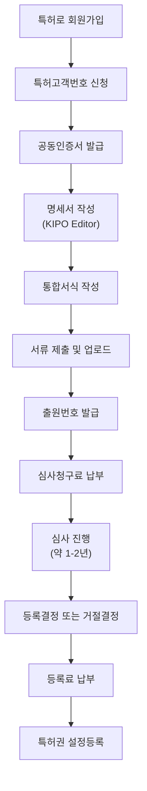
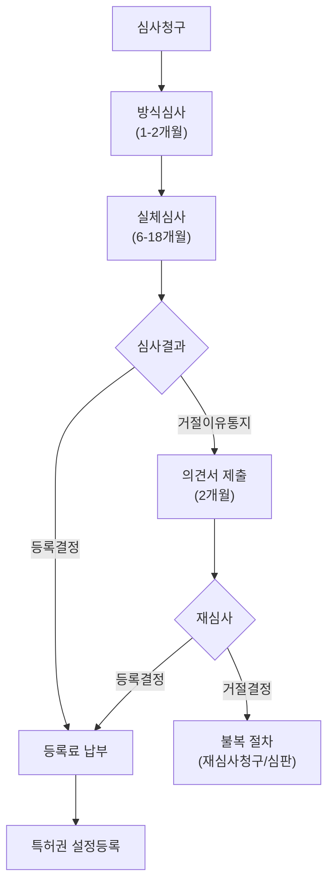
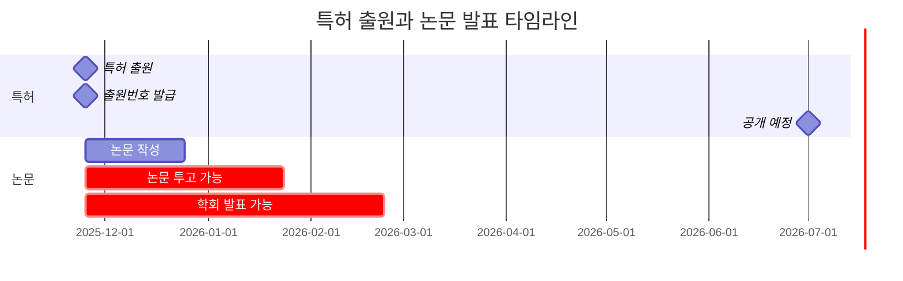
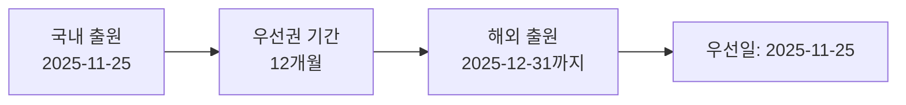

# 개인 발명가를 위한 특허 출원 실전 가이드

## 1. 특허 출원 프로세스 개요

### 1.1 출원 전체 프로세스



### 1.2 소요 기간 및 비용 개요

| 단계 | 소요 기간 | 비용 (개인 감면) |
|------|----------|----------------|
| 특허고객번호 신청 | 1-2일 | 무료 |
| 명세서 작성 | 1주-1개월 | 무료 (자체 작성) |
| 출원 수수료 | 즉시 | 약 4만원 |
| 심사청구료 | 출원 후 3년 이내 | 약 10-15만원 |
| 심사 기간 | 1-2년 | - |
| 등록료 (1-3년차) | 등록결정 후 3개월 | 약 10-15만원 |

> 주의: 개인 발명가는 70% 감면 혜택이 있습니다. 위 금액은 감면 적용 후 기준입니다.

---

## 2. 특허로(www.patent.go.kr) 회원가입 및 준비

### 2.1 특허고객번호 신청

특허고객번호는 특허청에서 발급하는 고유 식별번호로, 모든 특허 관련 업무에 필수입니다.

#### 2.1.1 필요 서류

1. **인감도장 스캔본**
   - 해상도: 300dpi 이상 권장
   - 파일 형식: JPG, PNG, PDF
   - 크기: 2MB 이하
   - 주의사항: 도장 날인 후 선명하게 스캔

2. **자필 서명 스캔본**
   - 백지에 흑색 볼펜으로 서명
   - 스캔 또는 고화질 촬영
   - 파일 형식: JPG, PNG, PDF
   - 크기: 2MB 이하

3. **본인확인 서류**
   - 주민등록등본 또는 초본 (발급일로부터 3개월 이내)
   - 정부24(www.gov.kr)에서 발급 가능
   - PDF 파일로 저장

#### 2.1.2 신청 절차

1. [특허로(www.patent.go.kr)](https://www.patent.go.kr) 접속
2. 회원가입 → 개인회원 선택
3. 본인인증 (휴대폰 또는 공동인증서)
4. 특허고객번호 신청
5. 서류 업로드
6. 1-2일 후 고객번호 발급 (이메일/문자 통보)

### 2.2 공동인증서 (금융인증서) 발급

특허청 전자출원 시스템 이용을 위해 필수입니다.

#### 2.2.2 발급 방법

**옵션 1: 공동인증서 (구 공인인증서)**
- 은행 홈페이지 또는 방문 발급
- 비용: 은행별 상이 (약 4,400원/년)
- 장점: 범용성 높음

**옵션 2: 금융인증서**
- 은행 앱에서 무료 발급
- 비용: 무료
- 장점: 모바일 편의성, 클라우드 저장
- 단점: 일부 시스템 미지원 가능

#### 2.2.3 인증서 등록

1. 특허로 로그인
2. My Page → 인증서 등록
3. 인증서 선택 및 비밀번호 입력
4. 등록 완료

---

## 3. 특허 명세서 작성 (KIPO Editor)

### 3.1 KIPO Editor 개요

KIPO Editor는 특허청에서 제공하는 무료 명세서 작성 프로그램입니다.

#### 3.1.1 다운로드 및 설치

1. [특허로 > 전자출원 > 프로그램 다운로드](https://www.patent.go.kr)
2. KIPO Editor 다운로드 (Windows/Mac 버전 제공)
3. 설치 및 실행

### 3.2 명세서 구성 요소

특허 명세서는 다음 항목으로 구성됩니다:

#### 3.2.1 발명의 명칭

```
예시:
- 나쁜 예: "새로운 장치"
- 좋은 예: "딥러닝 기반 실시간 객체 인식 시스템"
```

**작성 가이드:**
- 발명의 기술적 특징을 명확히 표현
- 15자 내외 권장
- 포괄적이지만 구체적인 표현

#### 3.2.2 기술분야

```
예시:
본 발명은 인공지능 기반 영상 처리 기술에 관한 것으로,
더욱 상세하게는 컨볼루션 신경망(CNN)을 이용하여 실시간으로
다중 객체를 인식하고 추적하는 시스템 및 방법에 관한 것이다.
```

**작성 가이드:**
- 발명이 속하는 기술 분야 명시
- 2-3문장으로 간결하게 작성
- IPC 분류 참고

#### 3.2.3 배경기술

```
예시:
종래의 객체 인식 시스템은 단일 프레임 기반 처리로 인해
실시간 처리 속도가 저하되는 문제가 있었다.
특히 다중 객체 환경에서는 연산량이 기하급수적으로 증가하여
임베디드 시스템에서의 적용이 어려웠다.

선행기술 1(KR 10-1234567)은 GPU 병렬 처리를 통해 속도를 개선하였으나,
전력 소비가 높아 모바일 환경에 부적합하다는 한계가 있다.
```

**작성 가이드:**
- 기존 기술의 문제점 명확히 기술
- 선행기술 조사 및 인용 (필수는 아니나 권장)
- 객관적이고 기술적인 서술

#### 3.2.4 발명의 내용 (핵심)

**해결하려는 과제:**
```
본 발명은 상기와 같은 문제점을 해결하기 위한 것으로,
저전력 환경에서도 실시간 다중 객체 인식이 가능한
경량화된 딥러닝 모델 및 처리 방법을 제공하는 것을 목적으로 한다.
```

**과제의 해결 수단:**
```
상기 목적을 달성하기 위한 본 발명의 실시간 객체 인식 시스템은,
- 영상 입력부
- 전처리부: 입력 영상을 정규화하고 ROI를 추출
- 경량 CNN 모델부: MobileNet 기반 특징 추출
- 객체 검출부: YOLO 알고리즘을 이용한 바운딩 박스 생성
- 추적부: Kalman Filter 기반 객체 추적
- 출력부: 인식 결과 시각화
를 포함하여 구성된다.
```

**발명의 효과:**
```
본 발명에 따르면,
1. 경량화 모델 적용으로 모바일/임베디드 환경에서 실시간 처리 가능
2. 전력 소비 30% 감소 (종래 기술 대비)
3. 추적 알고리즘 통합으로 객체 재인식 횟수 50% 감소
4. 정확도 mAP 0.85 이상 달성
등의 효과를 얻을 수 있다.
```

#### 3.2.5 도면의 간단한 설명

```
도 1은 본 발명의 실시간 객체 인식 시스템의 전체 구성도이다.
도 2는 본 발명의 전처리부의 상세 블록도이다.
도 3은 본 발명의 경량 CNN 모델의 네트워크 구조도이다.
도 4는 본 발명의 객체 인식 방법의 순서도이다.
도 5는 본 발명의 실험 결과 그래프이다.
```

#### 3.2.6 발명을 실시하기 위한 구체적인 내용

```
이하, 첨부된 도면을 참조하여 본 발명의 바람직한 실시예를 상세히 설명한다.

[실시예 1]
도 1을 참조하면, 본 발명의 객체 인식 시스템(100)은
영상 입력부(110), 전처리부(120), CNN 모델부(130),
객체 검출부(140), 추적부(150), 출력부(160)를 포함한다.

영상 입력부(110)는 카메라 센서(예: IMX219)로부터
1920x1080 해상도의 RGB 영상을 초당 30프레임으로 입력받는다.

전처리부(120)는 입력 영상을 다음과 같이 처리한다:
1) 리사이즈: 416x416 픽셀로 변환
2) 정규화: [0, 255] → [0, 1] 범위로 변환
3) 채널 순서 변경: RGB → BGR

수식:
$$
I_{normalized}(x,y,c) = \frac{I_{input}(x,y,c)}{255.0}
$$

CNN 모델부(130)는 MobileNetV2를 백본으로 사용하며,
파라미터 수는 3.5M으로 경량화되어 있다.
특징 맵은 13x13x1024 크기로 추출된다.

객체 검출부(140)는 YOLOv4-tiny 아키텍처를 적용하여
바운딩 박스(x, y, w, h)와 클래스 확률을 출력한다.
NMS(Non-Maximum Suppression) 임계값은 0.5로 설정한다.

추적부(150)는 Kalman Filter를 사용하여 프레임 간 객체를 추적한다:

$$
\hat{x}_{k|k} = \hat{x}_{k|k-1} + K_k(z_k - H\hat{x}_{k|k-1})
$$

여기서,
- $\hat{x}_{k|k}$: 현재 프레임의 추정 상태
- $K_k$: Kalman Gain
- $z_k$: 측정값 (검출된 바운딩 박스 중심)

[실시예 2]
실시예 1의 변형으로, 야간 환경에서는 전처리부(120)에서
히스토그램 평활화(Histogram Equalization)를 추가로 수행한다.

[실험 예]
표 1. 성능 비교 실험 결과

| 방법 | mAP | FPS | 전력(W) |
|------|-----|-----|---------|
| 종래 기술 | 0.88 | 15 | 25 |
| 본 발명 | 0.85 | 30 | 17 |

본 발명은 약간의 정확도 희생으로 2배의 속도 향상과
32%의 전력 절감을 달성하였다.
```

#### 3.2.7 청구범위 작성 (가장 중요)

청구범위는 특허권의 범위를 결정하는 가장 중요한 부분입니다.

**독립항 (청구항 1):**
```
【청구항 1】
실시간 객체 인식 시스템에 있어서,
영상을 입력받는 영상 입력부;
상기 입력 영상을 정규화하고 관심 영역(ROI)을 추출하는 전처리부;
MobileNet 기반 컨볼루션 신경망을 이용하여 특징을 추출하는 경량 CNN 모델부;
YOLO 알고리즘을 이용하여 객체의 바운딩 박스를 생성하는 객체 검출부;
Kalman Filter를 이용하여 프레임 간 객체를 추적하는 추적부; 및
인식 결과를 출력하는 출력부;
를 포함하는 것을 특징으로 하는 실시간 객체 인식 시스템.
```

**종속항 (청구항 2-5):**
```
【청구항 2】
제1항에 있어서,
상기 경량 CNN 모델부는,
MobileNetV2 아키텍처를 백본으로 사용하고,
파라미터 수가 500만개 이하인 것을 특징으로 하는 실시간 객체 인식 시스템.

【청구항 3】
제1항에 있어서,
상기 전처리부는,
입력 영상의 조도가 기준값 이하인 경우
히스토그램 평활화를 수행하는 것을 특징으로 하는 실시간 객체 인식 시스템.

【청구항 4】
제1항에 있어서,
상기 추적부는,
연속된 프레임에서 IoU(Intersection over Union)가 0.5 이상인
바운딩 박스를 동일 객체로 판단하는 것을 특징으로 하는 실시간 객체 인식 시스템.

【청구항 5】
제1항의 시스템을 이용한 객체 인식 방법에 있어서,
(a) 영상을 입력받는 단계;
(b) 입력 영상을 정규화하는 단계;
(c) CNN을 이용하여 특징을 추출하는 단계;
(d) YOLO로 객체를 검출하는 단계;
(e) Kalman Filter로 객체를 추적하는 단계; 및
(f) 결과를 출력하는 단계;
를 포함하는 것을 특징으로 하는 객체 인식 방법.
```

**청구항 작성 팁:**
- 독립항: 핵심 구성 요소만 포함 (포괄적)
- 종속항: 구체적 실시예 추가 (방어적)
- 청구항 수: 3-10개 권장 (많을수록 수수료 증가)
- 기능적 표현 vs 구조적 표현 혼합 사용

### 3.3 도면 작성

#### 3.3.1 도면 작성 도구

- PowerPoint, Visio, draw.io 등 사용 가능
- 해상도: 300dpi 이상
- 파일 형식: JPG, PNG (흑백 권장)

#### 3.3.2 도면 작성 가이드

```
도면 구성 예시:

[도 1] 시스템 블록도
┌─────────────────────────────────────┐
│         영상 입력부 (110)           │
└───────────┬─────────────────────────┘
            │
┌───────────▼─────────────────────────┐
│         전처리부 (120)              │
└───────────┬─────────────────────────┘
            │
┌───────────▼─────────────────────────┐
│       CNN 모델부 (130)              │
└───────────┬─────────────────────────┘
            │
┌───────────▼─────────────────────────┐
│       객체 검출부 (140)             │
└───────────┬─────────────────────────┘
            │
┌───────────▼─────────────────────────┐
│         추적부 (150)                │
└───────────┬─────────────────────────┘
            │
┌───────────▼─────────────────────────┐
│         출력부 (160)                │
└─────────────────────────────────────┘
```

- 구성요소에 참조번호 부여 (예: 110, 120, ...)
- 화살표로 데이터 흐름 표시
- 간결하고 명확한 표현

### 3.4 요약서 작성

```
[발명의 명칭]
딥러닝 기반 실시간 객체 인식 시스템

[과제]
저전력 환경에서 실시간 다중 객체 인식

[해결수단]
MobileNet 기반 경량 CNN과 YOLO 검출기, Kalman Filter 추적기를
결합하여 모바일 환경에서 실시간 처리 가능

[효과]
전력 소비 30% 감소, 처리 속도 2배 향상, mAP 0.85 이상 달성

[대표도]
도 1
```

---

## 4. 통합서식작성기를 이용한 출원서류 작성

### 4.1 통합서식작성기 개요

KIPO Editor에서 작성한 명세서를 특허청에 제출하기 위한 최종 서식 작성 도구입니다.

#### 4.1.1 다운로드 및 설치

1. [특허로 > 전자출원 > 프로그램 다운로드](https://www.patent.go.kr)
2. 통합서식작성기 다운로드
3. 설치 및 실행

### 4.2 서류 작성 순서

#### 4.2.1 특허출원서 작성

```
[특허출원서]
- 출원인 정보: 성명, 주소, 특허고객번호
- 발명자 정보: 성명, 주소 (출원인과 동일 가능)
- 대리인: 없음 (직접 출원)
- 발명의 명칭
- 청구범위 항수: 5항
- 출원서 첨부: 명세서(○), 요약서(○), 도면(○)
```

#### 4.2.2 감면 신청서 작성 (중요)

개인 발명가는 70% 감면 혜택을 받을 수 있습니다.

```
[수수료 감면 신청서]
감면 사유: 개인 (소득 요건 충족)
첨부 서류:
- 소득 증빙 서류 (종합소득세 납세증명서 또는 소득금액증명)
  → 정부24에서 발급 가능
```

#### 4.2.3 우선심사 신청 (선택사항)

일반 심사는 1-2년 소요되나, 우선심사 신청 시 3-6개월로 단축 가능합니다.

**우선심사 대상:**
1. 실시 중이거나 실시 준비 중인 발명
2. 외국 출원 계획이 있는 발명
3. 벤처기업 출원
4. 녹색기술 발명

```
[우선심사 신청서]
사유: 실시 중 (증빙서류: 사업자등록증, 제품 카탈로그 등)
```

### 4.3 서류 통합 및 검증

1. KIPO Editor XML 파일 불러오기
2. 출원서 정보 입력
3. 감면 신청서 첨부
4. 서류 검증 (자동 오류 체크)
5. 최종 XML 파일 생성

---

## 5. 전자출원 제출 및 수수료 납부

### 5.1 특허로 전자출원시스템 접속

1. [특허로(www.patent.go.kr)](https://www.patent.go.kr) 로그인
2. 전자출원 > 출원서 제출
3. 공동인증서 로그인

### 5.2 서류 업로드 및 제출

1. 통합서식작성기에서 생성한 XML 파일 업로드
2. 첨부 파일 확인 (명세서, 도면, 요약서)
3. 수수료 자동 계산 확인
4. 제출 버튼 클릭

### 5.3 출원번호 발급

- 제출 즉시 출원번호 발급 (예: 10-2025-0012345)
- 출원일: 제출 완료 시점 기준
- 출원번호 확인: My Page > 출원 현황

### 5.4 수수료 납부

#### 5.4.1 출원료 납부

- 납부 기한: 출원 후 15일 이내
- 납부 방법: 특허로 온라인 납부 (신용카드, 계좌이체)
- 금액: 약 4만원 (감면 적용 시)

#### 5.4.2 심사청구료 납부 시기 결정 (전략적 선택)

**옵션 1: 출원과 동시 심사청구**
- 장점: 빠른 등록 가능
- 단점: 심사청구료 즉시 납부 (약 10-15만원)
- 추천: 빠른 권리화가 필요한 경우

**옵션 2: 출원 후 심사청구 유예 (최대 3년)**
- 장점: 시장 반응 확인 후 결정 가능
- 단점: 등록까지 기간 지연
- 추천: 사업화 불확실성이 있는 경우

---

## 6. 심사청구 및 심사 진행

### 6.1 심사청구 시기

- 출원일로부터 3년 이내에 심사청구 필수
- 기한 내 미청구 시 출원 취하 간주

### 6.2 심사 진행 과정



### 6.3 거절이유통지 대응

심사관이 거절이유를 통지하면 2개월 내 의견서 또는 보정서를 제출해야 합니다.

#### 6.3.1 주요 거절이유

1. **신규성 위반 (제29조 제1항)**
   - 선행기술과 동일한 발명
   - 대응: 청구범위 한정 보정

2. **진보성 위반 (제29조 제2항)**
   - 통상의 기술자가 쉽게 발명할 수 있는 경우
   - 대응: 효과의 현저성 주장, 청구범위 구체화

3. **기재불비 (제42조)**
   - 명세서 기재가 불명확하거나 불충분
   - 대응: 명세서 보정

#### 6.3.2 의견서 작성 예시

```
[의견서]

1. 거절이유 요지
심사관님께서는 본원 발명이 선행문헌 1(KR 10-1234567)에 의해
진보성이 부정된다고 판단하셨습니다.

2. 의견
본원 발명은 선행문헌 1과 다음과 같은 차이가 있습니다.

(1) 구성의 차이
선행문헌 1: ResNet 기반 특징 추출 (파라미터 25M)
본원 발명: MobileNet 기반 경량화 (파라미터 3.5M)

(2) 효과의 차이
선행문헌 1: 전력 소비 25W
본원 발명: 전력 소비 17W (32% 절감)

특히, 본원 발명은 임베디드 환경 최적화를 위한
구조적 혁신을 포함하고 있어 통상의 기술자가
선행문헌 1로부터 쉽게 도출할 수 없습니다.

3. 결론
따라서 본원 발명은 진보성이 인정되므로
거절이유가 해소되었다고 판단됩니다.
등록결정하여 주시기 바랍니다.
```

---

## 7. 등록 및 유지

### 7.1 등록결정 후 절차

1. **등록결정 통지**
   - 심사 통과 시 등록결정서 발송
   - 통지일로부터 3개월 내 등록료 납부

2. **등록료 납부**
   - 1-3년차 등록료 일괄 납부
   - 금액: 약 10-15만원 (감면 적용)
   - 납부 방법: 특허로 온라인 납부

3. **특허권 설정등록**
   - 등록료 납부 후 1-2주 내 등록
   - 특허등록증 발급 (전자문서)
   - 특허번호 부여 (예: 10-1234567)

### 7.2 특허권 유지 (연차료 납부)

| 연차 | 납부 시기 | 금액 (감면 적용) |
|------|----------|----------------|
| 4년차 | 등록일로부터 3년 후 | 약 9만원 |
| 5년차 | 등록일로부터 4년 후 | 약 9만원 |
| 6년차 | 등록일로부터 5년 후 | 약 9만원 |
| 7-9년차 | 매년 | 약 18-27만원 |
| 10년차 이후 | 매년 | 약 36만원 이상 |

- 납부 기한: 각 연차 만료일 6개월 전부터 가능
- 추납 기간: 만료일로부터 6개월 (20% 할증)
- 미납 시: 특허권 소멸

---

## 8. 특허 전략 및 실무 팁

### 8.1 출원 vs 등록 전략

#### 8.1.1 청구만 하는 경우 (출원 공개)

**장점:**
- 출원일로부터 1년 6개월 후 자동 공개
- 공개 후 "특허출원 중" 표기 가능
- 심사청구 없이 3년 유예 가능

**단점:**
- 특허권 미발생 (독점권 없음)
- 3년 후 취하 시 권리 소멸

**추천 상황:**
- 사업화 불확실성이 큰 경우
- 논문 발표 전 선출원 목적
- 예산 제약이 있는 경우

#### 8.1.2 등록까지 진행하는 경우

**장점:**
- 독점권 확보 (20년 보호)
- 라이센싱, 기술이전 가능
- 투자 유치 시 유리

**단점:**
- 심사청구료, 등록료, 연차료 비용 발생
- 심사 과정에서 거절 가능성

**추천 상황:**
- 사업화 계획이 명확한 경우
- 경쟁사 견제 필요
- 기술적 우위가 확실한 경우

### 8.2 논문 발표와 특허의 관계

#### 8.2.1 신규성 상실 주의

특허법 제30조: 공개된 발명은 신규성 상실
- 논문 발표, 학회 발표, 제품 판매 등이 해당
- 공개 전 특허 출원 필수

#### 8.2.2 논문 발표 타임라인



**중요:**
- 특허 출원 후 출원번호만 받으면 즉시 논문 발표 가능
- 출원번호를 논문에 명시: "Patent Pending: KR 10-2025-0012345"
- 심사 중이더라도 논문 발표에 문제 없음

### 8.3 비용 절감 팁

#### 8.3.1 개인 감면 혜택 (70%)

**대상:**
- 개인 발명가 (연간 소득 1억원 이하)

**필요 서류:**
- 종합소득세 납세증명서 또는 소득금액증명
- 정부24에서 무료 발급

**절감 효과:**
```
출원료: 135,000원 → 40,500원
심사청구료: 467,000원 (청구항 5개 기준) → 140,100원
등록료 (1-3년): 450,000원 → 135,000원
총 절감액: 약 70만원
```

#### 8.3.2 변리사 비용 절감

**자체 출원:**
- 비용: 0원
- 시간: 1-2주 (명세서 작성)
- 난이도: 중상 (KIPO Editor 학습 필요)

**변리사 의뢰:**
- 비용: 150-300만원 (기술 난이도에 따라 상이)
- 시간: 1-2개월
- 난이도: 하 (전문가 위임)

**절충안:**
- 명세서 작성은 자체 수행
- 의견서 제출 시에만 변리사 자문 (30-50만원)

### 8.4 특허 검색 활용

#### 8.4.1 선행기술 조사 (출원 전 필수)

**조사 목적:**
- 신규성/진보성 사전 확인
- 유사 특허 회피 설계

**검색 데이터베이스:**
1. [KIPRIS(특허정보검색서비스)](https://www.kipris.or.kr)
   - 국내 특허 검색
   - 무료 이용

2. [Google Patents](https://patents.google.com)
   - 전세계 특허 검색
   - 영문 검색 가능

3. [WIPS](https://www.wips.co.kr)
   - 유료 서비스 (정밀 검색)

**검색 전략:**
```
키워드 조합 예시:
"객체 인식" AND "딥러닝" AND "경량화"
"object detection" AND "lightweight CNN"
```

#### 8.4.2 IPC 분류 활용

IPC(International Patent Classification): 국제특허분류
```
예시:
G06T - 이미지 데이터 처리
G06N - 컴퓨터 시스템
H04N - 영상 통신

검색 시 IPC 코드로 필터링하면 정확도 향상
```

### 8.5 출원 후 주의사항

#### 8.5.1 출원 내용 공개 금지

- 출원 후 1년 6개월 동안은 비공개 상태 유지
- 이 기간 중 공개하면 해외 출원(우선권 주장) 불가능

#### 8.5.2 우선권 주장 (해외 출원 고려 시)



- 국내 출원 후 1년 내 해외 출원 시 국내 출원일을 우선일로 인정
- PCT 국제출원 활용 권장

#### 8.5.3 정보제공 제도

- 누구나 심사 중인 특허에 대해 선행기술 정보 제공 가능
- 경쟁사가 자사 특허에 정보제공할 수 있으므로 선행기술 조사 철저히

---

## 9. 자주 묻는 질문 (FAQ)

### 9.1 출원 관련

**Q1. 아이디어만 있는데 특허 출원 가능한가요?**
A: 불가능합니다. 구체적인 실시예(구현 방법)가 명세서에 기재되어야 합니다.

**Q2. 소프트웨어도 특허 출원 가능한가요?**
A: 가능합니다. 단, 단순 알고리즘이 아닌 "하드웨어와 결합된 기술"로 기재해야 합니다.
예: "○○ 시스템", "○○ 장치를 이용한 방법"

**Q3. 명세서를 영어로 작성해야 하나요?**
A: 국내 출원은 한글 작성이 원칙입니다. 영어는 해외 출원 시 필요합니다.

**Q4. 출원 후 명세서 수정 가능한가요?**
A: 최초 명세서 범위 내에서만 보정 가능합니다. 신규 내용 추가는 불가능합니다.

### 9.2 비용 관련

**Q5. 총 비용이 얼마나 드나요?**
A: 개인 감면 적용 시, 출원부터 등록까지 약 20-30만원입니다.
```
출원료: 4만원
심사청구료: 14만원 (청구항 5개)
등록료(1-3년): 13만원
총: 31만원
```

**Q6. 연차료를 안 내면 어떻게 되나요?**
A: 납부 기한 경과 후 6개월 추납 기간이 주어지며, 이후 미납 시 특허권 소멸됩니다.

**Q7. 감면 혜택은 어떻게 받나요?**
A: 출원 시 "수수료 감면 신청서"를 함께 제출하면 자동 적용됩니다.

### 9.3 심사 관련

**Q8. 심사 기간은 얼마나 걸리나요?**
A: 일반 심사는 1-2년, 우선심사는 3-6개월입니다.

**Q9. 거절이유통지를 받았는데 어떻게 하나요?**
A: 2개월 내 의견서 또는 보정서를 제출해야 합니다. 변리사 자문 권장합니다.

**Q10. 등록 확률은 얼마나 되나요?**
A: 통계적으로 약 60-70%입니다. 선행기술 조사를 철저히 하면 확률이 높아집니다.

### 9.4 권리 행사 관련

**Q11. 특허권으로 무엇을 할 수 있나요?**
A:
- 독점적 실시권 (타인의 무단 사용 금지)
- 라이센싱 (기술 사용료 징수)
- 기술이전 (특허권 판매)
- 경쟁사 견제 (권리 침해 시 소송 가능)

**Q12. 특허가 있으면 사업이 보장되나요?**
A: 특허는 "독점권"이지 "사업 성공"을 보장하지 않습니다. 시장성, 사업화 전략이 더 중요합니다.

**Q13. 개인이 특허 침해 소송을 할 수 있나요?**
A: 가능하지만 비용이 많이 듭니다 (변호사 비용 수천만원).
소송 전 내용증명 발송, 합의 시도를 권장합니다.

---

## 10. 체크리스트

### 10.1 출원 전 체크리스트

- [ ] 선행기술 조사 완료 (KIPRIS, Google Patents)
- [ ] 발명의 신규성/진보성 확인
- [ ] 공개 여부 확인 (논문, 학회, SNS 등)
- [ ] 특허고객번호 발급 완료
- [ ] 공동인증서 발급 완료
- [ ] 본인확인 서류 준비 (주민등록등본)
- [ ] 소득증명 서류 준비 (감면 신청용)

### 10.2 명세서 작성 체크리스트

- [ ] 발명의 명칭 명확히 작성
- [ ] 기술분야 기재
- [ ] 배경기술 및 선행기술 문제점 기술
- [ ] 해결하려는 과제 명확화
- [ ] 과제 해결 수단 구체적 기재
- [ ] 발명의 효과 수치로 입증
- [ ] 도면 작성 (최소 1개 이상)
- [ ] 청구범위 작성 (독립항 + 종속항)
- [ ] 요약서 작성

### 10.3 출원 후 체크리스트

- [ ] 출원번호 확인
- [ ] 출원료 납부 (15일 이내)
- [ ] 출원 서류 파일 백업
- [ ] 심사청구 일정 관리 (3년 이내)
- [ ] 특허로 My Page 주기적 확인
- [ ] 등록료 납부 일정 관리
- [ ] 연차료 납부 캘린더 등록

---

## 11. 참고 자료

### 11.1 특허청 공식 사이트

- [특허로(출원 시스템)](https://www.patent.go.kr)
- [KIPRIS(특허 검색)](https://www.kipris.or.kr)
- [특허청 고객지원센터](https://www.kipo.go.kr) - 전화: 1544-8080

### 11.2 무료 교육 자료

- [특허청 IP-DIY(지식재산권 교육)](https://www.ip-navi.or.kr)
- [발명진흥회 지식재산교육포털](https://www.ip-edu.net)
- [특허청 유튜브 채널](https://www.youtube.com/kipotube)

### 11.3 법령 및 규정

- [특허법 전문](https://www.law.go.kr)
- [특허법 시행령](https://www.law.go.kr)
- [특허청 심사지침서](https://www.kipo.go.kr)

### 11.4 커뮤니티

- [특허청 고객지원 게시판](https://www.patent.go.kr)
- [발명넷(발명진흥회 운영)](https://www.kipa.org)

---

## 12. 결론

특허 출원은 복잡해 보이지만, 체계적으로 준비하면 개인도 충분히 직접 출원할 수 있습니다.

**핵심 요약:**

1. **사전 준비 (1-2일)**
   - 특허로 가입 및 고객번호 발급
   - 공동인증서 발급

2. **명세서 작성 (1-2주)**
   - KIPO Editor 활용
   - 선행기술 조사 필수
   - 청구범위 신중하게 작성

3. **출원 제출 (1일)**
   - 통합서식작성기로 최종 서식 작성
   - 감면 신청서 제출
   - 출원료 납부

4. **전략적 선택 (3년 이내)**
   - 출원만: 공개 효과만 활용
   - 심사청구: 등록까지 진행

5. **권리 유지**
   - 등록료 납부 (3개월 이내)
   - 연차료 관리 (매년)

**마지막 조언:**

- 완벽한 명세서보다 빠른 출원이 중요합니다 (선출원주의)
- 논문 발표 전 반드시 특허 출원을 먼저 하세요
- 첫 출원은 간단한 발명으로 연습하세요
- 거절이유통지는 두려워하지 마세요 (대응 가능)
- 막히는 부분은 특허청 콜센터(1544-8080) 활용하세요

특허는 여러분의 아이디어를 보호하는 강력한 도구입니다.
두려워하지 말고 도전하세요.

---

**문서 작성일:** 2025-11-27
**작성자:** 특허 출원 경험자
**버전:** 1.0

> 이 가이드는 2025년 11월 기준으로 작성되었습니다.
> 특허법 개정에 따라 일부 내용이 변경될 수 있으므로,
> 출원 전 특허청 공식 사이트에서 최신 정보를 확인하시기 바랍니다.
