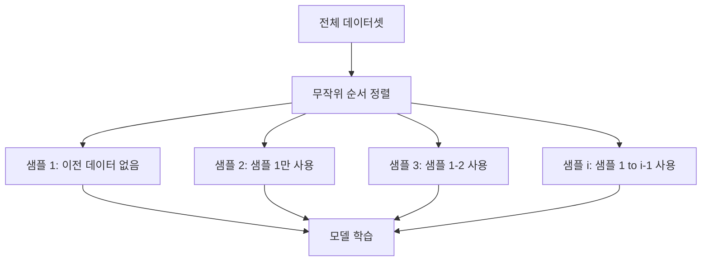
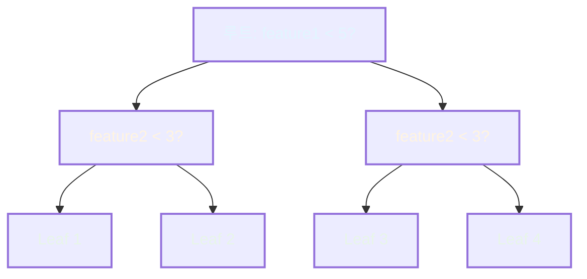

# CatBoost 완전 가이드

## 목차

1. [개요](#1-개요) 
   1.1. [CatBoost란](#11-catboost란) 
   1.2. [주요 특징](#12-주요-특징) 
   1.3. [다른 Gradient Boosting 라이브러리와의 비교](#13-다른-gradient-boosting-라이브러리와의-비교) 

2. [핵심 알고리즘](#2-핵심-알고리즘) 
   2.1. [Ordered Boosting](#21-ordered-boosting) 
   2.2. [범주형 변수 처리](#22-범주형-변수-처리) 
   2.3. [Oblivious Decision Trees](#23-oblivious-decision-trees) 

3. [하이퍼파라미터](#3-하이퍼파라미터) 
   3.1. [트리 구조 관련](#31-트리-구조-관련) 
   3.2. [학습 관련](#32-학습-관련) 
   3.3. [범주형 변수 관련](#33-범주형-변수-관련) 
   3.4. [정규화 관련](#34-정규화-관련) 
   3.5. [성능 최적화 관련](#35-성능-최적화-관련) 

4. [장단점](#4-장단점) 
   4.1. [장점](#41-장점) 
   4.2. [단점](#42-단점) 

5. [실전 활용](#5-실전-활용) 
   5.1. [적합한 상황](#51-적합한-상황) 
   5.2. [주의사항](#52-주의사항) 

---

## 1. 개요

### 1.1. CatBoost란

CatBoost (Categorical Boosting)는 Yandex에서 2017년 개발한 Gradient Boosting 라이브러리입니다. 범주형 변수 (categorical features, 범주형 특성)를 자동으로 처리하고, 과적합 (overfitting, 오버피팅)을 방지하는 알고리즘을 내장한 것이 핵심 특징입니다.

### 1.2. 주요 특징

**범주형 변수 자동 처리**
- One-Hot Encoding이나 Label Encoding 불필요
- Target Statistics 기반 인코딩을 기본 제공
- 고차원 범주형 변수도 효율적으로 처리

**과적합 방지**
- Ordered Boosting으로 예측 편향 (prediction shift, 예측 시프트) 감소
- Ordered Target Statistics로 타겟 누출 (target leakage, 타겟 리키지) 방지

**빠른 학습 속도**
- GPU 지원으로 대규모 데이터셋 처리 가능
- Oblivious Trees 구조로 예측 속도 최적화

### 1.3. 다른 Gradient Boosting 라이브러리와의 비교

| 특징 | CatBoost | XGBoost | LightGBM |
|------|----------|---------|----------|
| 범주형 변수 처리 | 자동 (내장) | 수동 (전처리 필요) | 자동 (제한적) |
| 트리 구조 | Oblivious (symmetric) | Level-wise | Leaf-wise |
| 기본 과적합 방지 | 강력 (Ordered Boosting) | 보통 | 보통 |
| 학습 속도 | 중간 | 빠름 | 매우 빠름 |
| 예측 속도 | 매우 빠름 | 중간 | 중간 |
| GPU 지원 | 우수 | 우수 | 우수 |
| 튜닝 난이도 | 낮음 (기본값 우수) | 높음 | 중간 |

---

## 2. 핵심 알고리즘

### 2.1. Ordered Boosting

**문제 정의**
전통적인 Gradient Boosting에서는 동일한 데이터로 잔차 (residuals, 레지듀얼)를 계산하고 다음 트리를 학습합니다. 이는 예측 편향을 발생시킵니다.

**해결 방법**
CatBoost는 각 샘플에 대해 이전 샘플들만 사용하여 모델을 구축합니다. 이를 위해 데이터를 임의로 순서화하고, 각 샘플 $i$에 대해 $1, 2, \ldots, i-1$ 번째 샘플만 사용합니다.

$$
F^{(i)}(x) = \sum_{t=1}^{T} \alpha_t h_t(x; D_{<i})
$$

여기서:
- $F^{(i)}(x)$: $i$번째 샘플에 대한 예측 함수
- $D_{<i}$: $i$번째 샘플 이전의 데이터
- $h_t$: $t$번째 트리
- $\alpha_t$: 학습률 (learning rate, 러닝 레이트)

**효과**
- 예측 편향 최소화
- 일반화 성능 (generalization performance, 제너럴라이제이션 퍼포먼스) 향상
- 검증 데이터와 테스트 데이터 간 성능 차이 감소

### 2.2. 범주형 변수 처리

**Target Statistics 인코딩**
CatBoost는 범주형 변수를 다음 공식으로 변환합니다:

$$
\text{TS}(x_i) = \frac{\sum_{j=1}^{i-1} \mathbb{1}_{x_j = x_i} \cdot y_j + a \cdot P}{\sum_{j=1}^{i-1} \mathbb{1}_{x_j = x_i} + a}
$$

여기서:
- $x_i$: $i$번째 샘플의 범주형 변수 값
- $y_j$: $j$번째 샘플의 타겟 값
- $\mathbb{1}_{x_j = x_i}$: 지시 함수 (indicator function, 인디케이터 펑션)
- $P$: 전체 데이터셋의 타겟 평균 (prior, 프라이어)
- $a$: 정규화 파라미터 (기본값 1)

**특징**
- Ordered 방식: 현재 샘플보다 앞선 샘플만 사용하여 타겟 누출 방지
- Prior 추가: 희귀 범주 (rare categories, 레어 카테고리)에 대한 안정성 확보
- 자동 처리: 별도의 전처리 (preprocessing, 프리프로세싱) 불필요

**조합 범주형 변수 (Combinations)**
CatBoost는 여러 범주형 변수를 조합하여 새로운 특성을 생성합니다:
- 2개 변수 조합: (color, size) → "red_large"
- 3개 변수 조합: (color, size, material) → "red_large_cotton"

### 2.3. Oblivious Decision Trees

**구조**
CatBoost는 대칭 트리 (symmetric trees, 시메트릭 트리)를 사용합니다. 모든 레벨에서 동일한 분할 조건 (split condition, 스플릿 컨디션)을 적용합니다.

**장점**
- 예측 속도 매우 빠름: $O(\text{depth})$ 복잡도
- 모델 크기 작음: 리프 노드 (leaf nodes, 리프 노드) 수가 $2^{\text{depth}}$로 제한
- 과적합 위험 감소: 구조적 제약으로 복잡도 제한

**단점**
- 표현력 (expressiveness, 익스프레시브니스) 제한: 비대칭 패턴 학습 어려움
- 깊이 증가 시 리프 노드 급증: 메모리 사용량 증가

---

## 3. 하이퍼파라미터

### 3.1. 트리 구조 관련

**`depth` (기본값: 6)**
- 트리의 깊이 (depth, 뎁스)
- 범위: 1-16 (일반적으로 4-10 사용)
- 영향:
  - 증가: 모델 복잡도 상승, 과적합 위험 증가, 학습 시간 증가
  - 감소: 언더피팅 (underfitting, 언더피팅) 위험
- 권장: 범주형 변수 많으면 4-6, 수치형 변수 많으면 6-10

**`max_leaves` (기본값: 31)**
- Oblivious Trees에서는 $2^{\text{depth}}$로 자동 계산됨
- 직접 설정 가능하나 권장하지 않음

**`min_data_in_leaf` (기본값: 1)**
- 리프 노드에 필요한 최소 샘플 수
- 영향:
  - 증가: 과적합 방지, 학습 속도 향상
  - 감소: 세밀한 패턴 학습 가능
- 권장: 데이터 크기에 따라 1-100

### 3.2. 학습 관련

**`iterations` (기본값: 1000)**
- 부스팅 라운드 수 (boosting rounds, 부스팅 라운드)
- 범위: 100-10000+
- 영향: 증가 시 성능 향상하다가 과적합 발생
- 권장: `early_stopping_rounds`와 함께 사용

**`learning_rate` (기본값: 0.03)**
- 학습률, 각 트리의 기여도
- 범위: 0.001-0.3
- 영향:
  - 감소: 더 많은 트리 필요, 학습 시간 증가, 일반화 성능 향상
  - 증가: 빠른 수렴, 과적합 위험
- 권장: 0.01-0.1

**`l2_leaf_reg` (기본값: 3.0)**
- L2 정규화 (regularization, 레귤러라이제이션) 계수
- 범위: 1-10
- 영향: 증가 시 과적합 방지, 리프 값 스무딩 (smoothing, 스무딩)
- 권장: 3-10

**`random_strength` (기본값: 1.0)**
- 분할 점 선택 시 추가되는 무작위성
- 범위: 0-10
- 영향: 증가 시 모델 다양성 증가, 과적합 방지
- 권장: 0-2

**`bagging_temperature` (기본값: 1.0)**
- 베이지안 부트스트랩 (Bayesian bootstrap, 베이지안 부트스트랩) 온도
- 범위: 0-1
- 영향:
  - 0: 모든 샘플 동일 가중치
  - 1: 표준 베이지안 부트스트랩
  - 증가: 더 공격적인 샘플링
- 권장: 0-1

### 3.3. 범주형 변수 관련

**`cat_features`**
- 범주형 변수 인덱스 또는 이름 리스트
- 형식: `[0, 3, 5]` 또는 `['color', 'brand']`
- 필수: CatBoost의 핵심 기능 활용을 위해 반드시 지정

**`one_hot_max_size` (기본값: 2)**
- One-Hot Encoding을 적용할 최대 고유값 수
- 범위: 0-255
- 영향:
  - 고유값 ≤ 이 값: One-Hot Encoding
  - 고유값 > 이 값: Target Statistics
- 권장: 2-10

**`max_ctr_complexity` (기본값: 4)**
- 조합 범주형 변수의 최대 특성 수
- 범위: 1-10
- 영향: 증가 시 특성 공간 확장, 학습 시간 증가
- 권장: 2-4

**`ctr_leaf_count_limit` (기본값: None)**
- 범주형 변수를 수치형으로 변환할 때 사용할 최대 리프 수
- 영향: 메모리 사용량 제어

**`ctr_border_count` (기본값: 254)**
- Target Statistics 계산 시 사용할 경계선 (borders, 보더) 수
- 범위: 1-255
- 영향: 증가 시 정밀도 향상, 계산 비용 증가

### 3.4. 정규화 관련

**`reg_lambda` (L2 정규화)**
- 위의 `l2_leaf_reg`와 동일

**`subsample` (기본값: None)**
- 각 트리 학습에 사용할 샘플 비율
- 범위: 0.0-1.0
- 영향: 감소 시 과적합 방지, 학습 속도 향상
- 권장: 0.5-1.0 (대규모 데이터셋), None (소규모)

**`colsample_bylevel` (기본값: None)**
- 각 레벨에서 사용할 특성 비율
- 범위: 0.0-1.0
- 영향: 감소 시 과적합 방지, 학습 속도 향상
- 권장: 0.5-1.0

**`rsm` (Random Subspace Method)**
- `colsample_bylevel`의 별칭

### 3.5. 성능 최적화 관련

**`task_type` (기본값: 'CPU')**
- 학습 디바이스 선택
- 옵션: 'CPU', 'GPU'
- 영향: GPU 사용 시 대규모 데이터 학습 속도 크게 향상

**`thread_count` (기본값: -1)**
- 사용할 CPU 스레드 수
- -1: 모든 코어 사용
- 권장: -1 (자동)

**`gpu_ram_part` (기본값: 0.95)**
- GPU 메모리 사용 비율
- 범위: 0.0-1.0
- 영향: GPU 메모리 부족 시 조정

**`bootstrap_type` (기본값: 'MVS')**
- 부트스트랩 방법
- 옵션:
  - 'Bayesian': 베이지안 부트스트랩 (기본, CPU)
  - 'Bernoulli': 베르누이 샘플링
  - 'MVS': Minimal Variance Sampling (GPU)
  - 'Poisson': 포아송 샘플링
- 권장: 기본값 유지

**`grow_policy` (기본값: 'SymmetricTree')**
- 트리 성장 정책
- 옵션:
  - 'SymmetricTree': Oblivious Trees (기본)
  - 'Depthwise': Level-wise 성장
  - 'Lossguide': Leaf-wise 성장
- 권장: 'SymmetricTree' (예측 속도 중요), 'Lossguide' (정확도 중요)

**`early_stopping_rounds` (기본값: False)**
- 검증 성능 개선 없을 시 조기 종료할 라운드 수
- 범위: 10-100
- 영향: 과적합 방지, 학습 시간 단축
- 권장: 50-100

**`verbose` (기본값: False)**
- 학습 과정 출력 주기
- 옵션: False, True, 정수 (N 라운드마다 출력)
- 권장: 100-500

---

## 4. 장단점

### 4.1. 장점

**1. 범주형 변수 자동 처리**
- 전처리 단계 간소화
- Target Statistics로 정보 손실 최소화
- 고차원 범주형 변수 효율적 처리

**2. 과적합 방지**
- Ordered Boosting으로 예측 편향 감소
- 기본 하이퍼파라미터만으로도 우수한 성능
- 별도 정규화 튜닝 불필요

**3. 빠른 예측 속도**
- Oblivious Trees 구조로 인퍼런스 (inference, 인퍼런스) 최적화
- 프로덕션 환경에서 실시간 예측 가능

**4. GPU 지원**
- 대규모 데이터셋 학습 가능
- 병렬 처리 효율적

**5. 튜닝 부담 적음**
- 기본값만으로도 경쟁력 있는 성능
- XGBoost/LightGBM 대비 하이퍼파라미터 민감도 낮음

**6. 결측치 자동 처리**
- 별도 임퓨테이션 (imputation, 임퓨테이션) 불필요
- 결측치를 별도 범주로 학습

### 4.2. 단점

**1. 학습 속도**
- Ordered Boosting으로 인해 XGBoost/LightGBM보다 느림
- 특히 CPU 환경에서 대규모 데이터셋 학습 시 시간 소요

**2. 메모리 사용량**
- 범주형 변수 조합 생성 시 메모리 증가
- 깊이가 깊은 트리 사용 시 리프 노드 급증

**3. Oblivious Trees 제약**
- 비대칭 패턴 학습 어려움
- 일부 복잡한 관계는 더 깊은 트리 필요

**4. 문서화**
- XGBoost 대비 커뮤니티 규모 작음
- 한국어 자료 제한적

**5. 특정 데이터셋에서 성능**
- 수치형 변수만 있는 경우 LightGBM이 더 빠를 수 있음
- 선형 관계 위주 데이터에서는 효과 제한적

---

## 5. 실전 활용

### 5.1. 적합한 상황

**범주형 변수 많은 데이터셋**
- 텍스트 ID, 지역 코드, 카테고리 등
- 고차원 범주형 변수 (예: 상품 ID 10만 개)

**과적합 우려 큰 경우**
- 소규모 데이터셋
- 노이즈 많은 데이터

**빠른 프로토타이핑**
- 하이퍼파라미터 튜닝 시간 부족
- 베이스라인 (baseline, 베이스라인) 모델 빠르게 구축

**프로덕션 예측 속도 중요**
- 실시간 추천 시스템
- 온라인 광고 입찰

**예측 안정성 중요**
- 의료, 금융 등 민감한 도메인
- 검증-테스트 성능 차이 최소화 필요

### 5.2. 주의사항

**초기 설정**
- `cat_features` 반드시 지정: 범주형 변수 자동 처리 활성화
- `eval_set` 지정: 조기 종료 및 과적합 모니터링

**범주형 변수 타입**
- 문자열 (string, 스트링) 또는 정수형 (integer, 인티저)으로 입력
- 실수형 (float, 플로트)은 자동 변환되지 않음

**대규모 데이터**
- GPU 사용 권장: `task_type='GPU'`
- 메모리 부족 시 `max_ctr_complexity` 감소

**하이퍼파라미터 튜닝 우선순위**
1. `iterations` + `learning_rate`: 성능-속도 트레이드오프
2. `depth`: 모델 복잡도
3. `l2_leaf_reg`: 정규화 강도
4. `bagging_temperature`: 샘플링 다양성
5. `random_strength`: 분할 무작위성

**앙상블**
- 다른 알고리즘과 앙상블 시 효과적
- CatBoost + XGBoost + LightGBM 스태킹 (stacking, 스태킹)

---

## 참고 자료

- 공식 문서: [https://catboost.ai/docs/](https://catboost.ai/docs/)
- 논문: "CatBoost: unbiased boosting with categorical features" (2018)
- GitHub: [https://github.com/catboost/catboost](https://github.com/catboost/catboost)
