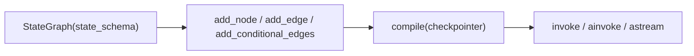

# LangGraph API 참고 문서

> 대상: [`LangGraph.ipynb`](LangGraph.ipynb)에서 사용된 **라이브러리 API**
> 목적: 노트북의 실습 로직(라우터 함수, 에이전트 상태머신 등 개발 로직)을 설명하는 문서가 아니라,
> **LangGraph 및 관련 라이브러리로 실제 개발할 때 참고하는 API 레퍼런스**다.
> 각 API는 시그니처 · 인자 설명 · 최소 사용 예 순으로 정리한다.

---

## 1. 사용 라이브러리 목록

| 라이브러리                        | 역할                                             | 이 문서의 섹션                           |
| --------------------------------- | ------------------------------------------------ | ---------------------------------------- |
| `langgraph.graph`               | 그래프 정의(StateGraph) · 실행 진입/종료 심볼   | [2](#2-langgraphgraph)                    |
| `langgraph.checkpoint.memory`   | 그래프 상태 체크포인팅(메모리)                   | [3](#3-langgraphcheckpointmemory)         |
| `langgraph.graph.message`       | 메시지 리스트 전용 리듀서                        | [4](#4-langgraphgraphmessage)             |
| `typing` / `operator`         | 상태 스키마 정의 및 리듀서 지정(표준 라이브러리) | [5](#5-typing--operator-상태-스키마-정의) |
| `langchain_core.prompts`        | 프롬프트 템플릿                                  | [6](#6-langchain_coreprompts)             |
| `langchain_core.output_parsers` | LLM 출력 파싱                                    | [7](#7-langchain_coreoutput_parsers)      |
| `langchain_core.messages`       | 대화 메시지 객체                                 | [8](#8-langchain_coremessages)            |
| Runnable`\|` 연산자 (LCEL)       | 프롬프트·LLM·파서 파이프라인 결합              | [9](#9-runnable-파이프-연산자-lcel)       |
| `langchain_google_genai`        | Gemini LLM 클라이언트                            | [10](#10-langchain_google_genai)          |
| `langchain_core.tools`          | LLM 호출용 도구(Tool) 정의                       | [11](#11-langchain_coretools)             |
| `pydantic`                      | 도구 입력 스키마 검증                            | [12](#12-pydantic)                        |
| `IPython.display`               | 그래프 구조 시각화(개발 보조)                    | [13](#13-ipythondisplay)                  |
| `dotenv`                        | `.env` 환경변수 로드                           | [14](#14-dotenv)                          |

---

## 2. `langgraph.graph`

### 2.1 `StateGraph`

```python
StateGraph(state_schema: type)
```

| 인자             | 설명                                                                     |
| ---------------- | ------------------------------------------------------------------------ |
| `state_schema` | 그래프가 실행 중 주고받는 상태의 스키마. 보통`TypedDict` 클래스를 전달 |

그래프 빌더를 생성한다. 이후 `add_node` / `add_edge` / `add_conditional_edges`로 그래프를 구성하고 `compile()`로 실행 가능한 객체를 만든다.

```python
from typing import TypedDict
from langgraph.graph import StateGraph

class State(TypedDict):
    text: str

builder = StateGraph(State)
```

### 2.2 `StateGraph.add_node`

```python
add_node(node: str, action: Callable[[State], dict]) -> StateGraph
```

| 인자       | 설명                                                                                     |
| ---------- | ---------------------------------------------------------------------------------------- |
| `node`   | 노드 이름(문자열 식별자)                                                                 |
| `action` | 상태를 받아**변경된 필드만 dict로 반환**하는 함수. `def`/`async def` 모두 가능 |

```python
def node_a(state: State) -> dict:
    return {"text": state["text"] + "!"}

builder.add_node("A", node_a)
```

### 2.3 `StateGraph.add_edge`

```python
add_edge(start_key: str, end_key: str) -> StateGraph
```

| 인자          | 설명                            |
| ------------- | ------------------------------- |
| `start_key` | 출발 노드 이름 (`START` 가능) |
| `end_key`   | 도착 노드 이름 (`END` 가능)   |

고정된(무조건) 연결을 만든다.

```python
from langgraph.graph import START, END
builder.add_edge(START, "A")
builder.add_edge("A", END)
```

### 2.4 `StateGraph.add_conditional_edges`

```python
add_conditional_edges(
    source: str,
    path: Callable[[State], str],
    path_map: dict[str, str] | None = None,
) -> StateGraph
```

| 인자         | 설명                                                                                     |
| ------------ | ---------------------------------------------------------------------------------------- |
| `source`   | 분기가 시작되는 노드 이름                                                                |
| `path`     | 상태를 받아**분기 키 문자열**을 반환하는 라우터 함수                               |
| `path_map` | 라우터 반환값 → 실제 노드 이름 매핑 딕셔너리 (생략 시 반환값 자체를 노드 이름으로 사용) |

```python
def route(state: State) -> str:
    return "A" if state["text"] == "A" else "B"

builder.add_conditional_edges("start", route, {"A": "node_a", "B": "node_b"})
```

### 2.5 `StateGraph.compile`

```python
compile(checkpointer: BaseCheckpointSaver | None = None) -> CompiledStateGraph
```

| 인자             | 설명                                                                               |
| ---------------- | ---------------------------------------------------------------------------------- |
| `checkpointer` | 상태를 저장/복원할 체크포인터(예:`MemorySaver()`). 생략하면 상태가 저장되지 않음 |

그래프를 실행 가능한 `CompiledStateGraph` 객체로 빌드한다.

```python
app = builder.compile()
```

### 2.6 `START` / `END`

그래프의 시작·종료를 나타내는 예약된 이름 상수. `add_edge`/`add_conditional_edges`의 노드 이름 자리에 그대로 전달한다.

### 2.7 실행: `invoke` / `ainvoke` / `stream` / `astream`

```python
CompiledStateGraph.invoke(input: dict, config: dict | None = None) -> dict
CompiledStateGraph.ainvoke(input: dict, config: dict | None = None) -> dict
CompiledStateGraph.astream(input: dict, config: dict | None = None, stream_mode: str = "values")
```

| 인자            | 설명                                                                                     |
| --------------- | ---------------------------------------------------------------------------------------- |
| `input`       | 초기 상태 값 (State 스키마의 dict)                                                       |
| `config`      | 실행 설정. 체크포인터 사용 시`{"configurable": {"thread_id": "..."}}` 형태로 세션 지정 |
| `stream_mode` | `astream`/`stream` 전용. 스트리밍 단위 지정                                          |

**`stream_mode` 옵션**

| 값                    | 설명                                                                           |
| --------------------- | ------------------------------------------------------------------------------ |
| `"values"` (기본값) | 매 스텝 후**전체 상태**를 방출                                           |
| `"updates"`         | 매 스텝에서**노드가 반환한 변경분**만 `{노드명: dict}` 형태로 방출     |
| `"messages"`        | LLM 노드의**토큰 단위** 응답을 `(message_chunk, metadata)` 튜플로 방출 |

```python
result = await app.ainvoke({"text": "hi"})

async for chunk in app.astream({"text": "hi"}, stream_mode="updates"):
    node_name = list(chunk.keys())[0]
    print(node_name, chunk[node_name])
```

### 2.8 `CompiledStateGraph.get_state`

```python
get_state(config: dict) -> StateSnapshot
```

| 인자       | 설명                                                             |
| ---------- | ---------------------------------------------------------------- |
| `config` | `{"configurable": {"thread_id": "..."}}` — 조회할 세션 식별자 |

체크포인터에 저장된 특정 `thread_id`의 최신 상태(`StateSnapshot`, `.values`로 상태 dict 접근)를 조회한다.

```python
state = app.get_state({"configurable": {"thread_id": "user1"}})
messages = state.values["messages"]
```

### 2.9 `get_graph().draw_mermaid_png()`

```python
CompiledStateGraph.get_graph() -> Graph
Graph.draw_mermaid_png() -> bytes
```

컴파일된 그래프 구조를 mermaid 기반 PNG 이미지 바이트로 렌더링한다. 그래프 구성이 의도대로 됐는지 시각적으로 검증할 때 사용한다.

```python
from IPython.display import display, Image
display(Image(app.get_graph().draw_mermaid_png()))
```



---

## 3. `langgraph.checkpoint.memory`

### `MemorySaver`

```python
MemorySaver()
```

인자 없이 생성하는 **인메모리 체크포인터**. `compile(checkpointer=...)`에 전달하면 실행할 때마다 상태가 `thread_id` 별로 저장되어, 이후 같은 `thread_id`로 실행 시 이전 상태를 이어받는다.

| 속성         | 설명                                          |
| ------------ | --------------------------------------------- |
| `.storage` | 저장된 체크포인트 원본 데이터(dict). 디버깅용 |

```python
from langgraph.checkpoint.memory import MemorySaver

memory = MemorySaver()
app = builder.compile(checkpointer=memory)

config = {"configurable": {"thread_id": "user1"}}
r1 = await app.ainvoke({"messages": [...]}, config=config)
r2 = await app.ainvoke({"messages": [...]}, config=config)  # r1의 이어지는 대화
```

---

## 4. `langgraph.graph.message`

### `add_messages`

```python
add_messages(left: list, right: list) -> list
```

| 인자      | 설명                             |
| --------- | -------------------------------- |
| `left`  | 기존 메시지 리스트               |
| `right` | 노드가 새로 반환한 메시지 리스트 |

메시지 리스트 전용 리듀서 함수. 새 메시지는 뒤에 추가하고, `id`가 같은 메시지가 있으면 **덮어쓰기(갱신)** 한다. State 필드에 리듀서로 지정해서 사용한다(직접 호출하지 않음).

```python
from typing import Annotated, TypedDict
from langgraph.graph.message import add_messages

class ChatState(TypedDict):
    messages: Annotated[list, add_messages]
```

---

## 5. `typing` / `operator` — 상태 스키마 정의

| API                              | 설명                                                                                                                                                                    |
| -------------------------------- | ----------------------------------------------------------------------------------------------------------------------------------------------------------------------- |
| `typing.TypedDict`             | State 스키마를 정의하는 딕셔너리 타입. 필드명: 타입 형태로 선언                                                                                                         |
| `typing.Annotated[T, reducer]` | 필드에**리듀서 함수**를 부여. 여러 노드가 같은 필드를 동시에 갱신할 때, 리듀서가 없으면 마지막 값으로 덮어써져 병렬 갱신 시 충돌하고, 있으면 리듀서 함수로 병합됨 |
| `operator.add`                 | 리스트/문자열 등에 대해`+` 연산(누적)을 수행하는 리듀서로 자주 사용                                                                                                   |

```python
from typing import Annotated, TypedDict
import operator

class State(TypedDict):
    text: str                              # 리듀서 없음 → 마지막 반환값으로 덮어쓰기
    logs: Annotated[list, operator.add]    # 리듀서 있음 → 리스트 누적(A+B 병렬 갱신 가능)
```

---

## 6. `langchain_core.prompts`

### 6.1 `ChatPromptTemplate.from_messages`

```python
ChatPromptTemplate.from_messages(messages: list[tuple[str, str]])
```

| 인자         | 설명                                                                                                                                              |
| ------------ | ------------------------------------------------------------------------------------------------------------------------------------------------- |
| `messages` | `(role, template_string)` 튜플 리스트. `role`은 `"system"`/`"human"`/`"ai"` 등. `template_string`은 `{변수}` 플레이스홀더 포함 가능 |

```python
prompt = ChatPromptTemplate.from_messages([
    ("system", "한 문장으로 설명해."),
    ("human", "{topic}"),
])
```

### 6.2 `PromptTemplate.from_template`

```python
PromptTemplate.from_template(template: str)
```

| 인자         | 설명                                                |
| ------------ | --------------------------------------------------- |
| `template` | `{변수}` 플레이스홀더를 포함한 단일 문자열 템플릿 |

```python
prompt = PromptTemplate.from_template("{country}의 수도는 어디야?")
```

---

## 7. `langchain_core.output_parsers`

| API                    | 설명                                                                                                 |
| ---------------------- | ---------------------------------------------------------------------------------------------------- |
| `StrOutputParser()`  | LLM 응답(`AIMessage`)에서 텍스트(`str`)만 추출                                                   |
| `JsonOutputParser()` | LLM 응답 텍스트를 JSON으로 파싱해`dict` 반환 (LLM이 JSON 형식으로 답하도록 프롬프트에서 유도 필요) |

```python
from langchain_core.output_parsers import StrOutputParser, JsonOutputParser

str_parser = StrOutputParser()
json_parser = JsonOutputParser()
```

---

## 8. `langchain_core.messages`

```python
SystemMessage(content: str)
HumanMessage(content: str)
AIMessage(content: str)
```

| 인자        | 설명               |
| ----------- | ------------------ |
| `content` | 메시지 본문 텍스트 |

LLM과 주고받는 대화의 역할별 메시지 객체. `llm.invoke([...])`처럼 리스트로 묶어 전달한다.

```python
from langchain_core.messages import SystemMessage, HumanMessage

messages = [SystemMessage("너는 친절한 AI야."), HumanMessage("안녕!")]
```

---

## 9. Runnable 파이프 연산자 (LCEL)

`langchain_core`의 모든 컴포넌트(`Prompt`, `LLM`, `OutputParser`, `Tool`)는 `Runnable`이며, `|` 연산자로 연결해 하나의 실행 체인(`RunnableSequence`)을 만들 수 있다. 체인도 동일하게 `invoke`/`ainvoke`/`stream`/`astream`을 제공한다.

```python
chain = prompt | llm | StrOutputParser()

result = chain.invoke({"topic": "머신러닝"})        # 동기
result = await chain.ainvoke({"topic": "머신러닝"})  # 비동기
```


---

## 10. `langchain_google_genai`

### `ChatGoogleGenerativeAI`

```python
ChatGoogleGenerativeAI(model: str, google_api_key: str, temperature: float = 0.7)
```

| 인자               | 설명                                                              |
| ------------------ | ----------------------------------------------------------------- |
| `model`          | 모델명 (예:`"gemini-3.1-flash-lite-preview"`)                   |
| `google_api_key` | Gemini API 키                                                     |
| `temperature`    | 생성 다양성(무작위성).`0`에 가까울수록 결정적(재현 가능)인 답변 |

`invoke(input)` / `ainvoke(input)`으로 호출하며 `input`은 문자열, 메시지 리스트, 또는 프롬프트 결과 모두 가능.

```python
llm = ChatGoogleGenerativeAI(model="gemini-3.1-flash-lite-preview", google_api_key=api_key, temperature=0)
res = await llm.ainvoke("안녕?")
print(res.content)
```

---

## 11. `langchain_core.tools`

### `@tool` 데코레이터

```python
@tool
def func(arg: str) -> str: ...

@tool(args_schema=PydanticModel)
def func(arg: str) -> str: ...
```

| 인자                   | 설명                                                                                          |
| ---------------------- | --------------------------------------------------------------------------------------------- |
| (데코레이터 인자 없음) | 함수의**타입 힌트**로 입력 스키마를 자동 추론, **docstring**을 도구 설명으로 사용 |
| `args_schema`        | 입력 스키마를 pydantic`BaseModel`로 명시 지정 (자동 추론 대신 사용)                         |

일반 함수를 LLM이 호출할 수 있는 `StructuredTool` 객체로 변환한다. `async def` 함수도 데코레이트 가능하며, 이 경우 `await tool.ainvoke(...)`로 실행해야 한다.

| 결과 객체 속성/메서드                                | 설명                                                             |
| ---------------------------------------------------- | ---------------------------------------------------------------- |
| `tool.name`                                        | 도구 이름 (함수명 기본값)                                        |
| `tool.description`                                 | 도구 설명 (docstring)                                            |
| `tool.args_schema`                                 | 입력 스키마(pydantic 모델)                                       |
| `tool.args_schema.model_json_schema()`             | 스키마를 JSON Schema dict로 변환 (LLM 프롬프트에 삽입할 때 사용) |
| `tool.invoke(dict)` / `await tool.ainvoke(dict)` | 도구 실행. 인자는`{파라미터명: 값}` dict                       |

```python
from langchain_core.tools import tool

@tool
def calculator_tool(expression: str) -> str:
    """수식 문자열을 계산해 결과를 반환한다."""
    return str(eval(expression))

result = calculator_tool.invoke({"expression": "1+2"})
```

---

## 12. `pydantic`

```python
class MyInput(BaseModel):
    text: str = Field(description="설명 텍스트")
```

| API                        | 설명                                                                                                        |
| -------------------------- | ----------------------------------------------------------------------------------------------------------- |
| `BaseModel`              | 필드 타입이 검증되는 스키마 클래스의 베이스                                                                 |
| `Field(description=str)` | 필드에 설명을 부여 —`@tool(args_schema=...)`와 함께 쓰면 이 설명이 LLM에게 전달되는 JSON Schema에 포함됨 |

```python
from pydantic import BaseModel, Field

class TranslateInput(BaseModel):
    text: str = Field(description="번역할 원문 텍스트")
    target_lang: str = Field(description="목표 언어 코드 (예: 'ko', 'en')")
```

---

## 13. `IPython.display`

| API                    | 설명                                    |
| ---------------------- | --------------------------------------- |
| `display(obj)`       | Jupyter 셀에 객체를 렌더링              |
| `Image(data: bytes)` | 이미지 바이트를 표시 가능한 객체로 감쌈 |

그래프 개발 중 구조를 눈으로 검증하는 용도로만 사용(운영 로직 아님).

```python
from IPython.display import display, Image
display(Image(app.get_graph().draw_mermaid_png()))
```

---

## 14. `dotenv`

```python
load_dotenv() -> bool
```

현재 작업 디렉터리(또는 상위 경로)의 `.env` 파일을 읽어 `os.environ`에 로드한다. 인자 없이 호출하면 자동 탐색.

```python
from dotenv import load_dotenv
import os

load_dotenv()
api_key = os.getenv("GEMINI_API_KEY")
```

---

## 15. 개발 시 참고 요약

- 상태 필드가 **여러 노드에서 동시에 갱신**될 수 있으면 반드시 `Annotated[T, 리듀서]`를 지정한다 (`operator.add`, `add_messages` 등). 지정하지 않으면 병렬 갱신 시 마지막 값으로 덮어써진다.
- 분기가 필요한 노드는 `add_conditional_edges(source, 라우터함수, path_map)`으로 연결한다. 라우터 함수는 상태만 보고 **문자열 키**를 반환해야 한다.
- LLM을 호출하는 노드는 `async def` + `await (prompt | llm | parser).ainvoke(...)` 형태를 권장한다(동기 `invoke`도 가능하나 다중 노드 병렬 실행 시 비동기가 유리).
- 멀티턴 대화·재실행 이력이 필요하면 `compile(checkpointer=MemorySaver())` + `config={"configurable": {"thread_id": ...}}`를 사용한다.
- 도구(Tool)의 입력 스키마는 `pydantic.BaseModel` + `Field(description=...)`로 명시하면, `args_schema.model_json_schema()`를 통해 LLM 프롬프트에 정확한 인자 설명을 전달할 수 있다.
- 그래프를 수정한 뒤에는 `get_graph().draw_mermaid_png()`로 구조를 시각화해 의도한 연결인지 확인한다.
