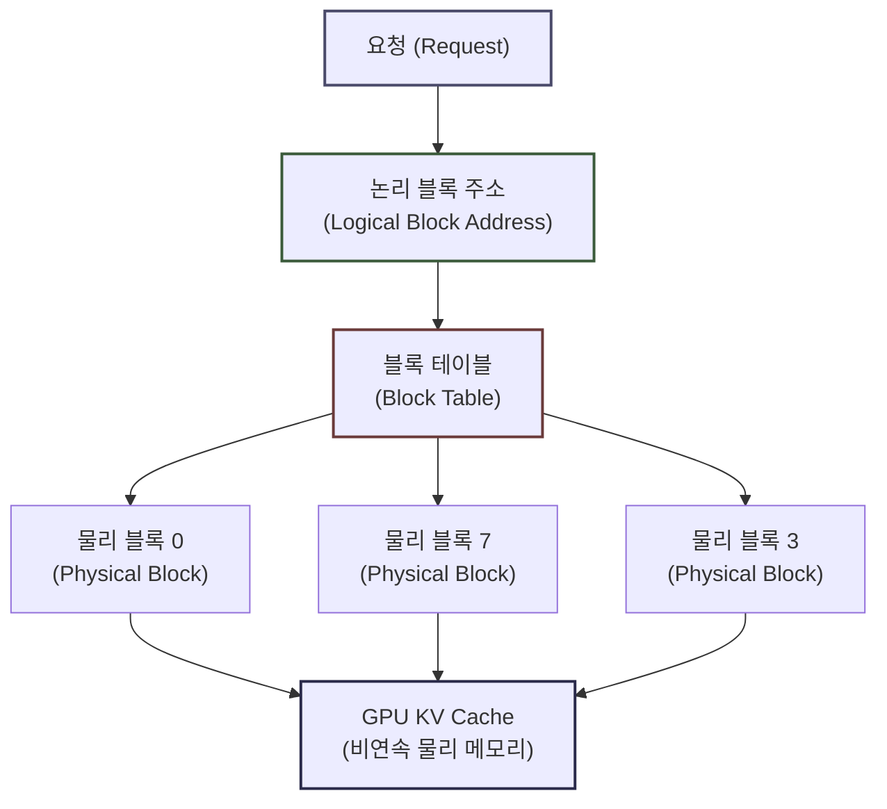
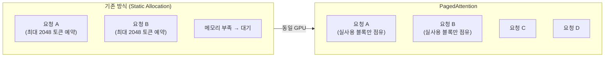
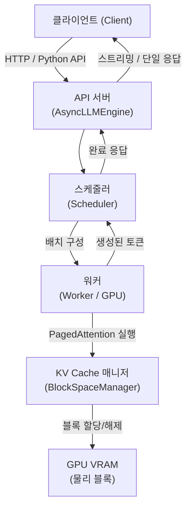
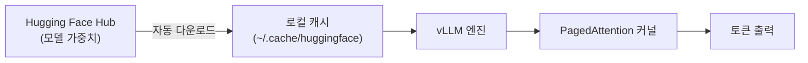

# vLLM — 고성능 LLM 추론 엔진

---

## 목차

- [vLLM — 고성능 LLM 추론 엔진](#vllm--고성능-llm-추론-엔진)
  - [목차](#목차)
  - [1. vLLM이란](#1-vllm이란)
  - [2. 핵심 문제: 기존 추론의 병목](#2-핵심-문제-기존-추론의-병목)
    - [2.1 KV Cache와 메모리 낭비](#21-kv-cache와-메모리-낭비)
    - [2.2 단편화 문제](#22-단편화-문제)
  - [3. 핵심 기술: PagedAttention](#3-핵심-기술-pagedattention)
    - [3.1 착안점](#31-착안점)
    - [3.2 동작 방식](#32-동작-방식)
    - [3.3 처리량 향상 원리](#33-처리량-향상-원리)
  - [4. vLLM 아키텍처 개요](#4-vllm-아키텍처-개요)
    - [4.1 전체 흐름](#41-전체-흐름)
    - [4.2 주요 구성 요소](#42-주요-구성-요소)
  - [5. 주요 특징 및 지원 기능](#5-주요-특징-및-지원-기능)
    - [5.1 Continuous Batching (연속 배치)](#51-continuous-batching-연속-배치)
    - [5.2 Tensor Parallelism (텐서 병렬처리)](#52-tensor-parallelism-텐서-병렬처리)
    - [5.3 지원 모델](#53-지원-모델)
  - [6. 성능 비교](#6-성능-비교)
  - [부록. Hugging Face 모델 연동](#부록-hugging-face-모델-연동)
    - [A.1 연동 구조 개요](#a1-연동-구조-개요)
    - [A.2 오프라인 추론 API: `LLM` 클래스](#a2-오프라인-추론-api-llm-클래스)
      - [`LLM.__init__()` 주요 인자](#llm__init__-주요-인자)
    - [A.3 온라인 서빙 API: OpenAI 호환 서버](#a3-온라인-서빙-api-openai-호환-서버)
      - [서버 실행 주요 CLI 인자](#서버-실행-주요-cli-인자)
    - [A.4 `SamplingParams` API](#a4-samplingparams-api)
      - [주요 인자](#주요-인자)
    - [A.5 양자화 및 최적화 옵션](#a5-양자화-및-최적화-옵션)
  - [용어사전](#용어사전)

---

## 1. vLLM이란

vLLM(Virtual Large Language Model serving)은 UC Berkeley에서 2023년 발표한 **오픈소스 LLM 추론 및 서빙 엔진** 이다.

기존 LLM 서빙 프레임워크들이 메모리 활용 비효율로 인해 처리량(throughput)에 심각한 제약을 받는 문제를 해결하기 위해 설계되었다. 핵심 목표는 단순하다. **동일한 GPU 자원으로 더 많은 요청을 동시에 처리한다.**

논문 제목은 "Efficient Memory Management for Large Language Model Serving with PagedAttention"이며, 핵심 기여는 OS의 가상 메모리(virtual memory) 개념을 KV Cache 관리에 적용한 **PagedAttention** 알고리즘이다.

---

## 2. 핵심 문제: 기존 추론의 병목

### 2.1 KV Cache와 메모리 낭비

트랜스포머(Transformer) 모델이 토큰을 생성할 때, 매 스텝마다 이전 토큰들의 Key·Value 행렬을 재계산하지 않도록 GPU 메모리에 저장해 둔다. 이를 **KV Cache(KV 캐시)** 라 한다.

문제는 요청마다 최대 시퀀스 길이(max sequence length)를 기준으로 메모리를 **정적으로 미리 할당(static pre-allocation)** 한다는 점이다.

$$
\text{KV Cache Size} = 2 \times L \times d_{\text{head}} \times n_{\text{heads}} \times S_{\text{max}}
$$

| 기호 | 의미 |
|------|------|
| $L$ | 레이어 수 |
| $d_{\text{head}}$ | 헤드 차원 |
| $n_{\text{heads}}$ | 헤드 수 |
| $S_{\text{max}}$ | 최대 시퀀스 길이 |

실제 생성 토큰 수가 최대 길이에 훨씬 못 미치더라도 메모리는 최대치 기준으로 점유된다. 결과적으로 GPU 메모리의 상당 부분이 사용되지 않는 채로 낭비된다.

### 2.2 단편화 문제

정적 할당 방식은 두 가지 단편화(fragmentation)를 동시에 일으킨다.

```
내부 단편화 (Internal Fragmentation)
  → 할당된 블록 내에서 실제로 쓰이지 않는 공간

외부 단편화 (External Fragmentation)
  → 여유 메모리가 흩어져 있어 큰 블록을 할당하지 못하는 상태
```

기존 시스템에서는 메모리의 **60~80%가 실질적으로 낭비** 된다는 분석이 있다.

---

## 3. 핵심 기술: PagedAttention

### 3.1 착안점

OS의 **페이징(paging) 메모리 관리** 방식에서 직접 착안했다.

OS는 프로세스에게 연속된 물리 메모리를 줄 필요 없이, 고정 크기의 **페이지(page)** 단위로 비연속적인 물리 메모리를 할당하고 가상 주소 공간으로 매핑한다. 프로세스는 연속된 메모리처럼 보이지만, 실제 물리 메모리는 흩어져 있어도 무관하다.

PagedAttention은 KV Cache에 동일한 원리를 적용한다.

### 3.2 동작 방식



- KV Cache를 고정 크기의 **블록(block)** 단위로 분할한다. 기본값은 블록당 16 토큰이다.
- 각 요청은 **논리 블록 주소** 를 갖고, 블록 테이블이 이를 **물리 블록 주소**로 변환한다.
- 물리 블록은 GPU 메모리 어디에든 위치할 수 있으며, 연속성이 불필요하다.
- 실제로 생성된 토큰만큼만 블록을 할당하므로 낭비가 최소화된다.

### 3.3 처리량 향상 원리



같은 GPU 메모리에서 동시 처리 가능한 요청 수가 대폭 증가한다. 이것이 처리량(throughput) 향상의 직접적인 원인이다.

추가로 **Copy-on-Write(쓰기 시 복사)** 메커니즘을 통해, 동일한 프롬프트를 공유하는 병렬 샘플링(parallel sampling) 요청들이 KV Cache 블록을 **공유** 할 수 있다. 중복 계산과 중복 메모리 점유가 동시에 제거된다.

---

## 4. vLLM 아키텍처 개요

### 4.1 전체 흐름



### 4.2 주요 구성 요소

**AsyncLLMEngine (비동기 추론 엔진)**

외부 요청을 수신하고 비동기 큐로 관리한다. OpenAI 호환 REST API 서버의 핵심 백엔드이다.

**Scheduler (스케줄러)**

대기(waiting), 실행(running), 선점(preempted) 세 가지 큐를 관리한다. 메모리 여유 상황에 따라 요청을 승인하거나 선점(preemption)하여 다른 요청에 메모리를 양보하게 한다.

**BlockSpaceManager (블록 공간 매니저)**

논리 블록과 물리 블록 간의 매핑 테이블을 유지한다. 블록 할당, 해제, Copy-on-Write 처리를 담당한다.

**Worker (워커)**

실제 GPU 위에서 모델 포워드 패스(forward pass)를 실행한다. 다중 GPU 환경에서는 텐서 병렬처리(Tensor Parallelism)를 위해 여러 워커가 협력한다.

---

## 5. 주요 특징 및 지원 기능

### 5.1 Continuous Batching (연속 배치)

기존 정적 배치(static batching)는 배치 내 모든 요청이 완료될 때까지 새 요청을 받지 못한다. 짧은 요청이 긴 요청과 묶이면 GPU가 대기 상태로 낭비된다.

** **Continuous Batching(연속 배치)** 한 요청이 완료되는 즉시 대기 중인 새 요청을 해당 슬롯에 채워 넣는다. GPU 활용률이 실질적으로 높아진다.

```mermaid
gantt
    title Continuous Batching vs Static Batching
    dateFormat X
    axisFormat %s

    section Static Batching
    요청A (짧음)   :0, 2
    요청B (긺)     :0, 8
    요청C (대기)   :8, 10

    section Continuous Batching
    요청A (짧음)   :0, 2
    요청B (긺)     :0, 8
    요청C (즉시투입):2, 6
```



### 5.2 Tensor Parallelism (텐서 병렬처리)

단일 모델이 하나의 GPU에 올라가지 않을 때, 모델의 가중치 행렬을 여러 GPU에 분할하여 각 GPU가 부분 연산을 수행하고 결과를 합산한다. vLLM은 Megatron-LM 방식의 텐서 병렬처리를 기본 지원한다.

### 5.3 지원 모델

| 계열 | 대표 모델 |
|------|-----------|
| LLaMA 계열 | LLaMA-2/3, Mistral, Mixtral, Qwen |
| GPT 계열 | GPT-2, GPT-J, GPT-NeoX |
| Falcon | Falcon-7B/40B |
| OPT | OPT-125M ~ 66B |
| BLOOM | BLOOM, BLOOMZ |
| Gemma | Gemma-2B/7B |
| Phi | Phi-2, Phi-3 |

Hugging Face Hub에 등록된 위 아키텍처 기반 모델이라면 대부분 연동 가능하다.

---

## 6. 성능 비교

vLLM 논문(Kwon et al., 2023)에서 보고한 처리량 비교이다. 측정 환경은 NVIDIA A100 40GB, LLaMA-13B 기준이다.

| 프레임워크 | 처리량 (tokens/sec) | 비고 |
|-----------|-------------------|------|
| Hugging Face Transformers | 기준(1x) | 정적 배치, 기본 구현 |
| FasterTransformer | 약 1.5~2x | 커널 최적화 |
| **vLLM** | **최대 24x** | PagedAttention + Continuous Batching |

처리량 차이는 동시 요청 수가 늘어날수록 더욱 벌어진다. 단일 요청 지연시간(latency)보다 **다중 요청 처리 처리량(throughput)** 에서 vLLM의 우위가 두드러진다.

---
---

## 부록. Hugging Face 모델 연동

### A.1 연동 구조 개요

vLLM은 Hugging Face Hub의 모델을 **모델 ID 문자열** 하나로 바로 불러올 수 있다. 내부적으로 `transformers` 라이브러리의 모델 가중치 로딩 경로를 그대로 활용하되, 추론 실행은 vLLM 자체 커널로 대체한다.



연동 방식은 두 가지다.

- **오프라인 추론**: Python 코드 내에서 `LLM` 클래스를 직접 인스턴스화
- **온라인 서빙**: OpenAI 호환 REST API 서버를 CLI로 실행

---

### A.2 오프라인 추론 API: `LLM` 클래스

`vllm.LLM`은 오프라인 배치 추론의 진입점이다. 인스턴스 생성 시 모델을 GPU에 로드하고, `generate()` 메서드로 추론을 실행한다.

```python
from vllm import LLM, SamplingParams

llm = LLM(model="mistralai/Mistral-7B-Instruct-v0.2")
outputs = llm.generate(["서울의 날씨는"], SamplingParams(max_tokens=128))
```

#### `LLM.__init__()` 주요 인자

| 인자 | 타입 | 기본값 | 설명 |
|------|------|--------|------|
| `model` | `str` | 필수 | Hugging Face 모델 ID 또는 로컬 경로. 예: `"meta-llama/Llama-2-7b-chat-hf"` |
| `tokenizer` | `str` | `None` | 별도 토크나이저 경로. `None`이면 `model`과 동일 경로 사용 |
| `tokenizer_mode` | `str` | `"auto"` | `"auto"`: 빠른 토크나이저 우선. `"slow"`: HF slow tokenizer 강제 사용 |
| `trust_remote_code` | `bool` | `False` | 모델 저장소의 커스텀 코드(`modeling_*.py`) 실행 허용 여부. Falcon, Qwen 등 일부 모델에서 `True` 필요 |
| `dtype` | `str` | `"auto"` | 가중치 데이터 타입. `"auto"` 시 모델 설정 따름. `"float16"`, `"bfloat16"`, `"float32"` 지정 가능 |
| `max_model_len` | `int` | `None` | 처리할 최대 시퀀스 길이(토큰 수). `None`이면 모델 설정값 사용. GPU 메모리 부족 시 줄여서 지정 |
| `gpu_memory_utilization` | `float` | `0.9` | KV Cache 할당에 사용할 GPU 메모리 비율 (0.0 ~ 1.0). 다른 프로세스와 GPU 공유 시 낮춤 |
| `tensor_parallel_size` | `int` | `1` | 텐서 병렬처리에 사용할 GPU 수. 사용 GPU 수만큼 지정. 예: 4 GPU 사용 시 `4` |
| `pipeline_parallel_size` | `int` | `1` | 파이프라인 병렬처리 단계 수. 모델 레이어를 여러 GPU 묶음으로 분할 |
| `quantization` | `str` | `None` | 양자화 방식. `"awq"`, `"gptq"`, `"squeezellm"`, `"fp8"` 지원 |
| `enforce_eager` | `bool` | `False` | CUDA 그래프 최적화 비활성화. 디버깅 또는 일부 호환성 문제 시 `True` |
| `max_num_seqs` | `int` | `256` | 한 번에 처리할 최대 동시 시퀀스 수. 메모리와 처리량의 트레이드오프 |
| `swap_space` | `int` | `4` | CPU 스왑 공간 크기(GB). 선점된 요청의 KV Cache를 CPU RAM에 임시 저장할 때 사용 |
| `revision` | `str` | `None` | HF Hub의 특정 커밋 해시 또는 브랜치 지정. 재현성 확보에 유용 |
| `download_dir` | `str` | `None` | 모델 가중치 다운로드 경로. `None`이면 HF 기본 캐시 경로 사용 |
| `load_format` | `str` | `"auto"` | 가중치 로드 방식. `"auto"`, `"pt"` (PyTorch), `"safetensors"`, `"npcache"`, `"dummy"` |

---

### A.3 온라인 서빙 API: OpenAI 호환 서버

CLI 명령 하나로 OpenAI API와 동일한 인터페이스의 REST 서버를 실행한다. 기존 OpenAI SDK 또는 HTTP 클라이언트를 그대로 사용할 수 있다.

```bash
python -m vllm.entrypoints.openai.api_server \
    --model mistralai/Mistral-7B-Instruct-v0.2 \
    --tensor-parallel-size 2
```

#### 서버 실행 주요 CLI 인자

| 인자 | 기본값 | 설명 |
|------|--------|------|
| `--model` | 필수 | HF 모델 ID 또는 로컬 경로 |
| `--host` | `"0.0.0.0"` | 바인딩 호스트 주소 |
| `--port` | `8000` | 바인딩 포트 번호 |
| `--tensor-parallel-size` | `1` | 텐서 병렬 GPU 수 |
| `--dtype` | `"auto"` | 가중치 데이터 타입 |
| `--max-model-len` | 모델 설정 | 최대 시퀀스 길이 |
| `--gpu-memory-utilization` | `0.9` | GPU 메모리 사용 비율 |
| `--quantization` | `None` | 양자화 방식 (`awq`, `gptq` 등) |
| `--trust-remote-code` | `False` | 원격 커스텀 코드 허용 |
| `--served-model-name` | 모델 ID | API 응답에 표시될 모델 이름. 임의 문자열 지정 가능 |
| `--max-num-seqs` | `256` | 동시 처리 최대 시퀀스 수 |
| `--disable-log-requests` | `False` | 요청 로깅 비활성화 (프로덕션 권장) |
| `--api-key` | `None` | 간이 API 키 인증 설정 |
| `--chat-template` | `None` | 커스텀 채팅 템플릿 파일 경로 (Jinja2 형식) |

서버 실행 후 `http://localhost:8000/v1/chat/completions` 엔드포인트가 OpenAI 스펙과 동일하게 동작한다.

---

### A.4 `SamplingParams` API

`vllm.SamplingParams`는 토큰 생성 방식을 제어한다. `LLM.generate()`의 두 번째 인자로 전달한다.

#### 주요 인자

| 인자 | 타입 | 기본값 | 설명 |
|------|------|--------|------|
| `temperature` | `float` | `1.0` | 샘플링 온도. `0.0`이면 greedy decoding(최고 확률 토큰만 선택). 높을수록 출력이 다양해짐 |
| `top_p` | `float` | `1.0` | Nucleus sampling. 누적 확률 상위 `top_p` 이내 토큰만 샘플링. `1.0`이면 비활성화 |
| `top_k` | `int` | `-1` | 상위 `k`개 토큰만 후보로 사용. `-1`이면 비활성화 |
| `max_tokens` | `int` | `16` | 생성할 최대 토큰 수 |
| `min_tokens` | `int` | `0` | 생성할 최소 토큰 수. EOS 토큰보다 우선함 |
| `stop` | `list[str]` | `[]` | 해당 문자열 등장 시 생성 중단. 예: `["</s>", "<br/><br/>"]` |
| `stop_token_ids` | `list[int]` | `[]` | 해당 토큰 ID 등장 시 생성 중단 |
| `presence_penalty` | `float` | `0.0` | 이미 등장한 토큰에 페널티 부여. 반복 억제. 범위: -2.0 ~ 2.0 |
| `frequency_penalty` | `float` | `0.0` | 등장 빈도에 비례한 페널티. 범위: -2.0 ~ 2.0 |
| `repetition_penalty` | `float` | `1.0` | 반복 토큰 억제 비율. `1.0`이면 비활성화. 1.0 초과 시 억제 강화 |
| `n` | `int` | `1` | 동일 프롬프트에서 생성할 독립 출력 수. Copy-on-Write로 KV Cache 공유 |
| `best_of` | `int` | `n` | `n`개 이상 후보를 생성하고 그중 최선을 반환. `n` 이상이어야 함 |
| `use_beam_search` | `bool` | `False` | Beam Search 사용 여부. `True` 시 `temperature` 무시 |
| `length_penalty` | `float` | `1.0` | Beam Search 시 시퀀스 길이에 대한 페널티 계수 |
| `seed` | `int` | `None` | 난수 시드. 재현성 확보 시 고정 |
| `logprobs` | `int` | `None` | 각 토큰에 대해 반환할 로그 확률 상위 후보 수 |
| `prompt_logprobs` | `int` | `None` | 입력 프롬프트 토큰들의 로그 확률 반환 수 |
| `skip_special_tokens` | `bool` | `True` | 출력에서 특수 토큰(`<s>`, `</s>` 등) 제거 여부 |
| `spaces_between_special_tokens` | `bool` | `True` | 특수 토큰 사이 공백 삽입 여부 |

---

### A.5 양자화 및 최적화 옵션

Hugging Face Hub에는 다양한 양자화(quantization) 포맷 모델이 공개되어 있다. vLLM은 이를 직접 지원한다.

| 양자화 방식 | `quantization` 값 | 설명 |
|------------|------------------|------|
| AWQ | `"awq"` | Activation-aware Weight Quantization. INT4 가중치. 속도·정확도 균형 우수 |
| GPTQ | `"gptq"` | GPT Quantization. INT4/INT8. HF Hub에 가장 많이 배포된 포맷 |
| SqueezeLLM | `"squeezellm"` | 희소 양자화. 비균일 비트폭 지원 |
| FP8 | `"fp8"` | NVIDIA H100 이상에서 하드웨어 가속 지원 |

양자화 모델 사용 시 `LLM` 생성자의 `model` 인자에 양자화 모델 ID를 그대로 지정하고, `quantization` 인자에 해당 방식을 명시하면 된다.

---

## 용어사전

vLLM 및 LLM 서빙 문맥에서 등장하는 핵심 기술 용어를 정리한다. 일반적으로 알려진 기초 용어는 제외하고, 문서를 읽는 데 실질적으로 필요한 중급 이상의 개념을 대상으로 한다.

| 영문 용어 | 한글 용어 | 약어 | 설명 |
|-----------|-----------|------|------|
| Autoregressive Decoding | 자기회귀 디코딩, 오토리그레시브 디코딩 | — | 다음 토큰을 생성할 때 이전에 생성된 모든 토큰을 조건으로 활용하는 방식. 매 스텝마다 새 토큰 하나를 생성하고 피드백하므로 KV Cache가 필수적이다. $P(x_t \mid x_1, \ldots, x_{t-1})$ |
| Prefill Phase | 프리필 단계 | — | LLM 추론의 첫 번째 단계. 입력 프롬프트 전체를 한 번에 병렬 처리하여 KV Cache를 초기화한다. GPU 활용률이 높고 연산이 빠르다. |
| Decode Phase | 디코드 단계 | — | LLM 추론의 두 번째 단계. 토큰을 하나씩 자기회귀적으로 생성한다. 매 스텝이 순차적이므로 하드웨어 활용률이 낮아지는 경향이 있다. |
| KV Cache | 키-밸류 캐시, 케이브이 캐시 | — | 트랜스포머 셀프 어텐션에서 각 토큰의 Key·Value 행렬을 GPU 메모리에 보존하는 구조. 이미 처리한 토큰의 재계산을 방지한다. 시퀀스 길이·레이어 수·헤드 수에 비례하여 메모리를 점유한다. |
| Logical Block | 논리 블록 | — | PagedAttention에서 요청의 관점으로 바라본 연속적인 토큰 묶음 단위. 실제 물리 메모리 위치와 분리되어 있다. |
| Physical Block | 물리 블록 | — | GPU VRAM 상의 실제 KV Cache 저장 위치. 논리 블록과 블록 테이블로 간접 매핑되므로 비연속적으로 분산되어도 무관하다. |
| Block Table | 블록 테이블 | — | 논리 블록 번호를 물리 블록 번호로 변환하는 매핑 테이블. OS의 페이지 테이블과 동일한 역할을 한다. `BlockSpaceManager`가 관리한다. |
| Copy-on-Write | 쓰기 시 복사, 카피온라이트 | CoW | 여러 요청이 동일 물리 블록을 공유하다가 쓰기 시점에만 복사본을 생성하는 메커니즘. 병렬 샘플링·빔 서치에서 KV Cache 공유로 메모리를 절약한다. |
| Preemption | 선점, 프리엠션 | — | 실행 중인 요청을 강제 중단하고 KV Cache 블록을 회수하는 동작. 새 요청을 위한 메모리 확보 목적이며, 선점된 요청의 KV Cache는 CPU 스왑 또는 재계산으로 복구된다. |
| Swap Space | 스왑 공간 | — | 선점된 요청의 KV Cache를 GPU VRAM 대신 CPU RAM에 임시 저장하는 공간. PCIe 대역폭이 병목이므로 스왑이 빈번하면 처리량이 저하된다. |
| Continuous Batching | 연속 배치, 컨티뉴어스 배칭 | — | 디코딩 스텝(이터레이션) 단위로 배치를 재구성하는 기법. 요청 완료 즉시 새 요청을 해당 슬롯에 투입하여 GPU 활용률을 높인다. Orca(2022) 논문에서 처음 제안되었다. |
| Iteration-level Scheduling | 이터레이션 수준 스케줄링 | — | Continuous Batching의 내부 구현 관점 명칭. 배치 단위가 아닌 매 디코딩 스텝마다 스케줄링 결정을 내린다. |
| Tensor Parallelism | 텐서 병렬처리, 텐서 패럴렐리즘 | TP | 모델 가중치 행렬을 열·행 방향으로 분할하여 여러 GPU에 분산 배치하는 기법. 각 GPU가 부분 연산 후 AllReduce로 합산한다. NVLink 등 고속 인터커넥트가 필요하다. |
| Pipeline Parallelism | 파이프라인 병렬처리, 파이프라인 패럴렐리즘 | PP | 모델 레이어를 여러 단계(stage)로 분할하여 GPU 묶음별로 담당 레이어 구간을 지정하는 기법. 단계 경계에서만 통신이 발생하지만 파이프라인 버블(pipeline bubble) 문제가 존재한다. |
| Pipeline Bubble | 파이프라인 버블 | — | 파이프라인 병렬처리에서 한 단계가 처리되는 동안 다른 단계가 대기하는 유휴 시간. GPU 활용률 저하의 원인이다. |
| AllReduce | 올리듀스 | — | 분산 GPU 간에 부분 연산 결과를 모두 합산하고 동일한 결과를 각 GPU에 전달하는 집합 통신 연산. 텐서 병렬처리의 핵심 통신 패턴이다. |
| Nucleus Sampling | 뉴클리어스 샘플링 | Top-p | 확률이 높은 토큰부터 누적 확률이 $p$에 도달할 때까지만 후보에 포함하고 샘플링하는 기법. `top_k`와 달리 확률 분포 형태에 동적으로 적응한다. |
| Greedy Decoding | 그리디 디코딩 | — | 매 스텝에서 확률이 가장 높은 단일 토큰만 선택하는 결정론적 방식. `temperature=0.0` 설정과 동일하다. 재현성이 보장되나 다양성이 없다. |
| Beam Search | 빔 서치 | — | 너비 $k$개의 후보 시퀀스를 동시에 유지하며 확장·가지치기를 반복하는 탐색 알고리즘. $k$배의 KV Cache가 필요하며 CoW로 메모리 부담을 완화한다. |
| Forward Pass | 포워드 패스, 순전파 | — | 입력 텐서가 모델 레이어를 순방향으로 통과하여 로짓 분포를 출력하는 연산. 추론 시에는 역전파(backpropagation)가 없으므로 포워드 패스만 수행한다. |
| Logit | 로짓 | — | 소프트맥스 변환 이전의 원시 점수 벡터. 어휘 크기 차원을 가지며, $P(x_i) = e^{z_i} / \sum_j e^{z_j}$ 로 확률로 변환된다. `logprobs` 인자로 로그 확률 반환 가능. |
| Log Probability | 로그 확률, 로그 프로바빌리티 | logprob | 토큰 확률의 자연로그 값 $\log P(x_i)$. 확률이 매우 작은 값을 다룰 때 수치 안정성을 위해 사용된다. `SamplingParams.logprobs`로 상위 $k$개를 반환한다. |
| Throughput | 처리량, 스루풋 | — | 단위 시간당 처리하는 토큰 또는 요청의 수. vLLM의 주요 최적화 목표이며, 동시 요청이 많은 서비스 환경에서 핵심 지표다. |
| Latency / TTFT | 지연시간 / 첫 토큰 생성 시간 | TTFT | 단일 요청의 첫 번째 토큰이 반환되기까지 걸리는 시간(Time To First Token). 처리량과 트레이드오프 관계이며 단일 사용자 환경에서 중요한 지표다. |
| Post-Training Quantization | 후훈련 양자화, 포스트 트레이닝 퀀타이제이션 | PTQ | 이미 학습된 모델의 가중치를 재학습 없이 낮은 비트폭(INT4/INT8 등)으로 변환하는 기법. GPTQ, AWQ가 대표적이다. |
| AWQ | 에이더블유큐 | AWQ | Activation-aware Weight Quantization. 활성화(activation) 분포를 기준으로 중요 가중치를 보호하며 INT4 양자화하는 PTQ 기법. 정확도 손실이 적다. |
| GPTQ | 지피티큐 | GPTQ | GPT Quantization. 레이어별 Hessian 정보를 활용해 INT4/INT8로 양자화하는 PTQ 기법. HF Hub에 가장 많은 양자화 모델이 이 포맷으로 배포되어 있다. |
| Dequantization | 역양자화, 디퀀타이제이션 | — | 추론 시 INT4 등 저비트 가중치를 FP16/BF16으로 복원하여 연산하는 과정. 양자화 저장과 부동소수점 연산을 분리함으로써 메모리와 속도를 동시에 확보한다. |
| Safetensors | 세이프텐서스 | — | Hugging Face가 개발한 모델 가중치 저장 포맷. `pickle`을 사용하지 않아 역직렬화 취약점이 없고, 메모리 맵(mmap)으로 대용량 모델을 빠르게 로드한다. vLLM이 기본 우선 탐색한다. |
| Jinja2 Chat Template | Jinja2 채팅 템플릿 | — | HF `tokenizer_config.json`에 포함되는 채팅 포맷 정의. 모델별 시스템 프롬프트·턴 구분 특수 토큰을 올바르게 생성한다. vLLM `--chat-template` 인자로 커스텀 지정 가능. |
| EOS Token | 시퀀스 종료 토큰, 이오에스 토큰 | EOS | End-of-Sequence Token. 모델이 생성 완료를 알리는 특수 토큰. 디코딩 루프는 이 토큰 출력 또는 `max_tokens` 도달 시 종료된다. 모델마다 토큰 ID가 다르다. |
| Static Pre-allocation | 정적 사전 할당 | — | 요청 수신 시 최대 시퀀스 길이 기준으로 메모리를 미리 고정 할당하는 방식. 실제 사용량과 무관하게 최대치를 점유하므로 내부·외부 단편화를 동시에 유발한다. |
| Memory Fragmentation | 메모리 단편화, 메모리 프래그멘테이션 | — | 내부 단편화(할당 블록 내 미사용 공간)와 외부 단편화(여유 공간이 흩어져 연속 할당 불가)를 통칭. 기존 LLM 서빙에서 GPU 메모리의 60~80%를 낭비시키는 주요 원인이다. |

---

*참고 문헌*

- Kwon, W. et al. (2023). Efficient Memory Management for Large Language Model Serving with PagedAttention. SOSP 2023.
- vLLM 공식 문서: https://docs.vllm.ai
- vLLM GitHub: https://github.com/vllm-project/vllm