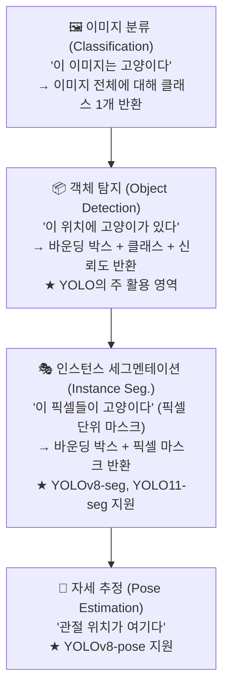
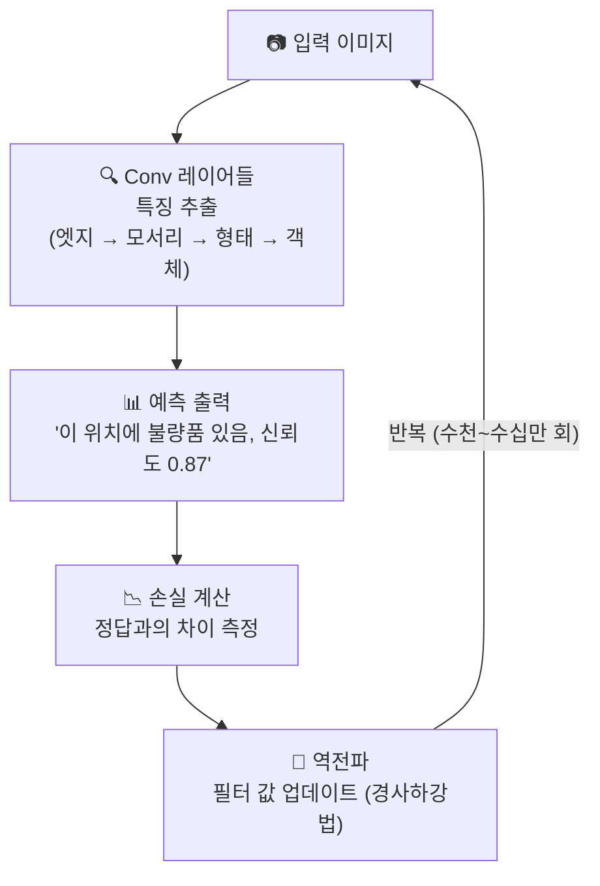
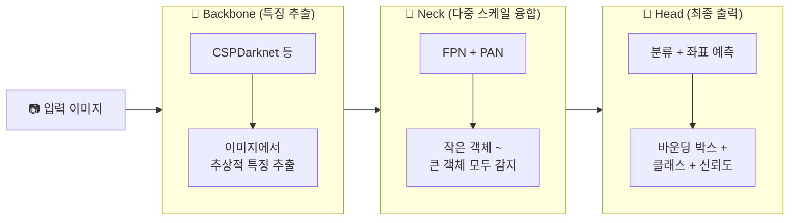
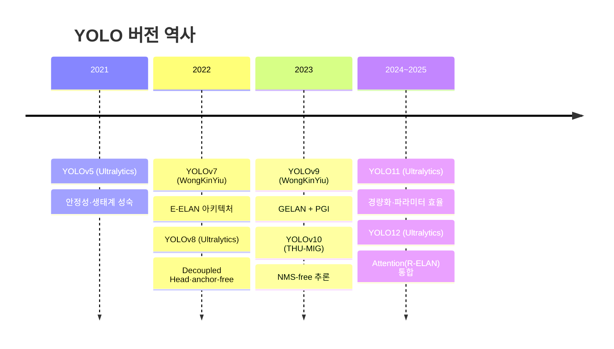
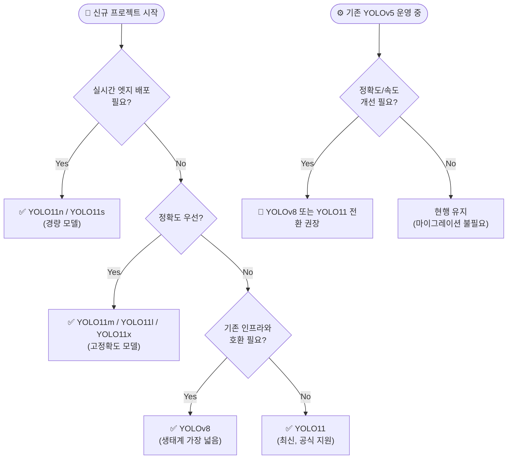
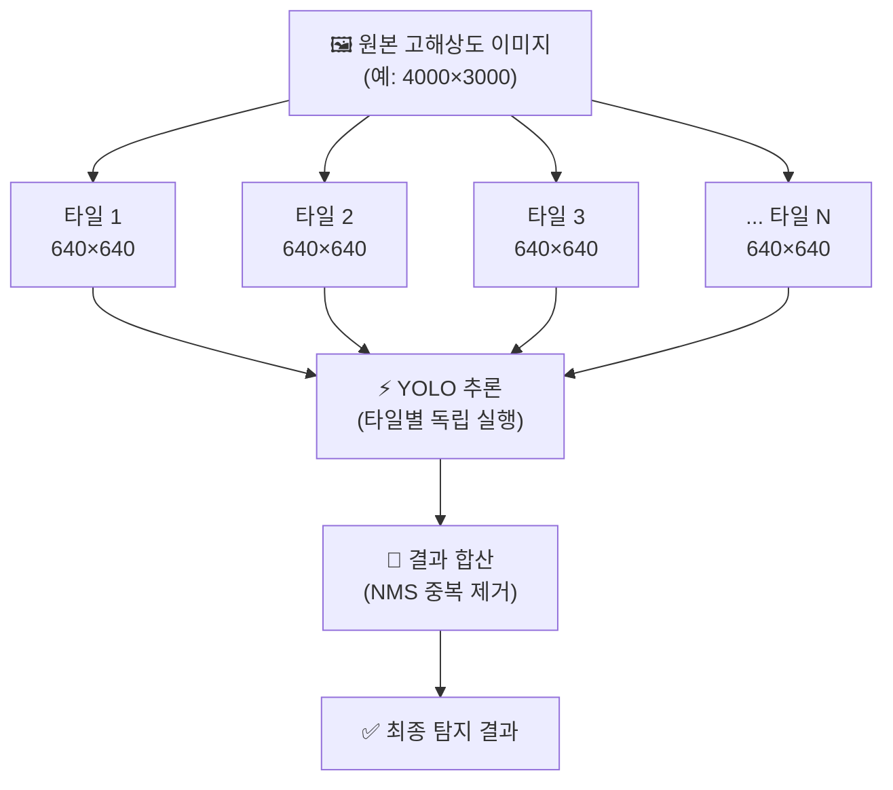

# YOLO 기술 도입 가이드
## SW 경력 개발자를 위한 실무 참조서

> **대상 독자**: AI 비전공 SW 경력 개발자  
> **목적**: 외주 벤더와의 기술 협의, 요구사항 정의, 품질 검수에 필요한 최소 지식 확보  
> **도메인**: 제조업 (전장 부품, 철도차량)

---

## 목차

- [YOLO 기술 도입 가이드](#yolo-기술-도입-가이드)
  - [SW 경력 개발자를 위한 실무 참조서](#sw-경력-개발자를-위한-실무-참조서)
  - [목차](#목차)
  - [1. YOLO란 무엇인가](#1-yolo란-무엇인가)
    - [1.1. 한 줄 정의](#11-한-줄-정의)
    - [1.2. 객체 인식 태스크의 종류](#12-객체-인식-태스크의-종류)
  - [2. CNN과 이미지 학습의 기본 원리](#2-cnn과-이미지-학습의-기본-원리)
    - [2.1. 이미지를 숫자로 본다](#21-이미지를-숫자로-본다)
    - [2.2. 합성곱 신경망 CNN의 작동 방식](#22-합성곱-신경망-cnn의-작동-방식)
    - [2.3. YOLO가 CNN을 사용하는 방법](#23-yolo가-cnn을-사용하는-방법)
  - [3. 학습 데이터의 기본 원리](#3-학습-데이터의-기본-원리)
    - [3.1. 이미지 데이터](#31-이미지-데이터)
    - [3.2. 레이블링 Labeling](#32-레이블링-labeling)
    - [3.3. 마스크 Mask 와 세그멘테이션 Segmentation](#33-마스크-mask-와-세그멘테이션-segmentation)
    - [3.4. 어노테이션 포맷 비교](#34-어노테이션-포맷-비교)
  - [4. YOLO 버전 역사 (최근 5년)](#4-yolo-버전-역사-최근-5년)
    - [4.1. 버전별 주요 변화](#41-버전별-주요-변화)
    - [4.2. 버전 선택 가이드](#42-버전-선택-가이드)
  - [5. YOLO 하드웨어 스펙과 FPS 기준](#5-yolo-하드웨어-스펙과-fps-기준)
    - [5.1. 모델 크기별 성능 비교표](#51-모델-크기별-성능-비교표)
    - [5.2. 하드웨어 환경별 추론 속도](#52-하드웨어-환경별-추론-속도)
    - [5.3. 실시간 기준 FPS 해석](#53-실시간-기준-fps-해석)
  - [6. 프로젝트 도입 시 고려사항](#6-프로젝트-도입-시-고려사항)
    - [6.1. 기술 검토 체크리스트](#61-기술-검토-체크리스트)
    - [6.2. 외주 벤더 검증 포인트](#62-외주-벤더-검증-포인트)
    - [6.3. 리스크와 대응 전략](#63-리스크와-대응-전략)
  - [7. 학습 데이터 준비 — 제조업 기준](#7-학습-데이터-준비--제조업-기준)
    - [7.1. 해상도와 객체 크기의 관계](#71-해상도와-객체-크기의-관계)
    - [7.2. 전장 부품 검사 시나리오](#72-전장-부품-검사-시나리오)
    - [7.3. 철도차량 검사 시나리오](#73-철도차량-검사-시나리오)
    - [7.4. 태스크별 권장 해상도 매트릭스](#74-태스크별-권장-해상도-매트릭스)
  - [8. 용어 목록](#8-용어-목록)

---

## 1. YOLO란 무엇인가

### 1.1. 한 줄 정의

> **YOLO (You Only Look Once)**: 이미지를 한 번 보는 것만으로 화면 안의 객체 위치와 종류를 동시에 출력하는 실시간 딥러닝 객체 인식 모델

SW 개발자 관점에서 비유하자면, YOLO는 이미지를 입력받아 `[{label, x, y, w, h, confidence}, ...]` 형태의 JSON을 반환하는 함수다. 내부 구현이 CNN이고, 그 학습 방식이 딥러닝이다.

### 1.2. 객체 인식 태스크의 종류

AI 비전 태스크는 아래와 같이 계층화된다. YOLO는 주로 Detection과 Segmentation을 수행한다.



---

## 2. CNN과 이미지 학습의 기본 원리

### 2.1. 이미지를 숫자로 본다

컴퓨터는 이미지를 숫자 배열로 처리한다. 640x640 컬러 이미지는 아래와 같이 표현된다.

```
이미지 shape: [3, 640, 640]
               ↑    ↑    ↑
              채널  높이  너비
              (RGB)

각 픽셀 값: 0 ~ 255 (정규화 후 0.0 ~ 1.0)

R 채널 예시 (일부):
[ 120, 130, 128, 125, ... ]
[ 118, 122, 119, 121, ... ]
[ ...                     ]
```

CNN은 이 숫자 배열에서 패턴을 학습한다.

### 2.2. 합성곱 신경망 CNN의 작동 방식

CNN은 이미지 위를 작은 필터(커널)가 슬라이딩하며 특징을 추출한다.

```
원본 이미지 (6x6)        필터 (3x3)           출력 특징맵 (4x4)
+------------------+    +----------+         +------------------+
| 1  2  3  4  5  6 |    | 1  0 -1  |    →    | ...  ...  ...  . |
| 7  8  9 10 11 12 |    | 2  0 -2  |         |  (합성곱 결과)   |
|13 14 15 16 17 18 |    | 1  0 -1  |         | ...  ...  ...  . |
|19 20 21 22 23 24 |    +----------+         +------------------+
|25 26 27 28 29 30 |
|31 32 33 34 35 36 |
+------------------+

필터가 슬라이딩하며 → 엣지, 텍스처, 패턴 등 특징 추출
```

학습 과정은 다음 순서로 반복된다.



### 2.3. YOLO가 CNN을 사용하는 방법

YOLO의 내부 구조는 세 파트로 나뉜다.



```
+-------------------+    +-------------------+    +-------------------+
|    Backbone       | →  |      Neck         | →  |      Head         |
|                   |    |                   |    |                   |
| CSPDarknet 등     |    | FPN + PAN         |    | 분류 + 좌표 예측  |
| (특징 추출)       |    | (다중 스케일 융합)|    | (최종 출력)       |
|                   |    |                   |    |                   |
| 이미지에서        |    | 작은 객체 ~       |    | 바운딩 박스 +     |
| 추상적 특징 추출  |    | 큰 객체 모두 감지 |    | 클래스 + 신뢰도  |
+-------------------+    +-------------------+    +-------------------+
```

**FPN + PAN (Feature Pyramid Network + Path Aggregation Network)**: 서로 다른 해상도의 특징맵을 합쳐 크기가 다른 객체를 동시에 잘 탐지하게 해주는 구조다. 제조업 검사에서 핀 하나(작은 객체)와 PCB 전체(큰 객체)를 동시에 탐지해야 할 때 핵심적인 역할을 한다.

---

## 3. 학습 데이터의 기본 원리

### 3.1. 이미지 데이터

학습용 이미지의 기본 요건은 아래와 같다.

| 항목 | 내용 |
|:-----|:-----|
| 형식 | `.jpg`, `.png`, `.jpeg` (일반적) |
| 권장 해상도 | 640×640 픽셀 (YOLO 기본값) |
| 색 공간 | RGB 3채널 (그레이스케일은 RGB로 변환) |
| 학습 수량 | 클래스당 최소 200장, 권장 1,000장 이상 |
| 데이터 분할 | Train 70% / Validation 20% / Test 10% |

폴더 구조는 다음 형태를 따른다.

```
dataset/
├── images/
│   ├── train/      ← 학습 이미지
│   ├── val/        ← 검증 이미지
│   └── test/       ← 테스트 이미지 (선택)
└── labels/
    ├── train/      ← 이미지와 동일 파일명, .txt 확장자
    ├── val/
    └── test/
```

### 3.2. 레이블링 Labeling

레이블링은 이미지 안의 객체에 위치(바운딩 박스)와 클래스(종류)를 표시하는 작업이다.

**YOLO 레이블 포맷 (.txt):**

```
<class_id> <x_center> <y_center> <width> <height>

예시:
0 0.512 0.334 0.120 0.085
1 0.231 0.678 0.045 0.032

- class_id  : 클래스 번호 (0부터 시작, data.yaml의 names 리스트 인덱스)
- x_center  : 바운딩 박스 중심 X 좌표 (이미지 너비 기준 0.0~1.0 정규화)
- y_center  : 바운딩 박스 중심 Y 좌표 (이미지 높이 기준 0.0~1.0 정규화)
- width     : 바운딩 박스 너비 (이미지 너비 기준 0.0~1.0 정규화)
- height    : 바운딩 박스 높이 (이미지 높이 기준 0.0~1.0 정규화)
```

**바운딩 박스 좌표 계산 예시:**

```
이미지 크기: 800 × 600 픽셀

불량 객체 위치 (픽셀):
  - 좌상단: (160, 120)
  - 너비:   200px
  - 높이:   150px

YOLO 포맷 변환:
  x_center = (160 + 200/2) / 800 = 260 / 800 = 0.325
  y_center = (120 + 150/2) / 600 = 195 / 600 = 0.325
  width    = 200 / 800 = 0.250
  height   = 150 / 600 = 0.250

레이블 파일:
  0 0.325 0.325 0.250 0.250
```

**주요 레이블링 도구:**

| 도구 | 특징 | 적합한 규모 |
|:-----|:-----|:-----------|
| LabelImg | 오픈소스, 무료, YOLO 직접 출력 | 소규모, 직접 작업 |
| Roboflow | 웹 기반, 팀 협업, 자동화 기능 | 중~대규모 |
| CVAT | 오픈소스, 영상·시퀀스 지원 | 중~대규모 |
| Label Studio | 범용 어노테이션 플랫폼 | 범용 |

### 3.3. 마스크 Mask 와 세그멘테이션 Segmentation

바운딩 박스(Detection)와 달리, 세그멘테이션은 객체의 정확한 픽셀 윤곽을 정의한다.

```
Detection (바운딩 박스):        Segmentation (마스크):
+----------------------+        +----------------------+
|                      |        |                      |
|   +-----------+      |        |      ***             |
|   |  [객체]   |      |   →    |     *****            |
|   |           |      |        |    *******           |
|   +-----------+      |        |     *****            |
|                      |        |                      |
+----------------------+        +----------------------+
  직사각형 박스만 표시          픽셀 단위 윤곽 표시

YOLO 세그멘테이션 레이블:
<class_id> <x1> <y1> <x2> <y2> <x3> <y3> ... (다각형 꼭짓점)
```

**사용 시기:**

| 태스크 | Detection | Segmentation |
|:-------|:----------|:-------------|
| 볼트/너트 존재 유무 확인 | 충분 | 과도한 수준 |
| 불규칙 형태 균열 검출 | 부정확 | 적합 |
| 도장 결함 면적 측정 | 어려움 | 필수 |
| 부품 조립 위치 확인 | 충분 | 과도한 수준 |
| 와이어 하네스 경로 추적 | 어려움 | 적합 |

### 3.4. 어노테이션 포맷 비교

외주 업체가 COCO 포맷으로 납품하는 경우가 있다. 포맷 차이를 알아야 검수할 수 있다.

| 항목 | YOLO | COCO |
|:-----|:-----|:-----|
| 파일 형태 | 이미지 1장당 .txt 1개 | 전체 데이터셋 단일 .json |
| 좌표 기준 | 중심 좌표, 정규화 (0~1) | 좌상단 좌표, 픽셀 단위 |
| 클래스 ID 시작 | 0 | 1 |
| 포함 정보 | 좌표, 클래스 | 좌표, 클래스, 메타데이터, 속성 |
| 변환 필요 여부 | — | YOLO 학습 전 변환 필수 |

---

## 4. YOLO 버전 역사 (최근 5년)

### 4.1. 버전별 주요 변화



```
2021                    2022                    2023                    2024~2025
  |                       |                       |                          |
  v                       v                       v                          v
YOLOv5              YOLOv7 / YOLOv8          YOLOv9 / YOLOv10          YOLO11 / YOLO12
(Ultralytics)       (WongKinYiu/             (WongKinYiu/              (Ultralytics)
                     Ultralytics)             THU-MIG)
```


| 버전 | 출시 | 핵심 특징 | 특이사항 |
|:-----|:-----|:----------|:---------|
| YOLOv5 | 2020.6 | 안정성, 생태계 성숙 | 현재도 산업 현장 다수 사용 중 |
| YOLOv7 | 2022.7 | E-ELAN 아키텍처, 고정확도 | 독립 연구팀 (비 Ultralytics) |
| YOLOv8 | 2023.1 | Decoupled Head, anchor-free, 다중 태스크 | Ultralytics 재정비, 표준화 |
| YOLOv9 | 2024.2 | GELAN + PGI (Programmable Gradient Info.) | 학습 효율성 향상 |
| YOLOv10 | 2024.5 | NMS-free 추론, Dual Assignment | 후처리 제거로 지연시간 감소 |
| YOLO11 | 2024.9 | 경량화 강화, 파라미터 효율 향상 | Ultralytics 최신 메인 버전 |
| YOLO12 | 2025.2 | Attention 메커니즘 도입 (R-ELAN) | Transformer 요소 통합 |

**버전 명명 혼란 주의**: YOLOv6은 Meituan(중국 기업) 독자 버전이며, 버전 번호가 여러 연구팀에 의해 독립적으로 붙여지는 구조다. 외주 업체가 "YOLOv6 사용"을 언급하면 어느 팀의 구현체인지 반드시 확인해야 한다.

### 4.2. 버전 선택 가이드



```
신규 프로젝트 시작
       ↓
  실시간 엣지 배포 필요?
  ├── Yes → YOLO11n / YOLO11s (경량)
  └── No  → 정확도 우선?
             ├── Yes → YOLO11m / YOLO11l / YOLO11x
             └── No  → 기존 인프라와 호환?
                        ├── Yes → YOLOv8 (생태계 가장 넓음)
                        └── No  → YOLO11 (최신, Ultralytics 공식 지원)

기존 YOLOv5 운영 중
  → 마이그레이션 필요성 검토
  → 정확도/속도 개선 필요 시 YOLOv8 또는 YOLO11 전환 권장
```

---

## 5. YOLO 하드웨어 스펙과 FPS 기준

### 5.1. 모델 크기별 성능 비교표

YOLO11 기준 (COCO val2017 데이터셋):

| 모델 | 파라미터 | 모델 크기 | mAP50-95 | CPU 추론 (ms) | GPU 추론 (ms) |
|:-----|:--------|:---------|:---------|:-------------|:-------------|
| YOLO11n | 2.6M | ~5 MB | 39.5 | ~56 ms | ~1.5 ms |
| YOLO11s | 9.4M | ~19 MB | 47.0 | ~90 ms | ~2.5 ms |
| YOLO11m | 20.1M | ~40 MB | 51.5 | ~183 ms | ~4.7 ms |
| YOLO11l | 25.3M | ~50 MB | 53.4 | ~238 ms | ~6.2 ms |
| YOLO11x | 56.9M | ~109 MB | 54.7 | ~462 ms | ~11.3 ms |

> **mAP50-95**: 평균 정밀도 (높을수록 정확). 범용 벤치마크 기준이며 특정 도메인(제조업 결함)에서는 Fine-tuning 후 이 수치보다 높거나 낮게 나올 수 있다.

### 5.2. 하드웨어 환경별 추론 속도

YOLOv8m 기준 실측값 (입력 640×640):

| 하드웨어 | 추론 시간 | FPS | 비고 |
|:--------|:---------|:----|:-----|
| NVIDIA RTX 4090 | ~3 ms | ~330 FPS | 고성능 서버 GPU |
| NVIDIA RTX 3080 | ~5 ms | ~200 FPS | 중급 서버/워크스테이션 |
| NVIDIA T4 (클라우드) | ~8 ms | ~125 FPS | 서버 추론용 |
| NVIDIA Jetson Orin | ~15 ms | ~67 FPS | 엣지 AI 보드 |
| NVIDIA Jetson Nano | ~45 ms | ~22 FPS | 저전력 엣지 |
| Intel Core i9 (CPU) | ~120 ms | ~8 FPS | CPU 전용 |
| Raspberry Pi 4 | ~800 ms | ~1 FPS | 실시간 불가 수준 |

> **주의**: 위 수치는 순수 추론 시간이다. 전처리(이미지 로딩, 리사이즈), 후처리(NMS, 좌표 역변환), 통신 지연을 더하면 실제 시스템 처리량은 30~50% 낮아진다.

### 5.3. 실시간 기준 FPS 해석

```
FPS 기준 해석:

1 FPS   → 초당 1장 처리 (실시간 불가, 배치 검사 적합)
10 FPS  → 초당 10장 (슬로우 모션 수준, 느린 컨베이어 가능)
25 FPS  → 초당 25장 (일반 영상과 동일, 대부분의 실시간 요구사항 충족)
30 FPS  → 초당 30장 (국제 영상 표준, 고속 라인 대응 가능)
60 FPS  → 초당 60장 (고속 컨베이어, 고속 카메라 대응)
120+ FPS → 고속 산업 카메라 대응 (특수 목적)

제조업 컨베이어 기준:
- 식품/일반 제조: 20~30 FPS 충분
- 전장 부품 정밀 검사: 30~60 FPS 권장
- 고속 라인 (분당 200개 이상): 60 FPS 이상 + 고속 카메라 필요
```

---

## 6. 프로젝트 도입 시 고려사항

### 6.1. 기술 검토 체크리스트

**[요구사항 정의 단계]**

- [ ] 감지 대상 객체 클래스 목록 확정
  - 예: 스크래치, 핀 누락, 솔더링 불량, 파손 등
- [ ] 허용 오류율 정의
  - 오탐(False Positive): "없는데 있다고 함" 허용 비율
  - 미탐(False Negative): "있는데 없다고 함" 허용 비율
  - **제조업 안전 부품의 경우 미탐율 < 1% 필수**
- [ ] 처리 속도 요구사항 (FPS)
- [ ] 배포 환경 (서버 / 엣지 / 임베디드)
- [ ] 실시간 여부 (라인 인라인 vs 오프라인 배치)

**[학습 데이터 단계]**

- [ ] 수집 가능한 이미지 수량 파악
- [ ] 레이블링 담당자 및 도구 확정
- [ ] 클래스별 데이터 불균형 검토 (희귀 불량은 데이터 부족)
- [ ] 이미지 수집 조건 표준화 (조명, 카메라 각도, 거리)
- [ ] 검수 기준 문서화 (모호한 불량 판정 기준)

**[개발/검증 단계]**

- [ ] Baseline 모델 정확도 측정 (mAP, F1-score)
- [ ] 실제 라인 조건에서 재검증 (조명 변화, 오염, 회전)
- [ ] 추론 속도 실측 (개발 환경 vs 배포 환경 차이 주의)
- [ ] 에지 케이스 테스트 (경계선상 불량, 복수 불량 겹침)

### 6.2. 외주 벤더 검증 포인트

외주 업체에 반드시 요청해야 할 산출물과 확인 사항:

| 확인 항목 | 요청 산출물 | 검증 방법 |
|:---------|:-----------|:---------|
| 학습 데이터 품질 | 레이블링 파일 + 검수 보고서 | 랜덤 샘플링 시각화 확인 |
| 모델 정확도 | 검증 세트 mAP, Precision, Recall, F1 | 고객사 보유 테스트 이미지로 재측정 |
| 클래스별 성능 | per-class AP 표 | 중요 클래스(미탐 위험) 개별 확인 |
| 추론 속도 | 배포 환경 실측 FPS | 실제 하드웨어 직접 측정 |
| 모델 파일 | .pt / .onnx / .engine 형태로 인도 | 로딩 및 추론 직접 실행 |
| 소스코드 | 학습 스크립트, 전처리 코드 | 재현 가능 여부 확인 |

**F1-Score 해석:**

```
F1 = 2 × (Precision × Recall) / (Precision + Recall)

Precision (정밀도) = TP / (TP + FP)
  → "양성이라고 한 것 중 실제 양성 비율"
  → 높으면: 오탐이 적다

Recall (재현율) = TP / (TP + FN)
  → "실제 양성 중 맞게 찾은 비율"
  → 높으면: 미탐이 적다

제조업 안전 부품 기준:
  Recall 우선 (미탐 비용이 오탐 비용보다 훨씬 큼)
  목표: Recall > 0.99, Precision > 0.90 이상
```

### 6.3. 리스크와 대응 전략

| 리스크 | 증상 | 대응 |
|:-------|:-----|:-----|
| 데이터 부족 | 특정 클래스 성능 저조 | 데이터 증강, 추가 수집 계획 수립 |
| 도메인 편향 | 개발 환경에서는 잘 되나 현장에서 안 됨 | 현장 조건 이미지 포함하여 재학습 |
| 조명 변화 | 야간/주간 성능 차이 | 다양한 조명 조건 이미지 필수 포함 |
| 클래스 불균형 | 희귀 불량 미탐 | 언더샘플링/오버샘플링, 손실 함수 가중치 조정 |
| 추론 속도 미달 | 배포 후 FPS 목표 미충족 | 모델 경량화(양자화), 하드웨어 업그레이드, 배치 처리 |
| 모델 버전 고착 | 향후 개선 어려움 | MLflow 등 실험 관리 도구 도입 요구 |

---

## 7. 학습 데이터 준비 — 제조업 기준

### 7.1. 해상도와 객체 크기의 관계

YOLO의 기본 입력 해상도는 640×640이지만, 원본 이미지 해상도와 객체 크기의 비율이 핵심이다.

```
핵심 원칙:
  탐지 대상 객체는 입력 이미지에서 최소 20×20 픽셀 이상이어야 신뢰도 높음

작은 객체 문제:
  원본: 4000×3000 이미지
  YOLO 입력: 640×640으로 리사이즈
  비율: 640/4000 = 0.16

  원본에서 10px짜리 스크래치 → 리사이즈 후 1.6px → 사실상 탐지 불가

해결 방법:
  1. 원본 고해상도 유지 + 슬라이딩 윈도우로 분할 추론
  2. 고배율 렌즈 사용으로 객체를 크게 촬영
  3. YOLO11x 등 고성능 모델 + 1280×1280 입력 해상도 사용
```

**슬라이딩 윈도우 분할 추론:**



```
원본 고해상도 이미지 (4000×3000)
+----------------------------------+
|  [640]  |  [640]  |  [640]  |    |
|         |         |         |    |
|---------|---------|---------|    |
|  [640]  |  [640]  |  [640]  |    |
|         |         |         |    |
|---------|---------|---------|    |
|  ...    |  ...    |  ...    |    |
+----------------------------------+

각 타일을 640×640으로 독립 추론 → 결과 합산 (NMS 처리)
장점: 작은 객체 탐지율 향상
단점: 추론 횟수 증가 (타일 수만큼)
```

> **장점**: 작은 객체 탐지율 향상 | **단점**: 추론 횟수 증가 (타일 수만큼)

### 7.2. 전장 부품 검사 시나리오

**시나리오 A: PCB 솔더링 불량 검사**

```
목표: BGA 볼 누락, 브릿지, 냉납 검출
객체 크기: 수십~수백 마이크론 (광학 확대 필수)

권장 구성:
  카메라:    산업용 라인스캔 또는 에어리어 카메라, 5~20MP
  렌즈:      텔레센트릭 렌즈 (왜곡 최소화)
  조명:      동축 낙사조명 (솔더 광택 균일화)
  해상도:    1920×1920 이상, 픽셀당 5~20 마이크론
  분할 추론: 슬라이딩 윈도우 필수

레이블 클래스 예시:
  0: solder_bridge    (브릿지)
  1: missing_solder   (솔더 누락)
  2: cold_joint       (냉납)
  3: excess_solder    (과잉 솔더)

데이터 수량 권장:
  클래스당 1,000장 이상 (불량 유형 다양성 확보)
  정상품 포함 비율: 전체의 30~40%
```

**시나리오 B: 커넥터/핀 검사**

```
목표: 핀 구부러짐, 핀 누락, 오염 검출
객체 크기: 핀 1개 = 수mm (카메라 거리에 따라 수십~수백 픽셀)

권장 구성:
  카메라:    2~5MP 컬러 또는 모노
  조명:      측면 경사조명 (핀 그림자로 구부러짐 강조)
  해상도:    1280×1280 (핀이 최소 30px 이상 되도록)
  입력 크기: YOLO 640 또는 1280

레이블 클래스 예시:
  0: bent_pin         (핀 구부러짐)
  1: missing_pin      (핀 누락)
  2: contamination    (오염)
  3: normal           (정상 — 선택적 포함)
```

**시나리오 C: 와이어 하네스 검사**

```
목표: 결선 누락, 피복 손상, 라우팅 오류 검출
객체 특성: 선형 객체 (바운딩 박스보다 세그멘테이션 적합)

권장 태스크: YOLOv8-seg 또는 YOLO11-seg
권장 해상도: 1920×1080 (와이어 경로 전체 포착)

레이블 방법:
  - 바운딩 박스: 손상 위치 검출용
  - 세그멘테이션 마스크: 경로 추적, 면적 측정용
```

### 7.3. 철도차량 검사 시나리오

**시나리오 D: 차체 외관 검사 (정기 점검)**

```
목표: 균열, 도장 박리, 부식, 볼트 이완 검출
검사 방식: 정지 상태 또는 저속 통과 (5 km/h 이하)

권장 구성:
  카메라:    라인스캔 카메라 (이동 중 연속 촬영)
             또는 에어리어 카메라 (정지 상태 점검)
  해상도:    4000×3000 이상 (균열 0.1mm 이상 검출)
  조명:      스트로보 조명 (흔들림 방지)
  추론 방식: 오프라인 배치 (실시간 불필요)

레이블 클래스 예시:
  0: crack             (균열)
  1: paint_peel        (도장 박리)
  2: corrosion         (부식)
  3: loose_bolt        (볼트 이완)
  4: dent              (함몰)

해상도 선택 기준:
  - 0.1mm 균열 검출: 픽셀당 < 0.1mm → 10m 차체 폭이면 100,000px 필요
  - 실용적 타협: 분할 촬영 (섹션당 3~5장) + 슬라이딩 윈도우
```

**시나리오 E: 대차/하부 부품 검사**

```
목표: 차축, 제동장치, 스프링, 이물질 끼임 검출
검사 방식: 검사 피트 위 카메라 또는 이동식 로봇

권장 구성:
  카메라:    광각 어안렌즈 (넓은 하부 전체 커버)
             + 줌 카메라 (특정 부위 클로즈업)
  해상도:    4K (3840×2160) 이상
  조명:      LED 패널 조명 (넓은 면적 균일 조명)

태스크 구분:
  탐지(Detection):  이물질, 오염, 볼트 이완
  세그멘테이션:     균열 면적 정량화, 마모 정도 측정

특수 고려사항:
  - 기름때, 먼지로 인한 노이즈 → 전처리 필터링 필요
  - 그림자 변화 → 다양한 조명 조건 학습 이미지 포함
  - 정상 부품 형태 변형 (제조사별 차이) → 클래스 세분화
```

**시나리오 F: 운행 중 실시간 이물질/장애물 감지**

```
목표: 선로 이물질, 신호기, 작업자 검출 (안전 기능)
동작: 실시간 고속 처리 필수

요구 FPS: 30 FPS 이상 (카메라 프레임 기준)
권장 모델: YOLO11s 또는 YOLO11m (속도/정확도 균형)

하드웨어 권장:
  - NVIDIA Jetson Orin NX (엣지 AI)
  - 또는 차량 탑재 서버 (RTX 3060 이상)

해상도: 1920×1080 (30fps 처리 가능, 원거리 객체 탐지 가능)

안전 요구사항:
  Recall > 0.999 (미탐 용납 불가)
  → 임계값(Confidence Threshold) 보수적 설정 필요 (0.3~0.4)
  → 오탐 발생 시 운전자 경고만 (자동 제동은 별도 검증 필요)
```

### 7.4. 태스크별 권장 해상도 매트릭스

| 검사 대상 | 최소 객체 크기 | 권장 원본 해상도 | YOLO 입력 | 추론 방식 | 비고 |
|:---------|:-------------|:--------------|:----------|:---------|:-----|
| PCB 솔더 불량 | 0.05~0.5mm | 10MP+ | 640 (분할) | 슬라이딩 윈도우 | 텔레센트릭 렌즈 |
| 커넥터 핀 | 0.5~3mm | 5MP+ | 640~1280 | 직접 추론 | 측면 조명 |
| 와이어 하네스 | 선폭 1~5mm | 5MP+ | 1280 | 직접 + seg | 세그멘테이션 권장 |
| 철도 차체 균열 | 0.1~5mm | 12MP+ | 640 (분할) | 배치 + 슬라이딩 | 정기 점검 |
| 대차 이물질 | 10mm+ | 4K | 640~1280 | 직접 추론 | 광각 카메라 |
| 선로 장애물 | 100mm+ | FHD | 640 | 실시간 (30fps+) | 안전 기능, 낮은 임계값 |

---

## 8. 용어 목록

| 용어 | 영문 | 설명 |
|:-----|:-----|:-----|
| 객체 탐지 | Object Detection | 이미지에서 객체의 위치(바운딩 박스)와 클래스를 동시에 찾는 태스크 |
| 바운딩 박스 | Bounding Box | 객체를 감싸는 직사각형. (x_center, y_center, width, height)로 표현 |
| 합성곱 신경망 | CNN (Convolutional Neural Network) | 이미지 특징 추출에 특화된 딥러닝 구조 |
| 정밀도 | Precision | 모델이 양성이라 예측한 것 중 실제 양성 비율 |
| 재현율 | Recall | 실제 양성 중 모델이 맞게 찾아낸 비율 |
| mAP | mean Average Precision | 여러 클래스에 대한 평균 정밀도. 객체 탐지 성능 지표 |
| 레이블링 | Labeling / Annotation | 이미지에 클래스와 위치 정보를 표시하는 작업 |
| 세그멘테이션 | Segmentation | 픽셀 단위로 객체 영역을 분리하는 태스크 |
| 앵커프리 | Anchor-Free | 사전 정의된 앵커 박스 없이 직접 좌표를 예측하는 방식. YOLOv8 이후 표준 |
| 정규화 | Normalization | 좌표나 픽셀 값을 0~1 범위로 조정하는 과정 |
| NMS | Non-Maximum Suppression | 동일 객체에 대한 중복 바운딩 박스를 제거하는 후처리 알고리즘 |
| FPS | Frames Per Second | 초당 처리 이미지 수. 실시간 처리 성능 지표 |
| 오탐 | False Positive (FP) | 정상인데 불량이라 판정한 경우 |
| 미탐 | False Negative (FN) | 불량인데 정상이라 판정한 경우 |
| 파인튜닝 | Fine-tuning | 사전학습된 모델을 특정 도메인 데이터로 추가 학습하는 방법 |
| 양자화 | Quantization | 모델 가중치를 FP32에서 INT8 등 낮은 정밀도로 변환해 경량화하는 기법 |
| 슬라이딩 윈도우 | Sliding Window | 고해상도 이미지를 작은 타일로 분할하여 순차 추론하는 방법 |
| 앵커 포인트 | Anchor Point | YOLOv8 이후 각 그리드 셀에서 직접 좌표를 예측하는 기준점 |
| 백본 | Backbone | CNN에서 특징 추출을 담당하는 핵심 네트워크 구조 |
| 넥 | Neck | 백본 출력을 다중 스케일로 융합하는 중간 구조 (FPN+PAN) |
| 헤드 | Head | 최종 클래스 분류 및 좌표 회귀를 담당하는 출력 구조 |
| 데이터 증강 | Data Augmentation | 기존 이미지에 변형(회전, 반전, 밝기 조정 등)을 가해 데이터를 늘리는 기법 |

---

*본 문서는 AI 컨설턴트가 SW 경력 개발자의 외주 벤더 협의 및 기술 검수를 지원하기 위해 작성한 실무 참조서입니다.*  
*YOLO 관련 수치는 공개 벤치마크 기준이며, 실제 도메인 적용 시 재측정이 필요합니다.*