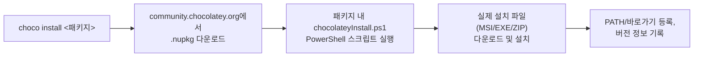
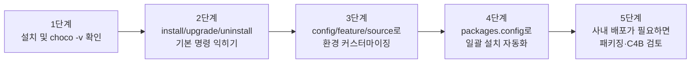

# Chocolatey(choco) 학습 가이드

## 목차

1. [Chocolatey 소개](#1-chocolatey-소개)<br/>
   1.1. [Chocolatey란 무엇인가](#11-chocolatey란-무엇인가)<br/>
   1.2. [작동 원리: NuGet 기반 패키지 매니저](#12-작동-원리-nuget-기반-패키지-매니저)<br/>
   1.3. [에디션 비교 (오픈소스 / Pro / Business)](#13-에디션-비교-오픈소스--pro--business)<br/>

2. [설치](#2-설치)<br/>
   2.1. [사전 요구 사항](#21-사전-요구-사항)<br/>
   2.2. [PowerShell 스크립트로 설치](#22-powershell-스크립트로-설치)<br/>
   2.3. [설치 확인 및 업데이트/삭제](#23-설치-확인-및-업데이트삭제)<br/>

3. [기본 사용법](#3-기본-사용법)<br/>
   3.1. [패키지 검색 (search / list)](#31-패키지-검색-search--list)<br/>
   3.2. [패키지 설치 (install)](#32-패키지-설치-install)<br/>
   3.3. [패키지 업그레이드 (upgrade)](#33-패키지-업그레이드-upgrade)<br/>
   3.4. [패키지 삭제 (uninstall)](#34-패키지-삭제-uninstall)<br/>

4. [주요 옵션과 사용 예](#4-주요-옵션과-사용-예)<br/>
   4.1. [전역 옵션 (-y, --noop, --limit-output 등)](#41-전역-옵션--y---noop---limit-output-등)<br/>
   4.2. [설치/업그레이드 세부 옵션](#42-설치업그레이드-세부-옵션)<br/>
   4.3. [pin으로 특정 버전 고정하기](#43-pin으로-특정-버전-고정하기)<br/>

5. [설정과 소스 관리](#5-설정과-소스-관리)<br/>
   5.1. [choco config](#51-choco-config)<br/>
   5.2. [choco feature](#52-choco-feature)<br/>
   5.3. [choco source (사내/사설 저장소 추가)](#53-choco-source-사내사설-저장소-추가)<br/>

6. [자동화 스크립트 작성](#6-자동화-스크립트-작성)<br/>
   6.1. [packages.config로 일괄 설치](#61-packagesconfig로-일괄-설치)<br/>
   6.2. [choco export로 현재 목록 백업](#62-choco-export로-현재-목록-백업)<br/>
   6.3. [CI/무인 설치 시 유의사항](#63-ci무인-설치-시-유의사항)<br/>

7. [나만의 패키지 만들기 (개요)](#7-나만의-패키지-만들기-개요)<br/>
   7.1. [choco new로 템플릿 생성](#71-choco-new로-템플릿-생성)<br/>
   7.2. [choco pack / choco push](#72-choco-pack--choco-push)<br/>

8. [Chocolatey GUI](#8-chocolatey-gui)<br/>

9. [자주 겪는 문제와 주의 사항](#9-자주-겪는-문제와-주의-사항)<br/>
   9.1. [관리자 권한 필수](#91-관리자-권한-필수)<br/>
   9.2. [PATH 갱신: refreshenv](#92-path-갱신-refreshenv)<br/>
   9.3. [보안: 커뮤니티 저장소의 검증 절차와 한계](#93-보안-커뮤니티-저장소의-검증-절차와-한계)<br/>
   9.4. [v1 → v2 마이그레이션 시 주의점](#94-v1--v2-마이그레이션-시-주의점)<br/>

10. [자주 묻는 질문](#10-자주-묻는-질문)<br/>

11. [결론 및 학습 로드맵](#11-결론-및-학습-로드맵)<br/>

---

## 1. Chocolatey 소개

### 1.1. Chocolatey란 무엇인가

Chocolatey(이하 choco)는 Windows OS용 커맨드 라인 패키지 매니저(command-line package manager, 커맨드라인 패키지 매니저)입니다. Linux의 `apt`/`yum`, macOS의 `brew`처럼, GUI 설치 마법사(Next 클릭, 라이선스 동의, 설치 경로 지정 등)를 거치지 않고 명령어 한 줄로 소프트웨어를 설치·업데이트·삭제할 수 있게 해줍니다.

2011년 첫 공개된 이후 꾸준히 개발되어, 2023년 말 **Chocolatey CLI v2.0.0**이 출시되며 성능과 안정성이 크게 개선되었고, 2026년 중반 현재 v2.x 라인이 주력 버전으로 유지보수되고 있습니다. 커뮤니티 저장소(Community Repository)에는 10,000개 이상의 패키지가 등록되어 있습니다.

### 1.2. 작동 원리: NuGet 기반 패키지 매니저

choco 패키지는 `.nupkg`라는 NuGet 패키지 형식으로 배포됩니다. 각 패키지는 PowerShell 스크립트(`chocolateyInstall.ps1` 등)를 포함하고 있으며, 이 스크립트가 실제 설치 파일(MSI, EXE, ZIP 등)을 다운로드하거나 압축을 풀어 시스템에 배치하는 역할을 합니다.



> **검토 의견**: choco 자체는 "패키지 메타데이터 + 설치 스크립트"를 표준화한 배포 계층일 뿐, 실제 설치 로직은 각 패키지 관리자(패키지를 등록한 커뮤니티 기여자)가 작성한 PowerShell 스크립트에 의존합니다. 즉 apt처럼 저장소 전체가 한 조직에서 빌드·서명하는 구조가 아니라, 커뮤니티 기여형 구조라는 점을 이해하고 있어야 9.3절에서 다루는 보안 주의사항이 왜 필요한지 납득이 됩니다.

### 1.3. 에디션 비교 (오픈소스 / Pro / Business)

| 항목 | Chocolatey CLI (오픈소스) | Chocolatey Pro | Chocolatey for Business (C4B) |
|------|---------------------------|-----------------|-------------------------------|
| 대상 | 개인 사용자 | 개인 사용자(향상된 기능) | 조직/기업 |
| 비용 | 무료 | 유료(개인 라이선스) | 유료(조직 라이선스) |
| 핵심 기능 | 패키지 설치/업그레이드/삭제 | 백그라운드 모드, 런타임 악성코드 검사 등 | 사내 패키지 저장소, 중앙 관리(Central Management), 패키지 내부 관리 도구, SIEM 연동 등 |
| 조직 내 사용 | 가능(단, Pro는 조직 사용 불가) | 개인 용도로 제한 | 조직 전체 배포 목적 |

> **검토 의견**: 개인 학습·홈랩 용도라면 오픈소스 CLI만으로 충분합니다. 회사에서 수백 대의 PC에 소프트웨어를 표준화해서 배포해야 하는 상황이 아니라면 Pro/C4B를 급하게 검토할 필요는 없습니다.

---

## 2. 설치

### 2.1. 사전 요구 사항

- **OS**: Windows 7 SP1 / Windows Server 2008 R2 이상 (Windows 10/11, Server 2016 이상 권장)
- **PowerShell**: v2 이상 (v5.1 이상 권장)
- **.NET Framework**: Chocolatey CLI v2.0.0부터 **.NET Framework 4.8**이 필요합니다. 설치 스크립트가 감지 시 자동으로 설치를 시도하지만, 사전에 .NET Framework 4.8을 설치하고 재부팅한 뒤 진행하는 것이 가장 매끄럽습니다.
- **실행 정책(Execution Policy)**: 기본 정책이 `Restricted`이면 설치 스크립트가 차단되므로, 아래 설치 명령에서 `-ExecutionPolicy Bypass`를 함께 지정합니다.

> ⚠️ **중요**: 모든 `choco` 명령어는 **관리자 권한으로 실행한 PowerShell**에서 사용해야 합니다. (자세한 내용은 9.1절 참고)

### 2.2. PowerShell 스크립트로 설치

**관리자 권한 PowerShell**에서 아래 공식 설치 명령을 실행합니다.

```powershell
Set-ExecutionPolicy Bypass -Scope Process -Force; `
[System.Net.ServicePointManager]::SecurityProtocol = [System.Net.ServicePointManager]::SecurityProtocol -bor 3072; `
iex ((New-Object System.Net.WebClient).DownloadString('https://community.chocolatey.org/install.ps1'))
```

각 구문의 역할은 다음과 같습니다.

| 구문 | 역할 |
|------|------|
| `Set-ExecutionPolicy Bypass -Scope Process -Force` | 현재 PowerShell 프로세스에서만 스크립트 실행 제한을 우회(시스템 전역 정책은 변경하지 않음) |
| `SecurityProtocol ... -bor 3072` | TLS 1.2를 강제 활성화(구형 .NET/Windows에서 TLS 1.0/1.1만 기본 활성화된 경우 다운로드 실패 방지) |
| `iex (... DownloadString(...))` | 공식 설치 스크립트(`install.ps1`)를 다운로드해 즉시 실행 |

**대안 설치 경로**

```powershell
# WinGet이 이미 있는 환경 (Windows 10 1709+/11)
winget install --id=chocolatey.chocolatey -e

# 오프라인/사내망(인터넷 직접 접근 불가) 환경
# 1) 인터넷이 되는 PC에서 choco install.ps1과 필요한 .nupkg를 미리 내려받아
# 2) 내부 파일 공유 또는 choco source add로 등록한 사내 NuGet 저장소를 통해 배포
```

> **검토 의견**: 회사 방화벽/프록시 환경에서는 `iex` 한 줄 설치가 `community.chocolatey.org` 접근이 막혀 실패하는 경우가 흔합니다. 이때는 `install.ps1`을 프록시 설정과 함께 실행하거나(`$env:chocolateyProxyLocation` 환경 변수 설정), 사내에 미러링된 NuGet 피드를 구성하는 것이 정석입니다. 개인 PC라면 WinGet 경로가 가장 마찰이 적습니다.

### 2.3. 설치 확인 및 업데이트/삭제

```powershell
choco -v          # 또는 choco --version
```

버전 번호(예: `2.5.0`)가 출력되면 설치가 정상 완료된 것입니다. 설치 직후에는 PowerShell 창을 새로 열어야 `choco` 명령이 PATH에 반영됩니다.

```powershell
# Chocolatey 자체 업데이트
choco upgrade chocolatey -y

# 삭제 (완전 제거는 %ChocolateyInstall% 폴더도 직접 삭제해야 함)
choco uninstall chocolatey -y
```

> **주의**: choco 자체를 제거해도 `C:\ProgramData\chocolatey` 폴더와 이미 설치된 프로그램들은 자동으로 지워지지 않습니다. 완전한 초기화가 필요하다면 별도로 해당 폴더를 정리해야 합니다.

---

## 3. 기본 사용법

### 3.1. 패키지 검색 (search / list)

```powershell
choco search <검색어>          # 커뮤니티 저장소에서 원격 검색
choco search googlechrome
choco list --local-only        # 현재 시스템에 choco로 설치된 패키지 목록
choco list -lo                 # 위 명령의 축약형
```

> **v2 변경 사항**: v1.x에서는 `choco list`가 옵션 없이도 원격 저장소를 검색했지만, **v2.0.0부터 `choco list`는 기본적으로 로컬 전용**으로 동작합니다. 원격 검색은 반드시 `choco search`를 사용해야 합니다.

### 3.2. 패키지 설치 (install)

```powershell
choco install <패키지명> -y
choco install googlechrome vscode git -y      # 여러 패키지 동시 설치
choco install nodejs --version=20.11.0        # 특정 버전 지정
```

`-y`(`--yes`, `--confirm`) 옵션은 설치 중 뜨는 확인 질문(스크립트 실행 동의 등)을 모두 자동 승인합니다.

### 3.3. 패키지 업그레이드 (upgrade)

```powershell
choco upgrade <패키지명> -y                 # 특정 패키지 업그레이드
choco upgrade all -y                        # 설치된 모든 패키지 일괄 업그레이드
choco upgrade all -y --except="python,git"  # 특정 패키지는 업그레이드 대상에서 제외
choco outdated                              # 업그레이드 가능한(오래된) 패키지 목록만 조회
```

패키지가 아직 설치되어 있지 않은 상태에서 `upgrade`를 실행하면, choco는 이를 신규 설치로 처리합니다.

### 3.4. 패키지 삭제 (uninstall)

```powershell
choco uninstall <패키지명> -y
choco uninstall vscode -y
choco uninstall vscode -y --remove-dependencies   # 함께 설치된 의존 패키지도 제거
```

---

## 4. 주요 옵션과 사용 예

### 4.1. 전역 옵션 (-y, --noop, --limit-output 등)

| 옵션 | 축약형 | 설명 |
|------|--------|------|
| `--yes` | `-y` | 확인 질문 자동 승인 |
| `--help` | `-h`, `-?` | 도움말 출력 |
| `--debug` | `-d` | 디버그 로그 출력 |
| `--verbose` | `-v` | 상세 로그 출력 |
| `--noop` | `--whatif` | 실제로 아무것도 실행하지 않고 무슨 일이 일어날지만 출력(드라이런) |
| `--limit-output` | `-r` | 스크립트/CI 파싱에 적합한 최소 출력 형식 |
| `--force` | `-f` | 이미 설치된 패키지도 강제로 재설치 |
| `--timeout=<초>` | `-t` | 명령 실행 제한 시간(초) 지정 |

```powershell
choco install firefox -y --noop     # 실제 설치 전 미리보기
choco upgrade all -y -r             # CI 파이프라인에서 파싱하기 쉬운 형태로 출력
```

### 4.2. 설치/업그레이드 세부 옵션

```powershell
choco install 7zip -y --params="'/InstallDir:C:\Tools\7zip'"   # 패키지별 설치 파라미터 전달
choco install nodejs -y --ignore-checksums                     # 체크섬 검증 생략(권장하지 않음)
choco install python -y --install-arguments="'/quiet'"         # 내부 설치 프로그램에 인자 전달
choco upgrade all -y --fail-on-unfound                         # 저장소에서 찾을 수 없는 패키지가 있으면 실패 처리
```

> **검토 의견**: `--ignore-checksums`는 패키지 관리자가 제공한 체크섬 검증을 건너뛰는 옵션으로, 신뢰할 수 없는 소스에서는 절대 사용하지 않는 것이 좋습니다. 사내 미러 저장소처럼 체크섬 메타데이터가 갱신되지 않은 특수한 상황에서만 제한적으로 고려합니다.

### 4.3. pin으로 특정 버전 고정하기

특정 패키지가 `choco upgrade all` 실행 시 자동으로 업그레이드되지 않도록 고정할 수 있습니다. 예를 들어 사내 표준 Node.js 버전을 유지해야 할 때 유용합니다.

```powershell
choco pin add -n nodejs                 # nodejs 패키지를 현재 버전에 고정
choco pin list                          # 고정된 패키지 목록 확인
choco pin remove -n nodejs              # 고정 해제
choco outdated --ignore-pinned          # 고정된 패키지는 오래된 목록에서 제외하고 조회
```

---

## 5. 설정과 소스 관리

### 5.1. choco config

전역 설정 값을 조회·변경합니다. 설정은 `%ChocolateyInstall%\config\chocolatey.config`(기본값: `C:\ProgramData\chocolatey\config\chocolatey.config`) 파일에 저장됩니다.

```powershell
choco config list                                     # 전체 설정 조회
choco config get cacheLocation                        # 특정 설정값 조회
choco config set cacheLocation "D:\choco-cache"        # 다운로드 캐시 위치 변경
choco config set commandExecutionTimeoutSeconds 5400   # 명령 실행 타임아웃 조정
choco config unset proxy                               # 설정 해제(기본값으로 복원)
```

### 5.2. choco feature

특정 기능(feature flag)을 켜고 끕니다.

```powershell
choco feature list                                    # 사용 가능한 feature 목록과 활성화 여부 확인
choco feature enable -n allowGlobalConfirmation       # 모든 명령에서 -y 없이도 자동 승인(스크립트 자동화용)
choco feature disable -n showDownloadProgress         # 다운로드 진행률 표시 끄기(CI 로그 정리용)
choco feature enable -n useRememberedArgumentsForUpgrades  # upgrade 시 install에 썼던 옵션 자동 재사용
```

> **검토 의견**: `allowGlobalConfirmation`을 켜두면 스크립트에서 매번 `-y`를 붙이지 않아도 되어 편하지만, 반대로 실수로 실행한 `choco uninstall all` 같은 명령도 확인 없이 즉시 실행되므로 개인 PC에서는 신중히 사용하는 것이 좋습니다.

### 5.3. choco source (사내/사설 저장소 추가)

기본적으로 choco는 `https://community.chocolatey.org/api/v2/` 하나만 소스로 등록되어 있습니다. 사내 NuGet 피드나 폴더 공유를 추가 소스로 등록할 수 있습니다.

```powershell
choco source list                                                  # 등록된 소스 목록
choco source add -n="internal" -s="\\fileserver\choco-packages"    # 사내 파일 공유를 소스로 추가
choco source add -n="nexus" -s="https://nexus.internal/repository/choco/" -u="user" -p="pass"
choco source disable -n="community"                                # 공식 커뮤니티 소스 비활성화
choco source remove -n="internal"                                  # 소스 제거
```

---

## 6. 자동화 스크립트 작성

### 6.1. packages.config로 일괄 설치

여러 패키지를 XML 목록 하나로 관리하면, 새 PC를 세팅할 때 파일 하나만 공유해도 동일한 환경을 재현할 수 있습니다.

```xml
<?xml version="1.0" encoding="utf-8"?>
<packages>
  <package id="git" />
  <package id="vscode" />
  <package id="googlechrome" />
  <package id="7zip" />
  <package id="nodejs-lts" version="20.11.0" />
</packages>
```

```powershell
choco install packages.config -y
```

### 6.2. choco export로 현재 목록 백업

```powershell
choco export                          # 현재 설치된 패키지를 packages.config로 내보내기 (기본 경로: 현재 디렉터리)
choco export --output=backup.config --include-version-numbers
```

새 PC에서 `choco install backup.config -y`를 실행하면 이전 PC와 동일한 패키지·버전 구성을 재현할 수 있습니다.

### 6.3. CI/무인 설치 시 유의사항

```powershell
choco install <패키지> -y --no-progress -r --timeout=600
```

- `--no-progress`: 다운로드 진행률 표시를 생략해 CI 로그를 깔끔하게 유지
- `-r`(`--limit-output`): 파싱하기 쉬운 최소 출력
- `--timeout`: 사내망/느린 회선에서 타임아웃으로 실패하는 것을 방지하기 위해 넉넉히 설정
- 무인 설치 환경에서는 `choco feature enable -n allowGlobalConfirmation`을 먼저 실행해두면 `-y`를 누락해도 안전합니다.

---

## 7. 나만의 패키지 만들기 (개요)

사내 전용 소프트웨어나 커뮤니티에 없는 도구를 choco 패키지로 만들어 배포할 수도 있습니다.

### 7.1. choco new로 템플릿 생성

```powershell
choco new mypackage
```

`mypackage/` 폴더에 `mypackage.nuspec`(패키지 메타데이터)과 `tools/chocolateyInstall.ps1`(실제 설치 로직) 템플릿이 생성됩니다. `chocolateyInstall.ps1`에서 `Install-ChocolateyPackage`, `Install-ChocolateyZipPackage` 같은 헬퍼 함수로 실제 설치 파일을 내려받아 배치하는 로직을 작성합니다.

### 7.2. choco pack / choco push

```powershell
choco pack mypackage.nuspec              # .nupkg 파일로 패키징
choco push mypackage.1.0.0.nupkg --source="https://push.chocolatey.org/" --api-key="<API 키>"   # 커뮤니티 저장소 업로드
choco push mypackage.1.0.0.nupkg --source="\\fileserver\choco-packages"  # 사내 저장소 업로드
```

> **검토 의견**: 커뮤니티 저장소에 올리는 패키지는 자동/수동 검수(moderation) 절차를 거치므로 승인까지 시간이 걸릴 수 있습니다. 사내에서만 쓸 목적이라면 굳이 공개 저장소에 올리지 말고 5.3절의 사내 소스로 바로 push하는 편이 빠르고 안전합니다.

---

## 8. Chocolatey GUI

CLI가 익숙하지 않은 사용자나 설치 현황을 시각적으로 보고 싶을 때는 GUI 프런트엔드를 별도로 설치할 수 있습니다.

```powershell
choco install chocolateygui -y
```

설치된 패키지 목록 확인, 업그레이드, 설치/삭제를 창 하나에서 클릭으로 처리할 수 있습니다. 다만 GUI 역시 내부적으로는 choco CLI를 호출하는 방식이므로, 사내 자동화나 스크립팅에는 여전히 CLI 사용을 권장합니다.

---

## 9. 자주 겪는 문제와 주의 사항

### 9.1. 관리자 권한 필수

대부분의 `choco install`/`upgrade`/`uninstall`은 프로그램 파일 설치 경로, 레지스트리, PATH 환경 변수를 건드리므로 **관리자 권한 PowerShell**이 필요합니다. 일반 권한으로 실행하면 "Access is denied" 오류가 발생합니다.

### 9.2. PATH 갱신: refreshenv

choco로 새 프로그램을 설치한 직후, 같은 PowerShell 창에서는 방금 설치한 실행 파일이 PATH에 반영되지 않아 "command not found"가 나올 수 있습니다.

```powershell
refreshenv          # 현재 세션의 환경 변수를 레지스트리 값으로 다시 로드
```

또는 PowerShell 창을 새로 열면 동일하게 해결됩니다.

### 9.3. 보안: 커뮤니티 저장소의 검증 절차와 한계

Chocolatey 커뮤니티 저장소에 올라오는 패키지는 자동 검사(바이러스 스캔, 설치 스크립트 정적 분석)와 일부 수동 검수를 거치지만, apt/Homebrew의 공식 저장소만큼 중앙화된 빌드·서명 체계는 아닙니다. 신뢰할 수 없는 개인이 유지보수하는 패키지도 존재할 수 있으므로, 다음을 권장합니다.

- 가능하면 **공식 벤더가 직접 관리하는 패키지**(다운로드 수, 최종 업데이트일, 유지관리자 확인)를 우선 선택
- 사내 환경에서는 5.3절처럼 검증된 패키지만 미러링한 **내부 저장소**를 우선 소스로 사용
- `--ignore-checksums` 같은 검증 우회 옵션은 특별한 이유가 없다면 사용하지 않음

### 9.4. v1 → v2 마이그레이션 시 주의점

Chocolatey CLI v2.0.0(2023년 말 출시)부터 다음 변경 사항이 적용되었으므로, 오래된 문서나 스크립트를 참고할 때 주의가 필요합니다.

| 변경 사항 | 내용 |
|-----------|------|
| `choco list` 기본 동작 | v1: 원격 검색 가능 → v2: 기본적으로 로컬 전용(원격은 `choco search`) |
| 구버전 alias 제거 | `chocolatey`, `cinst`, `clist`, `cpush`, `cuninst`, `cup` 단축 명령 제거 |
| `.NET Framework` 요구 버전 | 4.0 이상 → **4.8** 필수 |
| `choco apikey` 문법 | `--remove` 옵션 제거, `add`/`remove`/`list` 서브커맨드로 재편 |
| 버전 번호 표기 | NuGet의 최신 SemVer 규칙에 맞춰 일부 버전 문자열이 정규화되어 표시 |

---

## 10. 자주 묻는 질문

**Q. choco와 winget 중 무엇을 써야 하나요?**
A. winget은 Microsoft가 공식 관리하는 도구로 Windows 10/11에 기본 내장되어 있고, choco는 훨씬 방대한 커뮤니티 패키지(10,000개 이상)와 세밀한 설치 옵션, 사내 배포 기능(C4B)을 제공합니다. 둘은 병행 사용 가능하며, 개인 PC 최신 앱 설치는 winget, 세밀한 버전 고정·사내 표준화·자동화 스크립팅이 필요하면 choco가 유리합니다.

**Q. 오프라인(인터넷 차단) 환경에서도 쓸 수 있나요?**
A. 가능합니다. 인터넷이 되는 PC에서 필요한 `.nupkg`를 미리 받아 사내 파일 공유나 사설 NuGet 피드에 올리고, 각 PC의 choco 소스를 그 경로로 등록(5.3절)하면 됩니다.

**Q. 패키지 설치 위치를 바꿀 수 있나요?**
A. 패키지별로 지원하는 파라미터가 다릅니다. `choco install <패키지> --params="'/InstallDir:C:\원하는\경로'"`처럼 패키지가 노출한 파라미터를 사용해야 하며, 모든 패키지가 경로 변경을 지원하는 것은 아닙니다.

---

## 11. 결론 및 학습 로드맵



1. **설치 및 기본 명령 확인**: `choco -v`, `choco install`, `choco upgrade all -y`로 손에 익히기
2. **자주 쓰는 프로그램 목록화**: 새 PC 세팅 시 매번 설치하는 프로그램을 정리해 `packages.config`로 저장
3. **옵션과 pin 익히기**: `--noop`으로 먼저 미리보기 하는 습관, 표준 버전이 필요한 패키지는 `pin`으로 고정
4. **설정 커스터마이징**: 캐시 위치, 타임아웃, feature 플래그를 팀 환경에 맞게 조정
5. **필요 시 사내 배포로 확장**: 팀/조직 규모로 커지면 사내 소스 구성 또는 C4B 도입 검토

### 참고 자료

- 공식 문서: [https://docs.chocolatey.org/](https://docs.chocolatey.org/)
- 설치 가이드: [https://docs.chocolatey.org/en-us/choco/setup/](https://docs.chocolatey.org/en-us/choco/setup/)
- 명령어 전체 목록: [https://docs.chocolatey.org/en-us/choco/commands/](https://docs.chocolatey.org/en-us/choco/commands/)
- v2.0.0 변경 사항: [https://docs.chocolatey.org/en-us/choco/new-in-v2/](https://docs.chocolatey.org/en-us/choco/new-in-v2/)
- 커뮤니티 패키지 저장소: [https://community.chocolatey.org/packages](https://community.chocolatey.org/packages)
- GitHub 저장소: [https://github.com/chocolatey/choco](https://github.com/chocolatey/choco)
- 에디션 비교: [https://chocolatey.org/compare](https://chocolatey.org/compare)
