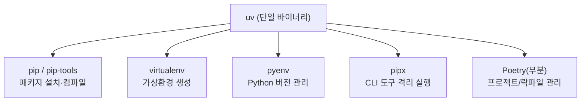
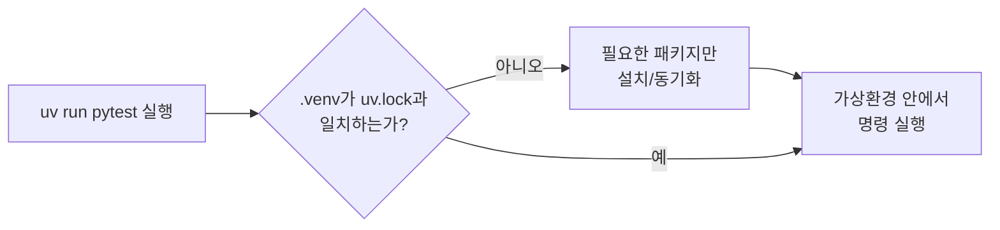

# uv 학습 가이드

## 목차

1. [uv 소개](#1-uv-소개)<br/>
   1.1. [uv란 무엇인가](#11-uv란-무엇인가)<br/>
   1.2. [기존 도구(pip, poetry, pyenv 등)와의 차이점](#12-기존-도구pip-poetry-pyenv-등와의-차이점)<br/>
   1.3. [왜 uv를 써야 하는가](#13-왜-uv를-써야-하는가)<br/>

2. [uv 설치](#2-uv-설치)<br/>
   2.1. [Windows, macOS, Linux 설치 방법](#21-windows-macos-linux-설치-방법)<br/>
   2.2. [WinGet, Scoop, PowerShell 스크립트 설치](#22-winget-scoop-powershell-스크립트-설치)<br/>
   2.3. [설치 확인 (uv --version)](#23-설치-확인-uv---version)<br/>

3. [기본 사용법](#3-기본-사용법)<br/>
   3.1. [프로젝트 초기화 (uv init)](#31-프로젝트-초기화-uv-init)<br/>
   3.2. [패키지 추가/삭제 (uv add, uv remove)](#32-패키지-추가삭제-uv-add-uv-remove)<br/>
   3.3. [개발 의존성 관리 (uv add --dev)](#33-개발-의존성-관리-uv-add---dev)<br/>

4. [가상환경 관리](#4-가상환경-관리)<br/>
   4.1. [자동 생성되는 .venv](#41-자동-생성되는-venv)<br/>
   4.2. [uv run으로 실행하는 이유](#42-uv-run으로-실행하는-이유)<br/>
   4.3. [전역 Python vs uv 환경 비교](#43-전역-python-vs-uv-환경-비교)<br/>

5. [Python 버전 관리](#5-python-버전-관리)<br/>
   5.1. [특정 버전 설치 (uv python install 3.12)](#51-특정-버전-설치-uv-python-install-312)<br/>
   5.2. [버전 고정 (uv python pin)](#52-버전-고정-uv-python-pin)<br/>
   5.3. [여러 버전 병행 사용](#53-여러-버전-병행-사용)<br/>

6. [스크립트 실행](#6-스크립트-실행)<br/>
   6.1. [uv run python script.py](#61-uv-run-pythonscriptpy)<br/>
   6.2. [인라인 의존성 실행](#62-인라인-의존성-실행)<br/>
   6.3. [pytest 실행 (uv run pytest)](#63-pytest-실행-uv-run-pytest)<br/>

7. [CLI 도구 실행](#7-cli-도구-실행)<br/>
   7.1. [pipx 대체 (uvx black, uv tool install ruff)](#71-pipx-대체-uvx-black-uv-tool-install-ruff)<br/>
   7.2. [도구 관리 및 업데이트](#72-도구-관리-및-업데이트)<br/>

8. [워크스페이스 관리](#8-워크스페이스-관리)<br/>
   8.1. [다중 패키지 프로젝트 구조](#81-다중-패키지-프로젝트-구조)<br/>
   8.2. [Cargo 스타일 워크스페이스](#82-cargo-스타일-워크스페이스)<br/>

9. [옵션 및 고급 기능](#9-옵션-및-고급-기능)<br/>
   9.1. [--reinstall, --dev, --upgrade 옵션](#91---reinstall---dev---upgrade-옵션)<br/>
   9.2. [글로벌 캐시 활용](#92-글로벌-캐시-활용)<br/>
   9.3. [CI/CD 환경에서 uv 사용](#93-cicd-환경에서-uv-사용)<br/>

10. [심플 예제](#10-심플-예제)<br/>
    10.1. [FastAPI 프로젝트 초기화 및 실행](#101-fastapi-프로젝트-초기화-및-실행)<br/>
    10.2. [pytest로 테스트 실행](#102-pytest로-테스트-실행)<br/>
    10.3. [ruff/mypy 같은 개발 도구 설치 및 실행](#103-ruffmypy-같은-개발-도구-설치-및-실행)<br/>

11. [자주 묻는 질문](#11-자주-묻는-질문)<br/>
    11.1. [pip와의 호환성](#111-pip와의-호환성)<br/>
    11.2. [requirements.txt vs uv.lock](#112-requirementstxt-vs-uvlock)<br/>
    11.3. [Rust toolchain 필요 여부](#113-rust-toolchain-필요-여부)<br/>

12. [결론 및 학습 로드맵](#12-결론-및-학습-로드맵)<br/>
    12.1. [uv를 익히는 단계별 학습 순서](#121-uv를-익히는-단계별-학습-순서)<br/>
    12.2. [기존 프로젝트 마이그레이션 방법](#122-기존-프로젝트-마이그레이션-방법)<br/>
    12.3. [uv 커뮤니티 및 문서 참고 링크](#123-uv-커뮤니티-및-문서-참고-링크)<br/>

---

## 1. uv 소개

### 1.1. uv란 무엇인가

uv는 Ruff, ty를 만든 Astral 사가 Rust로 작성한 Python 패키지·프로젝트 관리 도구(package and project manager, 패키지 앤 프로젝트 매니저)입니다. 2024년 2월 pip/pip-tools의 대체제로 처음 공개된 뒤, 2024~2026년에 걸쳐 Python 버전 설치, 가상환경(virtual environment, 버추얼 인바이런먼트), 락파일(lockfile, 락파일), 워크스페이스(workspace, 워크스페이스), 도구 실행까지 아우르는 종합 프로젝트 매니저로 확장되었습니다.



2026년 중반 기준 GitHub 스타 84,000개 이상을 기록했고, PyPI·Homebrew·자체 설치 스크립트를 합쳐 월 수억 건의 다운로드가 발생하는 등, 사실상 Python 생태계의 표준 도구로 자리잡는 중입니다.

### 1.2. 기존 도구(pip, poetry, pyenv 등)와의 차이점

| 항목 | uv | pip | Poetry | pyenv |
|------|----|----|--------|-------|
| 구현 언어 | Rust (단일 바이너리) | Python | Python | Shell |
| Python 자체 설치 | 지원 (`uv python install`) | 미지원 | 미지원 | 지원 (주 목적) |
| 가상환경 생성 | 자동 (`.venv` 자동 생성/동기화) | 별도 도구 필요 | 자동 생성 | 미지원 (venv와 조합 필요) |
| 락파일 | `uv.lock` (플랫폼 독립적 universal lock) | 없음 (pip-tools 필요) | `poetry.lock` | 없음 |
| 워크스페이스(모노레포) | 지원 (Cargo 스타일) | 없음 | 미지원 | 없음 |
| CLI 도구 격리 실행 | 지원 (`uvx`, `uv tool`) | 없음 | 없음 | 없음 |
| 설치 속도(콜드 인스톨 기준) | 매우 빠름(수 초) | 느림 | 중간 | 해당 없음 |
| pip 호환 인터페이스 | 제공 (`uv pip ...`) | 원본 | 부분적 | 해당 없음 |

> **검토 의견**: 표만 보면 uv가 4개 도구를 모두 대체하는 것처럼 보이지만, 실제로는 "겹치는 기능을 하나의 바이너리로 통합"한 것에 가깝습니다. 즉 Poetry의 플러그인 생태계나 pyenv의 오래된 사내 스크립트 호환성처럼 uv에 없는 기능도 있으므로, 신규 프로젝트는 uv로 시작하고 이미 잘 굴러가는 Poetry 프로젝트는 굳이 급하게 옮길 필요는 없습니다.

### 1.3. 왜 uv를 써야 하는가

- **속도**: 콜드 인스톨(cold install, 콜드 인스톨) 기준 uv는 약 3초, Poetry는 약 11초, pip-tools는 약 33초 수준으로 벤치마크되며, 일반적으로 pip 대비 10~100배, Poetry 대비 약 10배 빠릅니다. Rust로 작성된 리졸버(resolver, 리졸버)와 전역 캐시(global cache, 글로벌 캐시)가 핵심 요인입니다.
- **단일 바이너리**: Python 부트스트랩이 필요 없는 하나의 실행 파일이므로, "이 스크립트를 돌리려면 먼저 Python부터 설치해야 한다"는 닭과 달걀 문제가 사라집니다.
- **일관된 락파일**: `uv.lock` 하나로 여러 플랫폼(Windows/macOS/Linux)에 대해 동일한 재현성(reproducibility, 리프로듀서빌리티)을 보장합니다. pip-tools의 `requirements.txt`는 플랫폼별로 따로 컴파일해야 하는 것과 대조적입니다.
- **디스크 효율**: 전역 캐시로 의존성을 중복 없이 공유하므로, 프로젝트가 많아져도 디스크 사용량이 선형적으로 늘지 않습니다.
- **점진적 도입 가능**: pip 호환 인터페이스(`uv pip install` 등)를 제공하므로 기존 워크플로우를 유지하면서 부분적으로 도입할 수 있습니다.

> **검토 의견**: "빠르다"는 점이 가장 많이 홍보되지만, 실무에서 체감되는 진짜 이점은 CI 파이프라인의 반복적인 의존성 설치 시간이 단축되고, 팀원마다 pyenv/venv/pip 조합이 제각각이던 로컬 환경 문제가 `uv sync` 한 줄로 해소된다는 점입니다. 속도는 부가 효과이고, "환경 재현성의 표준화"가 진짜 채택 이유라고 보는 편이 정확합니다.

---

## 2. uv 설치

### 2.1. Windows, macOS, Linux 설치 방법

**macOS / Linux — 독립 설치 스크립트**

```bash
curl -LsSf https://astral.sh/uv/install.sh | sh
```

**Windows — PowerShell 스크립트**

```powershell
powershell -ExecutionPolicy ByPass -c "irm https://astral.sh/uv/install.ps1 | iex"
```

**macOS — Homebrew**

```bash
brew install uv
```

**모든 OS — pipx / pip (Python이 이미 있는 경우)**

```bash
pipx install uv
# 또는
pip install uv
```

**Docker**

```bash
docker pull ghcr.io/astral-sh/uv
```

### 2.2. WinGet, Scoop, PowerShell 스크립트 설치

**WinGet**

```powershell
winget install --id=astral-sh.uv -e
```

**Scoop**

```powershell
scoop install main/uv
```

**Cargo (Rust 툴체인이 이미 있는 경우)**

```bash
cargo install --locked uv
```

> **검토 의견**: Windows 사용자는 WinGet 설치를 기본으로 권장합니다. 앱 업데이트가 `winget upgrade`로 통합 관리되고, 관리자 권한 문제도 적기 때문입니다. 회사 정책상 WinGet이 막혀 있다면 PowerShell 설치 스크립트가 차선책입니다.

**업데이트 / 삭제**

```bash
# 독립 설치 스크립트로 설치한 경우
uv self update

# pip/pipx로 설치한 경우
pip install --upgrade uv

# 캐시 정리
uv cache clean
```

### 2.3. 설치 확인 (uv --version)

```bash
uv --version
```

정상적으로 설치되었다면 `uv 0.11.x` 형태의 버전 문자열이 출력됩니다. 쉘 자동완성이 필요하면 다음과 같이 설정합니다.

```bash
uv generate-shell-completion bash   # zsh, fish, elvish, powershell 도 지원
```

---

## 3. 기본 사용법

### 3.1. 프로젝트 초기화 (uv init)

```bash
uv init my-project
cd my-project
```

`uv init`은 다음과 같은 최소 구조를 생성합니다.

```
my-project/
├── .python-version
├── pyproject.toml
├── README.md
└── main.py
```

`pyproject.toml`은 프로젝트의 메타데이터와 의존성을 정의하는 표준 파일입니다.

```toml
[project]
name = "my-project"
version = "0.1.0"
requires-python = ">=3.12"
dependencies = []
```

### 3.2. 패키지 추가/삭제 (uv add, uv remove)

```bash
uv add requests            # 의존성 추가 + pyproject.toml 갱신 + uv.lock 갱신 + 동기화
uv add "fastapi>=0.110"    # 버전 제약 지정
uv remove requests         # 의존성 제거
```

`uv add`를 실행하면 내부적으로 다음 순서가 일어납니다.

1. `pyproject.toml`의 `dependencies`에 패키지 추가
2. 의존성 그래프를 다시 풀어 `uv.lock` 갱신
3. `.venv`에 실제 패키지 설치(동기화)

### 3.3. 개발 의존성 관리 (uv add --dev)

테스트, 린터처럼 배포에는 포함되지 않는 개발 전용 의존성은 `--dev` 옵션으로 분리합니다.

```bash
uv add --dev pytest ruff mypy
```

`pyproject.toml`에는 별도의 `[dependency-groups]` (또는 `[tool.uv]` 하위)로 기록되어, 운영 배포 시 이 그룹을 제외하고 설치할 수 있습니다.

```bash
uv sync --no-dev   # 운영 배포용: 개발 의존성 제외하고 동기화
```

---

## 4. 가상환경 관리

### 4.1. 자동 생성되는 .venv

uv는 프로젝트 루트에서 `uv add`, `uv sync`, `uv run` 중 어떤 명령을 실행하든 `.venv` 디렉터리를 자동으로 찾거나 생성합니다. `python -m venv`를 직접 실행할 필요가 없습니다.

```bash
uv venv          # .venv를 명시적으로 생성하고 싶을 때만 사용
uv sync          # pyproject.toml/uv.lock 기준으로 .venv를 최신 상태로 동기화
```

### 4.2. uv run으로 실행하는 이유

`uv run <command>`는 명령을 실행하기 전에 항상 가상환경이 락파일과 일치하는지 확인하고, 필요하면 자동으로 동기화한 뒤 실행합니다. 즉 "가상환경 활성화(activate) → 실행" 2단계를 사람이 잊어버릴 걱정이 없습니다.



이 덕분에 "내 컴퓨터에서는 되는데" 문제가 크게 줄어듭니다. `.venv`를 활성화(`source .venv/bin/activate`)하지 않고도 항상 프로젝트에 정의된 정확한 의존성 버전으로 실행되기 때문입니다.

> **검토 의견**: 초심자는 습관적으로 `.venv`를 활성화한 뒤 `python script.py`를 실행하려는 경향이 있는데, uv 프로젝트에서는 이 습관을 버리고 `uv run` 을 기본 실행 방식으로 삼는 것이 좋습니다. 활성화를 잊어서 전역 Python 패키지를 잘못 참조하는 사고를 원천 차단할 수 있습니다.

### 4.3. 전역 Python vs uv 환경 비교

| 구분 | 전역 Python 직접 사용 | uv 프로젝트 환경 |
|------|----------------------|-------------------|
| 패키지 설치 위치 | 시스템/사용자 site-packages | 프로젝트별 `.venv` |
| 버전 충돌 위험 | 높음(여러 프로젝트가 공유) | 낮음(프로젝트마다 격리) |
| 재현성 | 낮음(수동 관리) | 높음(`uv.lock` 기반) |
| 실행 방법 | `python script.py` | `uv run script.py` |
| 활성화 필요 여부 | 필요(가상환경 사용 시) | 불필요(자동 처리) |
| 팀 공유 | `requirements.txt` 수동 관리 | `uv.lock` 커밋으로 자동 공유 |

---

## 5. Python 버전 관리

### 5.1. 특정 버전 설치 (uv python install 3.12)

```bash
uv python install 3.12       # 특정 마이너 버전 설치
uv python install 3.12.4     # 특정 패치 버전까지 지정
uv python list                # 설치 가능/설치된 버전 목록
uv python find 3.11           # 설치된 3.11 버전의 실제 경로 확인
uv python uninstall 3.10      # 특정 버전 삭제
```

시스템에 Python이 전혀 없어도, uv가 필요한 버전을 자동으로 다운로드하여 사용합니다. pyenv처럼 별도 빌드 도구(Xcode Command Line Tools, build-essential 등)를 준비할 필요가 없습니다.

### 5.2. 버전 고정 (uv python pin)

```bash
uv python pin 3.12
```

프로젝트 루트에 `.python-version` 파일이 생성/갱신되며, 이후 해당 디렉터리에서 실행되는 모든 `uv` 명령은 이 버전을 기준으로 동작합니다.

### 5.3. 여러 버전 병행 사용

uv는 여러 Python 버전을 서로 다른 디렉터리에 나란히 설치해 두므로, 프로젝트별로 다른 버전을 동시에 사용할 수 있습니다.

```bash
uv run --python 3.10 script.py   # 이번 실행만 3.10 사용
uv venv --python 3.9              # 3.9 기반 가상환경 별도 생성
```

`.python-version` 파일과 명령행의 `--python` 옵션이 동시에 있으면 명령행 옵션이 우선합니다.

---

## 6. 스크립트 실행

### 6.1. uv run python script.py

프로젝트(pyproject.toml)가 없는 단일 파일 스크립트도 바로 실행할 수 있습니다.

```bash
uv run example.py
```

가상환경이 없으면 임시 환경을 만들어 실행하므로, 별도 설정 없이 즉시 시작할 수 있습니다.

### 6.2. 인라인 의존성 실행

PEP 723 인라인 스크립트 메타데이터(inline script metadata, 인라인 스크립트 메타데이터)를 이용하면, 스크립트 파일 하나에 필요한 의존성까지 함께 담을 수 있습니다.

```bash
uv add --script example.py "requests<3" "rich"
```

위 명령을 실행하면 스크립트 상단에 다음과 같은 메타데이터 블록이 자동 삽입됩니다.

```python
# /// script
# requires-python = ">=3.12"
# dependencies = [
#   "requests<3",
#   "rich",
# ]
# ///

import requests
from rich.pretty import pprint
```

이후 `uv run example.py`만 실행하면, uv가 메타데이터를 읽고 필요한 패키지를 임시 환경에 설치한 뒤 실행합니다. 다른 사람에게 스크립트 파일 하나만 전달해도 동일하게 재현됩니다.

> **검토 의견**: 이 기능은 "간단한 자동화 스크립트를 위해 매번 프로젝트를 만들기는 부담스럽다"는 문제를 정확히 해결합니다. 사내 배치 스크립트, 1회성 데이터 처리 스크립트에 특히 유용하며, `.py` 파일 하나를 Slack이나 Git으로 공유해도 의존성이 함께 따라갑니다.

### 6.3. pytest 실행 (uv run pytest)

프로젝트에 pytest가 개발 의존성으로 등록되어 있다면 다음과 같이 실행합니다.

```bash
uv add --dev pytest
uv run pytest
uv run pytest tests/ -v
```

`uv run`이 실행 전 자동으로 `.venv`를 동기화하므로, `pytest`가 설치되어 있는지 미리 확인할 필요가 없습니다.

---

## 7. CLI 도구 실행

### 7.1. pipx 대체 (uvx black, uv tool install ruff)

`uvx`는 `uv tool run`의 축약형으로, 도구를 프로젝트에 설치하지 않고 격리된 임시 환경에서 즉시 실행합니다. pipx의 `pipx run`과 동일한 역할입니다.

```bash
uvx black .              # black을 설치하지 않고 바로 실행
uvx ruff check .
uvx --python 3.11 ruff   # 특정 Python 버전으로 실행
uvx --from httpie http   # 실행 파일 이름이 패키지명과 다를 때
```

자주 쓰는 도구는 영구 설치해두는 편이 실행 속도 면에서 유리합니다.

```bash
uv tool install ruff
uv tool install 'httpie>0.1.0'
uv tool install mkdocs --with mkdocs-material   # 부가 의존성 함께 설치
```

### 7.2. 도구 관리 및 업데이트

```bash
uv tool list                 # 설치된 도구 목록
uv tool upgrade ruff         # 특정 도구만 업그레이드
uv tool upgrade --all        # 설치된 모든 도구 업그레이드
uv tool uninstall ruff       # 도구 삭제
uv tool update-shell         # PATH에 도구 설치 경로 등록
```

| 구분 | pipx | uvx / uv tool |
|------|------|----------------|
| 별도 설치 필요 여부 | pip으로 별도 설치 필요 | uv 안에 내장 |
| 임시 실행 | `pipx run <tool>` | `uvx <tool>` |
| 영구 설치 | `pipx install <tool>` | `uv tool install <tool>` |
| 실행 속도 | 보통 | 캐시 활용으로 더 빠름 |

---

## 8. 워크스페이스 관리

### 8.1. 다중 패키지 프로젝트 구조

여러 개의 서로 연관된 패키지(예: 공용 라이브러리 + API 서버 + 배치 작업)를 하나의 Git 저장소에서 관리해야 할 때, uv 워크스페이스를 사용하면 패키지별 `pyproject.toml`은 유지하면서 락파일은 하나로 통합할 수 있습니다.

```
albatross/
├── packages/
│   ├── bird-feeder/
│   │   ├── pyproject.toml
│   │   └── src/bird_feeder/
│   └── seeds/
│       ├── pyproject.toml
│       └── src/seeds/
├── pyproject.toml      # 루트(root) 패키지이자 워크스페이스 정의
├── uv.lock              # 워크스페이스 전체가 공유하는 단일 락파일
└── src/albatross/
```

### 8.2. Cargo 스타일 워크스페이스

루트 `pyproject.toml`에 `[tool.uv.workspace]` 테이블을 선언합니다.

```toml
[tool.uv.workspace]
members = ["packages/*"]
exclude = ["packages/seeds"]
```

워크스페이스 멤버 간 의존성은 `[tool.uv.sources]`에서 `workspace = true`로 연결하면, 별도 배포 없이도 로컬 소스가 편집 가능한(editable, 에디터블) 상태로 참조됩니다.

```toml
[tool.uv.sources]
bird-feeder = { workspace = true }
```

특정 멤버만 대상으로 명령을 실행할 때는 `--package` 옵션을 사용합니다.

```bash
uv run --package bird-feeder pytest
```

| 항목 | uv 워크스페이스 | Poetry |
|------|----------------|--------|
| 모노레포 지원 | 기본 제공 | 미지원(서드파티 플러그인 필요) |
| 락파일 | 워크스페이스 전체 공유 1개 | 패키지별 개별 관리 |
| 멤버 간 의존 | `workspace = true`로 자동 editable | 수동 path 의존성 설정 |

> **검토 의견**: 워크스페이스는 "패키지가 2개 이상이고, 서로 강하게 의존한다"는 조건이 맞을 때만 도입 가치가 있습니다. 서로 요구사항이 크게 다른(예: 한쪽은 Python 3.9 고정, 다른 쪽은 3.12) 패키지를 억지로 한 워크스페이스에 묶으면 오히려 락파일 충돌이 잦아지므로, 이 경우엔 별도 저장소나 path 의존성 방식이 낫습니다.

---

## 9. 옵션 및 고급 기능

### 9.1. --reinstall, --dev, --upgrade 옵션

```bash
uv sync --reinstall           # 캐시를 무시하고 모든 패키지를 강제로 재설치
uv add --dev pytest           # 개발 의존성으로 추가
uv sync --no-dev              # 개발 의존성을 제외하고 동기화(운영 배포용)
uv lock --upgrade             # 모든 의존성을 제약 범위 내 최신 버전으로 갱신
uv lock --upgrade-package requests   # 특정 패키지만 최신 버전으로 갱신
```

### 9.2. 글로벌 캐시 활용

uv는 다운로드한 패키지(wheel, 소스 배포본)를 사용자 홈 디렉터리 아래 전역 캐시에 저장하고, 프로젝트마다 하드링크/CoW(copy-on-write, 카피 온 라이트)로 재사용합니다. 같은 패키지를 여러 프로젝트에서 써도 디스크에는 한 벌만 저장됩니다.

```bash
uv cache dir      # 캐시 위치 확인
uv cache clean    # 캐시 전체 삭제
uv cache prune    # 더 이상 참조되지 않는 캐시 항목만 정리
```

### 9.3. CI/CD 환경에서 uv 사용

GitHub Actions에서는 공식 `astral-sh/setup-uv` 액션을 사용하는 것이 가장 간단합니다.

```yaml
- name: Install uv
  uses: astral-sh/setup-uv@v8
  with:
    enable-cache: true

- name: Install the project
  run: uv sync --locked --all-extras --dev

- name: Run tests
  run: uv run pytest tests
```


- `--locked` 옵션은 `uv.lock`이 `pyproject.toml`과 어긋나 있으면 CI를 실패시켜, 락파일 갱신을 깜빡한 채 커밋하는 실수를 잡아냅니다.
- 여러 Python 버전을 매트릭스로 테스트할 때는 `setup-uv`의 `python-version` 입력을 매트릭스 변수와 연결합니다.
- 캐시를 직접 관리할 경우 `UV_CACHE_DIR` 환경 변수를 `actions/cache`의 대상 경로로 지정하고, 잡 마지막에 `uv cache prune --ci`로 불필요한 항목을 제거해 캐시 용량을 줄입니다.

---

## 10. 심플 예제

### 10.1. FastAPI 프로젝트 초기화 및 실행

```bash
uv init fastapi-demo
cd fastapi-demo
uv add fastapi "uvicorn[standard]"
```

`main.py`:

```python
from fastapi import FastAPI

app = FastAPI()

@app.get("/")
def read_root():
    return {"message": "Hello, uv!"}
```

```bash
uv run uvicorn main:app --reload
```

`uv run`이 실행 전 `.venv`를 자동 동기화하므로, `uv add` 이후 별도의 활성화 단계 없이 바로 서버가 기동됩니다.

### 10.2. pytest로 테스트 실행

```bash
uv add --dev pytest httpx
```

`tests/test_main.py`:

```python
from fastapi.testclient import TestClient
from main import app

client = TestClient(app)

def test_read_root():
    response = client.get("/")
    assert response.status_code == 200
    assert response.json() == {"message": "Hello, uv!"}
```

```bash
uv run pytest -v
```

### 10.3. ruff/mypy 같은 개발 도구 설치 및 실행

프로젝트에 고정해서 쓸 도구는 개발 의존성으로 추가하는 편이 팀원 간 버전을 일치시키기 좋습니다.

```bash
uv add --dev ruff mypy
uv run ruff check .
uv run ruff format .
uv run mypy .
```

가끔 한 번만 돌려보는 도구라면 프로젝트에 추가하지 않고 `uvx`로 바로 실행해도 됩니다.

```bash
uvx ruff check .
```

---

## 11. 자주 묻는 질문

### 11.1. pip와의 호환성

uv는 `uv pip install`, `uv pip list`, `uv pip freeze` 같은 pip 호환 서브커맨드를 제공하며, 대부분의 기본 워크플로우는 그대로 동작합니다. 다만 다음과 같은 차이가 있습니다.

- pip의 설정 파일(`pip.conf`)과 `PIP_*` 환경 변수를 읽지 않습니다. `uv.toml` 또는 `UV_*` 환경 변수를 사용해야 합니다.
- 기본적으로 `.venv`를 찾아 사용하며, 시스템 Python에 설치하려면 `--system` 옵션을 명시해야 합니다.
- 여러 인덱스(index)를 지정한 경우, pip은 모든 인덱스의 버전을 합쳐 비교하지만 uv는 첫 번째로 패키지를 찾은 인덱스에서 멈춥니다(의존성 컨퓨전 공격 방지). pip과 동일하게 동작시키려면 `--index-strategy unsafe-best-match`를 사용합니다.
- 사전 릴리즈(pre-release) 버전은 명시적으로 `--prerelease allow`를 지정해야 설치됩니다.
- `--user` 옵션, `.egg` 배포본은 지원하지 않습니다.

### 11.2. requirements.txt vs uv.lock

| 구분 | requirements.txt | uv.lock |
|------|-------------------|---------|
| 형식 | 평문 패키지 목록 | uv 전용 TOML 형식 |
| 플랫폼 대응 | 플랫폼별로 따로 생성 필요 | 하나의 파일이 모든 플랫폼 커버(universal lock) |
| 해시 검증 | 선택적(`pip-compile --generate-hashes`) | 기본 포함 |
| 사람이 직접 수정 | 흔함 | 권장하지 않음(자동 생성 파일) |
| 다른 도구와의 호환 | 매우 넓음(pip 표준) | uv 전용, 필요 시 내보내기 가능 |

기존 pip 기반 배포 파이프라인과의 호환이 필요하면 다음처럼 내보낼 수 있습니다.

```bash
uv export --format requirements-txt > requirements.txt
```

> **검토 의견**: `uv.lock`은 사람이 직접 편집하는 파일이 아니라 Git에 커밋만 하는 "재현성 스냅샷"으로 다루는 것이 맞습니다. requirements.txt는 uv 생태계 밖(예: Docker 베이스 이미지가 pip만 지원하는 경우)과의 호환을 위한 산출물로만 사용하고, 실제 의존성 관리의 원본은 항상 `pyproject.toml` + `uv.lock` 조합으로 유지하는 편이 혼란이 적습니다.

### 11.3. Rust toolchain 필요 여부

일반 사용자는 Rust 툴체인을 설치할 필요가 없습니다. uv는 각 OS/아키텍처별로 미리 컴파일된 단일 바이너리로 배포되며, 설치 스크립트·WinGet·Scoop·Homebrew·pip/pipx 모두 이 바이너리를 내려받을 뿐입니다.

Rust 툴체인이 필요한 경우는 다음 두 가지뿐입니다.

- `cargo install --locked uv`로 소스 빌드 설치를 선택한 경우
- uv 자체의 소스 코드를 수정하여 기여(contribute)하는 경우

---

## 12. 결론 및 학습 로드맵

### 12.1. uv를 익히는 단계별 학습 순서


1. **설치 및 기본 명령 확인**: `uv --version`, `uv init`, `uv add`, `uv run`으로 손에 익히기
2. **토이 프로젝트 실습**: 10장의 FastAPI 예제처럼 작은 프로젝트를 처음부터 끝까지 만들어 보기
3. **Python 버전 관리 익히기**: `uv python install/pin`으로 여러 버전을 오가는 연습
4. **도구 워크플로우 구축**: ruff/mypy/pytest 등 상시 사용하는 도구를 `--dev` 의존성 또는 `uv tool install`로 정리
5. **기존 프로젝트 마이그레이션**: 아래 12.2절 절차로 실제 업무 프로젝트에 적용
6. **팀/CI 확장**: 워크스페이스, GitHub Actions 연동으로 팀 전체 표준화

### 12.2. 기존 프로젝트 마이그레이션 방법

**requirements.txt 기반 프로젝트**

```bash
uv init --no-readme            # 기존 디렉터리에 pyproject.toml만 생성
uv add -r requirements.txt     # requirements.txt 내용을 의존성으로 가져오기
uv add -r requirements-dev.txt --dev
```

**Poetry 기반 프로젝트**

```bash
# pyproject.toml의 [tool.poetry.dependencies]를 참고하여
uv add <패키지1> <패키지2> ...
uv add --dev <개발용 패키지들>
```

Poetry의 `[tool.poetry]` 섹션은 PEP 621 표준 `[project]` 섹션과 형식이 다르므로 자동 변환 도구보다는, 의존성 목록만 옮기고 `pyproject.toml`은 uv 표준 형식으로 다시 작성하는 편이 이후 유지보수가 편합니다.

**pyenv + venv 조합 프로젝트**

```bash
uv python pin 3.11        # pyenv의 .python-version 대신 uv가 관리
uv venv                   # 기존 venv를 대체
uv sync
```

> **검토 의견**: 마이그레이션은 한 번에 팀 전체를 전환하기보다, 신규 프로젝트부터 uv로 시작하고 기존 프로젝트는 CI 파이프라인에서 `uv pip install -r requirements.txt`처럼 호환 인터페이스로 먼저 얹어보는 점진적 접근을 권장합니다. 락파일 형식 전환은 되돌리기 어렵지 않지만, 팀원 전체의 로컬 환경을 한 번에 바꾸는 것은 항상 마찰이 따르기 때문입니다.

### 12.3. uv 커뮤니티 및 문서 참고 링크

- 공식 문서: [https://docs.astral.sh/uv/](https://docs.astral.sh/uv/)
- GitHub 저장소: [https://github.com/astral-sh/uv](https://github.com/astral-sh/uv)
- 변경 이력(Changelog): [https://github.com/astral-sh/uv/blob/main/CHANGELOG.md](https://github.com/astral-sh/uv/blob/main/CHANGELOG.md)
- 릴리즈 노트: [https://github.com/astral-sh/uv/releases](https://github.com/astral-sh/uv/releases)
- Astral 블로그(uv 소개 글): [https://astral.sh/blog/uv](https://astral.sh/blog/uv)
- GitHub Actions 연동 가이드: [https://docs.astral.sh/uv/guides/integration/github/](https://docs.astral.sh/uv/guides/integration/github/)

---

## 참고 자료

- 공식 문서: [https://docs.astral.sh/uv/](https://docs.astral.sh/uv/)
- GitHub: [https://github.com/astral-sh/uv](https://github.com/astral-sh/uv)
- Features 가이드: [https://docs.astral.sh/uv/getting-started/features/](https://docs.astral.sh/uv/getting-started/features/)
- 설치 가이드: [https://docs.astral.sh/uv/getting-started/installation/](https://docs.astral.sh/uv/getting-started/installation/)
- 스크립트 실행 가이드: [https://docs.astral.sh/uv/guides/scripts/](https://docs.astral.sh/uv/guides/scripts/)
- 도구 실행 가이드: [https://docs.astral.sh/uv/guides/tools/](https://docs.astral.sh/uv/guides/tools/)
- 워크스페이스 개념: [https://docs.astral.sh/uv/concepts/projects/workspaces/](https://docs.astral.sh/uv/concepts/projects/workspaces/)
- pip 호환성 문서: [https://docs.astral.sh/uv/pip/compatibility/](https://docs.astral.sh/uv/pip/compatibility/)
