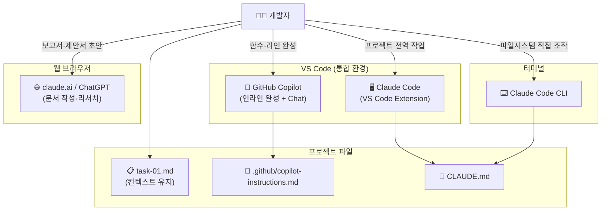
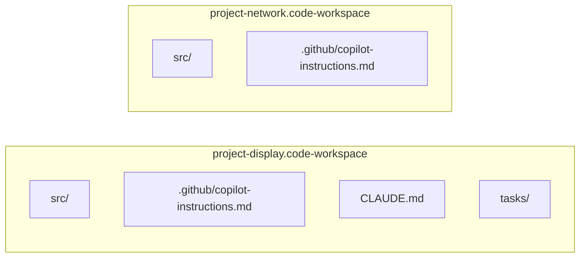
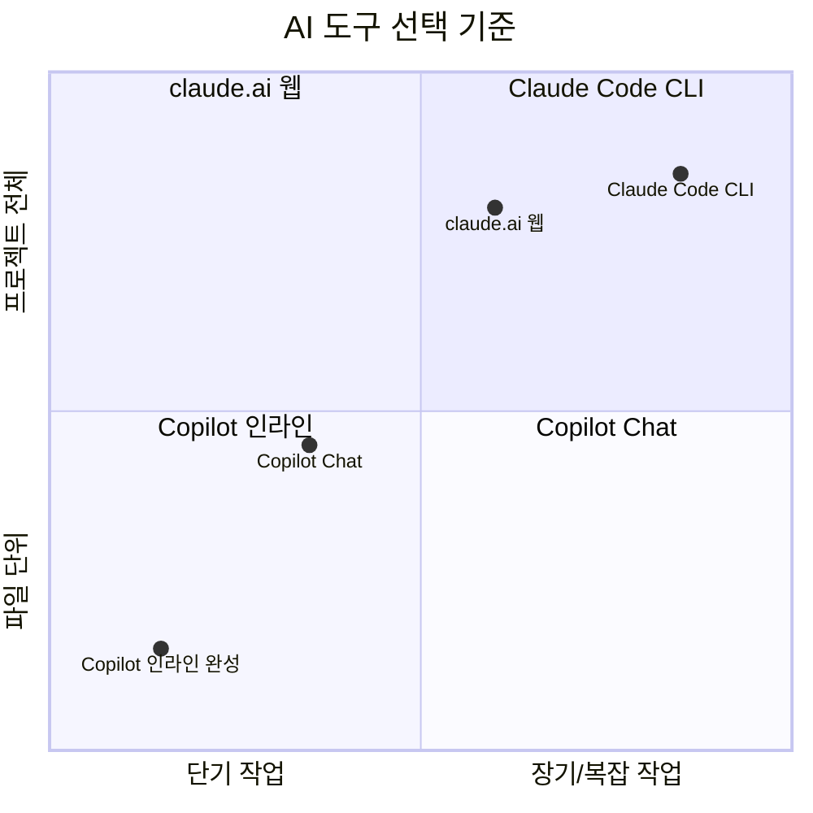
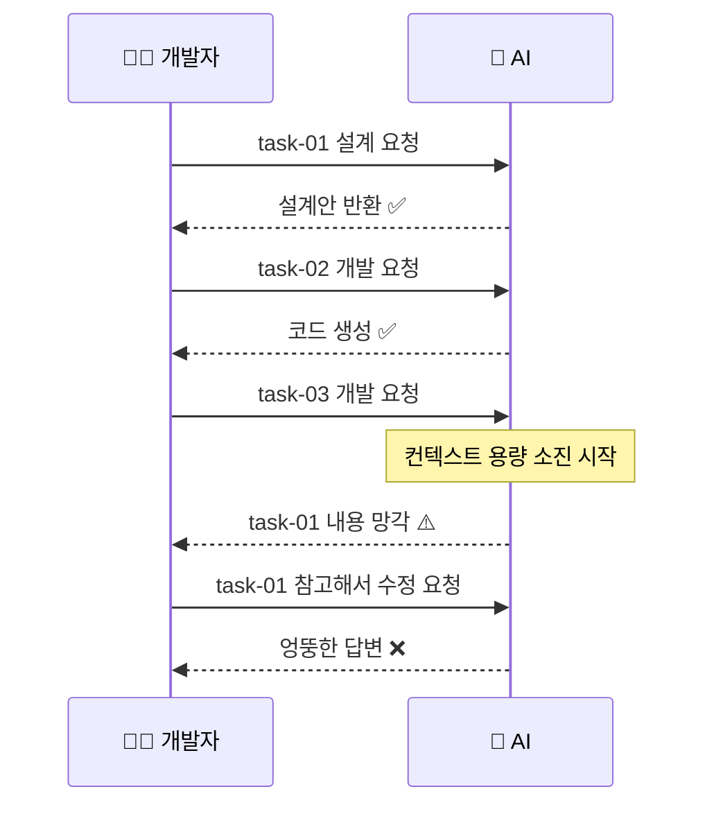
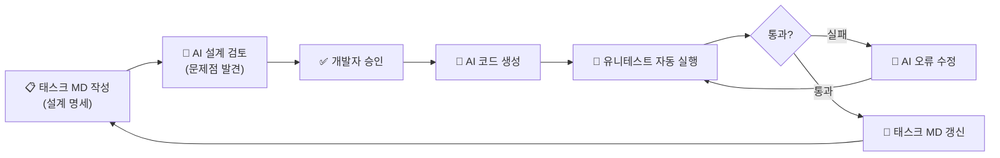
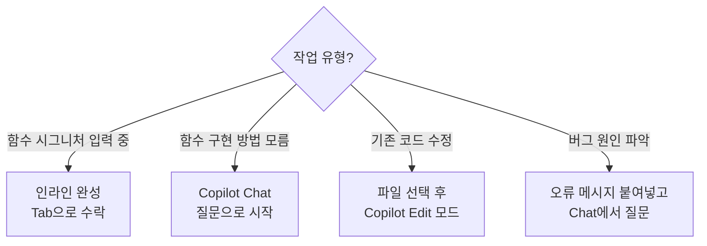
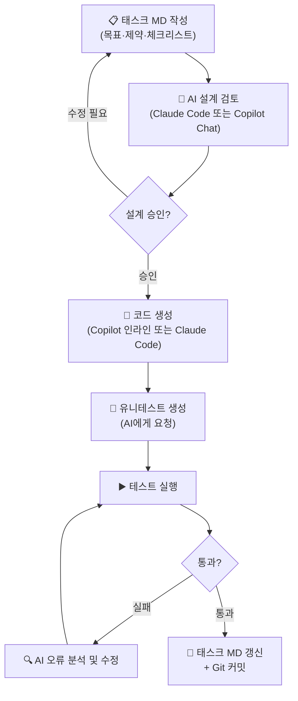
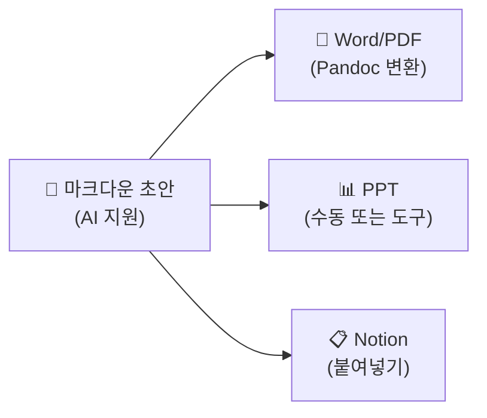
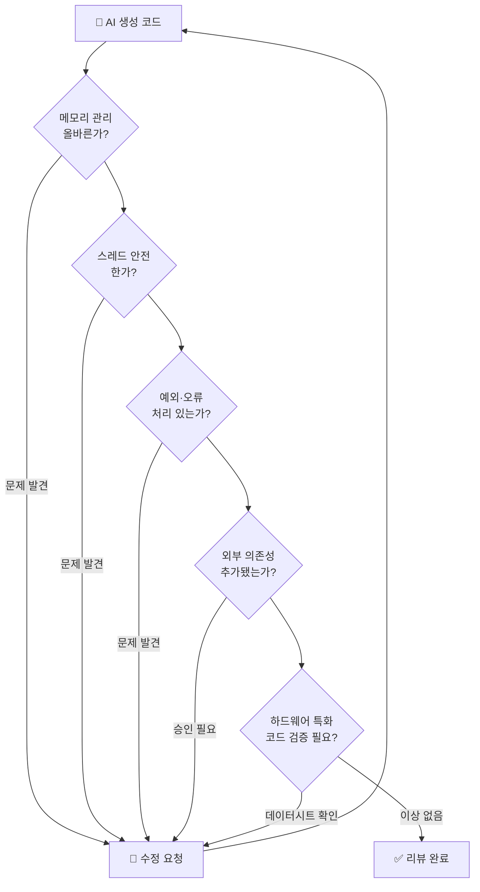
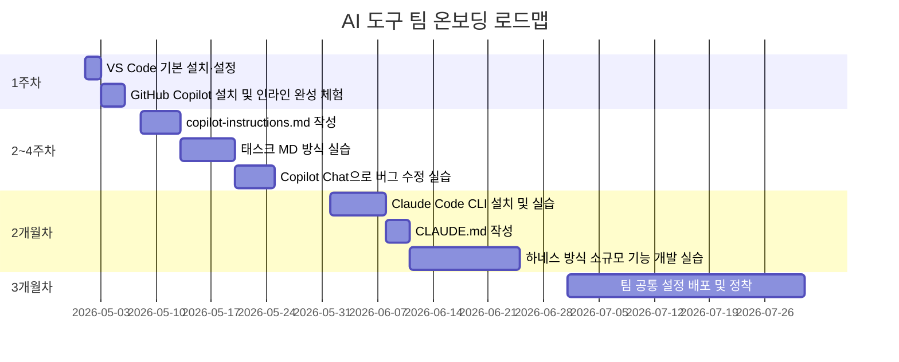

# VS Code + AI 개발 환경 구축 가이드

> **대상 독자**: C/C++·Qt·Android 경력 개발자  
> **용도**: 사내 온보딩 교육 자료  
> **최종 수정**: 2026년 4월

---

## 목차

1. [개요](#1-개요)
2. [VS Code 기반 환경 구축](#2-vs-code-기반-환경-구축)
3. [AI 도구 역할 분담 원칙](#3-ai-도구-역할-분담-원칙)
4. [AI 컨텍스트 관리 전략](#4-ai-컨텍스트-관리-전략)
5. [지침 파일 작성](#5-지침-파일-작성)
6. [GitHub Copilot 실전 활용](#6-github-copilot-실전-활용)
7. [Claude Code CLI 실전 활용](#7-claude-code-cli-실전-활용)
8. [AI 기반 개발 워크플로우](#8-ai-기반-개발-워크플로우)
9. [품질·보안 관리](#9-품질보안-관리)
10. [팀 도입 로드맵](#10-팀-도입-로드맵)
- [부록](#부록)

---

## 1. 개요

### 1.1. 이 문서의 목적과 독자

이 문서는 20년 이상 경력의 C/C++·Qt·Android 소프트웨어 개발자가 VS Code와 AI 도구를 실무에 도입하기 위한 **단계별 설정 가이드**입니다. 설치 명령어부터 지침 파일 작성까지, 처음부터 따라 하면 동작하는 수준으로 작성되어 있습니다.

### 1.2. AI 보조 개발의 패러다임 전환

경력 개발자에게 AI 도구의 핵심 가치는 **중간 과정의 위임**입니다.

> "설계하고 평가하는 사람만 있으면 됩니다. 중간에 AI가 다 해줍니다."

AI가 잘하는 것과 사람이 해야 하는 것이 명확히 구분됩니다.

| 사람이 해야 하는 것 | AI에게 위임하는 것 |
|---|---|
| 요구사항 분석 및 설계 | 코드 초안 생성 |
| 아키텍처 결정 | 유니테스트 작성 |
| 결과물 검증 및 평가 | 문서 초안 작성 |
| 보안·품질 판단 | 리팩토링 제안 |

### 1.3. 도구 생태계 전체 조감도



---

## 2. VS Code 기반 환경 구축

### 2.1. VS Code 설치 및 기본 설정

**설치**

공식 사이트(https://code.visualstudio.com)에서 운영체제에 맞는 설치 파일을 내려받습니다. 2026년 4월 기준 최신 안정 버전은 1.99 이상입니다.

> ⚠️ **Windows 사용자**: Claude Code CLI는 Windows 네이티브와 WSL2 모두 지원합니다. 단, 개발 환경이 Linux 서버에 있다면 WSL2 또는 Remote-SSH 방식을 권장합니다.

**한국어 UI 설정**

1. `Ctrl+Shift+P` → `Configure Display Language` 입력 → Enter
2. `한국어` 선택 → 재시작

> 💡 이 문서의 모든 단축키는 기본 키맵 기준입니다. `Ctrl+K Ctrl+S`로 키맵을 확인할 수 있습니다.

### 2.2. 핵심 확장(Extension) 선택 기준

경력 개발자가 확장을 고를 때 적용할 기준입니다.

- **다운로드 수**: 최소 100만 이상의 검증된 확장을 우선 선택합니다.
- **게시자 신뢰도**: Microsoft, Google, JetBrains 등 공식 게시자를 확인합니다.
- **마지막 업데이트**: 6개월 이상 방치된 확장은 제외합니다.
- **필요성 검증**: 확장이 없으면 정말 불편한지 확인 후 설치합니다. 과도한 확장은 VS Code 시작 속도를 저하시킵니다.

### 2.3. 도메인별 권장 확장 구성

#### 2.3.1. 🔧 C/C++ / Qt 개발 환경

| 확장명 | 게시자 | 용도 |
|---|---|---|
| C/C++ | Microsoft | IntelliSense, 디버거, 코드 브라우징 |
| C/C++ Extension Pack | Microsoft | CMake, 테스트 도구 포함 묶음 |
| CMake Tools | Microsoft | CMakeLists.txt 인식, 빌드 통합 |
| Qt Configure | leoflatow | `.pro` 파일 지원 |
| Clang-Format | xaver | 코드 포맷 자동화 |

**설치 방법 (C/C++ Extension Pack)**

1. 좌측 사이드바 Extensions 아이콘 클릭 (`Ctrl+Shift+X`)
2. 검색창에 `C/C++ Extension Pack` 입력
3. 게시자가 `Microsoft`인 항목 확인 후 `Install` 클릭

> ⚠️ **Qt 전용 IDE 병행 사용**: Qt Creator와 병행할 경우 `.pro` 파일 편집은 Qt Creator, AI 보조 작업은 VS Code로 역할을 나누는 것이 현실적입니다. VS Code에서 qmake 빌드 시스템을 완전히 대체하려면 추가 설정이 필요합니다.

#### 2.3.2. 🤖 Android (Kotlin/Java/JNI) 개발 환경

| 확장명 | 게시자 | 용도 |
|---|---|---|
| Kotlin | Mathias Fröhlich | Kotlin 문법 강조, 기본 IntelliSense |
| Android iOS Emulator | DiemasMichiels | 에뮬레이터 제어 |
| Gradle for Java | Microsoft | Gradle 태스크 실행 |
| XML | Red Hat | AndroidManifest.xml, 레이아웃 XML |

> ⚠️ **Android Studio와 병행**: 복잡한 Android 프로젝트의 전체 빌드·디버그 주기는 Android Studio가 더 안정적입니다. VS Code는 코드 편집·AI 보조·JNI 코드 작성에 집중하는 방식으로 분리하는 것을 권장합니다.

#### 2.3.3. 🛠️ 공통 도구

| 확장명 | 게시자 | 용도 |
|---|---|---|
| GitLens | GitKraken | Git 히스토리 인라인 표시 |
| Markdown All in One | Yu Zhang | 마크다운 편집·미리보기 |
| Mermaid Markdown Syntax | Bpruitt-Goddard | 다이어그램 문법 강조 |
| Remote - SSH | Microsoft | 원격 Linux 서버 직접 편집 |
| Thunder Client | Rangav | REST API 테스트 (Postman 대체) |

### 2.4. settings.json 실전 구성

`Ctrl+Shift+P` → `Open User Settings (JSON)` 으로 파일을 엽니다.

아래 내용을 추가합니다. 각 항목의 의도를 주석으로 설명합니다.

```json
{
  // ── 편집기 기본 ──────────────────────────────────────────
  "editor.fontSize": 14,
  "editor.tabSize": 4,
  "editor.insertSpaces": true,
  "editor.formatOnSave": true,          // 저장 시 자동 포맷
  "editor.rulers": [80, 120],           // 80/120자 가이드라인
  "editor.minimap.enabled": false,      // 미니맵 비활성화 (화면 공간 확보)
  "editor.wordWrap": "off",             // C/C++ 에서는 줄바꿈 비활성화 권장

  // ── 파일 관리 ────────────────────────────────────────────
  "files.autoSave": "onFocusChange",    // 다른 곳 클릭 시 자동 저장 (AI 작업에 중요)
  "files.trimTrailingWhitespace": true,
  "files.encoding": "utf8",
  "files.watcherExclude": {             // 빌드 폴더 감시 제외 (성능)
    "**/build/**": true,
    "**/out/**": true,
    "**/.git/objects/**": true
  },

  // ── 터미널 ──────────────────────────────────────────────
  "terminal.integrated.defaultProfile.windows": "Git Bash",  // Windows만
  "terminal.integrated.fontSize": 13,

  // ── C/C++ 설정 ──────────────────────────────────────────
  "C_Cpp.default.cppStandard": "c++17",
  "C_Cpp.default.cStandard": "c11",
  "C_Cpp.clang_format_fallbackStyle": "Google",

  // ── Git ─────────────────────────────────────────────────
  "git.autofetch": true,
  "git.confirmSync": false,

  // ── GitHub Copilot ──────────────────────────────────────
  "github.copilot.enable": {
    "*": true,
    "plaintext": false,                 // 일반 텍스트에서는 비활성화
    "markdown": true,
    "scminput": false
  },
  "github.copilot.chat.codeGeneration.useInstructionFiles": true,  // 지침 파일 적용
  "github.copilot.nextEditSuggestions.enabled": true               // 다음 편집 제안
}
```

> 💡 `"files.autoSave": "onFocusChange"` 설정은 Claude Code와 Copilot이 파일을 편집할 때 저장을 잊어버리는 문제를 방지합니다. AI 작업 시 특히 중요합니다.

### 2.5. Workspace 기반 프로젝트 분리 전략

프로젝트별로 별도의 `.code-workspace` 파일을 만들어 관리합니다.



**workspace 파일 생성 방법**

1. `File` → `Save Workspace As...`
2. 프로젝트 루트에 `project-name.code-workspace`로 저장
3. 이후 이 파일을 더블클릭하면 해당 프로젝트 전용 설정으로 VS Code가 열립니다.

프로젝트별로 다른 컴파일러 경로, 다른 지침 파일을 사용할 수 있어 AI 컨텍스트가 섞이지 않습니다.

---

## 3. AI 도구 역할 분담 원칙

### 3.1. 도구별 특성 비교

세 도구는 **같은 기능의 경쟁 도구가 아닙니다**. 작업 성격에 따라 역할이 구분됩니다.



| 도구 | 주요 용도 | 컨텍스트 크기 | 비용 |
|---|---|---|---|
| **GitHub Copilot 인라인** | 함수·라인 단위 완성 | 열린 파일 기준 | Pro $10/월 |
| **Copilot Chat** | 파일 단위 질의응답, 리팩토링 | 32k~128k 토큰 | Pro 포함 |
| **Claude Code CLI** | 프로젝트 전역 리팩토링, 설계 검토 | 최대 1M 토큰(베타) | Pro $20/월 |
| **claude.ai 웹** | 보고서·문서 초안, 기술 리서치 | 모델에 따라 다름 | Pro 포함 |

> ⚠️ **비용 주의**: GitHub Copilot Pro는 월 $10이나, Claude 모델 선택 시 프리미엄 요청 배수가 적용됩니다. Claude Opus 모델은 요청당 소진이 크므로 Claude Sonnet 계열을 일상적으로 사용하는 것이 현실적입니다.

### 3.2. 개인·업무 채팅 분리 원칙

AI는 대화 흐름(컨텍스트)이 섞이면 품질이 급격히 저하됩니다.

**반드시 지켜야 할 분리 원칙:**

- 개인 용도와 업무 용도의 AI 대화는 **계정 또는 프로젝트를 분리**합니다.
- 하나의 대화 창에서 서로 다른 프로젝트 질문을 섞지 않습니다.
- 불필요한 사전 설명("배경은 이렇고요...")보다 **핵심 질문을 먼저** 던집니다.

### 3.3. 프로젝트 단위 컨텍스트 분리

claude.ai 웹 기준으로 Projects 기능을 활용합니다.

1. claude.ai 좌측 메뉴 → `New Project`
2. 프로젝트명 설정 (예: `방송표시장치-펌웨어`)
3. 해당 프로젝트 안에서만 관련 대화를 진행

VS Code Copilot Chat은 workspace 단위로 자동 분리됩니다. workspace 파일을 프로젝트별로 분리한 이유입니다.

### 3.4. AI가 틀리는 패턴과 검증 습관

**경력 개발자가 알아야 할 AI의 구조적 한계:**

AI는 확률 기반으로 답변을 생성합니다. 아래 상황에서는 특히 주의합니다.

| 상황 | AI가 틀리는 이유 | 대응 방법 |
|---|---|---|
| 수치 계산 (타이머, 주기) | 산술 오류 빈번 | 반드시 직접 계산 검증 |
| 특정 하드웨어 레지스터 설정 | 데이터시트 미학습 | 데이터시트 직접 확인 |
| 플랫폼 특화 API (Qt 버전별 차이) | 버전 혼동 | 공식 문서와 대조 |
| 최신 라이브러리 변경사항 | 학습 데이터 시점 한계 | 공식 changelog 확인 |

---

## 4. AI 컨텍스트 관리 전략

### 4.1. 컨텍스트 사이즈 한계와 실무적 의미

AI 모델은 대화 창 안에서 처리할 수 있는 텍스트 양(컨텍스트 윈도우)이 정해져 있습니다.



**실무적 의미:** 하나의 대화 창에서 긴 작업을 이어가면 AI가 앞에서 정한 내용을 잊어버립니다. 이것은 AI의 버그가 아니라 구조적 한계입니다.

**해결 방향**: 작업 내용을 외부 파일(태스크 MD)에 지속적으로 기록하고, AI가 매번 이 파일을 참조하게 합니다.

### 4.2. 태스크(Task) MD 파일로 컨텍스트 유지하기

#### 4.2.1. 태스크 파일 구조 설계

프로젝트 루트에 `tasks/` 폴더를 만들고 태스크별로 파일을 생성합니다.

```
project-root/
├── tasks/
│   ├── task-01-display-init.md       ← 완료
│   ├── task-02-network-module.md     ← 진행 중
│   └── task-03-test-harness.md       ← 예정
├── src/
├── CLAUDE.md
└── .github/
    └── copilot-instructions.md
```

**태스크 파일 예시 (task-02-network-module.md)**

```markdown
# Task-02: 네트워크 모듈 개발

## 상태
- [ ] 설계 검토
- [x] 인터페이스 정의
- [ ] 구현
- [ ] 유니테스트
- [ ] 통합 테스트

## 목표
기존 DisplayManager와 연동되는 NetworkManager 클래스 구현.
UDP 수신 → 파싱 → DisplayQueue 전달.

## 인터페이스 (task-01에서 확정)
- `DisplayManager::enqueue(DisplayPacket)` 호출 방식 사용
- 패킷 포맷: `[STX][LEN][DATA][ETX]` (2바이트 헤더)

## 진행 기록
- 2026-04-23: UDP 소켓 바인딩 구현 완료. 포트 5000 하드코딩 → 추후 설정화 필요
- 2026-04-23: 파싱 로직에서 STX 누락 케이스 미처리. task-03에서 예외처리 추가 예정

## 다음 작업
- NetworkManager 유니테스트 작성
- 에러 상태 로깅 추가
```

#### 4.2.2. AI가 직접 태스크 기록하게 만들기

코딩 작업을 시킬 때 아래 형식으로 지시합니다.

> "task-02-network-module.md를 먼저 읽고, 이 태스크의 UDP 파싱 구현을 진행해 줘. 작업 완료 후 진행 기록 항목에 오늘 날짜로 완료 내용을 추가해 줘."

이렇게 하면 AI가 이전 작업 내용을 파일에서 읽고, 작업 후 기록까지 남깁니다.

#### 4.2.3. 체크리스트·진행도 자동 관리

태스크 파일에 체크리스트를 넣으면 AI가 완료된 항목을 자동으로 체크합니다.

```markdown
## 체크리스트
- [x] NetworkManager 클래스 선언 (헤더)
- [x] UDP 소켓 생성 및 바인딩
- [ ] 수신 스레드 구현
- [ ] 패킷 파서 구현
- [ ] 예외처리 (소켓 오류, 타임아웃)
- [ ] 유니테스트 작성
```

### 4.3. 소스 파일 크기 제한 규칙

경험적으로 소스 파일이 10KB를 넘어가면 AI가 파일 전체 맥락을 유지하기 어렵습니다. 지침 파일에 아래 규칙을 추가합니다.

```
소스 파일이 300줄(약 10KB)을 초과할 경우, 기능 단위로 파일을 분리하라.
예: NetworkManager.cpp → NetworkSocket.cpp + PacketParser.cpp + NetworkManager.cpp
```

> ⚠️ **검증된 경험 기반**: 이 수치는 C/C++ 기준 경험치입니다. 실제 한계는 파일 내용과 AI 모델에 따라 다릅니다. 프로젝트 초기에 직접 실험해서 기준을 조정하는 것을 권장합니다.

### 4.4. 하네스(Harness) 시스템 개요

하네스 시스템은 AI가 설계, 구현, 검증을 순환하며 코드 품질을 높이는 방법론입니다. 2025년 초 등장 후 빠르게 확산되고 있습니다.



**현재 수준에서 실용적인 접근 방법:**

1. 태스크 MD 파일을 먼저 작성합니다 (AI에게 시킬 수도 있음).
2. AI에게 태스크를 읽고 구현 전에 설계를 검토해 달라고 요청합니다.
3. 설계 검토 결과를 확인한 뒤 구현을 승인합니다.
4. 구현 후 유니테스트 작성을 AI에게 요청합니다.
5. 테스트 실패 시 AI에게 원인 분석과 수정을 요청합니다.

---

## 5. 지침 파일 작성

지침 파일은 AI가 매번 참조하는 **프로젝트 전용 규칙서**입니다. 한번 잘 만들어두면 매 대화마다 설명을 반복하지 않아도 됩니다.

### 5.1. 지침 파일의 종류와 위치

| 파일 | 위치 | 적용 대상 |
|---|---|---|
| `copilot-instructions.md` | `.github/` 폴더 | GitHub Copilot Chat |
| `CLAUDE.md` | 프로젝트 루트 | Claude Code CLI |
| `AGENTS.md` | 프로젝트 루트 | 복수 AI 에이전트 공용 (선택) |

두 도구를 함께 쓴다면 `CLAUDE.md`와 `copilot-instructions.md` 모두 작성하거나, 공통 내용은 `AGENTS.md`에 작성하고 각 파일에서 참조하는 방법을 사용합니다.

**파일 생성 방법 (Copilot 지침 파일)**

```bash
mkdir -p .github
touch .github/copilot-instructions.md
```

### 5.2. 지침 파일에 넣어야 할 항목

아래 순서로 작성합니다. 항목마다 짧고 명확한 문장으로 씁니다.

```
1. 프로젝트 개요 (1~3줄)
2. 기술 스택 (언어, 프레임워크, 버전)
3. 코딩 규칙
4. AI 행동 제약
5. 파일 구조
6. 금지 사항
```

### 5.3. 도메인별 지침 파일 템플릿

#### 5.3.1. C++/Qt 프로젝트용 (.github/copilot-instructions.md)

```markdown
# 프로젝트 개요
철도 방송 표시장치 펌웨어. Qt 5.15 기반 임베디드 Linux 애플리케이션.

# 기술 스택
- 언어: C++17
- 프레임워크: Qt 5.15 (QWidget 기반, QML 미사용)
- 빌드: qmake / CMake 병행
- 컴파일러: GCC 9.4 (ARM Cortex-A)
- OS: Embedded Linux (Yocto 기반)

# 코딩 규칙
- 클래스명: PascalCase (예: DisplayManager)
- 멤버 변수: m_ 접두어 (예: m_socketFd)
- 포인터: 스마트 포인터(QScopedPointer, std::unique_ptr) 우선, 원시 포인터 최소화
- Qt 시그널/슬롯: Qt5 방식 함수 포인터 문법 사용 (SIGNAL/SLOT 매크로 사용 금지)
- 예외처리: Qt 예외 비활성화 환경이므로 반환값 기반 오류 처리 사용

# AI 행동 제약
- 예상 코드 길이가 20줄 이상이면 반드시 먼저 설계를 제안하고 승인을 요청할 것
- 소스 파일이 300줄을 초과하면 기능 단위로 분리를 제안할 것
- 외부 라이브러리 추가는 반드시 먼저 질문할 것
- 동기 블로킹 네트워크 호출을 메인 스레드에 작성하지 말 것

# 파일 구조
src/
  core/        - 핵심 비즈니스 로직
  network/     - 네트워크 통신
  display/     - 표시 제어
  utils/       - 공통 유틸리티
tests/         - 유니테스트 (Qt Test 프레임워크)

# 금지 사항
- printf/scanf 사용 금지 (qDebug 사용)
- using namespace std 금지
- Qt 모듈 중 QtWebEngine 사용 금지 (메모리 제약)
```

#### 5.3.2. Android NDK/JNI 프로젝트용 (.github/copilot-instructions.md)

```markdown
# 프로젝트 개요
Android 기반 철도 차량 표시 앱. Java/Kotlin UI + C++ JNI 하드웨어 제어.

# 기술 스택
- UI: Kotlin 1.9 + Android SDK 34 (minSdk 26)
- Native: C++17 + Android NDK r25
- 빌드: Gradle 8.x + CMake 3.22
- JNI 브릿지: 수동 JNI (자동 생성 미사용)

# 코딩 규칙
- Kotlin: 공식 Kotlin 코딩 컨벤션 준수
- C++ JNI 함수명: Java_패키지_클래스_메서드 형식 유지
- JNI 전역 참조(GlobalRef)는 반드시 명시적으로 해제할 것
- ANR 방지: JNI 블로킹 작업은 별도 스레드에서 실행

# AI 행동 제약
- JNI 코드 생성 시 메모리 누수 가능성을 항상 명시할 것
- Kotlin Coroutines와 JNI 연동 시 스레드 안전성을 확인할 것
- 예상 코드 길이가 20줄 이상이면 먼저 설계 검토를 요청할 것

# 금지 사항
- Deprecated API 사용 금지 (API 26 이상 대안 사용)
- JNI GetStringUTFChars 사용 후 ReleaseStringUTFChars 누락 금지
```

### 5.4. AI에게 지침 초안을 만들게 하는 방법

직접 지침 파일을 처음 작성하기 어렵다면 AI에게 시킵니다.

```
나는 지금 Qt 5.15를 이용해서 임베디드 Linux용 철도 방송 표시장치 
소프트웨어를 개발할 것이다. 
개발 언어는 C++17이고, VS Code에서 GitHub Copilot과 Claude Code를 함께 쓸 예정이다.

AI가 지켜야 할 지침 파일(.github/copilot-instructions.md)의 초안을
위 내용 기반으로 작성해 줘.
```

초안을 받은 뒤 직접 검토하고 실정에 맞게 수정합니다. AI가 만든 지침을 검토 없이 그대로 쓰면 안 됩니다.

---

## 6. GitHub Copilot 실전 활용

### 6.1. 설치 및 모델 선택

**설치 단계**

1. Extensions(`Ctrl+Shift+X`) → `GitHub Copilot` 검색 → 게시자가 `GitHub`인 항목 설치
2. `GitHub Copilot Chat`도 함께 설치합니다 (별도 확장).
3. VS Code 우하단에 Copilot 아이콘이 나타나면 정상입니다.
4. GitHub 계정으로 로그인 팝업이 뜨면 로그인합니다.

> 💡 **요금제 확인**: 2026년 4월 기준 GitHub Copilot Pro는 월 $10입니다. 신규 가입은 일시적으로 중단된 상태이므로 현재 GitHub 공식 사이트에서 가입 가능 여부를 확인하세요. 기업 라이선스(Business)는 별도 계약이 필요합니다.

**Copilot Chat에서 모델 선택**

Copilot Chat 상단의 모델 선택 드롭다운에서 `Auto`를 선택하면 작업에 따라 최적 모델이 자동 선택됩니다. 수동으로 Claude Sonnet을 선택하려면 드롭다운에서 직접 선택합니다.

> ⚠️ **Claude 모델이 목록에 없을 때**: 모델 선택 시 회사명(Anthropic)이 아니라 `Copilot`을 클릭해야 Claude 모델 목록이 나타납니다. 이는 직관적이지 않은 UI이므로 주의합니다.

### 6.2. 인라인 완성 vs. Copilot Chat 상황별 선택



| 기능 | 단축키 | 용도 |
|---|---|---|
| 인라인 제안 수락 | `Tab` | 현재 줄 완성 |
| 인라인 제안 거부 | `Esc` | 제안 무시 |
| 다음 제안 보기 | `Alt+]` | 다른 후보 확인 |
| Chat 열기 | `Ctrl+Alt+I` | 대화형 질문 |
| 선택 영역 Chat | `Ctrl+I` | 선택한 코드에 대해 질문 |

### 6.3. 도메인별 활용 패턴

#### 6.3.1. Qt 시그널/슬롯 코드 생성

**사용 예시**: 새 클래스를 만들면서 헤더만 작성하고 Copilot이 구현을 완성하게 합니다.

```cpp
// 헤더에 이렇게 작성하고 .cpp에서 함수 시그니처를 입력하면
// Copilot이 Qt5 방식 connect 문법으로 구현을 제안합니다.
class NetworkManager : public QObject {
    Q_OBJECT
public:
    explicit NetworkManager(QObject *parent = nullptr);
signals:
    void packetReceived(const QByteArray &data);
private slots:
    void onSocketReadyRead();
};
```

> ⚠️ Copilot이 구형 SIGNAL/SLOT 매크로를 제안할 수 있습니다. 지침 파일에 `Qt5 함수 포인터 방식 사용` 규칙을 넣어두면 줄어들지만, 생성된 코드는 항상 확인합니다.

#### 6.3.2. Android JNI 브릿지 코드

JNI 함수명 규칙을 따라 함수 시그니처를 입력하면 Copilot이 boilerplate를 생성합니다.

```cpp
// Java 패키지: com.company.display
// 클래스: NativeController
// 메서드: init
extern "C" JNIEXPORT jint JNICALL
Java_com_company_display_NativeController_init(
    JNIEnv *env, jobject thiz) {
    // Copilot이 이 아래 구현 초안을 제안합니다.
}
```

> ⚠️ JNI 코드에서 GlobalRef 해제, JNI 예외 처리는 Copilot이 누락하는 경우가 많습니다. 지침 파일에 명시해도 100% 보장되지 않으므로 반드시 코드 리뷰에서 확인합니다.

### 6.4. Copilot이 자율 개발하지 않도록 통제하기

Copilot은 기본적으로 적극적으로 코드를 완성하려 합니다. 의도하지 않은 방향으로 코드가 생성되면 다음 방법을 씁니다.

- **인라인 제안이 불필요할 때**: `Esc`로 즉시 거부합니다.
- **특정 파일에서 비활성화**: settings.json의 `github.copilot.enable` 항목에 해당 확장자를 `false`로 추가합니다.
- **20줄 이상 코드는 Chat 먼저**: 지침 파일에 명시하면 Chat 모드에서는 먼저 물어봅니다. 단, 인라인 완성에는 지침 파일이 적용되지 않습니다.

---

## 7. Claude Code CLI 실전 활용

### 7.1. 설치 및 인증 설정

**사전 요건**

- Claude Pro 또는 Max 구독 ($20/월 이상)
- macOS, Linux: 터미널에서 직접 설치
- Windows: PowerShell(관리자 권한) 또는 WSL2

**macOS / Linux 설치**

```bash
# 네이티브 인스톨러 (Node.js 불필요, 권장)
curl -fsSL https://claude.ai/install.sh | sh
```

**Windows (PowerShell 관리자 권한)**

```powershell
irm https://claude.ai/install.ps1 | iex
```

**npm 방식 (Node.js 18+ 필요, 구형 방식)**

```bash
npm install -g @anthropic-ai/claude-code
```

> ⚠️ npm 방식에서 `sudo npm install -g`는 권한 문제를 유발할 수 있습니다. 네이티브 인스톨러 방식을 권장합니다.

**설치 확인 및 인증**

```bash
claude --version    # 버전 출력되면 설치 성공
claude              # 처음 실행 시 브라우저 인증 창 열림
```

**VS Code 터미널에서 바로 사용**

1. VS Code에서 `Ctrl+` `` ` `` 로 터미널 열기
2. 프로젝트 폴더로 이동: `cd /path/to/project`
3. `claude` 입력 후 Enter → 해당 폴더 기준으로 AI 세션 시작

### 7.2. 주요 사용 시나리오

#### 7.2.1. 레거시 코드 리팩토링

대용량 단일 파일을 기능별로 분리할 때 유용합니다.

```
프로젝트 폴더에서 claude 실행 후:

> src/display_manager.cpp 파일을 분석해서 기능별로 분리하는 방안을 제안해 줘.
> 분리 후 기존 인터페이스가 깨지지 않아야 해.
```

#### 7.2.2. 아키텍처 설계 검토

```
> tasks/task-03-test-harness.md를 읽고,
> 현재 제안된 설계에서 스레드 안전성 문제가 있는 부분을 찾아줘.
```

#### 7.2.3. SSH 원격 환경 연동

VS Code Remote-SSH로 원격 서버에 접속한 상태에서 해당 터미널에 `claude`를 실행하면 원격 서버의 파일을 직접 처리합니다. 별도 설정 없이 동작합니다.

```bash
# 원격 서버 터미널에서
cd /home/dev/railway-project
claude
```

### 7.3. CLAUDE.md 작성

Claude Code CLI는 프로젝트 루트의 `CLAUDE.md`를 자동으로 읽습니다. `copilot-instructions.md`와 내용이 중복되더라도 별도로 작성합니다.

```markdown
# CLAUDE.md — 철도 방송 표시장치 프로젝트

## 빠른 참조
- 빌드: `make -C build/ -j4`
- 테스트: `make -C build/ test`
- 주요 진입점: src/main.cpp

## 현재 태스크
tasks/ 폴더의 MD 파일을 순서대로 참조.
현재 진행: task-02-network-module.md

## 절대 금지
- /etc, /sys 경로 수정 금지
- 빌드 스크립트(CMakeLists.txt) 직접 수정 전 반드시 확인 요청
- 외부 패키지 추가 전 반드시 확인 요청
```

---

## 8. AI 기반 개발 워크플로우

### 8.1. 전체 개발 사이클 흐름



### 8.2. 신규 기능 개발 워크플로우

**Step 1 — 태스크 파일 만들기**

새 기능마다 태스크 MD를 먼저 만듭니다. AI에게 시킬 수도 있습니다.

```
> tasks/ 폴더에 task-04-packet-logger.md를 만들어 줘.
> 목표: 수신된 패킷을 파일로 로깅하는 기능.
> 기존 NetworkManager와 연동해야 하고, 성능에 영향이 없어야 해.
```

**Step 2 — 설계 검토 요청**

```
> task-04-packet-logger.md를 읽고, 구현하기 전에 설계 검토를 해 줘.
> 고려해야 할 엣지 케이스와 잠재적 문제를 먼저 알려줘.
```

**Step 3 — 코드 생성**

설계 승인 후 구현 요청합니다.

```
> 설계대로 PacketLogger 클래스를 구현해 줘.
> src/utils/ 에 PacketLogger.h와 PacketLogger.cpp로 만들어 줘.
```

**Step 4 — 유니테스트**

```
> PacketLogger에 대한 유니테스트를 tests/ 폴더에 만들어 줘.
> Qt Test 프레임워크를 사용해 줘.
```

### 8.3. 버그 수정 워크플로우

```
> src/network/NetworkManager.cpp 74번째 줄에서 아래 오류가 발생해:
> [오류 메시지 붙여넣기]
> 오류 원인을 분석하고 수정 방안을 제안해 줘.
> 수정 전에 원인을 먼저 설명해 줘.
```

> 💡 오류 메시지는 전체를 붙여넣습니다. 요약하면 AI가 잘못된 원인을 추측합니다.

### 8.4. 마크다운 우선 문서화 워크플로우

AI는 마크다운과 매우 친화적입니다. 모든 문서 작업은 마크다운으로 먼저 만든 뒤 2차 가공합니다.



**마크다운 → Word 변환 (Pandoc 사용)**

```bash
# Pandoc 설치 후
pandoc -o output.docx input.md --reference-doc=template.docx
```

---

## 9. 품질·보안 관리

### 9.1. AI 생성 코드 검증 원칙

AI가 생성한 코드는 반드시 검토합니다. 경력 개발자 관점에서 확인할 항목입니다.



### 9.2. 유니테스트 자동화 전략

지침 파일에 아래 규칙을 추가하면 AI가 코드를 생성할 때마다 테스트 파일도 함께 만듭니다.

```markdown
# 지침 파일 추가 항목
- 새 클래스나 함수를 구현할 때마다 대응하는 유니테스트 파일을 tests/ 폴더에 만들 것
- 테스트 프레임워크: Qt Test (C++/Qt 프로젝트), JUnit (Android)
- 정상 케이스 최소 2개, 경계값 1개, 오류 케이스 1개 포함
```

### 9.3. 🔒 민감 정보 유출 방지

AI 도구에 사내 코드를 입력할 때 주의해야 할 사항입니다.

**유출 위험이 있는 정보:**

- 인증키, API 키, 비밀번호
- 고객 데이터, 개인정보
- 특허 출원 중인 알고리즘
- 계약상 비공개 의무가 있는 소스코드

**실용적인 관리 방법:**

1. `.gitignore`와 마찬가지로 `.claudeignore` 파일을 만들어 민감 파일을 제외합니다.
2. API 키는 환경변수나 별도 설정 파일로 분리하고, 해당 파일을 AI에게 보여주지 않습니다.
3. 회사 보안 정책에서 외부 AI 서비스 사용 범위를 사전에 확인합니다.

**.claudeignore 예시**

```
config/secrets.h
keys/
*.pem
*.key
```

### 9.4. 라이선스 위험 관리

AI가 생성한 코드에 GPL 등 오픈소스 코드가 포함될 수 있습니다. 상업용 제품에 사용할 때는 아래를 확인합니다.

- 생성된 코드가 특정 오픈소스 라이브러리의 구현을 그대로 복사한 수준인지 확인합니다.
- GitHub Copilot는 공개 코드 기반으로 학습했으므로, 상업 제품의 핵심 보안 로직은 AI 생성 코드를 그대로 사용하지 않는 것을 권장합니다.

---

## 10. 팀 도입 로드맵

### 10.1. 온보딩 단계별 계획



### 10.2. 팀 공통 설정 배포 방법

팀 전체가 동일한 설정을 사용하면 AI 지침이 일관되게 적용됩니다.

**배포 파일 목록**

```
project-root/
├── .vscode/
│   ├── settings.json          ← 프로젝트 전용 VS Code 설정
│   ├── extensions.json        ← 권장 확장 목록
│   └── tasks.json             ← 빌드·테스트 태스크
├── .github/
│   └── copilot-instructions.md
└── CLAUDE.md
```

**.vscode/extensions.json 예시**

이 파일이 있으면 VS Code가 팀원에게 확장 설치를 자동으로 권장합니다.

```json
{
  "recommendations": [
    "ms-vscode.cpptools-extension-pack",
    "github.copilot",
    "github.copilot-chat",
    "eamodio.gitlens",
    "yzhang.markdown-all-in-one"
  ]
}
```

Git 저장소에 `.vscode/`, `.github/`, `CLAUDE.md`를 커밋하면 팀원이 저장소를 받을 때 동일한 환경이 자동 적용됩니다.

### 10.3. AI 도구 활용 코드 리뷰 가이드라인

AI 지원 개발이 정착되면 코드 리뷰에서 확인할 항목이 달라집니다.

| 기존 리뷰 항목 | AI 시대 추가 확인 항목 |
|---|---|
| 로직 오류 | AI 생성 코드의 메모리 관리 |
| 코딩 컨벤션 | 지침 파일 규칙 준수 여부 |
| 성능 | 하드웨어 특화 검증 누락 여부 |
| 가독성 | 태스크 MD 갱신 여부 |

---

## 부록

### A. 확장 설치 체크리스트

온보딩 시 설치를 확인하는 체크리스트입니다.

**공통 필수**
- [ ] GitHub Copilot (`github.copilot`)
- [ ] GitHub Copilot Chat (`github.copilot-chat`)
- [ ] GitLens (`eamodio.gitlens`)
- [ ] Markdown All in One (`yzhang.markdown-all-in-one`)
- [ ] Remote - SSH (`ms-vscode-remote.remote-ssh`)

**C/C++·Qt 개발자 추가**
- [ ] C/C++ Extension Pack (`ms-vscode.cpptools-extension-pack`)
- [ ] CMake Tools (`ms-vscode.cmake-tools`)
- [ ] Clang-Format (`xaver.clang-format`)

**Android 개발자 추가**
- [ ] Kotlin (`mathiasfrohlich.kotlin`)
- [ ] Gradle for Java (`vscjava.vscode-gradle`)
- [ ] XML (`redhat.vscode-xml`)

---

### B. settings.json 전체 템플릿

2장에서 소개한 settings.json의 전체 내용입니다. `.vscode/settings.json`에 저장해 팀과 공유합니다.

```json
{
  "editor.fontSize": 14,
  "editor.tabSize": 4,
  "editor.insertSpaces": true,
  "editor.formatOnSave": true,
  "editor.rulers": [80, 120],
  "editor.minimap.enabled": false,
  "editor.wordWrap": "off",
  "files.autoSave": "onFocusChange",
  "files.trimTrailingWhitespace": true,
  "files.encoding": "utf8",
  "files.watcherExclude": {
    "**/build/**": true,
    "**/out/**": true,
    "**/.git/objects/**": true
  },
  "terminal.integrated.fontSize": 13,
  "C_Cpp.default.cppStandard": "c++17",
  "C_Cpp.default.cStandard": "c11",
  "C_Cpp.clang_format_fallbackStyle": "Google",
  "git.autofetch": true,
  "git.confirmSync": false,
  "github.copilot.enable": {
    "*": true,
    "plaintext": false,
    "markdown": true,
    "scminput": false
  },
  "github.copilot.chat.codeGeneration.useInstructionFiles": true,
  "github.copilot.nextEditSuggestions.enabled": true
}
```

---

### C. CLAUDE.md 템플릿

```markdown
# CLAUDE.md — [프로젝트명]

## 빠른 참조
- 빌드: [빌드 명령어]
- 테스트: [테스트 명령어]
- 주요 진입점: [파일 경로]

## 기술 스택
- 언어: [언어 및 버전]
- 프레임워크: [프레임워크 및 버전]
- 타겟: [타겟 플랫폼]

## 현재 태스크
tasks/ 폴더 참조. 현재 진행: [파일명]

## 코딩 규칙
- [규칙 1]
- [규칙 2]

## AI 행동 제약
- 20줄 이상 코드 생성 전 설계 먼저 제안할 것
- 외부 패키지 추가 전 반드시 확인 요청
- 소스 파일 300줄 초과 시 분리 제안

## 절대 금지
- [금지 항목 1]
- [금지 항목 2]
```

---

### D. 태스크 MD 파일 템플릿

```markdown
# Task-NN: [기능명]

## 상태
- [ ] 설계 검토
- [ ] 구현
- [ ] 유니테스트
- [ ] 통합 테스트
- [ ] 완료

## 목표
[한 문단으로 목표 기술]

## 제약 조건
- [제약 1]
- [제약 2]

## 인터페이스
[연관 클래스·함수 설명]

## 체크리스트
- [ ] [세부 항목 1]
- [ ] [세부 항목 2]

## 진행 기록
- YYYY-MM-DD: [작업 내용]

## 다음 작업
- [후속 태스크]
```

---

### E. 자주 묻는 질문 (FAQ)

**Q. Claude Code와 Copilot을 동시에 써야 하나요?**

둘 다 필수는 아닙니다. 처음에는 Copilot만으로 시작하고, 프로젝트 전체 맥락이 필요한 작업(대규모 리팩토링, 설계 검토)이 생길 때 Claude Code를 추가하는 방식을 권장합니다.

**Q. AI가 만든 코드가 컴파일은 되는데 동작이 이상합니다.**

가장 흔한 원인은 지침 파일에 하드웨어 특화 내용이 없는 경우입니다. 레지스터 주소, 프로토콜 포맷, 타이밍 제약을 지침 파일 또는 태스크 MD에 명시합니다.

**Q. 컨텍스트가 길어지면 어떻게 새로 시작하나요?**

Claude Code CLI는 `/clear` 명령으로 컨텍스트를 초기화합니다. Copilot Chat은 `+` 버튼으로 새 대화를 시작합니다. 새 대화 시작 전 태스크 MD 파일이 최신 상태인지 확인합니다.

**Q. 사내 코드를 AI에게 보여줘도 되나요?**

회사 보안 정책과 고객 계약 조건을 먼저 확인합니다. 확인 전까지는 민감 정보가 없는 범위에서만 사용하고, `.claudeignore`로 민감 파일을 제외합니다.

---

### F. 참고 자료

| 자료 | URL |
|---|---|
| GitHub Copilot 공식 문서 | https://docs.github.com/copilot |
| VS Code Copilot 설정 가이드 | https://code.visualstudio.com/docs/copilot/customization/custom-instructions |
| Claude Code 공식 문서 | https://docs.anthropic.com/claude-code |
| VS Code AI 모델 선택 가이드 | https://code.visualstudio.com/docs/copilot/customization/language-models |
| Mermaid 다이어그램 문법 | https://mermaid.js.org/intro/ |

---

> 📌 이 문서는 2026년 4월 기준으로 작성되었습니다. AI 도구는 빠르게 업데이트되므로, 주요 설정 변경 시 공식 문서를 함께 확인하세요.
