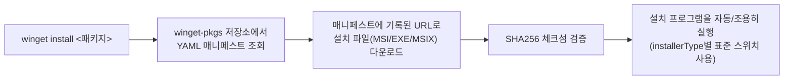
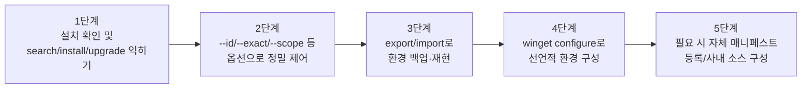

# winget 학습 가이드

## 목차

1. [winget 소개](#1-winget-소개)<br/>
   1.1. [winget이란 무엇인가](#11-winget이란-무엇인가)<br/>
   1.2. [작동 원리: winget-pkgs 매니페스트 저장소](#12-작동-원리-winget-pkgs-매니페스트-저장소)<br/>
   1.3. [choco/Scoop과의 차이점](#13-chocoscoop과의-차이점)<br/>

2. [설치](#2-설치)<br/>
   2.1. [사전 요구 사항 및 기본 내장 여부](#21-사전-요구-사항-및-기본-내장-여부)<br/>
   2.2. [App Installer(winget) 설치/업데이트 방법](#22-app-installerwinget-설치업데이트-방법)<br/>
   2.3. [설치 확인](#23-설치-확인)<br/>

3. [기본 사용법](#3-기본-사용법)<br/>
   3.1. [패키지 검색 (search)](#31-패키지-검색-search)<br/>
   3.2. [패키지 정보 확인 (show)](#32-패키지-정보-확인-show)<br/>
   3.3. [패키지 설치 (install)](#33-패키지-설치-install)<br/>
   3.4. [패키지 업그레이드 (upgrade)](#34-패키지-업그레이드-upgrade)<br/>
   3.5. [패키지 삭제 (uninstall)](#35-패키지-삭제-uninstall)<br/>

4. [주요 옵션과 사용 예](#4-주요-옵션과-사용-예)<br/>
   4.1. [식별 옵션 (--id, --exact, --source)](#41-식별-옵션---id---exact---source)<br/>
   4.2. [무인 설치 옵션 (--silent, --scope, --accept-*)](#42-무인-설치-옵션---silent---scope---accept-)<br/>
   4.3. [pin으로 특정 버전 고정하기](#43-pin으로-특정-버전-고정하기)<br/>

5. [소스와 설정 관리](#5-소스와-설정-관리)<br/>
   5.1. [winget source](#51-winget-source)<br/>
   5.2. [settings.json으로 동작 커스터마이징](#52-settingsjson으로-동작-커스터마이징)<br/>

6. [환경 재현: export / import](#6-환경-재현-export--import)<br/>
   6.1. [현재 설치 목록 내보내기](#61-현재-설치-목록-내보내기)<br/>
   6.2. [새 PC에 동일 환경 구성하기](#62-새-pc에-동일-환경-구성하기)<br/>

7. [winget configure (DSC 기반 환경 구성)](#7-winget-configure-dsc-기반-환경-구성)<br/>
   7.1. [YAML 구성 파일 개념](#71-yaml-구성-파일-개념)<br/>
   7.2. [간단한 예제](#72-간단한-예제)<br/>

8. [나만의 패키지 등록하기 (개요)](#8-나만의-패키지-등록하기-개요)<br/>

9. [자주 겪는 문제와 주의 사항](#9-자주-겪는-문제와-주의-사항)<br/>
   9.1. [관리자 권한과 UAC 승격](#91-관리자-권한과-uac-승격)<br/>
   9.2. [기업/사내망 프록시 환경](#92-기업사내망-프록시-환경)<br/>
   9.3. [msstore 소스 이용약관 동의](#93-msstore-소스-이용약관-동의)<br/>
   9.4. [해시 불일치·설치 실패 대응](#94-해시-불일치설치-실패-대응)<br/>

10. [자주 묻는 질문](#10-자주-묻는-질문)<br/>

11. [결론 및 학습 로드맵](#11-결론-및-학습-로드맵)<br/>

---

## 1. winget 소개

### 1.1. winget이란 무엇인가

winget(Windows Package Manager, 윈도우 패키지 매니저)은 Microsoft가 공식적으로 만들고 유지보수하는 Windows용 커맨드 라인 패키지 매니저입니다. 2020년 Windows Package Manager 1.0으로 처음 공개되었고, "App Installer"라는 UWP/MSIX 앱의 일부로 배포됩니다. 2026년 중반 현재 Windows 11과 Windows Server 2025에는 기본으로 내장되어 있으며, 별도 서드파티 도구 설치 없이 바로 사용할 수 있습니다.

### 1.2. 작동 원리: winget-pkgs 매니페스트 저장소

winget이 다루는 패키지 정보는 GitHub의 [microsoft/winget-pkgs](https://github.com/microsoft/winget-pkgs) 저장소에 YAML 매니페스트(manifest, 매니페스트) 형태로 등록되어 있습니다. 각 매니페스트는 실제 설치 파일 자체가 아니라, 설치 파일을 어디서 받을지(다운로드 URL), 어떤 체크섬으로 검증할지, 어떤 설치 스위치를 쓸지 등의 메타데이터만 담고 있습니다.



winget-pkgs는 Pull Request 기반의 완전 공개 저장소이며, 자동화된 검증 파이프라인(설치 성공 여부, 체크섬 일치 여부 등)을 통과해야 병합됩니다.

> **검토 의견**: choco의 커뮤니티 저장소가 "PowerShell 설치 스크립트"를 통째로 업로드받는 구조라면, winget-pkgs는 "다운로드 URL + 체크섬 + 표준 설치 스위치"라는 훨씬 제한된 메타데이터만 받습니다. 임의 스크립트를 실행할 여지가 상대적으로 적어 공급망 공격 표면이 좁다는 장점이 있지만, 반대로 복잡한 사후 설정(설치 후 레지스트리 조작, 여러 파일 배치 등)이 필요한 패키지는 choco 쪽이 더 유연합니다.

### 1.3. choco/Scoop과의 차이점

| 항목 | winget | Chocolatey (choco) | Scoop |
|------|--------|---------------------|-------|
| 관리 주체 | Microsoft 공식 | 커뮤니티(Chocolatey Software 사) | 커뮤니티 |
| 기본 내장 여부 | Windows 11/Server 2025 기본 내장 | 별도 설치 필요 | 별도 설치 필요 |
| 관리자 권한 | 필수 아님(사용자 범위 설치는 비관리자도 가능) | 대부분 필수 | 필수 아님(사용자 홈 디렉터리 설치) |
| 패키지 형식 | YAML 매니페스트(설치 파일은 벤더 원본) | NuGet(.nupkg) + PowerShell 스크립트 | JSON 매니페스트 |
| 패키지 수(대략) | 수만 개 | 10,000개 이상 | 수천 개(주로 포터블 앱) |
| 환경 선언/재현 | `winget configure`(DSC 기반) | packages.config | scoop export/import |
| 사내 배포 기능 | 제한적(Intune/MDM 연동은 별도) | Chocolatey for Business로 특화 | 제한적 |

> **검토 의견**: "OS에 이미 있고, Microsoft가 직접 관리한다"는 점 때문에 특별한 이유가 없다면 winget을 기본 선택지로 삼는 것이 합리적입니다. 다만 세밀한 설치 파라미터 제어, 버전 고정의 유연성, 사내 대규모 배포 기능이 필요하면 choco가, 관리자 권한 없이 포터블 앱 위주로 가볍게 쓰고 싶다면 Scoop이 더 맞을 수 있습니다.

---

## 2. 설치

### 2.1. 사전 요구 사항 및 기본 내장 여부

- **Windows 11 / Windows Server 2025**: App Installer(winget)가 기본 내장되어 있어 별도 설치가 필요 없습니다.
- **Windows 10 (버전 1809 이상)**: 기본 내장되어 있지 않을 수 있으며, Microsoft Store에서 "App Installer"를 설치하거나 아래 2.2절의 방법으로 설치해야 합니다.
- winget은 `cmd.exe`, Windows PowerShell, PowerShell(pwsh) 어디서든 동일하게 동작합니다.

### 2.2. App Installer(winget) 설치/업데이트 방법

**방법 1 — Microsoft Store (권장, 가장 간단)**

Microsoft Store 앱에서 "App Installer"를 검색해 설치/업데이트합니다. Store 앱이 자동 업데이트를 관리해주므로 별도로 신경 쓸 필요가 없습니다.

**방법 2 — GitHub 릴리스에서 수동 설치 (Store 접근이 막힌 환경)**

```powershell
# 관리자 권한 PowerShell에서 최신 .msixbundle을 받아 설치
winget-cli 릴리스 페이지(https://github.com/microsoft/winget-cli/releases)에서
Microsoft.DesktopAppInstaller_*.msixbundle 파일을 내려받은 뒤:

Add-AppxPackage -Path "Microsoft.DesktopAppInstaller_*.msixbundle"
```

**이미 설치되어 있다면 winget 자체를 업데이트**

```powershell
winget upgrade Microsoft.AppInstaller
```

> **검토 의견**: 사내 이미지(골든 이미지)를 만들 때는 Microsoft Store 로그인 없이 GitHub 릴리스의 `.msixbundle`을 오프라인으로 배포하는 방법 2가 더 안정적입니다. 일반 개인 PC라면 방법 1로 충분합니다.

### 2.3. 설치 확인

```powershell
winget --version
```

`v1.x.x` 형태의 버전 문자열이 출력되면 정상입니다.

---

## 3. 기본 사용법

### 3.1. 패키지 검색 (search)

```powershell
winget search <검색어>
winget search "Visual Studio Code"
winget search --id Microsoft.VisualStudioCode --exact   # ID로 정확히 일치하는 패키지만 검색
```

검색 결과에는 `Name`, `Id`, `Version`, `Match`, `Source` 컬럼이 표시되며, 이후 명령에서는 이름보다 **Id**를 쓰는 것이 가장 정확합니다.

### 3.2. 패키지 정보 확인 (show)

```powershell
winget show --id Git.Git
winget show --id Git.Git --versions   # 설치 가능한 전체 버전 목록
```

### 3.3. 패키지 설치 (install)

```powershell
winget install --id Git.Git -e
winget install --id Microsoft.VisualStudioCode -e --source winget
winget install --id OpenJS.NodeJS.LTS -e --version 20.11.0
```

`-e`(`--exact`)는 검색어가 아닌 정확한 Id로 매칭하도록 강제해, 이름이 비슷한 다른 패키지가 잘못 설치되는 것을 방지합니다.

### 3.4. 패키지 업그레이드 (upgrade)

```powershell
winget upgrade                          # 업그레이드 가능한 패키지 목록 확인
winget upgrade --id Git.Git             # 특정 패키지만 업그레이드
winget upgrade --all                    # 설치된 모든 패키지 일괄 업그레이드
winget upgrade --all --include-unknown  # 버전 정보를 알 수 없는 패키지도 포함해 업그레이드 시도
```

### 3.5. 패키지 삭제 (uninstall)

```powershell
winget uninstall --id Git.Git
winget list --upgrade-available         # 업그레이드 가능한 패키지만 필터링해 조회
```

---

## 4. 주요 옵션과 사용 예

### 4.1. 식별 옵션 (--id, --exact, --source)

| 옵션 | 설명 |
|------|------|
| `--id <값>` | 패키지 고유 Id로 지정(예: `Publisher.Product`) |
| `--exact`, `-e` | 검색/설치 시 부분 일치가 아닌 완전 일치만 허용 |
| `--source <값>` | 검색/설치 대상 소스 지정(`winget`, `msstore` 등) |
| `--moniker <값>` | 패키지 별칭(짧은 별명)으로 지정 |

```powershell
winget install --id Google.Chrome -e --source winget
```

### 4.2. 무인 설치 옵션 (--silent, --scope, --accept-*)

| 옵션 | 설명 |
|------|------|
| `--silent`, `-h` | 설치 UI를 띄우지 않고 조용히 설치 |
| `--interactive`, `-i` | 설치 마법사를 그대로 표시(기본 동작과 다르게 수동 진행하고 싶을 때) |
| `--scope machine` / `--scope user` | 전체 사용자용(관리자 권한 필요) / 현재 사용자용으로 설치 범위 지정 |
| `--architecture x64/x86/arm64` | 설치할 아키텍처 지정 |
| `--location <경로>` | 설치 경로 지정(패키지가 지원하는 경우) |
| `--accept-package-agreements` | 패키지 라이선스 동의 프롬프트 자동 승인 |
| `--accept-source-agreements` | 소스(예: msstore) 이용약관 동의 프롬프트 자동 승인 |

```powershell
winget install --id 7zip.7zip -e `
  --silent --scope machine --architecture x64 `
  --accept-package-agreements --accept-source-agreements
```

> **검토 의견**: CI나 배포 스크립트에서는 `--accept-package-agreements`와 `--accept-source-agreements`를 빠뜨리면 프롬프트에서 그대로 멈춰버립니다. 무인 실행 스크립트에는 이 두 옵션을 습관적으로 포함시키는 것이 안전합니다.

### 4.3. pin으로 특정 버전 고정하기

```powershell
winget pin add --id Microsoft.VisualStudioCode          # 현재 버전에 고정, upgrade --all에서 제외
winget pin add --id OpenJS.NodeJS.LTS --version "20.*"   # 특정 버전 패턴으로 고정
winget pin list                                          # 고정된 패키지 목록
winget pin remove --id Microsoft.VisualStudioCode        # 고정 해제
```

---

## 5. 소스와 설정 관리

### 5.1. winget source

winget은 기본적으로 두 개의 소스를 제공합니다: 공식 winget-pkgs 기반 `winget` 소스와 `msstore`(Microsoft Store) 소스입니다.

```powershell
winget source list                             # 등록된 소스 확인
winget source update                           # 모든 소스의 캐시된 인덱스 갱신
winget source add -n company -a https://내부저장소주소 -t Microsoft.Rest   # 사내 REST 소스 추가
winget source remove -n company                # 소스 제거
winget source reset --force                    # 모든 소스를 기본값으로 초기화
```

### 5.2. settings.json으로 동작 커스터마이징

```powershell
winget settings   # 기본 편집기로 settings.json을 염
```

파일 경로: `%LOCALAPPDATA%\Packages\Microsoft.DesktopAppInstaller_8wekyb3d8bbwe\LocalState\settings.json`

```json
{
  "$schema": "https://aka.ms/winget-settings.schema.json",
  "source": {
    "autoUpdateIntervalInMinutes": 1440
  },
  "installBehavior": {
    "preferences": {
      "scope": "user"
    }
  },
  "visual": {
    "progressBar": "accent"
  }
}
```

`installBehavior.preferences.scope`처럼 자주 쓰는 옵션을 기본값으로 설정해두면, 매번 명령줄에서 `--scope`를 지정하지 않아도 됩니다.

---

## 6. 환경 재현: export / import

### 6.1. 현재 설치 목록 내보내기

```powershell
winget export -o apps.json
winget export -o apps.json --include-versions   # 버전 정보까지 포함(엄격한 재현이 필요할 때)
```

### 6.2. 새 PC에 동일 환경 구성하기

```powershell
winget import -i apps.json
winget import -i apps.json --accept-package-agreements --accept-source-agreements
```

`apps.json`에는 소스별로 설치된 패키지의 Id(및 선택적으로 버전)가 기록되며, `import`는 이를 읽어 동일한 패키지들을 순서대로 설치합니다.

---

## 7. winget configure (DSC 기반 환경 구성)

### 7.1. YAML 구성 파일 개념

`winget configure`는 PowerShell DSC(Desired State Configuration, 디자이어드 스테이트 컨피규레이션) 3.0을 기반으로, "무엇을 설치하라"뿐 아니라 "레지스트리 값, 환경 변수, 개발자 모드 활성화 여부 같은 시스템 상태가 어떠해야 하는가"까지 선언적으로 기술할 수 있는 기능입니다. `packages.config`/`export-import`가 단순히 패키지 목록을 나열하는 방식이라면, `configure`는 목표 상태(desired state)를 YAML로 기술하고 winget이 현재 상태와의 차이를 스스로 맞춥니다.

### 7.2. 간단한 예제

```yaml
# dev-environment.dsc.yaml
properties:
  resources:
    - resource: Microsoft.WinGet.DSC/WinGetPackage
      id: git
      directives:
        description: Install Git
      settings:
        id: Git.Git
        source: winget
    - resource: Microsoft.WinGet.DSC/WinGetPackage
      id: vscode
      settings:
        id: Microsoft.VisualStudioCode
        source: winget
  configurationVersion: 0.2.0
```

```powershell
winget configure -f dev-environment.dsc.yaml
winget configure export -o current-state.dsc.yaml --all   # 현재 시스템 상태를 역으로 내보내기
```

> **검토 의견**: `configure`는 2026년 기준으로도 여전히 활발히 발전 중인 기능이라, 복잡한 조직 표준화보다는 "새 개발 PC 세팅을 스크립트 하나로 재현"하는 개인/소규모 팀 시나리오에 우선 적용해보는 것을 권장합니다. 대규모 조직 배포는 Intune/MDM 또는 choco의 C4B처럼 성숙한 도구와 병행 검토하는 편이 안전합니다.

---

## 8. 나만의 패키지 등록하기 (개요)

사내 도구나 아직 winget에 없는 소프트웨어는 [microsoft/winget-pkgs](https://github.com/microsoft/winget-pkgs) 저장소에 매니페스트를 Pull Request로 제출해 공개 카탈로그에 등록할 수 있습니다.

```powershell
winget install wingetcreate            # 매니페스트 생성 도구 설치
wingetcreate new                       # 대화형으로 새 매니페스트 생성(설치 파일 URL, 게시자, 버전 등 입력)
wingetcreate submit <manifest-folder>  # winget-pkgs 저장소에 PR 형태로 제출
```

사내 전용으로만 배포하고 싶다면 공개 저장소에 올리지 않고, 5.1절처럼 사내 REST 소스를 직접 구성해 매니페스트를 등록하는 방법도 있습니다.

---

## 9. 자주 겪는 문제와 주의 사항

### 9.1. 관리자 권한과 UAC 승격

일반 권한 PowerShell에서 `winget install`을 실행해도 동작하지만, 설치 프로그램 자체가 관리자 권한을 요구하는 경우 Windows가 UAC 승격 창을 띄웁니다. 이때 승격을 거부하면 설치가 실패합니다. 관리자 권한 PowerShell에서 실행하면 이런 프롬프트 없이 조용히 진행됩니다. `--scope machine`(전체 사용자 설치)은 대부분 관리자 권한이 필요합니다.

### 9.2. 기업/사내망 프록시 환경

```powershell
winget install --id Git.Git -e --proxy "http://프록시주소:포트"
```

또는 `settings.json`의 `network.proxy` 값으로 전역 프록시를 지정할 수 있습니다. 사내 인증서(Root CA)가 필요한 환경에서는 해당 인증서를 시스템 신뢰 저장소에 먼저 설치해야 winget의 HTTPS 통신이 정상 동작합니다.

### 9.3. msstore 소스 이용약관 동의

`msstore` 소스에서 처음 패키지를 설치할 때는 Microsoft Store 이용약관에 동의해야 합니다.

```powershell
winget source accept-agreements --source msstore
```

무인 스크립트에서는 `--accept-source-agreements` 옵션을 함께 지정해 프롬프트를 건너뛸 수 있습니다.

### 9.4. 해시 불일치·설치 실패 대응

매니페스트에 기록된 체크섬과 실제 다운로드 파일의 해시가 다르면 winget이 설치를 중단합니다. 이는 대부분 벤더가 배포 파일을 교체했지만 winget-pkgs 매니페스트가 아직 갱신되지 않은 경우입니다.

```powershell
winget install --id <패키지> --force   # 해시 불일치를 무시하고 강제 설치(신뢰할 수 있는 경우에만)
```

> **주의**: `--force`는 체크섬 검증을 우회하므로, 출처가 확실하지 않다면 사용을 피하고 winget-pkgs 저장소에 이슈를 등록해 매니페스트 갱신을 기다리는 편이 안전합니다.

---

## 10. 자주 묻는 질문

**Q. winget과 choco를 같이 써도 되나요?**
A. 네, 서로 독립적인 도구이므로 병행 사용에 문제가 없습니다. 다만 같은 프로그램을 두 도구로 각각 설치하면 업그레이드 시 버전이 꼬일 수 있으므로, 프로그램마다 "어느 도구로 설치했는지"를 일관되게 관리하는 것이 좋습니다.

**Q. 회사 PC에서 관리자 권한이 없는데도 쓸 수 있나요?**
A. `--scope user`를 지원하는 패키지라면 관리자 권한 없이 사용자 범위로 설치할 수 있습니다. 다만 모든 패키지가 사용자 범위 설치를 지원하는 것은 아니며, 설치 프로그램 자체가 관리자 권한을 강제하는 경우(MSI의 machine-wide 설치 등)는 winget으로도 우회할 수 없습니다.

**Q. 특정 패키지가 검색되지 않아요.**
A. `winget source update`로 소스 캐시를 먼저 갱신해보고, 그래도 없다면 winget-pkgs에 아직 등록되지 않은 패키지일 수 있습니다. 이 경우 8절처럼 직접 매니페스트를 제출하거나 choco 등 다른 소스를 병행 고려합니다.

---

## 11. 결론 및 학습 로드맵



1. **기본 명령 확인**: `winget search`, `winget install --id ... -e`, `winget upgrade --all`
2. **정밀 제어 익히기**: 이름 대신 `--id`를 습관화하고, 무인 설치 옵션(`--silent`, `--accept-*`) 정리
3. **환경 재현 연습**: `winget export`/`import`로 새 PC 세팅을 스크립트화
4. **선언적 구성 시도**: 자주 세팅하는 개발 환경을 `winget configure` YAML로 정의
5. **필요 시 확장**: 사내 표준화가 필요해지면 매니페스트 등록 또는 choco/Intune과의 역할 분담 검토

### 참고 자료

- 공식 문서: [https://learn.microsoft.com/windows/package-manager/winget/](https://learn.microsoft.com/windows/package-manager/winget/)
- install 명령: [https://learn.microsoft.com/windows/package-manager/winget/install](https://learn.microsoft.com/windows/package-manager/winget/install)
- upgrade 명령: [https://learn.microsoft.com/windows/package-manager/winget/upgrade](https://learn.microsoft.com/windows/package-manager/winget/upgrade)
- settings 문서: [https://learn.microsoft.com/windows/package-manager/winget/settings](https://learn.microsoft.com/windows/package-manager/winget/settings)
- WinGet Configuration: [https://learn.microsoft.com/windows/package-manager/configuration/](https://learn.microsoft.com/windows/package-manager/configuration/)
- winget-cli GitHub: [https://github.com/microsoft/winget-cli](https://github.com/microsoft/winget-cli)
- winget-pkgs(패키지 매니페스트 저장소): [https://github.com/microsoft/winget-pkgs](https://github.com/microsoft/winget-pkgs)
