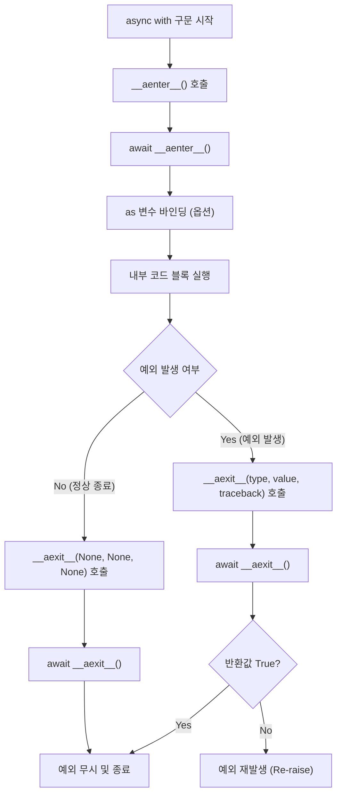

# 비동기 컨텍스트 매니저(Asynchronous Context Manager) 작성 및 활용 가이드

## 1. 개요 (Introduction)

파이썬(Python)의 비동기 프로그래밍(Asynchronous Programming) 환경에서 리소스 관리(Resource Management)는 매우 중요한 요소입니다. 파일, 네트워크 소켓, 데이터베이스 연결과 같은 시스템 리소스는 사용 후 반드시 해제되어야 합니다. 동기 코드에서 `with` 문이 이 역할을 수행하듯, 비동기 코드에서는 `async with` 문과 **비동기 컨텍스트 매니저(Asynchronous Context Manager)**가 이 역할을 담당합니다.

본 문서는 `__aenter__`와 `__aexit__` 매직 메서드(Magic Method)를 사용하여 비동기 컨텍스트 매니저를 구현하는 방법, 동작 원리, 그리고 실무적인 패턴을 상세히 다룹니다.

### 1.1. 배경 및 필요성 (Background and Necessity)

기존의 동기식 컨텍스트 매니저(Context Manager)는 `__enter__`와 `__exit__` 메서드가 블로킹(Blocking) 방식으로 동작한다고 가정합니다. 그러나 `asyncio`와 같은 비동기 프레임워크에서는 리소스의 획득과 해제 과정 자체가 비동기 I/O(Input/Output)를 수반하는 경우가 많습니다.

예를 들어, 데이터베이스 연결을 맺는 과정(`connect`)이나 종료하는 과정(`close`)에서 네트워크 대기가 발생할 수 있습니다. 이때 `await` 키워드를 사용할 수 없다면 이벤트 루프(Event Loop)가 차단되는 문제가 발생합니다. 이를 해결하기 위해 파이썬 3.5부터 `async with` 문법과 관련 프로토콜이 도입되었습니다.

## 2. 동작 원리와 생명주기 (Mechanism and Lifecycle)

비동기 컨텍스트 매니저는 런타임 컨텍스트(Runtime Context) 내부의 진입과 탈출을 비동기적으로 제어합니다.

### 2.1. 핵심 프로토콜 (Core Protocol)

비동기 컨텍스트 매니저는 다음 두 가지 핵심 메서드를 구현해야 합니다.

1. **`__aenter__(self)`**: `async with` 블록에 진입할 때 호출됩니다. 리소스를 할당하거나 초기화하며, 반드시 `awaitable` 객체를 반환해야 합니다.
2. **`__aexit__(self, exc_type, exc, tb)`**: `async with` 블록을 빠져나갈 때 호출됩니다. 리소스를 정리하거나 예외를 처리하며, 역시 `awaitable` 객체를 반환해야 합니다.

### 2.2. 실행 흐름도 (Execution Flowchart)



## 3. 상세 구현 가이드 (Detailed Implementation Guide)

제공된 `MCPClient` 예시를 바탕으로, 각 메서드의 역할과 구현 방법을 상세히 분석합니다.

### 3.1. 클래스 구조 정의

기본적인 클래스 구조는 다음과 같습니다.

```python
class MCPClient:
    def __init__(self, host: str, port: int):
        self.host = host
        self.port = port
        self.connection = None

    async def connect(self):
        # 비동기 연결 로직 시뮬레이션
        print(f"{self.host}:{self.port}에 연결 중...")
        await asyncio.sleep(0.1)  # I/O 대기 시뮬레이션
        self.connection = "Connected_Object"

    async def disconnect(self):
        # 비동기 연결 해제 로직 시뮬레이션
        print("연결 해제 중...")
        await asyncio.sleep(0.1)
        self.connection = None

```

### 3.2. `__aenter__` 구현

`__aenter__`는 리소스 준비 단계입니다. 중요한 점은 메서드 정의 앞에 `async def`가 붙어야 한다는 것입니다.

```python
    async def __aenter__(self):
        print("1. __aenter__ 호출: 리소스 초기화 시작")
        await self.connect()  # 실제 비동기 연결 작업 수행
        return self  # as 키워드 뒤의 변수에 할당될 객체 반환

```

* **반환값 (Return Value)**: 보통 `self`를 반환하여 블록 내부에서 인스턴스 메서드를 사용할 수 있게 하지만, 필요에 따라 커넥션 객체나 다른 헬퍼 객체를 반환할 수도 있습니다.

### 3.3. `__aexit__` 구현

`__aexit__`는 리소스 정리 및 예외 처리 단계입니다.

```python
    async def __aexit__(self, exc_type, exc, tb):
        print("3. __aexit__ 호출: 리소스 정리 시작")
        await self.disconnect()  # 리소스 해제 작업
        
        if exc_type:
            print(f"예외 감지: {exc}")
            # 예외 처리에 대한 로직
            # return True  # True를 반환하면 예외가 상위로 전파되지 않음
            # return False # False 또는 None이면 예외가 상위로 전파됨

```

* **인자 (Arguments)**: 예외가 발생하지 않으면 세 인자 모두 `None`입니다. 예외 발생 시 각각 예외 타입, 예외 인스턴스, 트레이스백(Traceback) 객체가 전달됩니다.

### 3.4. 예외 처리 로직 (Exception Handling Logic)

`__aexit__`에서의 예외 처리 여부는 반환값에 의해 결정됩니다. 이를 수식으로 표현하면 다음과 같습니다.

즉, 특정 예외를 내부에서 처리하고 프로그램을 계속 진행시키려면 `return True`를 명시해야 합니다.

## 4. `contextlib`을 활용한 구현 (Implementation utilizing contextlib)

클래스를 정의하는 것이 번거롭다면, 파이썬 표준 라이브러리(Standard Library)인 `contextlib` 모듈의 데코레이터(Decorator)를 활용할 수 있습니다.

### 4.1. `@asynccontextmanager` 활용

제너레이터(Generator) 문법을 사용하여 더 간결하게 작성할 수 있습니다.

```python
import asyncio
from contextlib import asynccontextmanager

@asynccontextmanager
async def mcp_client_manager(host, port):
    # __aenter__에 해당하는 부분
    print("연결 시작")
    conn = f"Connection({host}:{port})" 
    await asyncio.sleep(0.1)
    
    try:
        yield conn  # as 변수에 전달될 값
    except Exception as e:
        # 블록 내부에서 발생한 예외 처리
        print(f"에러 발생: {e}")
        raise e  # 필요 시 다시 발생
    finally:
        # __aexit__에 해당하는 부분
        print("연결 종료 및 정리")
        await asyncio.sleep(0.1)

# 사용법
async def main():
    async with mcp_client_manager("localhost", 8080) as client:
        print(f"{client} 사용 중")

```

## 5. 실무 모범 사례 (Best Practices)

### 5.1. 멱등성 보장 (Idempotency)

리소스 해제 로직은 **멱등성(Idempotency)**을 가져야 합니다. 즉, `__aexit__`가 여러 번 호출되거나, 이미 닫힌 리소스에 대해 닫기 요청을 하더라도 에러가 발생하지 않아야 합니다.

```python
    async def disconnect(self):
        if self.connection is None:
            return  # 이미 닫혀있으면 무시
        await self._close_socket()
        self.connection = None

```

### 5.2. `__aenter__` 내의 예외 처리

`__aenter__` 내부에서 예외가 발생하면 `__aexit__`는 호출되지 않습니다. 따라서 `__aenter__` 내에서 부분적으로 할당된 리소스가 있다면, 해당 메서드 내부에서 확실하게 정리하고 예외를 발생시켜야 리소스 누수(Resource Leak)를 방지할 수 있습니다.

### 5.3. 비동기 락(Async Lock)과의 결합

네트워크 클라이언트나 데이터베이스 세션 풀(Session Pool)과 같이 동시성 제어(Concurrency Control)가 필요한 경우, 내부적으로 `asyncio.Lock`을 함께 사용하는 것이 좋습니다.

```python
class ThreadSafeMCPClient:
    def __init__(self):
        self._lock = asyncio.Lock()

    async def __aenter__(self):
        await self._lock.acquire() # 락 획득
        return self

    async def __aexit__(self, exc_type, exc, tb):
        self._lock.release() # 락 해제

```

## 6. 전체 코드 예시 (Complete Code Example)

아래는 사용자 요청에 따른 `MCPClient`의 완전한 구현체입니다.

```python
import asyncio

class MCPClient:
    """
    Model Context Protocol (MCP) 클라이언트 시뮬레이션 클래스.
    비동기 컨텍스트 매니저를 구현하여 연결 수명 주기를 관리합니다.
    """
    def __init__(self, name: str):
        self.name = name
        self._is_connected = False

    async def connect(self):
        """실제 네트워크 연결을 시뮬레이션하는 비동기 메서드"""
        print(f"[{self.name}] 서버에 연결을 시도합니다...")
        await asyncio.sleep(0.5) # 네트워크 레이턴시
        self._is_connected = True
        print(f"[{self.name}] 연결 성공!")

    async def disconnect(self):
        """연결 해제를 시뮬레이션하는 비동기 메서드"""
        if not self._is_connected:
            print(f"[{self.name}] 이미 연결이 해제되어 있습니다.")
            return
            
        print(f"[{self.name}] 연결 해제를 시작합니다...")
        await asyncio.sleep(0.5)
        self._is_connected = False
        print(f"[{self.name}] 연결이 안전하게 종료되었습니다.")

    async def send_message(self, msg: str):
        """연결 상태에서 메시지를 보내는 메서드"""
        if not self._is_connected:
            raise ConnectionError("연결되지 않았습니다.")
        print(f"[{self.name}] 메시지 전송: {msg}")
        await asyncio.sleep(0.1)

    # --- 비동기 컨텍스트 매니저 프로토콜 ---

    async def __aenter__(self):
        await self.connect()
        return self

    async def __aexit__(self, exc_type, exc, tb):
        # 예외 발생 여부와 상관없이 연결을 종료합니다.
        await self.disconnect()
        
        if exc_type:
            print(f"[{self.name}] 블록 내부에서 예외 발생: {exc}")
            # True를 반환하지 않으므로 예외는 밖으로 전파됩니다.
            return False

async def main():
    print("--- 1. 정상 흐름 테스트 ---")
    async with MCPClient("Client-A") as client:
        await client.send_message("안녕하세요, MCP!")

    print("\n--- 2. 예외 발생 흐름 테스트 ---")
    try:
        async with MCPClient("Client-B") as client:
            await client.send_message("데이터 전송")
            raise ValueError("처리 중 치명적인 오류 발생!")
    except ValueError:
        print("메인 루틴에서 예외를 포착했습니다.")

if __name__ == "__main__":
    asyncio.run(main())

```
