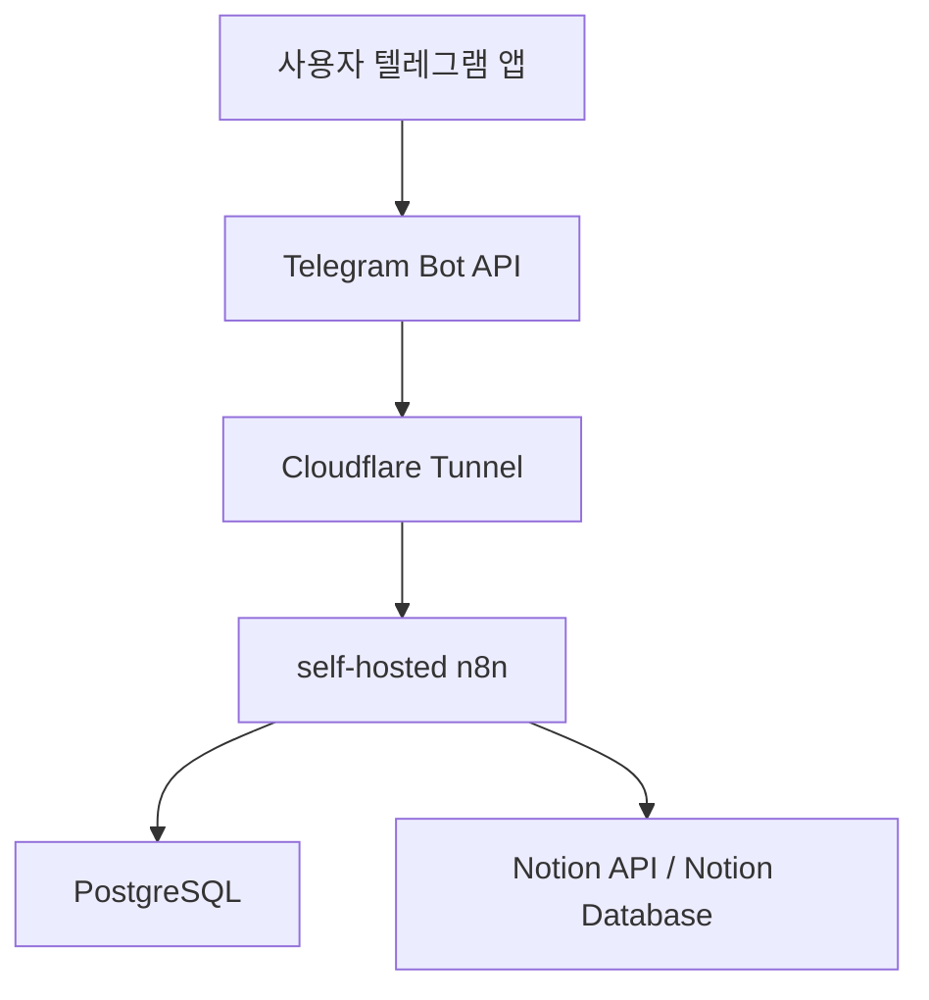
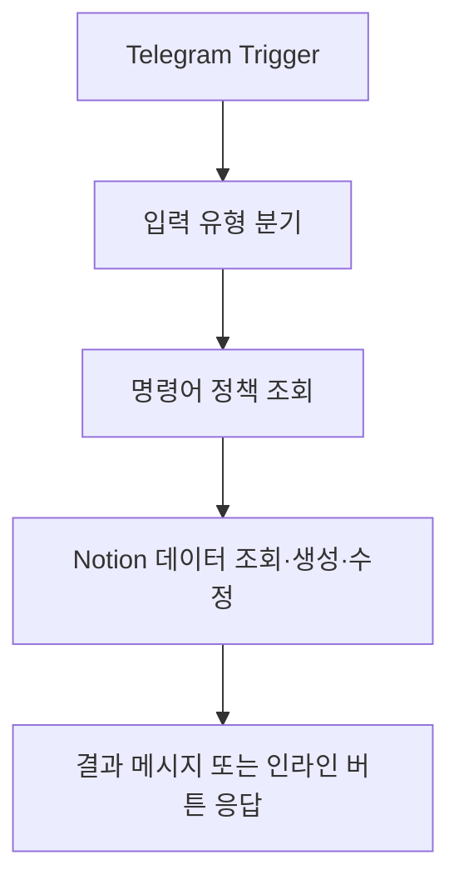
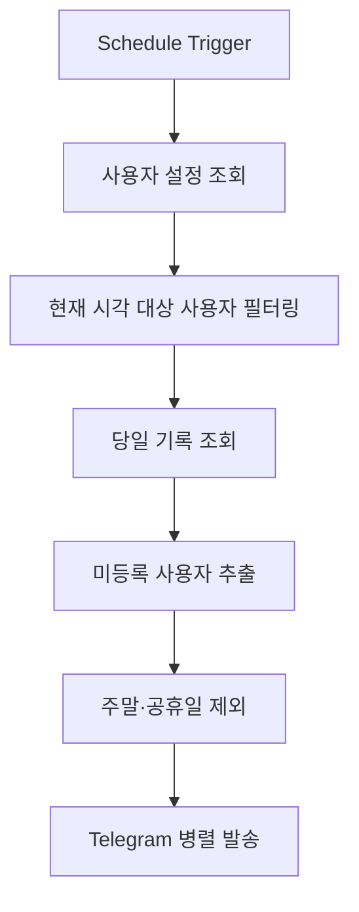
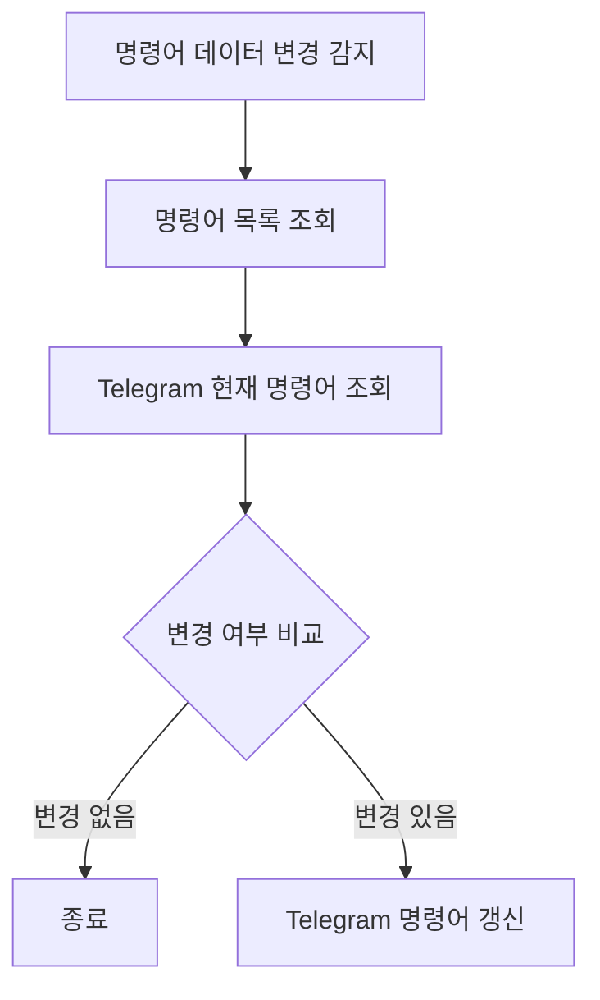

# 포트폴리오: 텔레그램 + n8n + Notion 기반 근태관리 자동화 시스템

## 프로젝트 개요

텔레그램 봇 명령어로 직원 근태를 기록하고, 이를 Notion 데이터베이스에 자동 저장·조회·수정할 수 있도록 구축한 업무 자동화 시스템이다.

단순한 봇 연동을 넘어서, self-hosted `n8n` 환경과 외부 webhook 수신 구조, 데이터 중심 운영 설계, 예외 처리 흐름까지 포함한 실운영형 자동화 시스템으로 설계했다.

이 프로젝트의 목표는 다음과 같았다.

- 반복적인 근태 입력 과정을 메신저 명령어 기반으로 단순화
- 운영자가 코드 수정 없이 명령어와 설정을 변경할 수 있도록 데이터 중심 구조 설계
- 외부 접속 제약, 한글 컬럼 처리, 플랫폼 제한사항 등 실제 운영 환경의 문제를 안정적으로 해결

---

## 핵심 성과

- 텔레그램 명령어만으로 출근, 퇴근, 외근, 복귀, 조회, 삭제, 수정까지 처리하는 자동화 흐름 구현
- 명령어, 사용자 설정, 프로젝트 정보를 데이터베이스로 분리해 운영 중 무코드 변경 가능 구조 설계
- 외부 webhook 연결 제약이 있는 환경에서도 안정적으로 이벤트를 수신하는 self-hosted 자동화 환경 구성
- `n8n` 기본 노드 한계를 JavaScript Code 노드로 보완해 실사용 가능한 사용자 경험 구현
- 다수 사용자 알림 발송을 병렬 처리해 순차 방식 대비 처리 성능 개선

---

## 시스템 구성

### 구성 요소

| 구성 요소 | 역할 |
| --- | --- |
| `n8n` | 자동화 워크플로우 실행 엔진 |
| `PostgreSQL` | 워크플로우 및 설정 영속 저장 |
| `Cloudflare Tunnel` | 외부 webhook 수신 경로 안정화 |
| `Notion` | 근태, 명령어, 프로젝트 데이터 저장소 |
| `Telegram Bot` | 사용자 입력 및 결과 확인 인터페이스 |

---

## 주요 기능

### 1. 근태 기록 자동화

텔레그램 명령어를 통해 출근, 퇴근, 외근, 복귀를 기록할 수 있도록 구성했다.

- 당일 기록 조회
- 기록 삭제
- 프로젝트 지정 외근 등록
- 기존 기록의 프로젝트 정보 수정
- 상황에 따라 중복 허용, 갱신, 차단 정책이 다른 명령어 구조 적용

### 2. 데이터 중심 명령어 관리

명령어 정의를 코드에 하드코딩하지 않고 별도 데이터베이스로 분리했다.

이를 통해 운영자는 데이터만 수정해도 새 명령어를 추가하거나 설명을 바꿀 수 있고, 봇 메뉴도 자동 동기화되도록 구성했다.

### 3. 사용자별 근태 분리 처리

조회와 수정 흐름 전반에 사용자 식별 기준을 일관되게 적용해, 사용자별 기록이 섞이지 않도록 설계했다.

또한 알림 발송에 필요한 사용자별 설정 정보를 분리 관리해, 개인별 출근 기준 시각에 맞는 안내가 가능하도록 구성했다.

### 4. 외근/복귀 흐름 자동화

복귀 입력 시 당일 외근 기록 중 아직 짝이 맞지 않은 최근 항목을 우선 탐지해 자동 연결하도록 구현했다.

자동 탐지에 실패하면 수동 선택 흐름으로 자연스럽게 전환되도록 설계해, 자동화와 안정성을 함께 확보했다.

---

## 기술적으로 해결한 문제

### 1. 외부 webhook 수신 제약 해결

일반적인 공개형 환경이 아닌 self-hosted 환경에서 외부 메신저 플랫폼의 webhook을 안정적으로 수신해야 했다.

이를 위해 Cloudflare Tunnel 기반 연결 구조를 도입해, 직접 공개가 어려운 환경에서도 안정적으로 이벤트를 수신할 수 있도록 구성했다.

### 2. 한글 컬럼 처리 문제 해결

`n8n`의 Notion 연동 과정에서 한글 속성명이 정상적으로 매핑되지 않는 문제가 있었다.

이 문제는 Notion 노드의 단순화 옵션을 끄고 원본 응답을 유지하는 설정으로 해결했다. 즉, 코드로 우회한 것이 아니라 **플랫폼이 제공하는 올바른 옵션을 적용해 데이터 손실을 막은 사례**에 가깝다.

이후 워크플로우에서는 필요한 필드만 읽도록 최소한의 후처리만 적용해 안정성을 유지했다.

### 3. 날짜 조건 필터 한계 보완

플랫폼 기본 필터만으로는 복수 날짜 조건을 안정적으로 조합하기 어려운 구간이 있었다.

이를 보완하기 위해 조회 범위를 단순화하고, 실제 업무 규칙에 필요한 상세 필터링은 Code 노드에서 수행하도록 역할을 분리했다.

### 4. Telegram callback 데이터 길이 제한 대응

인라인 버튼 기반 수정 기능을 구현하는 과정에서 플랫폼의 `callback_data` 길이 제한을 고려해야 했다.

식별자를 압축해 전달하고, 서버 측에서 다시 복원하는 방식으로 사용자 경험을 유지하면서 제약을 해결했다.

예시 포맷은 `ep|{recordIdCompressed}|{projectIdPrefix}` 형태로 설계했다.

### 5. Code 노드 문자열 처리 안정화

워크플로우 JSON 내부에 포함되는 JavaScript 코드 특성상 문자열 표현 방식에 따라 저장 오류가 발생할 수 있었다.

이 문제는 템플릿 문자열 사용을 줄이고, 더 안전한 문자열 결합 방식으로 변경해 해결했다.

### 6. 플랫폼 제약 하의 유지보수 방식 정리

일부 대규모 수정 작업은 관리 API만으로 처리하기 어려운 구간이 있었고, 이 과정에서 저장 구조와 변경 이력을 이해한 뒤 안전하게 보정하는 방식으로 운영 절차를 정리했다.

중요한 점은 단순 사용이 아니라, 도구의 제약을 분석하고 운영 가능한 형태로 개선했다는 점이다.

---

## 대표 워크플로우

### 근태관리 워크플로우

핵심 워크플로우로, 텔레그램 메시지와 버튼 입력을 받아 근태를 기록·조회·수정한다.

### 출근 미등록 알림 워크플로우

스케줄 기반으로 실행되며, 해당 시각에 출근해야 하는 사용자를 식별한 뒤 아직 기록이 없는 경우에만 알림을 발송한다.

- 사용자별 출근 기준 시각 반영
- 당일 기록 존재 여부 기반 알림 제외
- 공휴일 및 주말 예외 처리
- 병렬 발송을 통한 처리 시간 단축

### 명령어 동기화 워크플로우

명령어 데이터가 변경되면 Telegram 봇 명령 목록도 자동으로 동기화되도록 구성했다.

이를 통해 운영자는 코드를 수정하지 않고도 봇 메뉴를 최신 상태로 유지할 수 있다.

---

## 데이터 설계 요약

세부 식별자나 내부 스키마보다, 운영 구조가 명확하게 분리되어 있다는 점이 핵심이다.

| 데이터 영역 | 역할 |
| --- | --- |
| 근태 기록 | 출근, 퇴근, 외근, 복귀 등 이벤트 저장 |
| 사용자 설정 | 알림 기준 시각, 기본 프로젝트, 사용자별 옵션 관리 |
| 명령어 관리 | 봇 명령어, 설명, 동작 정책 정의 |
| 프로젝트 정보 | 외근 및 업무 연계용 프로젝트 선택 정보 저장 |

이 구조 덕분에 자주 바뀌는 운영 규칙을 코드가 아니라 데이터에서 제어할 수 있었다.

---

## 설계상 강점

### NoCode + Code의 균형

기본 흐름은 `n8n` 노드로 구성하되, 플랫폼 기본 기능만으로 부족한 부분은 JavaScript Code 노드로 보완했다.

덕분에 개발 속도와 유연성을 동시에 확보할 수 있었다.

### 운영 친화적 구조

명령어, 사용자 설정, 프로젝트 목록을 데이터로 분리해 운영 중 변경 비용을 낮췄다.

이는 자동화 시스템이 단발성 데모가 아니라 실제 운영 가능한 형태가 되도록 만드는 핵심 요소였다.

### 예외 상황을 고려한 UX

자동 선택 실패 시 수동 선택으로 전환하고, 빈 조회 결과나 예외 케이스를 명시적으로 처리해 사용자 경험이 끊기지 않도록 설계했다.

### 비용 효율적 운영

상용 SaaS 의존을 최소화하고, self-hosted 환경과 무료·저비용 서비스 조합으로 실용적인 운영 구성을 완성했다.

---

## 사용 기술

| 영역 | 기술 |
| --- | --- |
| 자동화 엔진 | `n8n` |
| 데이터 저장 | `PostgreSQL`, `Notion API` |
| 인터페이스 | `Telegram Bot API` |
| 네트워크 구성 | `Cloudflare Tunnel` |
| 구현 언어 | `JavaScript` |
| 운영 환경 | `Docker`, `Ubuntu` |

---

## 한 줄 정리

이 프로젝트는 메신저 기반 업무 자동화를 실제 운영 가능한 수준으로 설계하고, 플랫폼 제약과 운영 이슈를 직접 해결해낸 사례다.

특히 `n8n` 같은 자동화 도구를 단순 연결 수준이 아니라, 데이터 설계, 운영 안정성, 예외 처리, 사용자 경험까지 고려한 시스템으로 확장했다는 점에서 의미가 있다.
